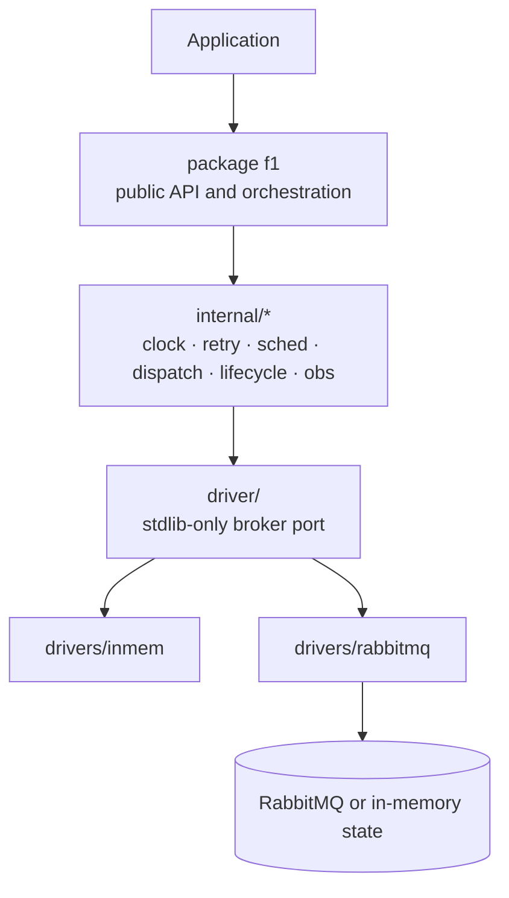
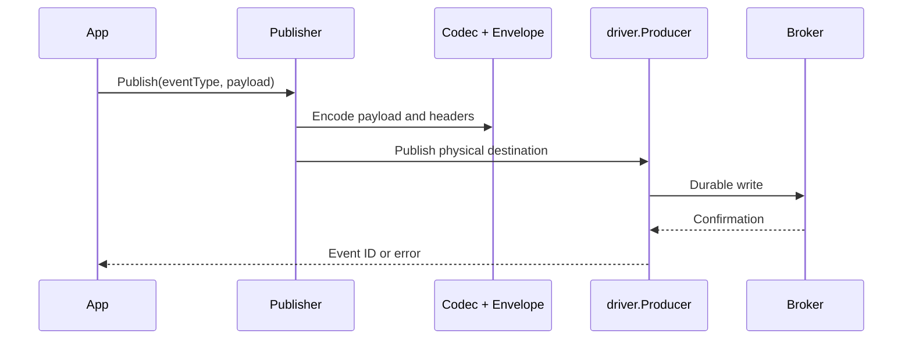
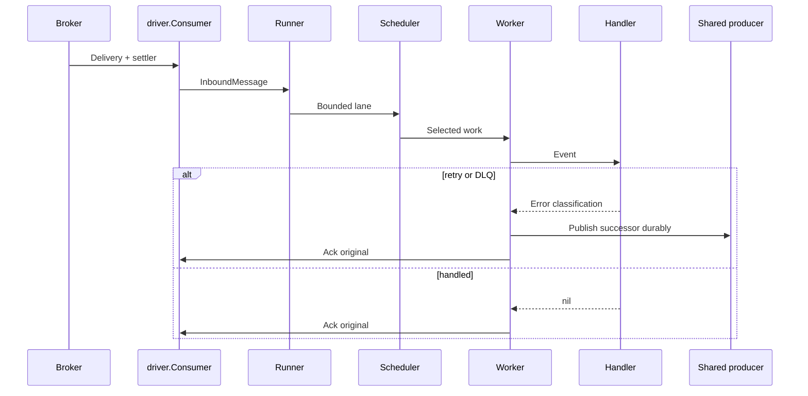
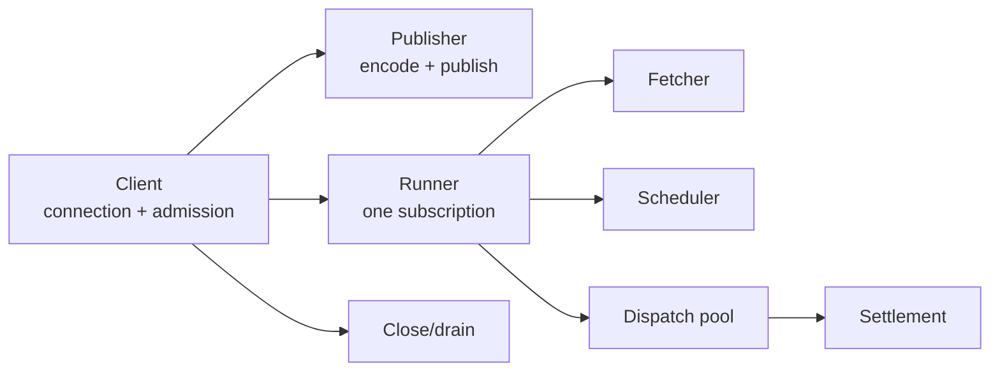

# Architecture

This document is the compact map of the current implementation. For runtime walkthroughs, use
[`docs/`](docs/README.md).

## System shape

The core does not import `drivers/**` or a broker client. Drivers implement the port and own broker
syntax. `make verify-agnostic` checks this boundary.

## Runtime message paths

### Publish

### Consume

The successor copy is published before the original is acknowledged. This prevents loss but allows
duplicates; application effects must use `Event.IdempotencyKey()` when they need deduplication.

## Current package ownership

| Package | Current responsibility |
| --- | --- |
| `.` (`package f1`) | `Client`, `Publisher`, `Subscription`, `Runner`, `Event`, envelope, errors, routing |
| `codec/` | Public payload codec port and JSON implementation |
| `driver/` | Broker port: connection, producer, consumer, settlement, admin, topology, capabilities |
| `driver/conformance/` | Driver-independent contract suite; imports the port, not a driver |
| `internal/clock/` | Real and fake time |
| `internal/retry/` | Error classification, backoff tiers, retry sanity |
| `internal/sched/` | Bounded weighted lanes and aging |
| `internal/dispatch/` | Worker pool, ordered-key routing, settlement registry |
| `internal/lifecycle/` | Runner drain state machine and disposition accounting; `Client.Close` coordinates runner drains |
| `internal/obs/` | OpenTelemetry metric registration and sampled collection |
| `drivers/inmem/` | Deterministic reference broker and test driver |
| `drivers/rabbitmq/` | AMQP and RabbitMQ management adapter |
| `f1test/` | Deterministic black-box test client built on in-memory transport |
| `tools/` | `tools/apisurface` and `tools/apidiff` checks |

Kafka is recognized by shared configuration and port types, but `drivers/kafka/` is not present.
There is no SDK database, deduplication store, or outbox.

## Core ownership

- `Client` eagerly opens one connection and shares one producer.
- `Publisher` builds outbound messages; it does not own broker resources.
- `Runner` owns one consumer and its worker pipeline.
- `driver.Settler` owns the broker-specific operation for one delivery.
- `inflightRegistry` tracks accepted deliveries until settlement is known.

## Import boundaries

Enforced through `.golangci.yml` and `make verify-agnostic`:

- root and `internal/**` must not import `drivers/**` or broker clients;
- `driver/**` outside conformance imports only the standard library;
- each concrete driver imports the standard library, the port, and its own broker client only;
- `driver/conformance` imports the port and test dependencies, never a concrete driver;
- `examples/` may select a driver but must not use a broker client directly.

## Detailed runtime guides

- [Runtime overview](docs/runtime-overview.md)
- [Publish flow](docs/publish-flow.md)
- [Consume flow](docs/consume-flow.md)
- [Dispatch and scheduling](docs/dispatch-and-scheduling.md)
- [Settlement and shutdown](docs/settlement-and-shutdown.md)
- [Drivers and capabilities](docs/drivers-and-capabilities.md)
- [Reading guide](docs/reading-guide.md)
