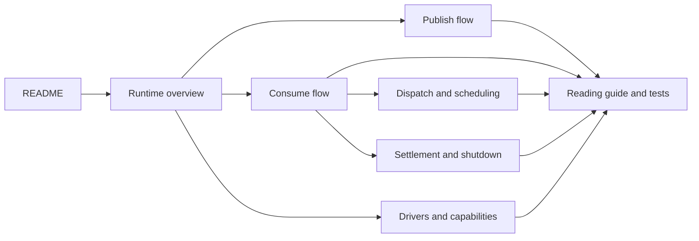

# F1 documentation

Open the [offline documentation front door](index.html) for a browser-friendly route through the docs.

Choose the route that matches your role:

## For service authors

Follow these guides to add F1 to an application:

- [Getting started](user-guide/getting-started.md) — install the module, load configuration, and connect a driver.
- [Publishing events](user-guide/publishing-events.md) — publish versioned events and choose routing metadata.
- [Consuming events](user-guide/consuming-events.md) — register handlers, decode payloads, and run a subscription.
- [Handling failures](user-guide/handling-failures.md) — choose retry, terminal, drop, dead-letter, and idempotency behavior.
- [Graceful shutdown](user-guide/graceful-shutdown.md) — drain runners and close clients without losing accepted work.
- [Testing](user-guide/testing.md) — test handlers deterministically with the in-memory test client.

## For maintainers

The runtime guide below explains implementation boundaries, message flows, and source-reading order.

This is the shortest route from “what is F1?” to “where does this line run?”



## Guides

- [Runtime overview](runtime-overview.md) — boundaries, ownership, and the two main flows.
- [Publish flow](publish-flow.md) — application payload to durable broker acknowledgement.
- [Consume flow](consume-flow.md) — broker delivery to handler result and settlement.
- [Dispatch and scheduling](dispatch-and-scheduling.md) — lanes, fairness, backpressure, and ordering.
- [Settlement and shutdown](settlement-and-shutdown.md) — retry/DLQ safety and drain phases.
- [Drivers and capabilities](drivers-and-capabilities.md) — the broker port, supported adapters, Kafka scaffold, and conformance.
- [Reading guide](reading-guide.md) — file-by-file order and which tests to read later.

## Source authority

Docs provide navigation, diagrams, terminology, and durable constraints. The source and tests own
current behavior. Start from the symbol links in each guide when behavior matters.

## Current implementation

The repository contains the core SDK, the public codec and driver ports, the deterministic in-memory
driver, the RabbitMQ driver, and a Kafka driver scaffold. Kafka configuration and port compatibility
surfaces exist, but [`drivers/kafka.Driver.Open`](../drivers/kafka/kafka.go) currently returns
`driver.ErrUnsupported`, so RabbitMQ is the supported external runtime adapter.

Useful commands are owned by the [Makefile](../Makefile):

```text
make build
make test-fast
make test
make test-rabbitmq
make lint
make verify-agnostic
```

`test-rabbitmq` requires Docker. The broker lifecycle targets use the
[local compose fixture](../docker/docker-compose.yml); its Kafka service is a development fixture
until the Kafka driver is implemented.
