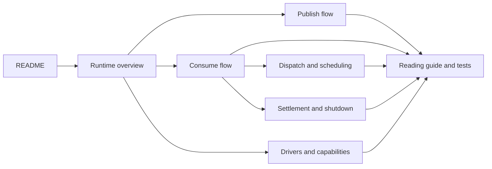

# F1 runtime guide

This is the shortest route from “what is F1?” to “where does this line run?”



## Guides

- [Runtime overview](runtime-overview.md) — boundaries, ownership, and the two main flows.
- [Publish flow](publish-flow.md) — application payload to durable broker acknowledgement.
- [Consume flow](consume-flow.md) — broker delivery to handler result and settlement.
- [Dispatch and scheduling](dispatch-and-scheduling.md) — lanes, fairness, backpressure, and ordering.
- [Settlement and shutdown](settlement-and-shutdown.md) — retry/DLQ safety and drain phases.
- [Drivers and capabilities](drivers-and-capabilities.md) — the broker port, in-memory driver, RabbitMQ adapter, and conformance.
- [Reading guide](reading-guide.md) — file-by-file order and which tests to read later.

## Source authority

Docs provide navigation, diagrams, terminology, and durable constraints. The source and tests own
current behavior. Start from the symbol links in each guide when behavior matters.

## Current implementation

The repository contains the core SDK, the public codec and driver ports, the deterministic in-memory
driver, and the RabbitMQ driver. Kafka appears in shared configuration and port types, but no
`drivers/kafka` package is committed.

Useful commands are owned by the [Makefile](../Makefile):

```text
make build
make test-fast
make test
make test-rabbitmq
make lint
make verify-agnostic
```

`test-rabbitmq` requires Docker. `test-chaos`, `kpi`, and `swap-report` currently report that their
matrices are unavailable.
