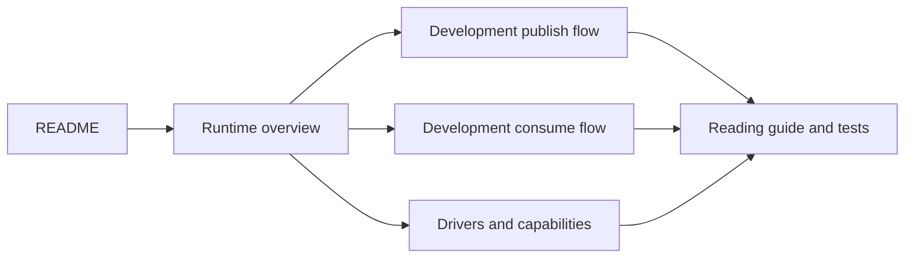

# F1 documentation

Use this page as the documentation front door and choose the route that matches your role.

Choose the route that matches your role:

## For service authors

Follow these guides to add F1 to an application:

- [Getting started](user-guide/getting-started.md) — install the module, load configuration, and connect a driver.
- [Publishing events](user-guide/publishing-events.md) — publish versioned events and choose routing metadata.
- [Consuming events](user-guide/consuming-events.md) — register handlers, decode payloads, and run a subscription.
- [Handling failures](user-guide/handling-failures.md) — choose retry, terminal, drop, dead-letter, and idempotency behavior.
- [Graceful shutdown](user-guide/graceful-shutdown.md) — drain runners and close clients without losing accepted work.
- [Testing](user-guide/testing.md) — test handlers deterministically with the in-memory test client.

## For maintainers

The architecture map is the canonical entry point for maintainers. The runtime guides below explain
implementation boundaries, message flows, and source-reading order.

- [Architecture](development/architecture.md) — package ownership, dependency boundaries, and core invariants.

This is the shortest route from “what is F1?” to “where does this line run?”

## Guides

- [Runtime overview](runtime-overview.md) — boundaries, ownership, and the two main flows.
- [Publish flow](development/publish-flow.md) — application payload to durable broker acknowledgement.
- [Consume flow](development/consume-flow.md) — broker delivery to handler result, settlement, drain, and reconnect.
- [Driver contract](development/driver-contract.md) — port interfaces, capability negotiation, topology, and lifecycle rules.
- [Driver conformance](development/driver-conformance.md) — shared contract groups, profiles, fixtures, vectors, and run commands.
- [Testing strategy](development/testing.md) — test-layer selection, deterministic timing, failure paths, and repository gates.
- [Drivers and provider notes](drivers-and-capabilities.md) — adapter behavior, broker differences, and capability notes.
- [Source-reading guide](development/source-reading-guide.md) — maintainer reading order, flow tracing, and verification ownership.

## Source authority

Docs provide navigation, diagrams, terminology, and durable constraints. The source and tests own
current behavior. Start from the symbol links in each guide when behavior matters.

## Current implementation

The repository contains the core SDK, the public codec and driver ports, the deterministic in-memory
driver, the RabbitMQ driver, and a connected Kafka driver. Kafka uses classic consumer groups; share
groups are not implemented. Its transport limits are reported through `Client.Limits()` and the
core emulates F1 retry, delay, and dead-letter behavior where Kafka has no native equivalent.

Useful commands are owned by the [Makefile](../Makefile):

The [Makefile](../Makefile) owns the complete build, unit-test, lint, API-surface, and driver
verification command set. `make test-rabbitmq` and `make test-kafka` require their respective
local broker fixtures; `make test-kafka-conformance` runs the Kafka conformance profiles and can
take several minutes. The broker lifecycle targets use the
[local compose fixture](../docker/docker-compose.yml).
