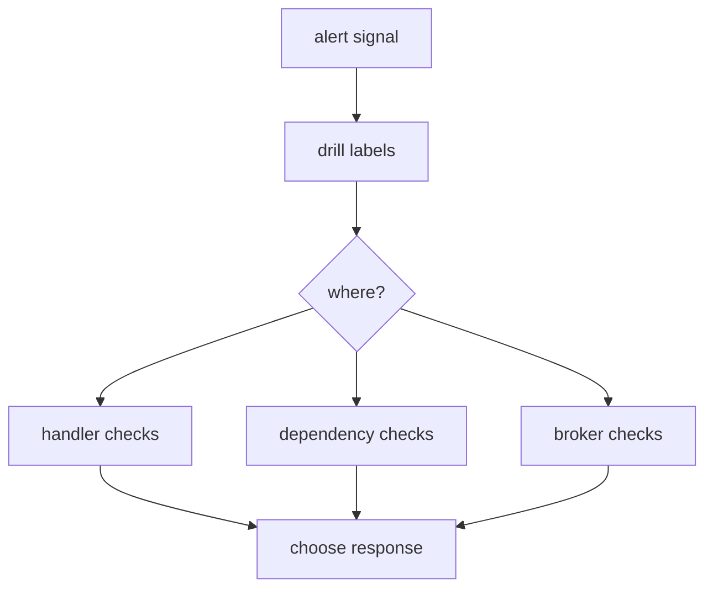

# Alerts

F1 alert queries use names produced by the configured OpenTelemetry Prometheus exporter. That exporter normally changes dots to underscores, appends unit suffixes such as `_seconds`, and adds `_total` to counters. The thresholds here are starting points, not SDK guarantees.

## Triage every alert first

Use the same first pass for every signal:

1. Confirm `messaging_system`, destination, consumer group, priority, error, and reason labels identify the intended series.
2. Compare the signal with receive, process, retry, dead-letter, backlog, and broker health signals for the same group.
3. Check the handler, its dependencies, broker assignment, and recent configuration changes before changing a threshold.



Each query is a starting point. Tune its window, labels, and threshold to the deployment's traffic and service-level objective.

## Dead letters appearing

A non-zero rate means F1 confirmed a dead-letter publication or routing. Group by error class and death reason to identify the failing path.

```text
sum by (messaging_system, messaging_destination_name, messaging_consumer_group_name, f1_priority, error_type, reason) (
  rate(f1_messaging_dead_letters_total[5m])
) > 0
```

Start with any rate above zero over five minutes, then add a hold duration (`for`) so the condition must remain true before firing when isolated dead letters are normal.

Check the matching handler, decode, and poison-message errors. Then inspect the dead-letter destination and error handler for publication or notification failures.

## Retry rate high relative to consumption

A high retry ratio means recovery work consumes a material share of deliveries. Group the ratio by messaging system and consumer group; use retry labels for destination and priority drilldown.

```text
(
  sum by (messaging_system, messaging_consumer_group_name) (
    rate(f1_messaging_retries_total[5m])
  )
  /
  clamp_min(
    sum by (messaging_system, messaging_consumer_group_name) (
      rate(messaging_client_consumed_messages_total[5m])
    ),
    0.001
  )
) > 0.1
```

Start at 10 percent retries per consumed message over five minutes. Tune it after observing the normal retry mix.

Break retries down by error type, confirm the query targets the intended group, and check handler errors, broker redeliveries, and dependency health.

## Backlog growing

A growing backlog is a positive 15-minute derivative above a small floor, which avoids paging on a few transient messages.

```text
deriv(f1_messaging_backlog_messages[15m]) > 0
and
f1_messaging_backlog_messages > 10
```

Start with a floor of 10 messages. Check membership, assigned work, concurrency, paused destinations, handler latency, retry or dead-letter rates, and broker lag.

## Oldest message age

The oldest-age signal is meaningful when a broker supplies a trusted head timestamp. For Kafka, configure `message.timestamp.type=LogAppendTime`; RabbitMQ does not report this metric for its default quorum queue type.

```text
f1_messaging_backlog_oldest_age_seconds{messaging_system="f1.kafka"} > 300
```

Start at five minutes and tune it to the destination latency objective. Verify the Kafka timestamp setting, then check backlog by destination and group, partition assignment, consumer health, and handler latency.

## Handler latency near its timeout

A p99 process duration near `handlerTimeout` leaves little room for [the final ack or nack](/learn/glossary#settlement) and the broker's check that the consumer is still alive.

```text
histogram_quantile(
  0.99,
  sum by (le, messaging_system, messaging_destination_name, messaging_consumer_group_name, f1_priority) (
    rate(messaging_process_duration_seconds_bucket[5m])
  )
) > 24
```

The query uses 24 seconds as an example for a 30-second timeout. Replace it with 80 percent of the deployment's configured `handlerTimeout`. Compare p99 with that timeout and any broker consumer timeout, then inspect slow handlers and downstream dependencies.

## Broker wait high

Broker wait measures time from a trusted broker enqueue timestamp to delivery. It exists only when F1 has that timestamp.

```text
histogram_quantile(
  0.99,
  sum by (le, messaging_system, messaging_consumer_group_name) (
    rate(f1_messaging_broker_wait_duration_seconds_bucket[5m])
  )
) > 1
```

Start at one second over five minutes. Verify Kafka `LogAppendTime` or RabbitMQ's trusted `timestamp_in_ms` configuration, then inspect broker lag, fetch capacity, assignment, broker health, and network latency.

## No consumption while backlog is positive

This signal means F1 sees backlog but no received-message rate for the same messaging system and consumer group.

```text
(
  (
    sum by (messaging_system, messaging_consumer_group_name) (
      rate(messaging_client_consumed_messages_total[5m])
    )
    or on (messaging_system, messaging_consumer_group_name)
    (
      0 * sum by (messaging_system, messaging_consumer_group_name) (
        f1_messaging_backlog_messages
      )
    )
  ) == 0
)
and on (messaging_system, messaging_consumer_group_name)
(
  sum by (messaging_system, messaging_consumer_group_name) (
    f1_messaging_backlog_messages
  ) > 0
)
```

Start after five minutes of zero consumption while backlog remains positive. Check process health, group membership, assignment, connection errors, broker permissions, paused destinations, and the configured error handler.

F1 does not emit a metric for connection lost or connection restored. Use the error handler and logs for those signals instead of adding an alert for a nonexistent series.

## Go further

- [Observability](/advanced-topics/observability) - metric names, attributes, and timestamp sources;
- [Running in production](/advanced-topics/running-in-production) - readiness and shutdown; and
- [Failure handling](/advanced-topics/failure-handling) - retry and dead-letter outcomes.
