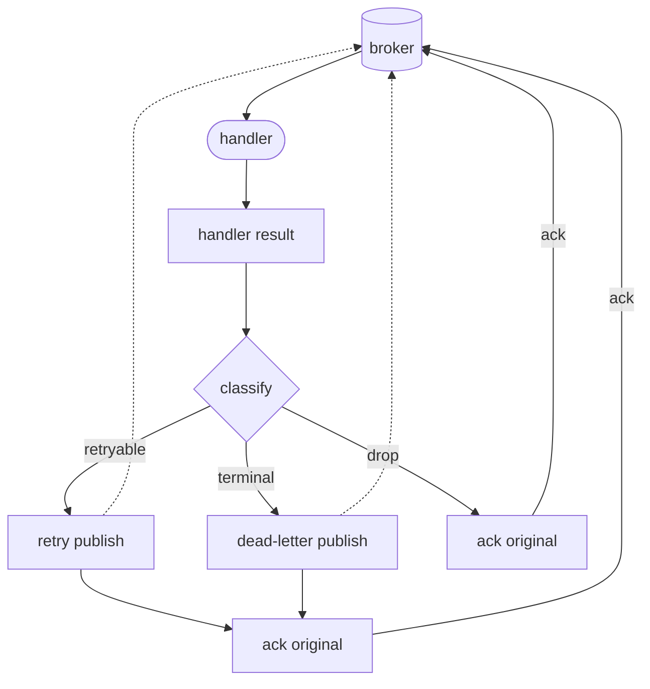

# Failure handling

F1 turns a handler result into a delivery outcome: it decides what the result means, publishes any [retry or dead-letter copy](/learn/glossary#successor-publish), and then [finishes the original](/learn/glossary#settlement) with an ack or a nack.

A handler does not acknowledge, reject, or requeue a driver message directly. F1 provides [at-least-once delivery](/learn/glossary#at-least-once-delivery), so a process or connection failure can repeat a business effect after the handler has returned. Use `Event.IdempotencyKey()` when an effect must be safe to apply twice. See [Message](/basics/message) and [Publisher and subscriber](/basics/pubsub).

## Choose the outcome

Return the result that matches the business meaning of the failure.

| Outcome | Trigger and delivery result |
| --- | --- |
| Retryable | An ordinary error publishes a retry copy, then acks the original, until the attempt limit is reached. |
| Terminal | `f1.Terminal` or the last allowed attempt publishes a dead-letter copy, then acks the original. |
| Dropped | `f1.Drop` acknowledges without applying the effect or retaining a dead-letter copy. |
| Unmatched | No handler matches; `f1.Ignore` acknowledges it, while `f1.DeadLetter` publishes a dead-letter copy. |
| Unpublishable | A copy that can never be encoded or accepted: a retry copy is dead-lettered instead; when no dead-letter copy can be made, F1 drops the message and reports it as an observer event and through `WithErrorHandler`, or an error log when no handler is set. |

A temporary dependency outage should remain retryable. A payload that cannot be decoded cannot become valid on a later attempt, so return `f1.Terminal` for that case.

```go
func handleOrder(ctx context.Context, event *f1.Event) error {
	var order Order
	if err := event.Decode(&order); err != nil {
		return f1.Terminal(fmt.Errorf("decode order: %w", err))
	}
	if err := reserveInventory(ctx, order); err != nil {
		return fmt.Errorf("reserve inventory: %w", err)
	}
	return nil
}
```

Returning `nil` after logging a failure acknowledges the delivery. Return the error instead.

## Keep classification through context

Classification helpers work through wrapped errors. Add context with `%w` so F1 can still find `Terminal` or `Drop` in the error chain.

```go
if err := validateOrder(order); err != nil {
	return f1.WithDetails(
		f1.Terminal(fmt.Errorf("validate order: %w", err)),
		map[string]string{"validation": "order"},
	)
}
```

`f1.WithDetails` adds diagnostics to a terminal or max-attempts dead-letter copy. Details do not affect routing, retries, acks, or ordering. Keys are lowercase alphanumeric; F1 accepts at most 16 keys and 1 KiB of encoded detail data. Invalid or excess details are discarded and reported when the message is dead-lettered. See [`WithDetails`](https://fgit.zapps.vn/zatf2026-be-t3/event-driven-messaging-sdk/-/blob/main/errors.go).

## Configure the retry delays

`RetryConfig` defines [the list of retry delays](/learn/glossary#retry-ladder): when an ordinary error gets another attempt, and how long it waits first.

```go
runner, err := client.Subscribe(ctx, f1.Subscription{
	Name:  "orders-worker",
	Topics: []string{"orders.created"},
	Retry: f1.RetryConfig{
		MaxAttempts:     5,
		InitialInterval: time.Second,
		Multiplier:      2,
		MaxInterval:     time.Minute,
	},
	Handlers: map[string]f1.Handler{
		"orders.created.v1": f1.HandlerFunc(handleOrder),
	},
})
```

The effective attempt limit is the smaller of the event's `WithMaxAttempts` value and the subscription policy. `MaxAttempts` includes the first delivery, and `Event.Attempt()` is one-based. Once the current attempt reaches that cap, an ordinary error follows the dead-letter path with `ReasonMaxAttempts`.

When `Tiers` is not set, F1 works out the [retry steps](/learn/glossary#retry-tier) from `InitialInterval`, `Multiplier`, and `MaxInterval`. A handler cannot choose its own delay: every retry waits the delay of the step for its attempt. No retry step may be longer than 2,147,483,647 ms (about 24.8 days), the longest delay a RabbitMQ message can carry; a longer step is rejected at startup rather than released early.

## Follow a failed delivery

A retry or dead-letter copy is published before F1 acks the original delivery. This order means a message is never lost between the two: until the broker confirms the copy, the original is still there.



F1 waits for the broker to confirm the copy before acking the original. If a retry or dead-letter copy cannot be published within the time allowed for handing it to the broker, F1 stops the subscription, reports the runtime error through `WithErrorHandler`, releases the consumer without acknowledging the original, and records the failure for `Health`.

A copy that can never be published is different. If the broker refuses the copy because it is too large, or its headers cannot be encoded, every redelivery would fail the same way. F1 acknowledges the original and reports the deliberate drop through `WithErrorHandler`. A retry copy that is too large is first sent through the dead-letter path; if that copy is also unpublishable, the same drop applies.

## Dead letters and discarded events

A dead-letter copy keeps the original body and envelope metadata, then adds a death reason and the last error. Automatic reasons include `terminal`, `max_attempts`, `panic`, `decode`, `expired`, `unmatched`, and `poison`.

`Subscription.OnDeadLetter` receives a confirmed dead-letter outcome. `Subscription.OnDiscarded` receives an unmatched or explicitly dropped event. These callbacks are for logs, metrics, and alerts, not correctness-critical workflow steps. They run asynchronously with bounded notification contexts, so a slow or panicking callback must not stall delivery or shutdown.

Use `f1.Drop` only when the event is intentionally handled without applying an effect and should not be retained. The default `UnmatchedPolicy` is `f1.Ignore`, which acknowledges an event without a matching handler and reports `DiscardUnmatched`. Use `f1.DeadLetter` when unmatched events must be retained.

## Make effects idempotent

F1 publishes a copy before acking the current delivery, but a process can still stop after a handler's side effect and before the copy or the ack completes. The original or its copy may therefore be seen more than once.

Use [`Event.IdempotencyKey()`](/basics/message#delivery-identity-and-redelivery) as the input to application-owned deduplication. A producer can set the key with `WithIdempotencyKey`; otherwise F1 falls back to the event ID. `Event.Attempt()` is useful for diagnostics and policy decisions, but it is not an identity.

## Read runtime failures

The notification surfaces have different meanings.

| Surface | Receives | Does not receive |
| --- | --- | --- |
| `Subscription.OnDeadLetter` | A confirmed dead-letter outcome and its reason | A dead-letter copy the broker has not confirmed |
| `Subscription.OnDiscarded` | An unmatched or explicitly dropped event | Retried or dead-lettered handler errors |
| `f1.WithErrorHandler` | Driver errors, failures to publish a retry or dead-letter copy, and a dropped copy that can never be published | Ordinary handler errors already covered by retry or dead-letter policy |

The event passed to `WithErrorHandler` identifies the affected delivery when there is one. It is `nil` for a connection-level error. The callback runs asynchronously with a bounded context and must remain safe to drop or repeat.

## Go further

- [Ordering and scheduling](/advanced-topics/ordering-and-scheduling) - retry lanes, fairness, and per-key order;
- [Lifecycle and shutdown](/advanced-topics/lifecycle-and-shutdown) - drain and the ack-last close order; and
- [Message](/basics/message) - envelope identity and idempotent effects.
