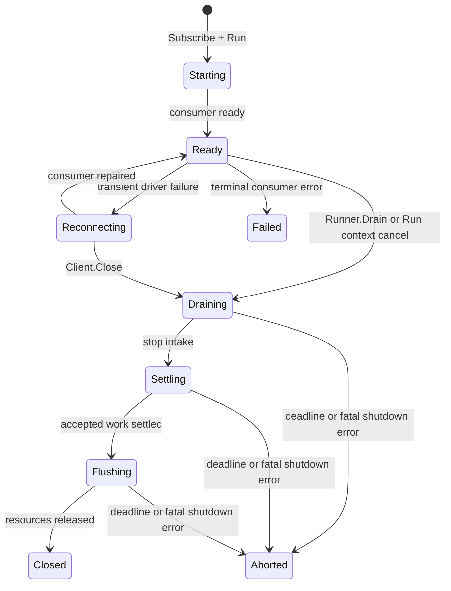

# Lifecycle and shutdown

F1 separates subscription lifecycle from client lifecycle:

- `Runner.Run` owns one subscription's consumer and delivery workers;
- `Runner.Drain` stops one subscription while the client remains usable; and
- `Client.Close` is the process-boundary operation that drains every registered
  runner and releases the client's driver resources.

Choose the smallest scope that matches the operation. Do not close a shared
client just to stop one subscription, and do not rely on a runner context
cancel alone to flush the client's publisher.

## The lifecycle at a glance



The public runner lifecycle is implemented by [`Runner.Run`](https://fgit.zapps.vn/zatf2026-be-t3/event-driven-messaging-sdk/-/blob/main/worker.go)
and [`Runner.Drain`](https://fgit.zapps.vn/zatf2026-be-t3/event-driven-messaging-sdk/-/blob/main/worker.go). The state machine and phase transitions
are owned by [`internal/lifecycle`](https://fgit.zapps.vn/zatf2026-be-t3/event-driven-messaging-sdk/-/tree/main/internal/lifecycle). A runner that
has not started is already drained; `Drain` returns without starting it.

## Run a subscription

`Subscribe` validates the subscription and returns a runner. It does not start
fetching. Call `Run` from the service-owned goroutine and retain its result:

```go
runner, err := client.Subscribe(ctx, f1.Subscription{
	Name:   "orders-worker",
	Topics: []string{"orders.placed"},
	Handlers: map[string]f1.Handler{
		"orders.placed.v1": f1.HandlerFunc(handleOrderPlaced),
	},
})
if err != nil {
	return fmt.Errorf("create subscription: %w", err)
}

runDone := make(chan error, 1)
go func() {
	runDone <- runner.Run(ctx)
}()
```

`Run` returns when the consumer stops, the run context is canceled, or a
driver error ends the current runner generation. A transient driver failure may
put the runner into `Reconnecting`; the runner can rebuild its consumer and
return to `Ready` without the service creating a second runner. A terminal
runner error is returned and recorded in the client's health state, whether it
came from a fatal consumer error or from any other way the runner stopped. That
record stays until a runner with the same subscription name starts and reaches
`Ready`; inspect and report it rather than silently restarting the same runner
in a loop.

The context passed to `Run` controls normal intake and handler work. Canceling
it is a hard stop: in-flight handlers see their context canceled at once and
`HandlerGrace` does not apply, so a signal wired straight into `Run` abandons
the handler that is already in flight. `Runner.Drain` is the graceful stop; it
ends intake and lets accepted work finish within the lifecycle budgets. Use a
separate shutdown context for cleanup so an already-canceled run context does
not immediately cancel the cleanup operation.

When a signal should stop the subscription without abandoning in-flight work,
drain first and cancel the run context afterwards:

```go
// Run on its own context, so a signal can drain instead of canceling.
runCtx, cancelRun := context.WithCancel(context.Background())
defer cancelRun()

runDone := make(chan error, 1)
go func() { runDone <- runner.Run(runCtx) }()

signalCtx, stop := signal.NotifyContext(context.Background(), os.Interrupt, syscall.SIGTERM)
defer stop()

<-signalCtx.Done()

drainCtx, cancelDrain := context.WithTimeout(context.Background(), 20*time.Second)
defer cancelDrain()
if err := runner.Drain(drainCtx); err != nil {
	return fmt.Errorf("drain orders worker: %w", err)
}
cancelRun()
if err := <-runDone; err != nil {
	return fmt.Errorf("orders worker stopped: %w", err)
}
```

## Drain one runner

Use `Runner.Drain` when the client or its publisher must stay available for
other subscriptions:

```go
drainCtx, cancel := context.WithTimeout(context.Background(), 20*time.Second)
defer cancel()

if err := runner.Drain(drainCtx); err != nil {
	return fmt.Errorf("drain orders worker: %w", err)
}
if err := <-runDone; err != nil {
	return fmt.Errorf("orders worker stopped: %w", err)
}
```

Drain performs the following contract:

1. stop accepting new deliveries for the runner;
2. let already accepted deliveries finish or settle within the lifecycle
   budgets;
3. give handler code the configured cancellation and grace window; and
4. stop or release the consumer after the runner's work is accounted for.

`Drain` does not acknowledge an unfinished handler as successful. If a handler
does not cooperate with cancellation or a settlement operation cannot finish,
F1 returns an error or requeues/releases the delivery according to the final
settlement path. See [Consume flow](/development/consume-flow)
for the settle-last rule and in-flight accounting.

Calling `Drain` is idempotent for an already draining or closed runner. The
caller still needs to observe the returned error and the `Run` result because a
driver or settlement failure can be surfaced through either lifecycle boundary.

## Close the client

Use `Client.Close` at the process boundary. It drains all registered runners,
waits for active publishes, flushes the shared producer, closes the producer,
and finally closes the driver connection:

```go
func shutdown(client *f1.Client) error {
	closeCtx, cancel := context.WithTimeout(context.Background(), 20*time.Second)
	defer cancel()

	if err := client.Close(closeCtx); err != nil {
		return fmt.Errorf("close F1 client: %w", err)
	}
	return nil
}
```

The close sequence is intentionally settle-last and publish-aware:

1. shutdown admission closes, so new application publishes and subscriptions
   are refused;
2. the reconnect supervisor is stopped;
3. registered runners drain concurrently;
4. active application publishes reach quiescence;
5. the shared producer is flushed;
6. the producer is closed; and
7. the driver connection is closed.

Core-generated retry and dead-letter successors are allowed to complete during
runner drain so an accepted failed delivery is not lost merely because
shutdown has begun. Application code should stop publishing once shutdown
starts. The publish-side ownership is described in
[Publish flow](/development/publish-flow), and the executable orchestration is in
[`Client.Close`](https://fgit.zapps.vn/zatf2026-be-t3/event-driven-messaging-sdk/-/blob/main/client.go).

`Client.Close` is safe to call again after it has completed. A concurrent close
attempt is rejected while the first attempt is active. If shutdown cannot
complete a phase, the client remains retryable; a later `Close` retries or
rejoins the still-running phase instead of starting a duplicate driver
operation. A resolved producer-close error is still returned, but it does not
prevent connection shutdown; once all resources are released, the client may
be closed even though the returned error is non-nil. Shutdown errors should be
logged and returned to the process supervisor.

## Use independent shutdown contexts

The normal run context and shutdown context have different jobs:

```go
runCtx, cancelRun := context.WithCancel(context.Background())
defer cancelRun()

runDone := make(chan error, 1)
go func() { runDone <- runner.Run(runCtx) }()

signalCtx, stop := signal.NotifyContext(context.Background(), os.Interrupt, syscall.SIGTERM)
defer stop()

// The signal context never cancels runCtx, so a signal leaves in-flight
// handlers to Close.
var runErr error
runReturned := false
select {
case runErr = <-runDone:
	runReturned = true
case <-signalCtx.Done():
}

shutdownCtx, cancel := context.WithTimeout(context.Background(), 20*time.Second)
defer cancel()
if err := client.Close(shutdownCtx); err != nil {
	return fmt.Errorf("shutdown: %w", err)
}

// Close drains every runner, so Run returns even though runCtx was never
// cancelled.
if !runReturned {
	runErr = <-runDone
}
cancelRun()
if runErr != nil && !errors.Is(runErr, context.Canceled) {
	return fmt.Errorf("subscription stopped: %w", runErr)
}
```

Use a fresh context derived from `context.Background()` for shutdown. A signal
context is already canceled when the signal branch runs, so passing it to
`Close` would make every phase fail immediately. A shutdown deadline is still
required: it bounds the caller's wait even when a driver or handler is not
cooperative.

For a service with several runners, wait for the first run result or a signal,
then call `Client.Close` once. `Client.Close` already drains all runners;
calling `Drain` on each runner first is only necessary when the client must
remain usable between those operations.

## Configure shutdown budgets

Lifecycle budgets live in [`LifecycleConfig`](https://fgit.zapps.vn/zatf2026-be-t3/event-driven-messaging-sdk/-/blob/main/config.go). Configure them
from the service's work and dependency behavior rather than selecting values
only to make a shutdown test pass:

| Field | Governs | Important constraint |
| --- | --- | --- |
| `DrainTimeout` | Runner handler-drain and settlement phases | Must be positive; subscription `HandlerTimeout` must be shorter. |
| `HandlerGrace` | Final cancellation grace window for handlers during drain | Must not be negative; a value outside the drain budget is not useful. |
| `ConsumerDrainTimeout` | `Client.Close`'s wait for all runner drains | Zero leaves the caller's context as the only bound. |
| `FlushTimeout` | Shared producer flush | Zero leaves the caller's context as the only bound. |
| `CloseTimeout` | Producer and connection close operations | Zero leaves the caller's context as the only bound. |

`DrainTimeout` is applied to the runner's drain and settlement waits as separate
phase budgets, not as one promise that the entire client close will finish in
that duration. `ConsumerDrainTimeout` is a separate client-level bound around
the collection of runner drains. The caller's `Close` context can end the
current wait earlier; a producer or connection phase that was started for
rejoining may continue in the background.

The config defaults and validation are executable in [`config.go`](https://fgit.zapps.vn/zatf2026-be-t3/event-driven-messaging-sdk/-/blob/main/config.go).
Do not duplicate the numeric defaults in service documentation; link to the
config owner and set explicit values when the deployment needs a documented
policy.

## Handler cancellation and stuck work

Handlers receive a context that carries the delivery's deadline and
cancellation. Pass it to downstream calls and return when the operation has
completed or the context has ended:

```go
func handleOrder(ctx context.Context, event *f1.Event) error {
	var order Order
	if err := event.Decode(&order); err != nil {
		return f1.Terminal(fmt.Errorf("decode order: %w", err))
	}
	if err := applyOrder(ctx, event.IdempotencyKey(), order); err != nil {
		return err
	}
	return nil
}
```

Avoid launching untracked goroutines from a handler. F1 cannot settle work that
the handler has detached from its delivery, and shutdown cannot make a
non-cooperative goroutine stop. If handler code ignores cancellation for too
long, F1 records the delivery as abandoned or requeues it through the driver
instead of claiming a successful acknowledgement. Make the business effect
idempotent because that recovery path can produce another delivery.

Notification callbacks such as `OnDeadLetter`, `OnDiscarded`, and
`WithErrorHandler` are also not shutdown barriers. Keep them short and
cancellation-aware; they run asynchronously and may be abandoned when the
runner has finished its bounded lifecycle.

## Reconnection is not shutdown

Transient driver failures can move a runner from `Ready` to `Reconnecting`.
F1 releases the old consumer, waits for in-flight publish quiescence, and asks
the driver to create a replacement before returning the runner to `Ready`.
While reconnecting, the service should keep its runner and avoid creating a
duplicate subscription.

Once `Client.Close` begins, shutdown wins over reconnect: new reconnect work is
not admitted and the supervisor is canceled. A reconnect failure should be
reported as a runtime or runner error; it is not a reason for the service to
skip the close path. The reconnect ownership lives in
[`reconnect.go`](https://fgit.zapps.vn/zatf2026-be-t3/event-driven-messaging-sdk/-/blob/main/reconnect.go).

## Test lifecycle behavior

Use [`f1test`](https://fgit.zapps.vn/zatf2026-be-t3/event-driven-messaging-sdk/-/blob/main/f1test/f1test.go) for handler and settlement tests, then
use driver conformance tests for driver-specific lifecycle behavior. Cover the
decisions that matter to the service:

- `Runner.Drain` stops intake and waits for accepted work;
- a canceled handler settles or requeues instead of being acknowledged as
  successful;
- `Client.Close` drains multiple runners before producer and connection close;
- new publishes and subscriptions are refused once shutdown begins;
- a phase timeout returns an error without starting duplicate driver calls on a
  later `Close`; and
- a fresh shutdown context can complete a retried close after an earlier
  caller deadline.

The lifecycle state machine is tested in
[`internal/lifecycle/drain_test.go`](https://fgit.zapps.vn/zatf2026-be-t3/event-driven-messaging-sdk/-/blob/main/internal/lifecycle/drain_test.go).
Client-level timeout and retry behavior is covered by
[`client_drain_budget_test.go`](https://fgit.zapps.vn/zatf2026-be-t3/event-driven-messaging-sdk/-/blob/main/client_drain_budget_test.go) and
[`client_close_sequencing_test.go`](https://fgit.zapps.vn/zatf2026-be-t3/event-driven-messaging-sdk/-/blob/main/client_close_sequencing_test.go).
The runnable consumer example demonstrates signal handling, but the service
code should still keep the driver selection outside its business handlers; see
[`examples/consumer/main.go`](https://fgit.zapps.vn/zatf2026-be-t3/event-driven-messaging-sdk/-/blob/main/examples/consumer/main.go) for the complete
composition pattern.

## Common mistakes

- Passing an already-canceled run or signal context to `Client.Close`.
- Closing a shared client to stop one subscription that should have used
  `Runner.Drain`.
- Ignoring the `Run`, `Drain`, or `Close` error and reporting shutdown as
  successful unconditionally.
- Returning from a handler before its business effect has completed.
- Starting background work from a handler without a cancellation and
  idempotency plan.
- Calling `Close` concurrently from multiple cleanup paths.
- Starting a new runner after shutdown has begun, or creating a duplicate
  runner after a transient reconnect.
- Assuming a timeout means the underlying driver call stopped immediately;
  retryable close phases can continue in the background and are rejoined by a
  later `Close`.

## Continue from here

- [Publisher and subscriber](/basics/pubsub) - runner ownership and the
  publish/consume lifecycle boundary;
- [Failure handling](/advanced-topics/failure-handling) - settlement outcomes during drain
  and successor handoff;
- [Message](/basics/message) - context, identity, and idempotent effects;
- [Consume flow](/development/consume-flow) - settle-last
  ordering and in-flight accounting; and
- [Runtime overview](/runtime-overview) - client, runner, and driver
  boundaries.
