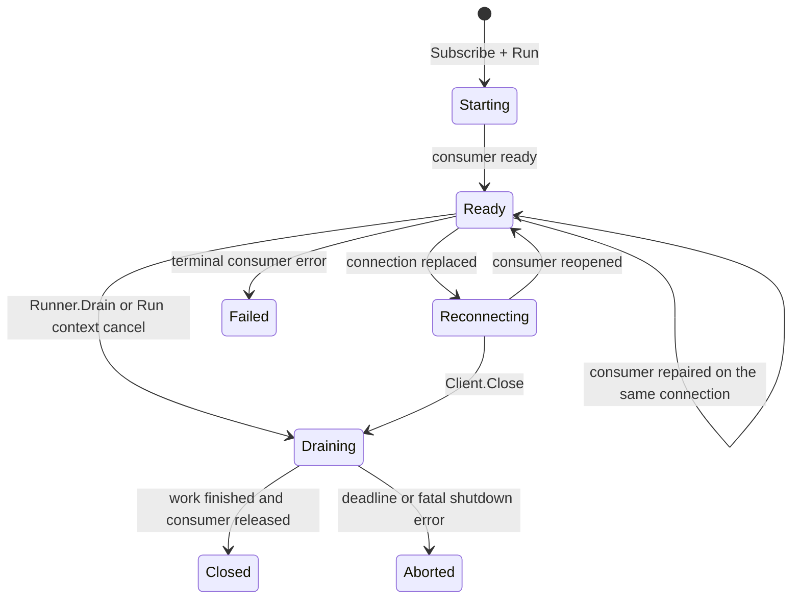
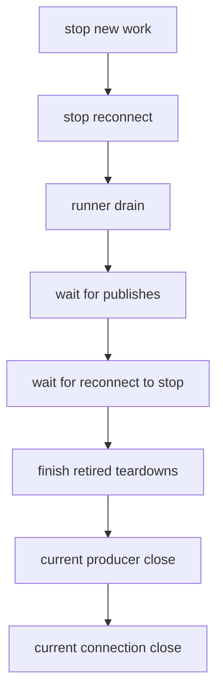

# Lifecycle and shutdown

F1 separates subscription lifecycle from client lifecycle: `Runner.Run` owns one consumer and its workers, `Runner.Drain` stops one subscription while the client remains usable, and `Client.Close` [drains](/learn/glossary#drain) every registered runner before releasing client resources.

Choose the smallest scope that matches the operation. Do not close a shared client just to stop one subscription, and do not rely on canceling a runner context to release the client's driver resources.

## The lifecycle at a glance



A runner that has not started is already drained; `Drain` returns without starting it. `Run` returns when the consumer stops, its context is canceled, or a driver error ends the runner's [current consumer](/learn/glossary#reconnect-generation).

A terminal runner error is recorded in client health only when the runner stops unexpectedly while the client is `Ready`. Caller cancellation, `Runner.Drain`, and a client that has begun shutting down are intentional exits and are not recorded as subscription failures. The record remains until a runner with the same subscription name starts and reaches `Ready`.

## Run and drain a subscription

`Subscribe` validates a subscription and returns a runner, but it does not start fetching. Run it from a service-owned goroutine and retain the result. A canceled `Run` context is a hard stop: in-flight handlers see cancellation immediately, and `HandlerGrace` does not apply. Use `Runner.Drain` for graceful completion: it ends intake and lets accepted work finish within the lifecycle time limits.

A drain performs four steps:

1. stop accepting new deliveries;
2. let accepted deliveries finish and be [acked or nacked](/learn/glossary#settlement) within the time limits;
3. give handlers their configured cancellation and grace window; and
4. stop or release the consumer after accepted work is accounted for.

`Drain` does not acknowledge an unfinished handler as successful. If a handler ignores cancellation or the ack cannot go through, F1 returns an error, or requeues or releases the delivery, depending on how far the ack got. Observe both the `Drain` result and the `Run` result because either can surface a driver or ack failure.

## Use one shutdown path

Keep the run context independent from the signal context. A fresh shutdown context lets `Close` drain work even though the signal branch has already observed cancellation.

```go
runCtx, cancelRun := context.WithCancel(context.Background())
defer cancelRun()

runDone := make(chan error, 1)
go func() { runDone <- runner.Run(runCtx) }()

signalCtx, stop := signal.NotifyContext(context.Background(), os.Interrupt, syscall.SIGTERM)
defer stop()

<-signalCtx.Done()
shutdownCtx, cancelShutdown := context.WithTimeout(context.Background(), 20*time.Second)
defer cancelShutdown()
if err := client.Close(shutdownCtx); err != nil {
	return fmt.Errorf("close F1 client: %w", err)
}
if err := <-runDone; err != nil && !errors.Is(err, context.Canceled) {
	return fmt.Errorf("subscription stopped: %w", err)
}
```

For a client with several runners, call `Client.Close` once. It drains all registered runners. Call `Runner.Drain` separately only when the client must remain usable between subscription operations.

## Keep client facts separate

A client reports three independent facts:

| Fact | Meaning |
| --- | --- |
| Lifecycle | `Ready` before close, `Draining` during close, `Aborted` after a failed phase that may be retried, and `Closed` after resources are released. |
| Producer | The shared producer is created on first use and torn down by `Close`. |
| Connection | A live connection, no connection, a reconnect attempt, or a retained error after reconnect gives up. |

A timeout can leave one fact changed while another phase continues. For example, a producer may be closed while the lifecycle becomes `Aborted`. A reconnect error may be retained while the lifecycle remains `Ready`. Reading the facts independently prevents one derived state from hiding a still-running operation.

`Subscribe` and `Runner.Run` require a ready client and a live connection. Application publishes are still allowed during `Draining` while the producer and connection stand, so accepted work can finish; new subscriptions are refused. F1's own [retry and dead-letter copies](/learn/glossary#successor-publish) are still allowed during a drain for the same reason.

`Health` reports connection status before recorded runner failures. It reports a retained reconnect error after the connection is given up, `f1: client is closed` after close, `f1: client is not connected` with no connection, `f1: client is reconnecting` during a rebuild, and `f1: client is closing` while shutdown is active with a connection still present.

## Close in ack-last order

`Client.Close` stops new work, drains registered runners, waits for in-flight publishing and the reconnect supervisor, finishes retired teardowns, closes the current shared producer, and finally closes the current driver connection.



The phases are:

1. stop letting new work start;
2. stop the reconnect supervisor;
3. drain registered runners concurrently within `Lifecycle.ConsumerDrainTimeout`;
4. wait for application publishes started before close, and for retry and dead-letter copies still being handed to the broker, up to `Lifecycle.DrainTimeout`;
5. wait up to `Lifecycle.CloseTimeout` for a reconnect in progress to stop, then
   finish retired teardowns before closing current resources, with a separate
   `Lifecycle.CloseTimeout` bound for each retirement wait;
6. close the current producer, after releasing any consumer a failed `Release`
   left registered; and
7. close the current driver connection.

`Lifecycle.CloseTimeout` bounds consumer `Stop` and `Release` waits outside
retirement attempts, the wait for the reconnect supervisor, each retired teardown
wait, and current producer and connection close waits. A retired teardown calls
its producer close, retained-consumer releases, and connection close sequentially;
it stops at the first error and retains unfinished resources. `Client.Close`
returns nil only after all retired teardowns finish successfully. A running
attempt is rejoined, never duplicated; a failed retirement gets at most one new
attempt per caller-issued `Close`, skipping successful stages. An error or timeout
stops shutdown before current resource teardown. There is no background retry,
timer, or backoff; the caller chooses when to retry. Several retired connections
can make total shutdown exceed one `CloseTimeout`, while the caller context bounds
the invocation.

A consumer whose `Release` failed remains owned until release succeeds. A retried
`Client.Close` rejoins running current producer or connection close phases as well.
A concurrent close is rejected, and a fully closed client returns nil. For the
current producer only, a returned close error does not prevent current connection
shutdown; this policy does not apply to retired resources. A timeout bounds the
caller's wait, not necessarily the driver call, which can continue and be rejoined
later.

## Configure shutdown time limits

Lifecycle time limits live in `LifecycleConfig`. Choose them from handler and dependency behavior, not only from a test timeout.

| Field | Governs | Constraint |
| --- | --- | --- |
| `DrainTimeout` | Runner handler drain and finishing messages | Must be positive; subscription `HandlerTimeout` must be shorter. |
| `HandlerGrace` | Final cancellation grace for handlers | Must not be negative. A value at or above `DrainTimeout` is treated as `0`, so handlers get no grace. |
| `RebalanceDrainTimeout` | Kafka only: the wait for an in-flight delivery on each revoked partition during a rebalance | Must not exceed 0.6 times the smaller of `broker.kafka.sessionTimeout` and `broker.kafka.rebalanceTimeout`. Zero selects the package default. |
| `ConsumerDrainTimeout` | `Client.Close` waiting for runner drains | Zero leaves the caller's context as the only bound. |
| `CloseTimeout` | Consumer Stop and Release waits outside retirement attempts, the supervisor wait, each retired teardown wait, and current producer and connection close waits | Zero selects the package default. |

`DrainTimeout` applies separately to the runner drain and to the wait for acks. `ConsumerDrainTimeout` is a separate client-level limit around all runner drains together. The caller's `Close` context can end the current wait earlier.

## Keep handler work attached

Handlers receive a context carrying delivery cancellation and deadlines. Pass it to downstream calls and return when the operation completes or the context ends.

```go
func handleOrder(ctx context.Context, event *f1.Event) error {
	var order Order
	if err := event.Decode(&order); err != nil {
		return f1.Terminal(fmt.Errorf("decode order: %w", err))
	}
	if err := applyOrder(ctx, event.IdempotencyKey(), order); err != nil {
		return err
	}
	return nil
}
```

Do not launch untracked goroutines from a handler. F1 cannot ack work detached from its delivery, and shutdown cannot stop a goroutine that ignores cancellation. If handler code ignores cancellation, F1 gives up on the delivery and requeues it through the driver instead of reporting a successful ack. Make the business effect idempotent because recovery can produce another delivery.

Notification callbacks are not shutdown barriers either. Keep `OnDeadLetter`, `OnDiscarded`, and `WithErrorHandler` short and cancellation-aware; they run asynchronously and F1 may stop waiting for them once the runner's lifecycle time limits run out.

## Reconnection is not shutdown

A transient consumer error first repairs the runner's consumer on the same connection, and the runner stays `Ready`. When the repair fails twice in a row, or the connection itself has to be replaced, the runner moves to `Reconnecting`. F1 waits for in-flight publishes to finish, installs the replacement, and lets waiting runners open consumers on it. Keep the existing runner and do not create a duplicate subscription.
Reconnect attempts use jittered exponential backoff and stop after `broker.maxReconnectAttempts` when that limit is set; the retained error then shows in `Health`.

Once `Client.Close` begins, shutdown wins over reconnect: new reconnect work is not started and the supervisor is canceled. Report a reconnect failure through the runtime or runner error path, then continue through the close path.

## Common mistakes

- Passing an already-canceled run or signal context to `Client.Close`.
- Closing a shared client to stop one subscription that should use `Runner.Drain`.
- Ignoring `Run`, `Drain`, or `Close` errors and reporting shutdown as successful.
- Returning from a handler before its business effect completes.
- Starting background work from a handler without cancellation and idempotency.
- Calling `Close` concurrently from multiple cleanup paths.
- Starting a new runner after shutdown begins or after a transient reconnect.
- Assuming a timeout means the underlying driver call stopped immediately.

## Go further

- [Failure handling](/advanced-topics/failure-handling) - retry and dead-letter copies, and why the original is acked last;
- [Running in production](/advanced-topics/running-in-production) - readiness and process shutdown;
- [Publisher and subscriber](/basics/pubsub) - runner ownership and boundaries; and
- [Message](/basics/message) - context, identity, and idempotent effects.
