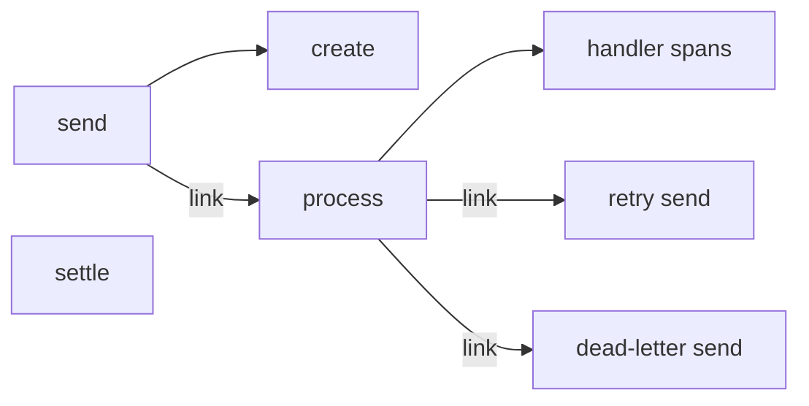

# Observability

F1 emits typed lifecycle events, and the `f1otel` adapter turns them into OpenTelemetry metrics and spans without adding instrumentation to handlers.

The adapter uses an application-owned `MeterProvider`, `TracerProvider`, and propagator. It is safe for concurrent calls and uses event timestamps rather than the wall clock. See [Observer events](/development/observer-events) for the complete event and field reference.

## Install the adapter

Create providers in the application and pass the observer to `f1.New`.

```go
import (
	"context"

	f1 "fgit.zapps.vn/zatf2026-be-t3/event-driven-messaging-sdk"
	"fgit.zapps.vn/zatf2026-be-t3/event-driven-messaging-sdk/f1otel"
	sdkmetric "go.opentelemetry.io/otel/sdk/metric"
)

meterProvider := sdkmetric.NewMeterProvider()
observer, err := f1otel.New(f1otel.WithMeterProvider(meterProvider))
if err != nil {
	return err
}

client, err := f1.New(
	context.Background(),
	cfg,
	f1.WithDriver(driver),
	f1.WithObserver(observer),
)
```

`f1otel.New` creates no exporter and never selects the global OpenTelemetry provider. A nil provider, a zero observer, and a nil observer record no telemetry. The application owns exporter setup and provider shutdown. Configure views in the application when duration histograms need explicit buckets; `f1otel` installs no view.

## One observer per client

Create one `f1otel.New` per client and share the providers. An observer reports the broker endpoint of the client it is attached to, so it belongs to one live client at a time. Being safe for concurrent calls does not make it safe to share: two clients on one observer would label each other's metrics and spans with the wrong `server.address` and `server.port`.

`f1.New` enforces this. Given an observer that another live client already holds, it fails before opening the driver and returns an error naming the fix. The binding is per live client, not per observer lifetime:

- a failed `f1.New` releases the observer, so it can be passed to the next attempt;
- a `Close` that completes shutdown releases it, so a replacement client can reuse it; and
- a `Close` that fails and leaves the client retryable keeps it until a retry completes.

Two clients reporting through the same providers:

```go
observerA, err := f1otel.New(
	f1otel.WithMeterProvider(meterProvider),
	f1otel.WithTracerProvider(tracerProvider),
)
if err != nil {
	return err
}
clientA, err := f1.New(ctx, cfgA, f1.WithDriver(driverA), f1.WithObserver(observerA))
if err != nil {
	return err
}

observerB, err := f1otel.New(
	f1otel.WithMeterProvider(meterProvider),
	f1otel.WithTracerProvider(tracerProvider),
)
if err != nil {
	return errors.Join(err, clientA.Close(ctx))
}
clientB, err := f1.New(ctx, cfgB, f1.WithDriver(driverB), f1.WithObserver(observerB))
if err != nil {
	return errors.Join(err, clientA.Close(ctx))
}
```

Close both clients before shutting the providers down; the providers stay application-owned. If you wrap an `f1otel` observer in your own observer, forward `BindClient` to it, as the [observer guide](/basics/observer#bind-an-observer-to-one-client) describes. A wrapper that does not forward it is not checked, and sharing one relabels telemetry silently.

## Trace publish, process, and ack

A primary publish creates producer spans, a delivery creates a process span, and [the final ack or nack](/learn/glossary#settlement) creates a `settle` client span. Retry and dead-letter sends are new producer roots linked to the process span that caused them.



The process span is a new root linked to the inbound trace context, and the context returned by `Start` reaches the handler so handler spans become its children. Retry and dead-letter sends are new roots linked to the incoming process context. `WithCreateSpans(false)` removes the `create` span; the default creates it.

`InjectTrace` writes `traceparent` and `tracestate` only when a propagator was configured with `WithPropagator`. It never reads the global propagator.

## OpenTelemetry metrics

`f1otel` records eleven instruments. Names below are the OpenTelemetry names emitted by the adapter. `messaging.destination.name` is the [topic name from your code](/learn/glossary#logical-topic), not the [broker queue or topic name](/learn/glossary#physical-destination). `messaging.system` is `f1.<driver>` when the driver is known.

| Name | Kind | Unit | Recorded when |
| --- | --- | --- | --- |
| `messaging.client.sent.messages` | sum | `{message}` | A publish finishes successfully; a confirmed retry or dead-letter copy with no result slice counts as one. |
| `messaging.client.consumed.messages` | sum | `{message}` | F1 reports a delivery receipt. |
| `messaging.client.operation.duration` | histogram | `s` | A publish or an ack or nack finishes, using matching event timestamps. |
| `messaging.process.duration` | histogram | `s` | A process finishes, using event timestamps and an optional classified error. |
| `f1.messaging.broker.wait.duration` | histogram | `s` | A delivery has a trusted broker enqueue timestamp. |
| `f1.messaging.backlog.messages` | gauge | none | Each backlog sample reports sampled lag. |
| `f1.messaging.backlog.oldest.age` | gauge | `s` | A backlog head timestamp is known and came from the broker. |
| `f1.messaging.deadline.promotions` | sum | none | A [lane](/learn/glossary#lane) waits past its wait limit and jumps the queue. |
| `f1.messaging.lane.wait.duration` | histogram | `s` | A lane [jumping the queue when overdue](/learn/glossary#deadline-promotion) reports the lane wait. |
| `f1.messaging.retries` | sum | none | A retry schedule is confirmed. |
| `f1.messaging.dead_letters` | sum | none | A dead-letter publication is confirmed. |
| Attribute | Meaning | Instruments |
| --- | --- | --- |
| `messaging.system` | Driver system, `f1.<driver>` when known | All instruments |
| `messaging.destination.name` | Topic name from your code | All instruments |
| `messaging.operation.name` | Operation name | `messaging.client.sent.messages` (`publish`), `messaging.client.consumed.messages` (`receive`), `messaging.client.operation.duration` (`publish` or `settle`), and `messaging.process.duration` (`process`) |
| `messaging.consumer.group.name` | Consumer group | `messaging.client.consumed.messages`, `messaging.client.operation.duration` for `settle` only, `messaging.process.duration`, `f1.messaging.broker.wait.duration`, `f1.messaging.backlog.messages`, `f1.messaging.backlog.oldest.age`, `f1.messaging.deadline.promotions`, `f1.messaging.lane.wait.duration`, `f1.messaging.retries`, and `f1.messaging.dead_letters`; omitted from sent messages |
| `f1.priority` | F1 priority | All instruments |
| `server.address`, `server.port` | Broker endpoint when known | All instruments |
| `error.type` | Classified error | `messaging.process.duration` when classified, `f1.messaging.retries`, and `f1.messaging.dead_letters` |
| `reason` | Dead-letter reason when known | `f1.messaging.dead_letters` |

Attributes are omitted when empty or undefined for an event kind. The adapter does not emit a duration when its required timestamp source is unavailable. Primary publish calls omit `f1.priority` when priorities are mixed or unresolved; a uniform priority is retained even across mixed topics. Mixed-topic publish calls omit the destination name, while a uniform topic is retained even across mixed priorities. Primary send spans set a known priority at Finish, not at the unresolved Start.

Metrics and spans use `ConsumerGroup` for `messaging.consumer.group.name`, falling back to `Subscription` when the group is empty.

Connection changes are not metrics. The observer receives `connection_lost` and
`connection_restored` point events from the reconnect supervisor, but `f1otel`
does not turn them into instruments. To alert on reconnects, handle those kinds
in your own [observer](/basics/observer), or watch `Client.Health`.

## Use enqueue timestamps correctly

F1 carries both an enqueue timestamp and its source.

| Source | Meaning |
| --- | --- |
| `producer` | Event creation time; retry and dead-letter copies include earlier attempts. |
| `broker` | Timestamp supplied by the broker for the current hop. |
| `unknown` | The timestamp is absent or its source is unavailable. |

Broker wait uses only `source=broker`. A producer timestamp does not represent the current broker hop. Backlog samples report lag when the driver supports backlog reads. Oldest age is omitted when the broker gives no head timestamp; unknown age is not reported as zero.

`WithBacklogPollInterval` controls sampling. Zero selects the 15-second default, a negative interval disables polling, and a positive interval below one second is rejected by `New`.

## Configure broker timestamps

Kafka uses producer [`CreateTime`](/drivers/kafka#kafka-retry-timing) by default. For broker-clock wait, configure each destination whose broker append time matters with [`LogAppendTime`](/drivers/kafka#kafka-retry-timing):

```text
message.timestamp.type=LogAppendTime
```

For RabbitMQ, enable overwrite on the incoming [`set_header_timestamp` interceptor](/drivers/rabbitmq):

```text
message_interceptors.incoming.set_header_timestamp.overwrite = true
```

RabbitMQ requires an incoming `set_header_timestamp` interceptor with overwrite enabled before `broker.rabbitmq.trustBrokerTimestamp: true` is useful. Without overwrite mode, `timestamp_in_ms` is publisher-controlled and is not a trusted broker timestamp.

RabbitMQ resolves enqueue time from a trusted `timestamp_in_ms`, then `cloudEvents:time`, then the AMQP timestamp property, and finally `unknown`. Its backlog count is `Lag`. Quorum queues have no trusted head time for oldest-age reporting.

## Configure tracing

Configure an application-owned tracer provider and propagator when creating the observer.

```go
import (
	"context"

	f1 "fgit.zapps.vn/zatf2026-be-t3/event-driven-messaging-sdk"
	"fgit.zapps.vn/zatf2026-be-t3/event-driven-messaging-sdk/f1otel"
	"go.opentelemetry.io/otel/propagation"
	sdktrace "go.opentelemetry.io/otel/sdk/trace"
)

tracerProvider := sdktrace.NewTracerProvider()
observer, err := f1otel.New(
	f1otel.WithTracerProvider(tracerProvider),
	f1otel.WithPropagator(propagation.TraceContext{}),
)
if err != nil {
	return err
}

client, err := f1.New(
	context.Background(),
	cfg,
	f1.WithDriver(driver),
	f1.WithObserver(observer),
)
```

A primary `send <topic>` span is named with the topic when the publish is uniform, and `send` for a mixed-topic batch. `create <topic>` is its child. `process <topic>` is a consumer root linked to the inbound context. `settle` is parented by the acknowledgement or release context. Retry and dead-letter sends use the topic known at their start.

## Go further

- [Alerts](/advanced-topics/alerts) - PromQL starting points and triage;
- [Running in production](/advanced-topics/running-in-production) - provider shutdown and readiness;
- [Observer](/basics/observer) - event and callback contracts; and
- [Observer events](/development/observer-events) - the complete event vocabulary.
