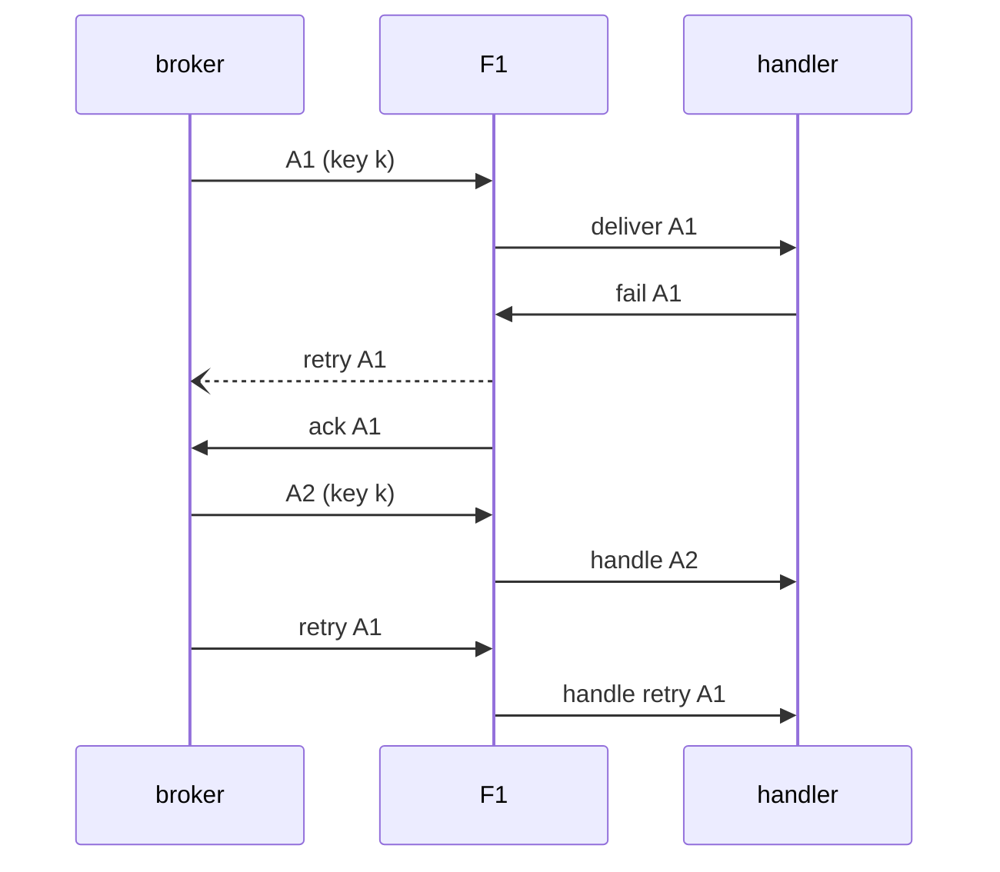
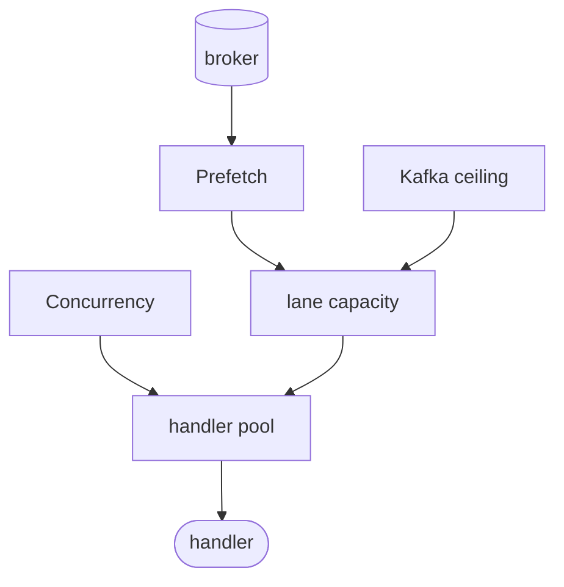

# Ordering and scheduling

F1 makes two separate delivery decisions: ordering controls whether equal keys overlap, while scheduling controls which ready delivery receives the next handler slot.

Do not use one setting to solve the other. `OrderedByKey` protects a per-key business rule; `FairnessConfig` shares service capacity across topics, priorities, and retry work. Both operate within [at-least-once delivery](/learn/glossary#at-least-once-delivery), so ordering does not remove the need for idempotent effects.

## Choose the ordering guarantee

The default subscription mode is `f1.Unordered`. It allows configured handler concurrency to process deliveries in parallel and makes no ordering promise.

Use `f1.OrderedByKey` when one business entity must be processed serially.

```go
runner, err := client.Subscribe(ctx, f1.Subscription{
	Name:        "order-projector",
	Topics:      []string{"orders.placed"},
	Mode:        f1.OrderedByKey,
	Concurrency: 4,
	Handlers: map[string]f1.Handler{
		"orders.placed.v1": f1.HandlerFunc(handleOrderPlaced),
	},
})
```

Equal message keys are handled one at a time. Different keys may run concurrently. F1 does not provide one global order across topics, priorities, keys, or consumer instances.

This guarantee ends at a retry. Once the retry copy is stored, the failed original is acknowledged and releases the key. A later message with that key can run before the retry returns. If a key must never be handled out of order, set `RetryConfig{MaxAttempts: 1}` so failure goes directly to dead-letter, or make the handler tolerate the reorder.

The connected driver must advertise [`ordered_by_key`](/drivers-and-capabilities#capability-report). F1 rejects an ordered subscription when the capability is unavailable. Check `client.Limits()` during startup when deployment portability matters.

## Publish a stable key

Ordering follows the message key, not the event type or idempotency key unless the application deliberately uses that value as a key.

```go
_, err := client.Publisher().Publish(
	ctx,
	"orders.placed.v1",
	OrderPlaced{OrderID: orderID},
	f1.WithKey(orderID),
)
```

`WithKey` sets the routing key explicitly. `WithSubject` supplies a stable default when no explicit key is present. With neither option, F1 falls back to the generated event ID, which is safe but does not create a useful per-order relationship.

## See what a retry does to key order

A failed delivery releases its key as soon as the [retry copy](/learn/glossary#successor-publish) is stored. The next same-key message can therefore run before the retry is eligible again.



The diagram shows why `OrderedByKey` is a per-attempt execution guarantee, not a durable sequence across retries. Use the failure policy to choose whether that trade-off is acceptable.

## Configure execution capacity

`Concurrency`, `Prefetch`, [lane](/learn/glossary#lane) capacity, the Kafka partition ceiling, and the handler pool form one bounded path. Raising one knob cannot exceed a lower ceiling later in the path.



`Concurrency` is the number of handler workers. `Prefetch` is the subscription's in-flight limit, not a promise that the broker hands over that many messages at once. In ordered mode, lane capacity also bounds the dispatch queue. When a stage is full, F1 waits for capacity instead of growing an unbounded in-memory queue.

On a driver whose [parallelism is limited by partition count](/learn/glossary#partition-bound-scaling), F1 lets in one delivery per partition owned by a consumer. Its effective parallelism is the smaller of `Concurrency` and the assigned partition count. Raising `Prefetch` or priority weights above that count does not raise the ceiling. See [Kafka driver](/drivers/kafka#kafka-parallelism-and-partitions) for the warning and the `broker.kafka.maxExpectedInstances` setting.
On a driver whose [parallelism is not limited by partitions](/learn/glossary#free-scaling), a subscription's effective `Prefetch` is the smaller
of its configured prefetch and the sum of its lane capacities.

Use `Concurrency` that matches safe handler parallelism and downstream capacity. Set `Prefetch` high enough to keep those workers supplied, but not so high that a slow dependency creates an unnecessarily large in-flight backlog. Tune one setting at a time while watching handler latency, dependency saturation, redelivery, and drain time. [Why lane capacity stays small](/deep-dives/scheduler#why-lane-capacity-stays-small) explains what a deeper buffer costs.

A named `Prefetch` must cover every topic, priority, and retry lane. Four attempts give three [retry steps](/learn/glossary#retry-tier). With one topic, three priorities, and four attempts, the minimum is 12, so `32` passes. An unnamed `Prefetch` is raised to the lane count automatically.

```go
runner, err := client.Subscribe(ctx, f1.Subscription{
	Name:        "order-projector",
	Topics:      []string{"orders.placed"},
	Priorities:  []f1.Priority{f1.PriorityHigh, f1.PriorityMedium, f1.PriorityLow},
	Concurrency: 4,
	Prefetch:    32,
	Handlers:    orderHandlers,
})
```

A larger value cannot make a hot ordered key concurrent or make a blocked dependency complete faster. Increasing broker credit through `broker.rabbitmq.brokerPrefetch` also increases memory pressure and can return a redelivery burst during close or revoke. Held deliveries can age toward RabbitMQ's `consumer_timeout` setting; configure that broker setting with its [acknowledgement timeout](https://www.rabbitmq.com/docs/consumers#acknowledgement-timeout) in mind.

## Use priorities as fair lanes

`Priority` selects a delivery lane. `high`, `medium`, and `low` are labels for the scheduling policy, not strict execution precedence.

```go
_, err := client.Publisher().Publish(
	ctx,
	"orders.placed.v1",
	OrderPlaced{OrderID: orderID},
	f1.WithKey(orderID),
	f1.WithPriority(f1.PriorityHigh),
)
```

A subscription chooses its priority lanes with `Subscription.Priorities`. `FairnessConfig` then assigns relative opportunity across topics, priorities, and retry steps. Weights prevent sustained high-priority traffic from starving lower lanes.

```go
fairness := f1.FairnessConfig{
	Weights: map[f1.Priority]int{
		f1.PriorityHigh:   8,
		f1.PriorityMedium: 4,
		f1.PriorityLow:    1,
	},
	Budgets: map[f1.Priority]time.Duration{
		f1.PriorityHigh:   5 * time.Second,
		f1.PriorityMedium: 30 * time.Second,
		f1.PriorityLow:    2 * time.Minute,
	},
	RetryWeightDivisor: 2,
	PrefetchFactor:     2,
}
```

`Weights` controls relative share. `Budgets` sets each priority's [wait limit](/learn/glossary#lane-budget): a lane whose oldest message waits longer can [jump the queue](/learn/glossary#deadline-promotion). `RetryWeightDivisor` reduces retry pressure, and `PrefetchFactor` scales bounded lane capacity. `DisableDeadlinePromotion` turns queue jumping off; its zero value leaves it on.

The scheduler deep dive explains weighted selection, score traces, empty-lane reset, and how an overdue lane jumps the queue. This page keeps the application decisions and their limits; read [How F1 picks the next message](/deep-dives/scheduler) for the algorithm.

## Keep retries from taking all capacity

Retry timing and ready-work scheduling are separate decisions:

1. `RetryConfig` decides when a failed event becomes eligible.
2. `FairnessConfig` decides how that ready retry competes with fresh work.

F1 gives retry lanes their own scheduling groups and normally reduces their weight with `RetryWeightDivisor`. A retry storm therefore does not consume all handler capacity, while a retry lane that has waited past its wait limit can still jump the queue. Returning `f1.RetryAfter` changes eligibility time, not priority after the retry is ready.

## Tune in this order

When a subscription is slow or unfair, identify the needed guarantee first.

1. Use `OrderedByKey` and a stable `WithKey` for serial state transitions. Do not use `Concurrency: 1` unless the whole subscription needs global serialization.
2. If handlers are idle while work exists, check `Prefetch`, lane capacity, distinct keys, and assigned partitions before increasing concurrency.
3. If fresh work is delayed by retries, lower retry share with `RetryWeightDivisor` instead of discarding transient failures.
4. If a lane waits too long, turn queue jumping back on or adjust its wait limit after checking downstream capacity. A wait limit is an escape hatch, not a latency guarantee.
5. If high priority dominates, reduce its weight or split the workload into subscriptions with independent capacity.

Every handler must remain safe under redelivery. Changing concurrency, key distribution, or retry timing can expose duplicate effects and races that at-least-once delivery already permits.

## Go further

- [Failure handling](/advanced-topics/failure-handling) - retry classification and idempotent effects;
- [Lifecycle and shutdown](/advanced-topics/lifecycle-and-shutdown) - drain, close, and in-flight work;
- [Drivers and capabilities](/drivers-and-capabilities) - provider limits and portability; and
- [Message](/basics/message) - keys, priority metadata, and delivery identity.
