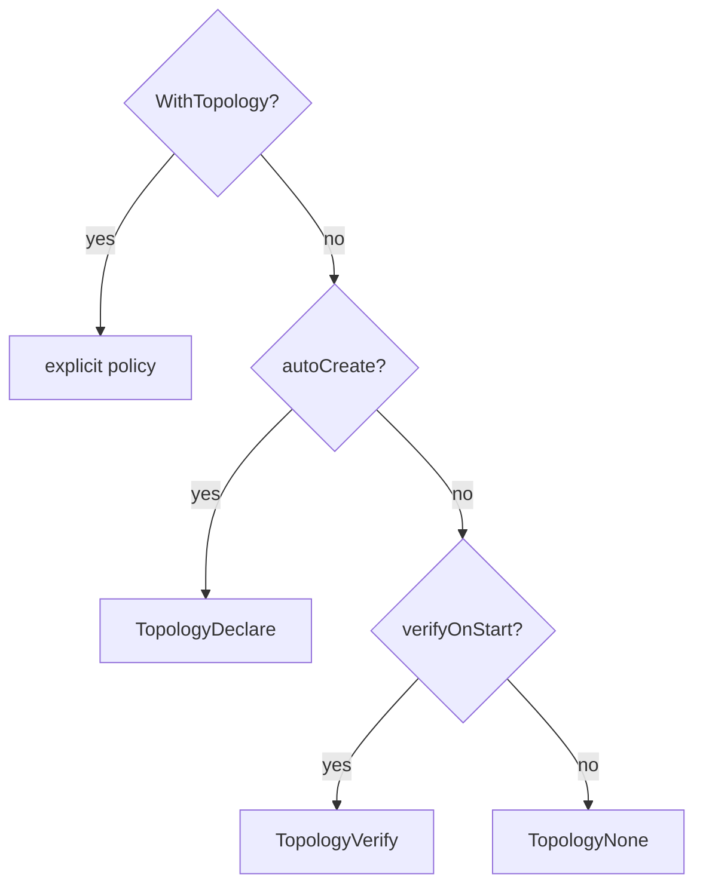

# Topology and capabilities

F1 keeps application code on topic names and subscriptions while the selected driver maps them to real broker queues and topics.

[Topology policy](/learn/glossary#topology-policy) decides whether F1 declares, verifies, or assumes destinations. Capability policy decides which features [the broker does itself](/learn/glossary#native), which [F1 does instead](/learn/glossary#emulated), and which requests are unavailable. Application handlers use `Event`, `Publisher`, and `Subscription`; provider syntax stays behind the driver port.

## Select a topology policy

F1 exposes three policies.

| Policy | Meaning | Use when |
| --- | --- | --- |
| `f1.TopologyDeclare` | Create missing required topology and report the diff | Development or a delegated provisioning boundary |
| `f1.TopologyVerify` | Check that required topology exists and report drift without creating it | Infrastructure is provisioned separately but startup verification is useful |
| `f1.TopologyNone` | Assume topology exists and skip publisher administration | The platform owns provisioning and checks |

The effective policy follows one precedence chain: an explicit `WithTopology` option wins, then `topology.autoCreate: true`, then `topology.verifyOnStart: true`, then `TopologyNone`. The default configuration sets `topology.verifyOnStart: true`, so without `WithTopology` or `autoCreate` the effective policy is `TopologyVerify`.



At publisher startup, `TopologyNone` skips the administration call entirely. At subscription startup, `Runner.Run` still sends a `TopologyNone` specification through the driver's admin interface; the driver records the specification but does no broker work. This difference lets the consumer build its driver configuration without making `TopologyNone` perform a broker check.

Set the policy at the composition boundary.

```go
client, err := f1.New(
	ctx,
	cfg,
	f1.WithDriver(selectedDriver),
	f1.WithTopology(f1.TopologyVerify),
)
```

Do not use `TopologyNone` to hide a missing destination. The first publish or consumer creation will fail later, farther from the configuration mistake.

## Check topology at resource boundaries

`New` prepares publisher entry points when `WithPublishTopics` is present and the effective policy is not `TopologyNone`. `Subscribe` validates a subscription and returns a runner without opening a consumer. `Runner.Run` opens the consumer and prepares its main, retry, and [dead-letter destinations](/learn/glossary#dead-letter-destination). Reconnect repeats the checks for rebuilt resources.

`WithPublishTopics` both names the [topics](/learn/glossary#logical-topic) to prepare at `New` and restricts publishing to those topics. The event type's version suffix is stripped to get its topic before the allowlist is checked.

```go
client, err := f1.New(
	ctx,
	cfg,
	f1.WithDriver(selectedDriver),
	f1.WithPublishTopics("orders.placed", "orders.cancelled"),
)
```

Use it when startup should fail before the first publish if publisher topology is unavailable. Omit it when another system owns publisher provisioning and the service intentionally relies on existing topology.

## Understand generated resources

Application configuration names topics, priorities, retry policy, and subscriptions. F1 builds the broker's queues and topics from those inputs. A typical subscription has a main destination, one retry destination per [retry step](/learn/glossary#retry-tier), a dead-letter destination, and, when supported, [the broker's own dead-letter queue](/learn/glossary#backstop). Publish entry points use either routing points with bindings or direct destinations according to the effective fan-out capability.

Do not build [broker queue or topic names](/learn/glossary#physical-destination) in application code. Use event types, `WithTopic`, `WithPublishTopics`, and `Subscription.Topics` so publish, consume, retry, and dead-letter families stay consistent.

The driver's admin operations are non-destructive by default. `EnsureTopology` creates or verifies resources and reports drift and in-scope orphans; it does not delete destinations. A `Prune` operation is separate and must recheck that a destination and its auxiliary retry or dead-letter resources are empty and unused before deleting them. The recheck and the delete are not atomic on RabbitMQ quorum queues or Kafka topics, so run `Prune` only on destinations traffic has already left.

An incomplete orphan scan is not proof that cleanup is safe. When a driver cannot scan the requested scope, the diff must expose that limitation.

## Read the connected feature list

Capabilities have a static and a live layer.

| Layer | Meaning |
| --- | --- |
| Driver capabilities | The adapter's maximum declared feature set before connection. |
| Connection capabilities | What the connected broker supports; it may reduce the driver's declaration but cannot increase it. |
| Effective capabilities | The set F1 passes to producer, consumer, and topology operations. |
| `Client.Limits()` | The application-facing report of the connected result. |

Inspect `Client.Limits()` after `New` when service behavior depends on a capability.

```go
limits := client.Limits()
for _, feature := range limits.Features {
	log.Printf("F1 feature=%s mode=%v detail=%s",
		feature.Feature, feature.Mode, feature.Detail)
}
```

`FeatureNative` means the connected broker does the feature itself. `FeatureEmulated` means F1 does it, with the same application contract on every broker. `FeatureUnavailable` means the requested behavior cannot be provided for that connection. The report is the decision surface; do not cast the connection to a provider-specific type.

Capabilities never change what F1 does as seen from your code. Broker delay, delivery counts, acks, or fan-out are optimizations around the same retry, ordering, dead-letter, and handler contracts. When F1 can do a feature itself, it does. When a requested behavior cannot be provided, the operation is rejected.

Fan-out mode, per-key ordering, consumer scaling, message size limits, and header size limits remain meaningful capability facts even when an optimization is disabled. An ordered subscription is still rejected when the effective connection does not advertise `ordered_by_key`.

## Use strict portability deliberately

`WithStrictPortability` turns off broker features that F1 can do itself. It preserves fan-out, key ordering, consumer scaling, message-size limits, and header-size limits because those describe the broker or the required application contract, not optional shortcuts.

```go
client, err := f1.New(
	ctx,
	cfg,
	f1.WithDriver(selectedDriver),
	f1.WithStrictPortability(),
)
```

Strict portability is useful for proving that application behavior does not depend on a driver-specific optimization. It does not remove broker limits, make an unavailable behavior available, or authorize a driver to branch on a capability view different from the effective set passed by F1.

Broker and F1 modes therefore keep the same application contract. Only who does the work changes.

## Common mistakes

- Assuming `TopologyDeclare` is effective without checking `WithTopology` and configuration precedence.
- Enabling auto-creation where production infrastructure should be provisioned separately.
- Expecting `Subscribe` to validate broker topology before `Runner.Run` opens the consumer.
- Omitting `WithPublishTopics` and assuming publisher topology was checked at client startup.
- Hardcoding broker queue or topic names or provider routing syntax in service code.
- Treating an orphan in a diff as safe to delete without checking depth, auxiliary resources, and active consumers.
- Reading only `Driver.Capabilities()` after connecting instead of using `Client.Limits()`.
- Treating `FeatureNative` as a different application contract from `FeatureEmulated`.
- Using strict portability to bypass an unavailable required feature.

## Go further

- [Ordering and scheduling](/advanced-topics/ordering-and-scheduling) - capability-gated ordering and fair lanes;
- [Lifecycle and shutdown](/advanced-topics/lifecycle-and-shutdown) - reconnect, drain, and close;
- [Publisher and subscriber](/basics/pubsub) - topics and subscriptions;
- [Drivers and capabilities](/drivers-and-capabilities) - adapter configuration and ownership; and
- [Getting started](/learn/getting-started) - driver selection at the composition root.
