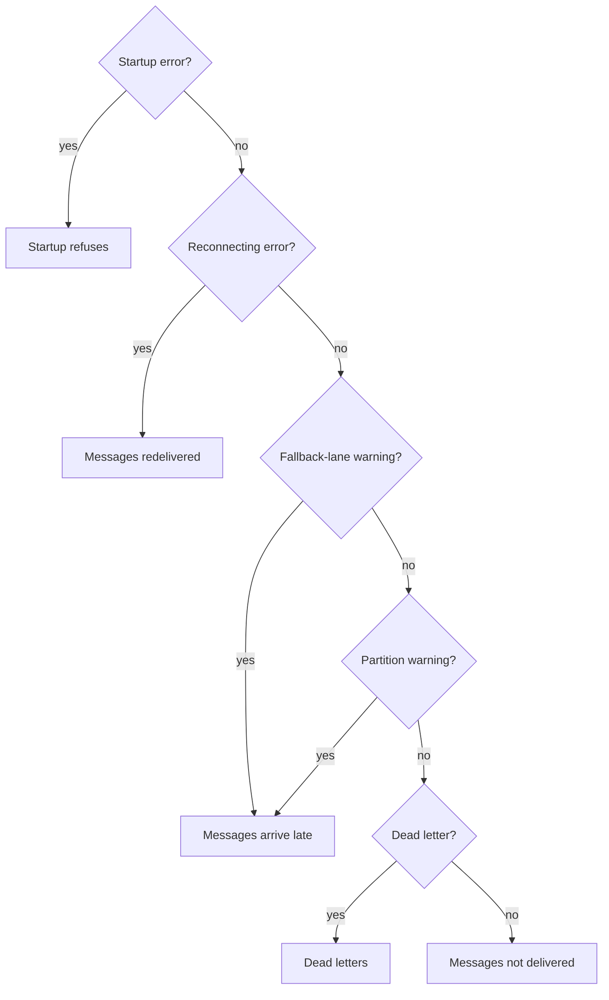

# Troubleshooting F1

F1 names each failure with a stable error or log message, grouped here by the symptom you see. Start with the symptom, then fix the part that produced it. The messages below preserve the stable F1 error or log text; `%s`, `%d`, `%q`, and `%w` remain where the code formats runtime values.



## Startup refuses the configuration

### Drain timeout is rejected

```text
f1: lifecycle.drainTimeout must be positive
```

**Why** `lifecycle.drainTimeout` is zero or negative, so the runner has no valid time limit for a controlled drain.

**Fix** Set a positive drain timeout, then size handler and broker timeouts around it. See [Run and drain a subscription](/advanced-topics/lifecycle-and-shutdown#run-and-drain-a-subscription).

### Kafka drain time exceeds the session bound

```text
f1: lifecycle.rebalanceDrainTimeout %s exceeds 0.6 x broker.kafka.sessionTimeout %s (broker.kafka.rebalanceTimeout=%s)
```

**Why** Kafka must be able to take the partitions away and drain before the coordinator removes the member; F1 rejects a drain bound above 60% of the applicable broker timeout.

**Fix** Lower `lifecycle.rebalanceDrainTimeout`, or raise the Kafka session and rebalance timeouts together. See [Kafka rebalancing](/drivers/kafka#kafka-rebalancing).

### RabbitMQ TLS is rejected

```text
f1: broker.tls.enabled requires an amqps:// endpoint; got %q
rabbitmq: plaintext connection to non-loopback host requires an amqps:// endpoint
```

**Why** RabbitMQ TLS is enabled with a non-AMQPS endpoint, or plaintext AMQP targets a remote host.

**Fix** Use `amqps://` for every remote RabbitMQ endpoint; reserve `amqp://` for loopback development connections. See [RabbitMQ connection and security](/drivers/rabbitmq#rabbitmq-tls).

### Production broker settings are rejected

```text
f1: broker.rabbitmq.queueType must be quorum in prod
f1: broker.sasl.mechanism requires broker.tls.enabled in prod
kafka: unsupported SASL mechanism %q
rabbitmq: unsupported SASL mechanism %q; supported mechanisms: PLAIN, AMQPLAIN, EXTERNAL, or empty
f1: broker.rabbitmq.consumerTimeout must be at least subscriptions.%s.handlerTimeout x 3
```

**Why** The production configuration violates a broker-specific safety rule, uses SASL without TLS, selects an unsupported mechanism, or lets RabbitMQ cancel a long-running handler.

**Fix** Use quorum queues, enable TLS before SASL, select a supported mechanism, and set `broker.rabbitmq.consumerTimeout` to at least three times every handler timeout. Recreate queues when their timeout argument is already fixed. See [Production safeguards](/advanced-topics/running-in-production#set-production-configuration).

### RabbitMQ topology inspection cannot reach management

```text
rabbitmq: %s requires the management API at %s (enable the RabbitMQ management plugin, or set rabbitmq.managementPort when management does not listen on the AMQP port plus 10000): %w
```

**Why** Declaring or verifying RabbitMQ topology requires the Management HTTP API, and the configured endpoint is unavailable.

**Fix** Enable the management plugin and make its endpoint reachable, or set `broker.rabbitmq.managementPort` when it uses a non-default port. See [The Management HTTP API is a deployment requirement](/drivers/rabbitmq#the-management-http-api-is-a-deployment-requirement).

## Messages are not delivered

### Ordered mode is rejected

```text
f1: subscriptions.%s: ordered mode needs concurrency x prefetch at most %d, got %d x %d
f1: subscription %s requests ordered_by_key, but feature is unavailable
```

**Why** Ordered delivery either exceeds its bounded buffer or is not provided by the connected driver.

**Fix** Reduce ordered `concurrency` or `prefetch` until the reported product fits, or select a driver and mode that support ordered-by-key delivery. See [Choose the ordering guarantee](/advanced-topics/ordering-and-scheduling#choose-the-ordering-guarantee).

### Prefetch does not provide the expected window

```text
f1 configured prefetch exceeds the destination windows
```

**Why** A configured total above the sum of destination windows is effectively capped. A smaller positive total is valid, even below the lane count, and deliberately limits SDK admission.

**Fix** Review the chosen total, concurrency, lane capacities, and driver limits instead of raising prefetch alone. Use automatic sizing when no smaller application backlog budget is needed. See [Configure execution capacity](/advanced-topics/ordering-and-scheduling#configure-execution-capacity).

## Messages arrive late or out of order

### A delivery uses the fallback lane

```text
f1 unknown delivery lane; routing to fallback lane
```

**Why** The message could not be mapped to a configured scheduler [lane](/learn/glossary#lane), which indicates a mismatch between subscription inputs, retry topology, or deployed resource names.

**Fix** Compare topics, priorities, [retry steps](/learn/glossary#retry-tier), and [broker queue or topic names](/learn/glossary#physical-destination); repair the configuration or topology rather than relying on fallback routing. See [Dispatch lanes and scheduler](/development/consume-flow#dispatch-lanes-and-scheduler).

### Topology arguments drift from configuration

```text
f1 topology argument drift
```

**Why** A broker resource exists, but one or more arguments differ from the requested topology. The broker may therefore apply behavior different from the F1 configuration.

**Fix** Inspect the structured destination, argument, expected value, and actual value; reconcile provisioning or configuration. Recreate immutable broker resources during a planned change. See [Check topology at resource boundaries](/advanced-topics/topology-and-capabilities#check-topology-at-resource-boundaries).

### Kafka has fewer partitions than delivery slots

```text
destination %q has %d partitions, fewer than maxExpectedInstances %d
Kafka consumer holds fewer partitions than the subscription's slot budget; raising the destination's partition count gives this member more of them and re-maps the keys published to it
```

**Why** The destination or this consumer owns fewer Kafka partitions than the configured delivery-slot floor, so configured concurrency cannot become active parallelism.

**Fix** Increase the destination partition count, or review `broker.kafka.maxExpectedInstances` and instance count. Increasing partitions remaps keys, so plan the change. See [Kafka parallelism and partitions](/drivers/kafka#kafka-parallelism-and-partitions).

### A handler exceeds the stuck thresholds

```text
f1 stuck worker
f1 worker exceeded stuck threshold
```

**Why** A handler remained active through the first stuck phase and then exceeded the cumulative abort threshold, four times `HandlerTimeout`, holding lane capacity while work stops progressing. F1 then gives up on the delivery and requeues it, but Go cannot stop the handler, so it keeps running. The redelivered message can run beside it, repeating its side effects and, on an ordered subscription, overlapping work for the same key. Each such handler also holds its goroutine and the event until it returns.

**Fix** Inspect the structured subscription and event fields, return promptly on context cancellation, and fix the blocking dependency before increasing the timeout. See [Handler latency near its timeout](/advanced-topics/alerts#handler-latency-near-its-timeout).

### RabbitMQ cancels the consumer

```text
rabbitmq: broker cancelled the consumer for destination %q
```

**Why** RabbitMQ cancelled a consumer, commonly because the queue's consumer-timeout argument expired while a delivery was in progress.

**Fix** Compare handler timeout, `broker.rabbitmq.consumerTimeout`, and the queue's existing timeout argument; increase the broker setting and recreate the queue if required. See [RabbitMQ options](/drivers/rabbitmq#rabbitmq-options).

## Messages are redelivered or duplicated

### The client is reconnecting

```text
f1: client is reconnecting
```

**Why** A transient driver failure is repairing the connection or the runner's [current consumer](/learn/glossary#reconnect-generation). Messages already accepted by the broker may be delivered again once the new consumer starts.

**Fix** Keep handlers idempotent, retry the operation within its caller deadline, and wait for health to recover instead of creating a second subscription. See [Reconnection is not shutdown](/advanced-topics/lifecycle-and-shutdown#reconnection-is-not-shutdown).

### Reconnect attempts are exhausted

```text
f1 reconnect attempts exhausted
```

**Why** The reconnect supervisor reached `broker.maxReconnectAttempts` without installing a working connection.

**Fix** Restore broker reachability and credentials, then restart or reconnect according to the deployment lifecycle. Inspect the retained health error before treating the process as healthy. See [Reconnection is not shutdown](/advanced-topics/lifecycle-and-shutdown#reconnection-is-not-shutdown).

## Dead letters and drops
### The event codec is unavailable

```text
f1: no codec registered for datacontenttype %q
f1: codec.default %q is not registered
```

**Why** An inbound delivery has a content type with no registered codec, or has an empty content type and the configured default codec is not registered.

**Fix** Register the codec for the published content type, or register the configured default codec for an empty content type. F1 dead-letters the delivery with a copy carrying death reason `decode`; the handler never runs. See [Metadata and the envelope](/basics/message#metadata-and-the-envelope).


### No handler route exists

```text
no handler matched event type
```

**Why** The event reached the unmatched path. With `DeadLetter`, F1 attempts a retained copy; with `Ignore`, it acknowledges without one.

**Fix** Correct the event type or handler registration when the event is valid. Otherwise choose the unmatched policy that matches the intended retention behavior. See [Dead letters and discarded events](/advanced-topics/failure-handling#dead-letters-and-discarded-events).

### A poison message's copy cannot be kept

```text
f1 poison message dropped; no dead-letter route
f1: %s: event_id=%q destination=%q attempt=%d: %s: %w
f1: successor copy cannot be encoded
```

**Why** F1 classified the delivery as poison, lacked a usable dead-letter route, or could not encode the retry or dead-letter copy safely.

**Fix** Repair the dead-letter route or [the broker's own dead-letter queue](/learn/glossary#backstop), validate the codec and content type, and reduce payload or optional header size. Inspect the structured event ID, destination, attempt, reason, and wrapped error. See [Dead letters and discarded events](/advanced-topics/failure-handling#dead-letters-and-discarded-events).

## Shutdown and reconnect

### A shutdown phase times out

```text
f1: shutdown %s phase timed out: %w
```

**Why** A shutdown phase exceeded its lifecycle time limit while waiting for drain, [acks and nacks](/learn/glossary#settlement), publishing, or connection work to finish.

**Fix** Identify the named phase in the structured error, remove the blocking handler or broker dependency, and set a lifecycle time limit that covers the intended work. See [Configure shutdown time limits](/advanced-topics/lifecycle-and-shutdown#configure-shutdown-time-limits).

## Go further

- [Lifecycle and shutdown](/advanced-topics/lifecycle-and-shutdown) - drain, close, and reconnect behavior.
- [Failure handling](/advanced-topics/failure-handling) - retries, dead letters, and poison messages.
- [Drivers and capabilities](/drivers-and-capabilities) - provider limits and production settings.
- [Observability](/advanced-topics/observability) - structured events and backlog signals.
