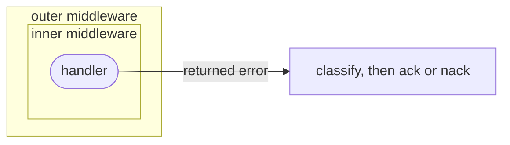

# Middleware

F1 middleware wraps an [`f1.Handler`](https://fgit.zapps.vn/zatf2026-be-t3/event-driven-messaging-sdk/-/blob/main/handler.go) with behavior that is
useful across handlers but should not be part of one handler's business logic.
Typical examples are structured logging, timing, tracing, and application-level
metrics.

F1 currently exposes one middleware extension point. It does not ship a
catalog of retry, timeout, deduplication, or transport middleware. Retry and
the final ack or nack remain core runtime responsibilities.

## Where middleware runs

The middleware boundary is part of the handler path:

1. `f1.New` records middleware supplied through `f1.WithMiddleware`.
2. `Client.Subscribe` wraps each handler in the subscription with that chain.
3. `Runner` invokes the wrapped handler with the delivery context and event.
4. F1 classifies the returned error and [finishes the delivery](/learn/glossary#settlement) with an ack or nack outside the
   middleware chain.

F1 applies this chain when a subscription registers its handlers. Middleware
receives the handler-facing context and event, not a driver message or broker
ack handle.

The chain nests before the ack:



## Define middleware

Middleware has the shape `func(f1.Handler) f1.Handler`. It can run code before
and after the next handler while preserving the handler's context, event, and
error result:

```go
func withLogging(next f1.Handler) f1.Handler {
	return f1.HandlerFunc(func(ctx context.Context, event *f1.Event) error {
		started := time.Now()
		err := next.Handle(ctx, event)

		log.Printf("handled event type=%s id=%s elapsed=%s error=%v",
			event.Type(), event.ID(), time.Since(started), err)
		return err
	})
}
```

The middleware should normally return the downstream error unchanged. If it
adds context, wrap the error with `%w` so F1 can still recognize classified
errors such as `f1.Terminal` and `f1.Drop`.

## Register middleware

Pass middleware as client options when the client is constructed:

```go
client, err := f1.New(
	ctx,
	cfg,
	f1.WithDriver(selectedDriver),
	f1.WithMiddleware(withLogging),
)
if err != nil {
	return fmt.Errorf("create F1 client: %w", err)
}
```

`WithMiddleware` is client-wide. It wraps every non-nil handler registered
through that client, including handlers in different subscriptions. F1 rejects
nil middleware during client construction.

There is no separate F1 option for registering middleware on one handler. If a
cross-cutting behavior belongs to only one handler, wrap that handler directly
when building the subscription:

```go
runner, err := client.Subscribe(ctx, f1.Subscription{
	Name:   "orders-worker",
	Topics: []string{"orders.created"},
	Handlers: map[string]f1.Handler{
		"orders.created.v1": withLogging(f1.HandlerFunc(handleOrderCreated)),
	},
})
```

Use client-wide `WithMiddleware` for behavior every handler in the service needs. Use direct
wrapping for a deliberately local behavior. Keep the choice visible at the
composition boundary.

## Ordering and panic recovery

Middleware is executed in the order supplied to `WithMiddleware`:

```go
f1.WithMiddleware(first, second)
```

The effective call sequence is:

```text
first before
  second before
    handler
  second after
first after
```

F1's internal panic-recovery wrapper is outside the user chain. A panic from a
handler or middleware is therefore converted into an error that the runtime can
classify instead of escaping the worker goroutine. Do not add a recovery layer
just to make normal F1 usage safe; add one only when the application needs
additional logging or panic policy around its own boundary.

Middleware order is part of application behavior. Put outer concerns such as
request logging or tracing first, and put concerns that should measure only the
inner handler nearer to the end of the chain.

## Preserve context and event ownership

The handler context carries cancellation and the configured handler deadline.
Pass it to downstream calls:

```go
func withDependencyMetrics(next f1.Handler) f1.Handler {
	return f1.HandlerFunc(func(ctx context.Context, event *f1.Event) error {
		if err := ctx.Err(); err != nil {
			return err
		}
		log.Printf("starting downstream work for event type=%s", event.Type())
		return next.Handle(ctx, event)
	})
}
```

Do not replace the context with `context.Background()` and do not retain it for
work that outlives the delivery. During [drain](/learn/glossary#drain), F1 cancels handler work and waits
for in-flight deliveries to be acked within the configured lifecycle time limits.

`Event` is the handler-facing view of a delivery. Middleware may inspect its
accessors and call `Decode`, but it should not make the handler depend on a
driver-specific message or ack object. See [Message](/basics/message) for
payload, envelope, header, and identity guidance.

## Error propagation and the ack

Middleware participates in handler execution; it does not ack or nack deliveries.
The final error returned by the chain is treated exactly like a handler result;
see [the handler result table](/basics/message#the-handler-result-decides-the-ack).

F1 keeps this classification and the ack outside the middleware chain. A
middleware that logs an error must still return it. Swallowing the error by
returning `nil` changes the delivery outcome to success.

If middleware needs to add context to a failure, use wrapping:

```go
return fmt.Errorf("record handler metrics: %w", err)
```

Do not implement a second retry or dead-letter loop by calling the handler
again from middleware. Configure retry on the `Subscription`
and return `f1.Terminal` or `f1.Drop` as described in
[Failure handling](/advanced-topics/failure-handling).

## Middleware is not an error callback

F1 has callback surfaces for events that are not part of the handler pipeline:

| Surface | Scope | Use it for |
| --- | --- | --- |
| `WithMiddleware` | Every handler on a client | Cross-cutting behavior around handler execution |
| `WithErrorHandler` | Client-level asynchronous runtime errors | Driver error-stream failures and failures to publish a retry or dead-letter copy |
| `Subscription.OnDeadLetter` | One subscription | Notification when an event reaches the dead-letter path |
| `Subscription.OnDiscarded` | One subscription | Notification for unmatched or explicitly dropped events |
| `WithLogger` | Client runtime | Structured SDK logs |

`WithErrorHandler` does not receive ordinary errors returned by a handler;
those errors already flow through retry and dead-letter classification. Its
callback may receive a nil event for a connection-level error, and it must not
block delivery or shutdown. F1 runs each call on its own goroutine with a
one-second context deadline, and allows as many calls at once as the
subscription's `Concurrency`. When every slot is busy, F1 drops the notification
and logs `f1 error handler notification dropped` instead of waiting. The deadline
is advisory: a callback that ignores its context keeps running.

Keep dead-letter and discarded callbacks short. They are notification surfaces,
not replacement handler pipelines. A callback that ignores its context keeps its
goroutine and the event, body included, until it returns. F1 logs the overrun
but does not cap how many such goroutines pile up. Use the subscription's
`DeadLettered` and `Discarded`
payloads to inspect the event and failure reason.

## Testing middleware

Test middleware at two levels:

1. Unit-test the wrapper with a small fake handler to prove ordering, context
   propagation, and error preservation.
2. Use `f1test` to verify the wrapped handler's
   observable behavior through a real `Client`, `Subscription`, and `Runner`.

Include cases for success, a wrapped retryable error, a wrapped terminal error,
and a panic if the middleware changes panic visibility or logging. The expected
ack or nack belongs to the handler/runtime contract, not to a mock Ack/Nack
implementation.

## Go further

- [Message](/basics/message) - event data, metadata, context, and identity;
- [Publisher and subscriber](/basics/pubsub) - publish, subscribe, runner, and
  lifecycle boundaries;
- [Failure handling](/advanced-topics/failure-handling) - `Terminal` and `Drop` failure
  classification helpers;
- [Consume flow](/development/consume-flow) - dispatch, classification, and
  ack internals; and
- [`Middleware`](https://fgit.zapps.vn/zatf2026-be-t3/event-driven-messaging-sdk/-/blob/main/handler.go) - the executable type and composition owner.
