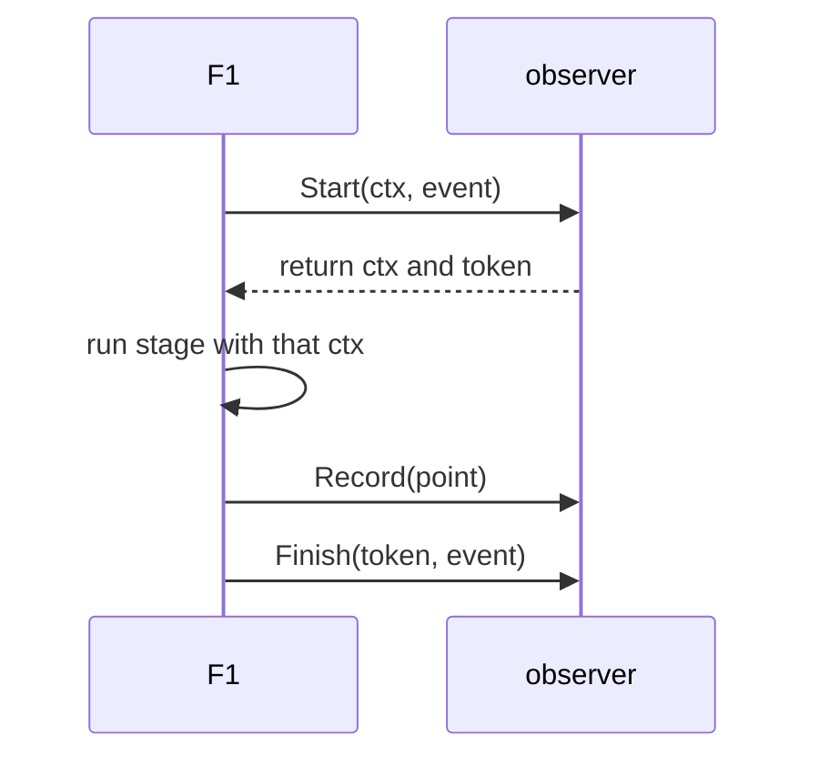

# Observer

An observer is how an application watches what F1 is doing. F1 hands out typed
events at every stage of publishing and consuming a message, and the application
decides what to do with them: record metrics, open spans, write logs, or nothing
at all.

The SDK emits neutral events in the core and knows nothing about the tool you
send them to. That is why adapters live outside it. If you want OpenTelemetry,
use the [observability guide](/advanced-topics/observability); this page explains the
model underneath it.

## Three methods, three event shapes

The [`Observer`](https://fgit.zapps.vn/zatf2026-be-t3/event-driven-messaging-sdk/-/blob/main/observer.go)
interface is three methods:

```go
type Observer interface {
	Start(context.Context, StartEvent) (context.Context, Token)
	Finish(Token, FinishEvent)
	Record(PointEvent)
}
```

`Start` and `Finish` bracket a stage that takes time. `Record` reports something
that happened at an instant. Every event carries a `Kind` saying which stage it
belongs to, and an `At` timestamp from the client's clock.

Events are passed by value, and a field that does not apply to a kind is left at
its zero value. A [drain](/learn/glossary#drain) event has no `EventType`; a publish `Start` is emitted
before the message is resolved, so it has no `Topic` yet. The field comments in
`observer.go` say which kinds set which fields, and the
[observer events reference](/development/observer-events) lists every value.

## Write one

A working observer that counts failures by cause:

```go
type failureCounter struct {
	mu     sync.Mutex
	counts map[f1.ErrorClass]int
}

func (o *failureCounter) Start(ctx context.Context, event f1.StartEvent) (context.Context, f1.Token) {
	return ctx, f1.Token{}
}

func (o *failureCounter) Finish(token f1.Token, event f1.FinishEvent) {
	if event.Outcome != f1.ObserverOutcomeError {
		return
	}
	o.mu.Lock()
	defer o.mu.Unlock()
	o.counts[event.ErrorClass]++
}

func (o *failureCounter) Record(event f1.PointEvent) {}
```

Hand it to the client at construction:

```go
client, err := f1.New(ctx, cfg, f1.WithObserver(&failureCounter{
	counts: make(map[f1.ErrorClass]int),
}))
```

Note what this observer does not do. It returns the context unchanged and a zero
token, because it keeps no per-stage state. It ignores `Record` entirely. An
observer only has to answer the calls it cares about.

## Tokens match a Finish to its Start

An observer that does keep per-stage state needs to find that state again when
`Finish` arrives. That is what the token is for: whatever you return from
`Start`, F1 gives back to `Finish`.

```go
func (o *spanObserver) Start(ctx context.Context, event f1.StartEvent) (context.Context, f1.Token) {
	ctx, span := o.tracer.Start(ctx, string(event.Kind))

	o.mu.Lock()
	o.handle++
	handle := o.handle
	o.spans[handle] = span
	o.mu.Unlock()

	return ctx, f1.Token{Kind: event.Kind, Start: event.At, Handle: handle}
}

func (o *spanObserver) Finish(token f1.Token, event f1.FinishEvent) {
	o.mu.Lock()
	span, ok := o.spans[token.Handle]
	delete(o.spans, token.Handle)
	o.mu.Unlock()

	if !ok {
		return // zero or unknown token, nothing was started
	}
	span.End()
}
```

`Handle`, `Kind`, and `Start` belong to the observer. F1 returns the exact
`Token` value from `Start` to `Finish` without inspecting or filling it. If the
observer returns a token without `Kind` or `Start`, those fields are still
absent at `Finish`.

The zero token means no stage was started, so check for it rather than assuming
a `Finish` always maps to state you hold.

Every started stage gets exactly one `Finish`. If the stage exits without
reporting an outcome, F1 emits `ObserverOutcomeAbandoned` (the stage was given up on) so an adapter never
leaks a span or timer.

The observer lifecycle is one paired flow, with point events recorded alongside it:



## Paired kinds and point kinds

Five kinds are paired: publish, message building, processing, [the final ack or nack](/learn/glossary#settlement), and
drain. Each arrives through `Start` and a matching `Finish`.

Every other kind is a point event delivered only through `Record`.

The kinds are named for where an observation belongs in the lifecycle, not for a
broker API:

- **Publishing.** `ObserverPublish` surrounds a publish call that was allowed to start;
  `ObserverMessageBuilt` surrounds building each outbound message inside it.
- **Consuming.** `ObserverDeliveryReceived` marks a delivery let in to
  dispatch, `ObserverProcess` surrounds the handler, and `ObserverSettle`
  surrounds the ack or nack.
- **Failing.** `ObserverRetryScheduled` fires when a [retry copy](/learn/glossary#successor-publish) is
  confirmed. The dead-letter kinds separate the decision from the publish result,
  so you can tell "we decided to dead-letter" from "the dead-letter publish
  failed". `ObserverPoisonRejected` fires only after `ObserverDeadLetterFailed`
  when a delivery is dropped because its poison reason has no dead-letter route or
  its dead-letter copy is too large for the broker or cannot be encoded. A
  normally dead-lettered delivery emits `ObserverDeadLetterPublished` instead.
- **Connecting.** `ObserverConnectionLost` and `ObserverConnectionRestored`
  report transitions; `ObserverDriverSelected` fires once per client.
- **Scheduling.** `ObserverDrain` surrounds a runner drain,
  `ObserverBacklogSampled` reports a sampled destination, and
  `ObserverDeadlinePromoted` reports a [lane](/learn/glossary#lane) that [jumped the queue when overdue](/learn/glossary#deadline-promotion), rate limited per lane.

A message does not pass through every stage. One rejected before dispatch never
produces a processing pair, so do not build a dashboard that assumes publish and
process counts line up.

## Outcomes and error classes

`Outcome` on a `FinishEvent` is one of `ok`, `error`, or `abandoned`. When it is
`error`, `ErrorClass` says why in a bounded vocabulary: `f1_retryable`,
`f1_poison`, `driver_transient`, `_OTHER`, and a dozen more.

Bounded is the point. An error string is unbounded, and using one as a metric
label is how a metrics backend falls over. `ErrorClass` is safe to use as a
dimension:

```go
failures.WithLabelValues(
	string(event.Kind),
	string(event.ErrorClass),
).Inc()
```

These strings are a public contract and appear as metric labels in the
OpenTelemetry adapter. The [observer events reference](/development/observer-events)
lists all values and their meanings.

Primary-publish `FinishEvent.Results` contains `[]ObserverMessageResult` in
input order. Each result exposes only `ID` and a bounded `ErrorClass`, never
the raw publish error or its wrapped cause:

| ID | ErrorClass | Meaning |
| --- | --- | --- |
| Non-empty | Empty | Successfully published |
| Empty | Non-empty | Failed at this index |
| Empty | Empty | No published result and no per-index error |

The last state occurs when the batch fails before publication, for example
during encoding. The method error and top-level Finish `ErrorClass` describe
that failure; do not count an empty-class result as sent unless its ID is also
non-empty. A driver-reported partial failure without a cause gets `_OTHER`,
not an empty class.

This draft observer API replaces per-result `Err` with `ErrorClass`. Custom
observers should use the class and ID to inspect outcomes and copy any needed
values during Finish; they must not retain or mutate the Results slice.
The SDK converts into separate observer storage only when observation is
enabled. Application callers still receive `BatchResult.Results` containing
the original `MessageResult.Err`, including wrapped causes reachable through
`errors.Is` and `errors.As`; Publisher and Observer method signatures do not
change.

## Rules an observer must follow

**Be safe for concurrent use.** F1 calls every method concurrently for different
messages, subscriptions, and publishers. A `Start` and its own `Finish` may run
on different goroutines. For one message, its `Start` happens before its
`Finish`; between different messages F1 promises no ordering at all.

**Return quickly.** Observer methods run synchronously on the path that emitted
the event. A slow one stalls intake, dispatch, acks, or drain. Buffer and
flush elsewhere; do not do I/O inline. F1 applies no timeout to an observer call:
the path that emitted the event waits for it, and on the ack path that
wait can use up the time the broker allows before it treats the consumer as dead.

**Panicking is contained but not free.** F1 recovers a panic in an observer so it
cannot change how a message is acked, and logs the first one per kind, but the
observation is lost.

**A nil observer is free.** F1 checks for nil before it builds the event, so a
client with no observer pays one call-site comparison and constructs no event
struct.

**Ignore what you do not know.** An adapter must not fail because it does not
recognize a kind or does not read a field. A field that does not apply to a kind
keeps its zero value, and `FinishEvent.Results` must not be retained or mutated
after the call returns, because the core may reuse its storage.

**Use event timestamps, not the wall clock.** Every event carries an `At` from the
client's clock. Derive durations from event timestamps instead of calling
`time.Now`, so a fake-clock test stays exact.

**Keep metric cardinality bounded.** Do not use a [broker queue or topic name](/learn/glossary#physical-destination) or a
message identity as a metric dimension. Use the [topic name from your code](/learn/glossary#logical-topic), the subscription
or consumer group, the kind, and the bounded `ErrorClass`.

F1 never calls an observer while holding a client or runner lock, so an observer
cannot deadlock the SDK from inside one. The public `Observer` contract and the
[observer events reference](/development/observer-events) define this boundary.

## Trace context

Inbound trace context arrives on `StartEvent` as `TraceParent` and `TraceState`,
so reading it needs no extra hook.

Writing it out does. An observer that also implements
[`TraceInjector`](https://fgit.zapps.vn/zatf2026-be-t3/event-driven-messaging-sdk/-/blob/main/observer.go)
is asked to serialize the current trace context, and F1 writes the result into
the outgoing envelope:

```go
func (o *spanObserver) InjectTrace(ctx context.Context) (traceParent, traceState string) {
	carrier := propagation.MapCarrier{}
	o.propagator.Inject(ctx, carrier)
	return carrier.Get("traceparent"), carrier.Get("tracestate")
}
```

F1 checks for the interface once and calls it after starting a message build or
a republish. An injector that is missing or panics does not fail the publish.

One boundary worth knowing: the context from `Start` for `ObserverProcess` is the
context the handler receives, but the ack and the retry publish can run on a
different drain-time context. Trace context crossing a retry or dead-letter hop
travels on the message, not on a context.

## Bind an observer to one client

Most observers can be shared by any number of clients. One that keeps
per-client state, such as the broker endpoint it labels telemetry with, cannot,
and it says so by also implementing
[`ObserverBinder`](https://fgit.zapps.vn/zatf2026-be-t3/event-driven-messaging-sdk/-/blob/main/observer.go):

```go
type ObserverBinder interface {
	BindClient() (unbind func(), err error)
}
```

`f1.New` calls `BindClient` once, after it validates the configuration and
before it opens the driver or emits any event. An error fails `New` with that
error wrapped, and nothing is opened. After a successful bind, F1 calls a
non-nil `unbind` exactly once: when `New` fails later, or when `Close` completes
shutdown. A `Close` that fails and leaves the client retryable keeps the
binding. `unbind` runs outside client locks and does not wait for observer calls
already in flight.

The [OpenTelemetry adapter](/advanced-topics/observability#one-observer-per-client)
implements it, which is why each client needs its own `f1otel` observer.

A wrapper must forward the call to keep the wrapped observer's binding
enforced:

```go
func (w *loggingObserver) BindClient() (func(), error) {
	if binder, ok := w.inner.(f1.ObserverBinder); ok {
		return binder.BindClient()
	}
	return nil, nil
}
```

F1 cannot see through a wrapper that does not forward it, so such a wrapper is
not checked.

## Test against a recorder

`f1test` ships a recording observer so a test can assert on events instead of
reimplementing one:

```go
recorder := f1test.NewRecorder()
client, err := f1.New(ctx, cfg, f1.WithObserver(recorder))

// ... publish and consume ...

for _, call := range recorder.Calls() {
	t.Log(call)
}
```

`Recorder.Wait` blocks until the recorded calls satisfy a predicate, which is how
you wait for an event without sleeping.

## Go further

- [Observability](/advanced-topics/observability) - the OpenTelemetry adapter, metrics, and operator setup;
- [Observer events reference](/development/observer-events) - every kind, outcome, error class, and field; and
- [Consume flow](/development/consume-flow) - where these events are emitted on the consume path.
