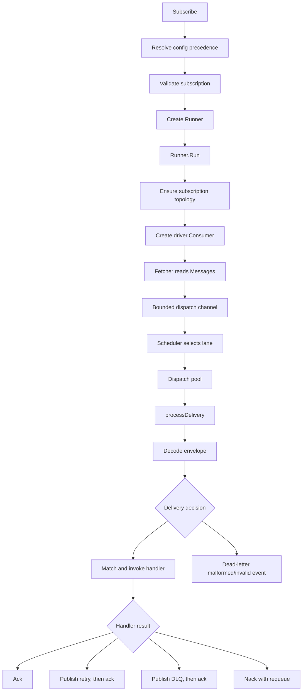
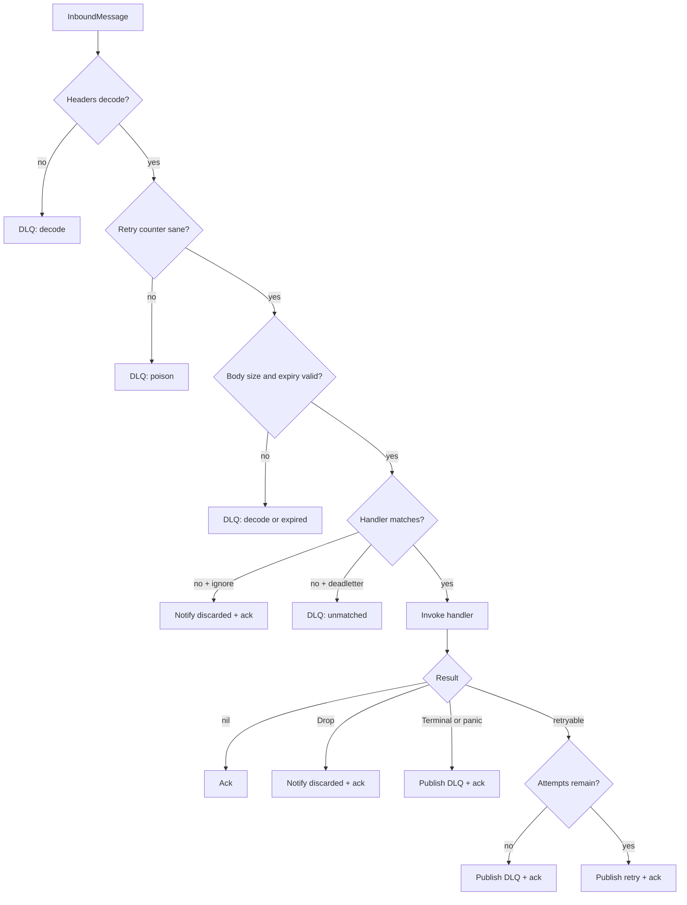

# Consume flow

Entry points:

- [`Client.Subscribe`](../subscription.go)
- [`Runner.Run`](../worker.go)
- [`fetchRunner`](../worker.go)
- [`runDispatchPipeline`](../worker.go)
- [`dispatchMessage`](../worker.go)
- [`invokeHandler`](../worker.go)

## Runner startup

`Subscribe` only validates and registers a runner. `Run` performs the runtime work:

1. Create lifecycle, settlement, metrics, and cancellation state.
2. Build destination names from topics, priorities, retry tiers, and capability profile.
3. Ensure or verify topology according to client policy.
4. Create one driver consumer with a per-destination prefetch allocation.
5. Start fetch, dispatch, and driver-error goroutines.

## File-level worker map

| Function | Responsibility |
| --- | --- |
| `Run` | Own runner startup, goroutines, and final drain |
| `openRunnerConsumer` | Resolve destinations, topology, and consumer config |
| `fetchRunner` | Read driver messages and register accepted deliveries |
| `fetchRunnerAfterCancel` | Stop intake, drain the consumer, and forward already-delivered messages |
| `runDispatchPipeline` | Feed the scheduler and dispatch pool |
| `processDelivery` | Guarantee final settlement/accounting even after panic or abandonment |
| `dispatchMessage` | Decode, validate, match handler, classify outcome |
| `invokeHandler` | Apply timeout, panic recovery, and stuck-worker detection |
| `retryAndSettle` | Build and durably publish the next retry copy, then ack |
| `deadLetterAndSettle` | Build and durably publish the DLQ copy, then ack |
| `ackDelivery` / `nackDelivery` | Call the driver settler and update state |
| destination helpers | Generate main, retry, DLQ, and backstop names |

## Handler decision tree

If successor publishing or acknowledgement fails, the original remains eligible for broker
redelivery. The `processDelivery` defer block retries the relevant settlement operation and records
unknown or abandoned outcomes when success cannot be proven.
