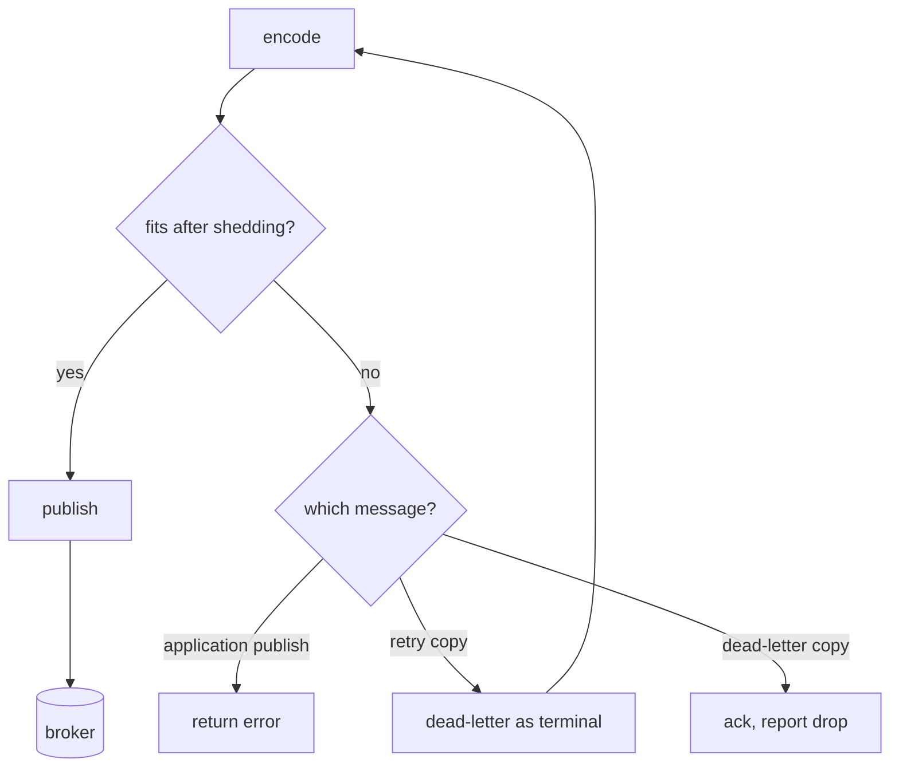

# A dead-letter copy sheds optional headers before it gives up

*By trungbk.*

An event is published with 2,500 bytes of `WithHeader` extensions and arrives without trouble. Its handler then fails for good with a long wrapped error. The dead-letter copy has to carry everything the original had, plus the error text, the reason, the time, and any details the handler attached, and that puts it over the [header size cap](/learn/glossary#header-size-cap) although the original was under it.

If F1 refused to encode that copy, the message that most needs a dead-letter queue would have nowhere to go. So whenever F1 encodes an envelope and finds it too large, it removes optional headers in a fixed order and stops as soon as the rest fits.

## Background

F1 writes the [envelope](/learn/glossary#envelope) as message headers: the CloudEvents fields, F1's own fields for retries, ordering and deduplication, trace context, and your extensions. The cap is the smallest of three numbers: 8 KiB, `codec.maxHeaderBytes`, and any limit the broker driver declares. Neither the RabbitMQ nor the Kafka driver declares one, so the cap is 8 KiB unless you lower it. F1 counts the size as the bytes of every header name plus every value.

The same encoding, with the same cap, runs for every message F1 sends: an application publish, a retry copy, and a dead-letter copy. The dead-letter copy is the one that grows, because it adds the death headers. A retry copy clears the previous error text before it is encoded, so error text does not pile up across retries.

F1 truncates the error text before encoding. `f1.WithDetails` bounds each
attached set of details, not the aggregate collected from nested or joined
errors. Several valid attachments can therefore exceed one attachment's limit;
the final header cap still governs the copy. The example below illustrates
shedding, not the largest possible dead-letter copy.

## The order F1 sheds headers

F1 checks the size after each step and stops at the first one that fits.

| Step | Removed | Why at this point |
| ---: | --- | --- |
| 1 | Your `WithHeader` extensions, all of them | F1 cannot tell which of them matter, and delivery never depends on them. |
| 2 | Error text trimmed to a short floor | The start of an error usually names the failure, and the rest is often wrapping. |
| 3 | Details from `f1.WithDetails` | Useful for diagnosis, but the error text says more per byte. |
| 4 | Unknown F1 headers carried from the wire | Headers a newer F1 wrote that this version does not read. |
| 5 | `tracestate`, `dataschema`, `datacontenttype`, `subject`, then `traceparent`, one at a time | Descriptive fields. `traceparent` goes last because on its own it still links the trace. |
| 6 | Error text trimmed with no floor, down to nothing if needed | The last optional content left. |

Error text is always cut on a UTF-8 character boundary, so a trimmed message is still valid text.

Required identity, routing, ordering, retry, and death metadata stays.
Shedding those fields would make a smaller copy mean something different from
the original. If the required headers alone exceed the cap, encoding fails
with `ErrEnvelopeTooLarge`. The wire boundary is
[`Envelope.EncodeHeaders`](https://fgit.zapps.vn/zatf2026-be-t3/event-driven-messaging-sdk/-/blob/main/envelope.go).

## The opening example, in numbers

The sizes are illustrative. The cap is the default 8,192 bytes.

| Header group | Original | Dead-letter copy | After step 1 |
| --- | ---: | ---: | ---: |
| CloudEvents and F1 fields | 700 | 800 | 800 |
| Trace context and subject | 300 | 300 | 300 |
| Extensions | 2,500 | 2,500 | 0 |
| Error text | 0 | 4,000 | 4,000 |
| Details | 0 | 1,000 | 1,000 |
| Total | 3,500 | 8,600 | 6,100 |

The dead-letter copy fits after step 1. It keeps the whole error and the details and loses every extension. I think that is the right order for a dead-letter queue, whose reader is someone working out why a message died. It is the wrong order for a consumer of the dead-letter queue that routes on one of your extensions: such a consumer cannot count on the extension being there.

## When shedding is not enough

What happens next depends on which message was too large.

- An application publish returns `ErrEnvelopeTooLarge` to the caller. Nothing reached the broker.
- A retry copy that cannot be encoded, or that the broker refuses as too large, sends the message down the dead-letter path as a [terminal error](/learn/glossary#terminal-error), with the encoding or broker error joined to the handler's error.
- A dead-letter copy that cannot be encoded, or that the broker refuses as too large, has nowhere left to go. F1 acks the original and reports the [drop](/learn/glossary#drop) as an observer event and through `WithErrorHandler`, or logs it when no error handler is set. A redelivery would fail the same way every time, and stopping the subscription over it would block every message behind it.

## Limits and trade-offs

- If shedding makes an application publish fit, publication can succeed without its extensions. The consumer cannot tell from the message that anything was removed. Keep business-required values in the payload, not optional headers.
- Removing `datacontenttype` selects `codec.default`. `f1.Typed` makes a returned decode error terminal, but cannot detect a fallback codec that accepts the bytes and produces the wrong value. Both typed and plain handlers can silently misdecode; keeping headers small protects the codec selection as well as diagnostics.
- The cap counts header bytes as F1 sees them, not the broker's own encoding overhead.
- A lower `codec.maxHeaderBytes` makes dead-letter copies reach the later steps sooner. Try a failure path with your largest real error before lowering it.

## Go further

- [Metadata and the envelope](/basics/message) - the envelope fields and `WithHeader`.
- [Failure handling](/advanced-topics/failure-handling#dead-letters-and-discarded-events) - dead letters and discarded events.
- [Retries and dead letters](/deep-dives/retries-and-dead-letters) - how the retry and dead-letter copies are built.
- [Configuration](/advanced-topics/configuration) - `codec.maxHeaderBytes`.
- [Source-reading guide](/development/source-reading-guide#code-behind-the-deep-dives) - where this lives in the code.
