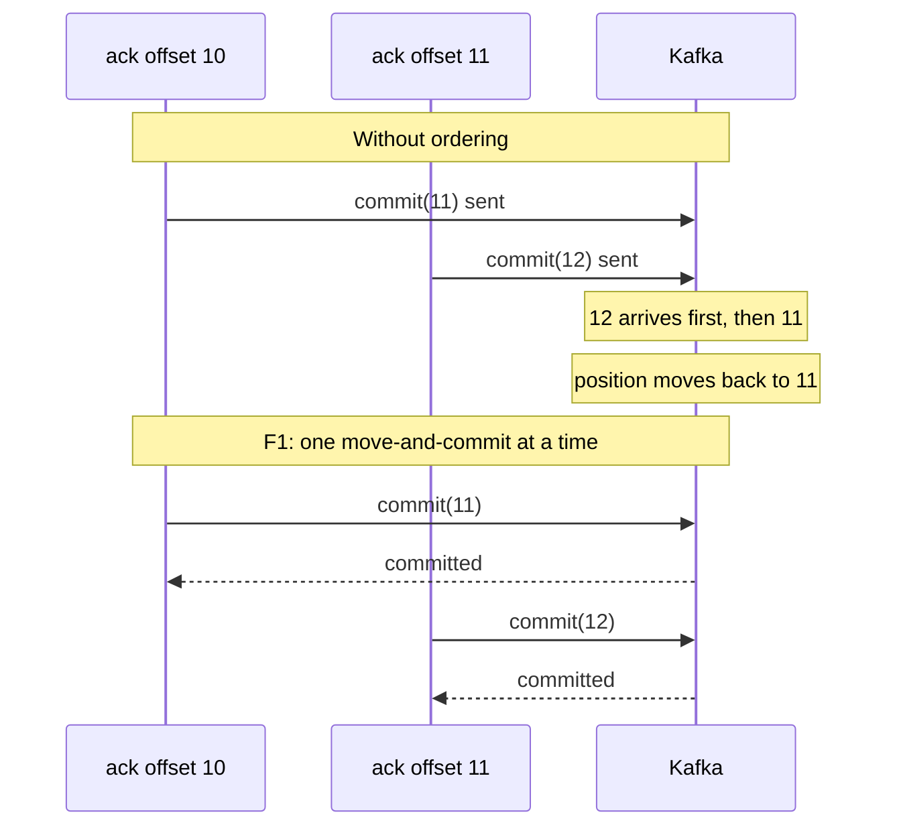
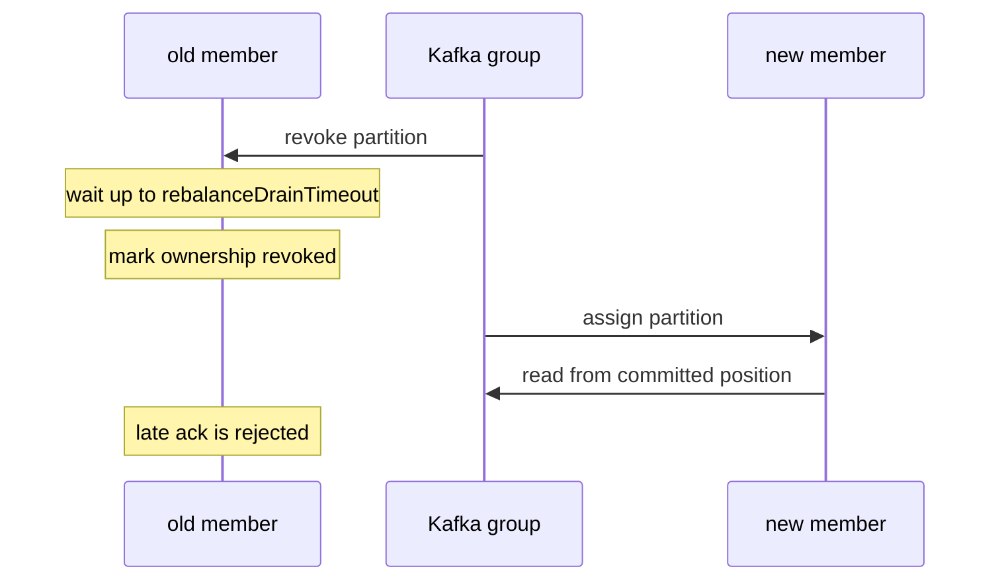

# One in-flight record, one committed offset

*By trungbk.*

Suppose records 10, 11, and 12 of one partition were handled at the same time, and the handler for 12 finished first. Committing 13 for it would let a restart skip records 10 and 11. Kafka stores a group position per partition, not an ack per record. F1's safety rule is therefore about records it delivered: a commit must not pass an earlier delivery that is still unfinished.

## Background

A Kafka topic is split into append-only partitions. A consumer group stores one committed position per partition. That position means "the next offset to read", so a restart or rebalance resumes there.

One delivery at a time per partition makes that rule simple, at the cost of letting a slow record hold up its partition. Offsets Kafka never delivered are different from unfinished deliveries: a gap after compaction does not imply that F1 owes a handler for the missing record.

## The committed offset

Ownership matters as much as offset order. A delivery from the current assignment can commit past offsets Kafka skipped. An old delivery cannot use that permission after the partition is lost and regained: it must match the offset the current ownership owes. Otherwise a late ack could pass a different record that the new assignment has not finished. The [offset tracker](https://fgit.zapps.vn/zatf2026-be-t3/event-driven-messaging-sdk/-/blob/main/drivers/kafka/acktracker.go) and the [consumer's ownership boundary](https://fgit.zapps.vn/zatf2026-be-t3/event-driven-messaging-sdk/-/blob/main/drivers/kafka/consumer.go) are the executable owners.

The figure traces why a stale ack for any offset other than the current one is refused. The refused acks in it come from a delivery whose ownership has ended; a delivery of the current ownership never sends them.

<F1KafkaCursorStepper />

The same steps as a table

| Step | Attempt | Result | Committed position |
| ---: | --- | --- | ---: |
| 1 | offset 10, Ack | moves the committed offset forward | 11 |
| 2 | offset 12, stale Ack from an earlier ownership | refused, 11 is still current | 11 |
| 3 | offset 11, Requeue | leaves the record not yet acked | 11 |
| 4 | offset 11, Ack | moves the committed offset forward | 12 |
| 5 | offset 12, Ack | moves the committed offset forward | 13 |
| 6 | offset 13, Nack without requeue | moves the committed offset forward, like an ack | 14 |
| 7 | offset 15, stale Ack from an earlier ownership | refused, 14 is still current | 14 |
| 8 | offset 14, Ack | moves the committed offset forward | 15 |
| 9 | offset 15, Ack | moves the committed offset forward | 16 |

A crash before a successful commit can deliver the current record again. This is the [at-least-once](/learn/glossary#at-least-once-delivery) boundary, not proof that a handler effect failed. Handler effects must be idempotent.

## Why commits stay ordered

F1 first moves its in-memory offset forward, then sends the commit to Kafka, and does both for one partition one at a time. Without that, commits can arrive out of order. One ack could move to 11 and begin `commit(11)`. A second could move to 12 and begin `commit(12)`. If Kafka receives 12 before 11, its position moves backwards.

Serialization must cover the whole move-and-commit, not just the local offset update. Releasing it before the broker call finishes would admit the out-of-order sequence above. Batching points from different partitions does not remove this requirement; the [commit batching owner](https://fgit.zapps.vn/zatf2026-be-t3/event-driven-messaging-sdk/-/blob/main/drivers/kafka/committer.go) preserves the confirmation boundary.

A failed commit restores the local offset while the partition is still owned. An ambiguous error does not prove whether Kafka stored the request: later commits or a restart can produce duplicate work, and the outcome is not limited to repeating the same offset. Rollback favors replay over skipping work.

If ownership ends while the commit is running, rollback must not revive the old assignment. A successful commit remains successful if ownership ends just after it; an old tracker stays ended even when a fresh assignment is created.

## Requeue keeps the original record

A retry creates another record; a requeue keeps the original offset unfinished. Confusing the two would advance the group position before the original was done. If ownership moves first, Kafka's stored position, rather than the old consumer's local queue, determines redelivery.

See [Consume flow](/development/consume-flow) for the distinction between retry publication and finishing the original.

## When the partition moves

A rebalance can leave a handler running after its partition changes ownership. Waiting indefinitely would prevent the group from making progress; accepting every late ack would let the old assignment change the new one's position. The bounded revoke wait trades possible duplicate work for a finite ownership transfer.

A late ack or discard is rejected when another member now owns the partition. If this same consumer gets the partition back, a late ack can still succeed, but only for the offset that is current again. That is safe: the ack says the same record is done, and the ack cannot name any other offset.

A late requeue does not commit and cannot be finished through the new member. If the partition comes back, F1 builds a new offset tracker for it, starting from the lowest offset this consumer still owes, instead of reusing the old tracker that old deliveries still point to.

The old tracker stays marked as ended, so an ack sent through it is refused.

The new owner resumes from Kafka's stored position, which can differ from the old owner's local state after an uncertain commit. Cooperative rebalancing reduces how much ownership changes; it does not remove the duplicate window.

## Limits and trade-offs

One slow record holds its partition. More handler workers cannot bypass that safety boundary; [partition capacity](/drivers/kafka#kafka-parallelism-and-partitions) is a separate deployment decision. Lost ownership or an uncertain commit requires idempotent effects, even when a handler completed successfully.

## Go further

- [Driver contract](/development/driver-contract) - the ack and ownership contract every driver implements.
- [Kafka lane balancer](/deep-dives/kafka-lane-balancer) - how partition ownership changes during a rebalance.
- [Drivers and capabilities](/drivers-and-capabilities) - Kafka configuration and limits.
- [Source-reading guide](/development/source-reading-guide) - the maintainer route through the implementation.
