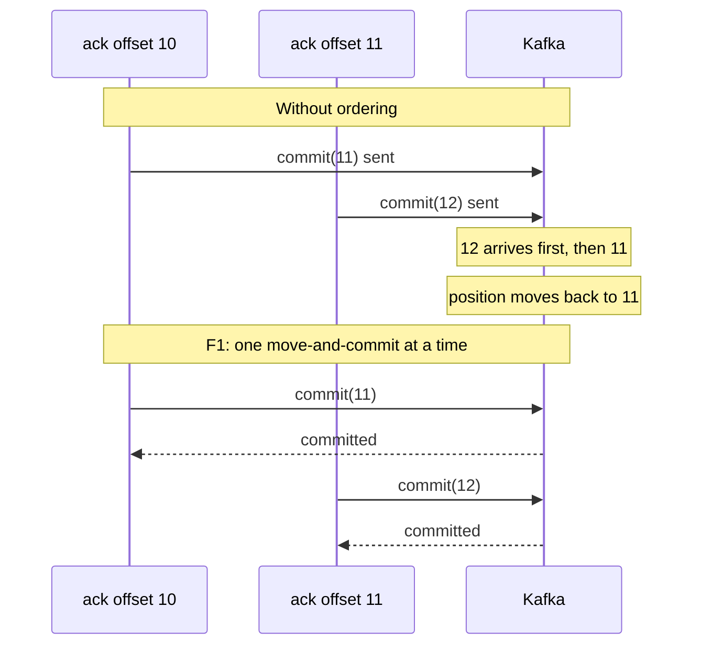
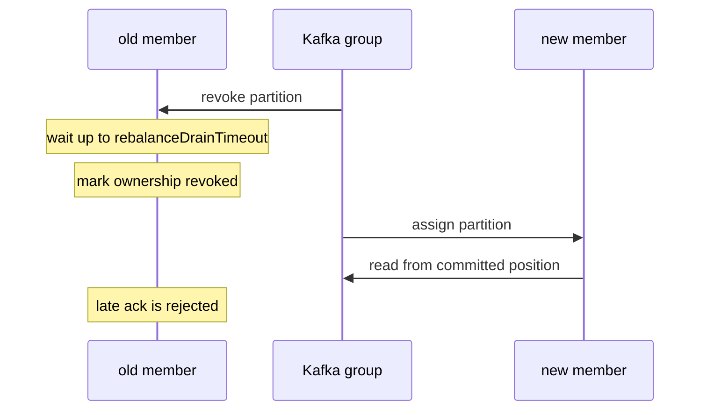

# One in-flight record, one committed offset

*By trungbk.*

Suppose records 10, 11, and 12 of one partition were handled at the same time, and the handler for 12 finished first. If I committed 13 for it, a crash right then would make the next owner start at 13, and records 10 and 11 would never be handled. Kafka commits one offset per partition, not one ack per record, so a commit says "everything below this is done". I only commit past a record once every record before it that Kafka delivered is done, and I refuse to commit for a partition after Kafka has taken it away from this consumer.

I treat the committed offset as the partition's promise: every offset below it is done, and the committed offset itself is the next one a new owner must read.

## Background

A Kafka topic is split into append-only partitions. A consumer group stores one committed position per partition. That position means "the next offset to read", so a restart or rebalance resumes there.

Kafka itself would accept a commit of 15 while 14 is unfinished; the gap is F1's to prevent. F1 therefore lets in one delivery per partition at a time, so a commit never skips a record that is still being handled. When Kafka never delivered some offsets, for example after compaction, the delivery after them commits past them. An ack and a discard move the committed offset forward; a requeue leaves it where it is so the record can be delivered again.

## The committed offset

For each partition it owns, F1 keeps the next uncommitted offset and whether that ownership has ended ([how assignments change](/deep-dives/kafka-lane-balancer)). The commit request itself carries Kafka's group generation, Kafka's number for the current assignment, so Kafka refuses a commit from a member whose assignment has changed. An ack from the delivery that the current ownership let in commits the offset after it, even when Kafka skipped offsets before it. An ack from an earlier ownership, after the partition was lost and regained, must name the current offset; any other offset, later or older, is refused rather than allowed to skip a record.

The figure traces why a stale ack for any offset other than the current one is refused. The refused acks in it come from a delivery whose ownership has ended; a delivery of the current ownership never sends them.

<F1KafkaCursorStepper />

The same steps as a table

| Step | Attempt | Result | Committed position |
| ---: | --- | --- | ---: |
| 1 | offset 10, Ack | moves the committed offset forward | 11 |
| 2 | offset 12, stale Ack from an earlier ownership | refused, 11 is still current | 11 |
| 3 | offset 11, Requeue | leaves the record not yet acked | 11 |
| 4 | offset 11, Ack | moves the committed offset forward | 12 |
| 5 | offset 12, Ack | moves the committed offset forward | 13 |
| 6 | offset 13, Nack without requeue | moves the committed offset forward, like an ack | 14 |
| 7 | offset 15, stale Ack from an earlier ownership | refused, 14 is still current | 14 |
| 8 | offset 14, Ack | moves the committed offset forward | 15 |
| 9 | offset 15, Ack | moves the committed offset forward | 16 |

The committed position is always the next offset Kafka should deliver. A crash before a successful commit can deliver the current record again, which is the [at-least-once](/learn/glossary#at-least-once-delivery) guarantee and why handler effects must be idempotent.

## Why commits stay ordered

F1 first moves its in-memory offset forward, then sends the commit to Kafka, and does both for one partition one at a time. Without that, commits can arrive out of order. One ack could move to 11 and begin `commit(11)`. A second could move to 12 and begin `commit(12)`. If Kafka receives 12 before 11, its position moves backwards.

The driver releases its ordinary lock before waiting on the broker, but a second lock, held for the whole move-and-commit, makes the next one wait until the first returns. Other code can still read the state while the commit is running, and it sees the offset already moved forward.

A failed commit moves the in-memory offset back when the partition is still owned. F1 treats a commit error as not committed; if Kafka did store it, the cost is only that the same offset is committed again later. If Kafka takes the partition away while the commit call is running, the old offset is not restored for the lost partition. A successful commit stays successful even if the partition is taken away right after.

## Requeue is a local redelivery

A handler error normally creates a retry copy and acks the original. Requeue is for work the driver gives back without creating a copy. It leaves the committed position unchanged and puts the record ahead of later records for that partition on the current consumer.

If the partition moves before the requeued record is acked, the next member starts from Kafka's unchanged committed position and can deliver it again. An offset below the committed offset is already done and is skipped; an offset not seen before is let in as the next current record.

A discard moves the committed offset forward like an ack. Kafka's consumer groups do not expose a per-message delivery count, so an F1 failure count cannot become a counter inside Kafka.

## When the partition moves

A rebalance changes the member that owns a partition. F1 waits up to `lifecycle.rebalanceDrainTimeout` for the in-flight delivery, then marks the old ownership as revoked and detaches it.

A late ack or discard is rejected when another member now owns the partition. If this same consumer gets the partition back, a late ack can still succeed, but only for the offset that is current again. That is safe: the ack says the same record is done, and the ack cannot name any other offset.

A late requeue does not commit and cannot be finished through the new member. If the partition comes back, F1 builds a new offset tracker for it, starting from the lowest offset this consumer still owes, instead of reusing the old tracker that old deliveries still point to.

The old tracker stays marked as ended, so an ack sent through it is refused.

The new owner starts at Kafka's committed position. If the old owner did not commit before losing the partition, a redelivery is expected. If it committed, the new owner starts after that offset. Cooperative rebalancing moves fewer partitions, but it does not promise that no message is delivered twice.

## Limits and trade-offs

- One slow record pauses its partition, because the next record cannot pass the current offset.
- A crash or a lost partition before a successful commit can deliver the current record again.
- A requeue keeps the committed offset where it is and gives the current consumer the record again first.
- A partition that moved to another member rejects late acks instead of committing through the old assignment.
- Partition count is how you get more parallelism on Kafka; F1 never lets a later ack pass an unfinished offset. Adding partitions moves some keys to other partitions, and Kafka cannot lower a topic's partition count afterwards.

## Go further

- [Driver contract](/development/driver-contract) - the ack and ownership contract every driver implements.
- [Kafka lane balancer](/deep-dives/kafka-lane-balancer) - how partition ownership changes during a rebalance.
- [Drivers and capabilities](/drivers-and-capabilities) - Kafka configuration and limits.
- [Source-reading guide](/development/source-reading-guide) - the maintainer route through the implementation.
