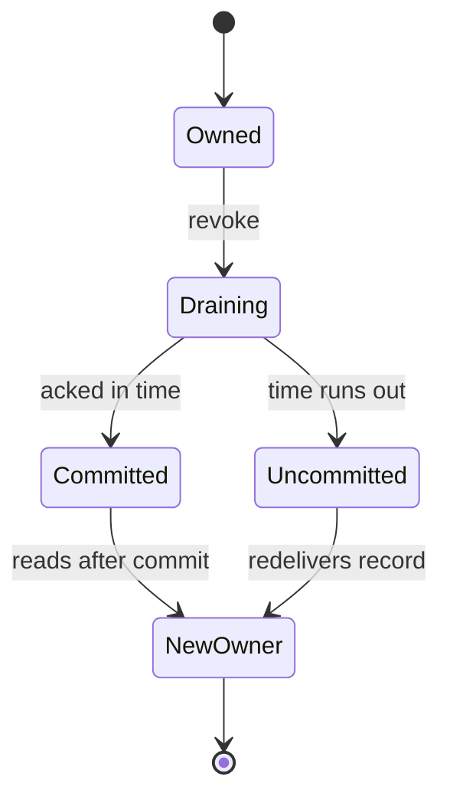

# Partitions set Kafka parallelism, and a rebalance moves them without losing records

*By trungbk.*

I run two instances of a service with `Concurrency: 16` against a topic with 4 partitions, and each instance handles only 2 messages at a time. Then a third instance starts, Kafka moves partitions between members mid-message, and some records arrive twice. Both surprises come from the same fact: Kafka, not F1, decides which consumer owns each partition. F1 maps a destination, priority, and [retry step](/learn/glossary#retry-tier) to a topic and lets the consumer group assign partitions to members, so the assignment sets how much each instance can run in parallel and what a rebalance can redeliver.

## Group assignment

A consumer group has members, and Kafka gives each partition to one member at a time. When membership changes, the group leader computes a new assignment using the assignment strategy the members agree on.

The `broker.kafka.balancer` setting picks that strategy from three built-in choices:

- `cooperative-sticky` is the default. Members retain partitions that do not need to move.
- `sticky` prefers stable ownership but uses eager revocation before the new assignment.
- `range` assigns contiguous ranges per topic and also uses eager revocation.

Every member must advertise a compatible strategy. I change this setting across the group as one deployment. Moving from cooperative-sticky to an eager protocol takes every partition away from every member once and can redeliver records that were not committed before the move.

## Parallelism is limited by partition count

The Kafka driver lets in one delivery per partition at a time. For one destination, effective handler parallelism is the smaller of `Concurrency` and the number of assigned partitions.

F1's priority weights can choose among available work, but they cannot create a partition. If a member is assigned fewer partitions than the destination's prefetch could keep busy, F1 emits one warning with the assigned count, that prefetch number, and what to scale. What to scale is the destination's partition count unless `broker.kafka.maxExpectedInstances` sets a floor. That setting is the number of instances you expect to run, and F1 uses it as the minimum partition count for every destination.

The operator response is to provision more partitions or configure that floor before consumers start. Increasing a topic's partition count remaps keys and cannot be undone, so the keying scheme must remain valid after the change.

A cooperative callback can report only part of the eventual assignment. F1 logs the partition-shortfall warning once, and does not retract it when a later callback brings in more partitions. The warning describes assignment shape, not a consumer failure.

## Rebalancing without losing ownership

A cooperative revoke keeps unaffected partitions and drains only the partitions that must move. The drain has a time limit derived from the broker's timeouts, so the next owner can read a record that was not yet acked when the old owner cannot finish in time.

The diagram's time-runs-out branch is [at-least-once](/learn/glossary#at-least-once-delivery) redelivery, not loss. An eager strategy follows the same ownership idea but revokes every assignment before assigning again.

The order inside a revoke matters. F1 first stops letting new records in from the partitions that are leaving, then waits for the deliveries already in hand, with one shared time limit for the whole revoke. After the wait it closes the old offset records, so late acks through them are refused, and commits the acked prefix: the offsets acked in a row after the last commit, up to the first one still unacked.

If that final commit fails, F1 reports it and the next owner starts from Kafka's previous committed position, so it gets every record after that position again, including records whose handlers already finished. A handler still running when the time limit ends is not stopped; its ack is refused, and the next owner can handle the same record while it runs.

A lost assignment is different from a revoke. It happens when the group coordinator has already dropped this member, for example because its session expired without heartbeats. Then its commits would be refused anyway, so F1 does not wait and does not commit: it drops the partitions at once, and the next owner redelivers everything this member did not commit.

`lifecycle.rebalanceDrainTimeout` is the wait for one in-flight delivery on each revoked partition. It must fit both broker group windows: the value must not exceed 0.6 times the smaller of `broker.kafka.sessionTimeout` and `broker.kafka.rebalanceTimeout`, which leaves the rest of the window for the final commit and the rejoin.

## Partition floors and retry topics

`broker.kafka.maxExpectedInstances` makes a capacity floor explicit. When F1 declares topology, a destination with no partition count set is created with the floor, a declared count below the floor is refused, and an existing topic is accepted only at or above the floor. Topology verification refuses an existing destination below it. Retry topics are destinations too, so the floor applies to them. Its zero value leaves the broker's count in charge. `TopologyNone` skips declaration and verification, so the operator provisions the topic and its floor outside F1.

Retry steps use separate Kafka topics and the same one-delivery-per-partition rule. Their due time comes from the record timestamp plus the step's configured delay. A retry topic with too few partitions can leave handler capacity idle; the same irreversible key-remapping trade-off applies.

## Limits and trade-offs

- Cooperative assignment moves fewer partitions but can redeliver records not yet acked when the drain time runs out.
- Eager protocols simplify full reassignment at the cost of revoking every partition during a change.
- A partition-floor warning is an assignment-shape risk, not proof that Kafka or the consumer is broken.
- Raising a partition count increases possible parallelism but remaps keys permanently.
- A rebalance drain time that fits `broker.kafka.rebalanceTimeout` can still violate the separate session-timeout fraction, so both bounds must be checked.

## Go further

- [Drivers and capabilities](/drivers-and-capabilities) - Kafka options, topology, and capability limits.
- [Kafka ack tracker](/deep-dives/kafka-ack-tracker) - how acks behave when ownership changes.
- [Driver contract](/development/driver-contract) - the broker-independent consumer contract.
- [Source-reading guide](/development/source-reading-guide) - the maintainer route through the implementation.
