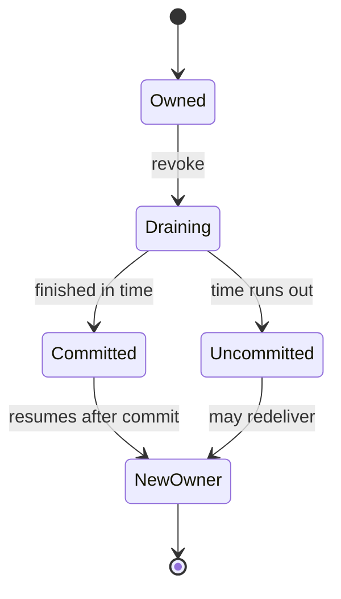

# A rebalance changes who may commit a partition

*By trungbk.*

A handler can still be running when Kafka gives its partition to another member. Waiting forever would block the group; allowing the old member to commit without an ownership check could skip work the new member still owes. F1 uses a bounded wait and ends the old ownership, accepting duplicate work rather than letting an old delivery advance an unrelated offset.

## Cooperative and eager assignment

A cooperative assignment keeps partitions that do not need to move. An eager assignment revokes the whole assignment before distributing it again. Keeping unaffected partitions avoids restarting their work from the stored group position, which is why cooperative-sticky is F1's default.

Protocol choice is a group-wide deployment decision: every member must advertise a compatible strategy. Switching to an eager protocol broadens the revoke and therefore the duplicate window. The [Kafka driver guide](/drivers/kafka#kafka-rebalancing) owns the supported settings; the [balancer selection source](https://fgit.zapps.vn/zatf2026-be-t3/event-driven-messaging-sdk/-/blob/main/drivers/kafka/balancer.go) owns their mapping.

## One wait limit for the revoke

A revoke wait is shared by all partitions leaving in that callback. Giving each partition a fresh wait would make total transfer time grow with the assignment, even though the group has only one window in which to complete the rebalance.

Stopping new deliveries before waiting makes the wait finite: otherwise another record could replace each one that finishes. Ending the old trackers after the wait prevents late acks through that ownership. The final commit represents the finished prefix of delivered records, not a promise that every numeric offset existed.

A handler may outlive the wait. If another member owns the partition, the late ack is refused and the same record can be handled there while the old handler still runs. If a final commit returns an ambiguous error, the new owner resumes from whatever position Kafka actually stored, not necessarily the position the old member expected. Neither case makes handler effects exactly-once.

## Revoke is not lost ownership

A revoke offers time to finish work before ownership transfer. A lost assignment means that opportunity has already ended, so waiting would not preserve the old member's right to commit. F1 drops lost ownership without a wait or a final commit. The [consumer ownership source](https://fgit.zapps.vn/zatf2026-be-t3/event-driven-messaging-sdk/-/blob/main/drivers/kafka/consumer.go) owns both paths, including the separate handling of a consumer already shutting down.

The revoke wait must leave room for the final commit and rejoin in both the session and rebalance windows. Fitting only the rebalance window is insufficient. The [Kafka timeout rule](https://fgit.zapps.vn/zatf2026-be-t3/event-driven-messaging-sdk/-/blob/main/internal/kafka/drain.go) is the executable constraint; [driver configuration](/drivers/kafka#kafka-rebalancing) points to the operator settings.

## A warning can precede the final assignment

Partition-shortfall warnings compare the member's accumulated assignment with the resolved destination budget, not just the partitions named by one callback. That avoids treating retained cooperative partitions as missing. It cannot tell whether more partitions will arrive in a later round.

For example, a destination budget of three can see one partition in the first callback and two more in the next. The first callback warns; the completed assignment no longer has a shortfall, but the warning is not retracted. Waiting for another round instead would miss a real shortfall when no later callback comes. This accepted false positive is a diagnostic trade-off, not a consumer failure or a measured throughput result.

Use the completed assignment and workload evidence before changing capacity. The [partition-capacity guide](/drivers/kafka#kafka-parallelism-and-partitions) owns sizing and partition-floor guidance. Retry destinations with a positive configured delay are excluded from this warning; silence does not establish that their capacity is sufficient.

## Go further

- [Kafka ack tracker](/deep-dives/kafka-ack-tracker) - why stale ownership cannot skip an unfinished record.
- [Kafka driver](/drivers/kafka) - configuration and deployment constraints.
- [Driver contract](/development/driver-contract) - the broker-independent ownership boundary.
- [Source-reading guide](/development/source-reading-guide) - the maintainer route through the implementation.
