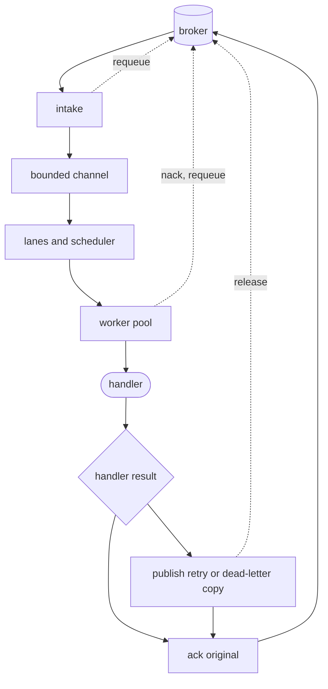
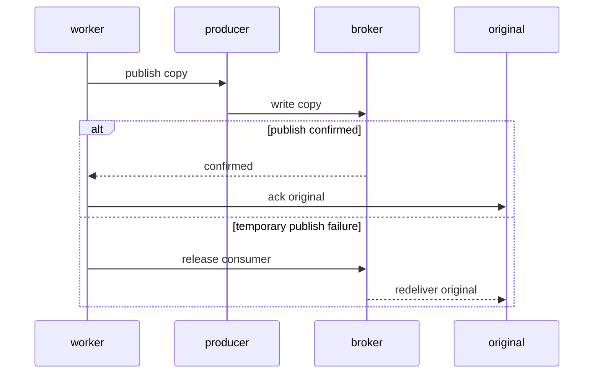

# F1 tracks every message from intake to its final ack

*By trungbk.*

A message becomes F1's responsibility when the driver hands it to the subscription; from that moment F1 records it as in flight. I follow one message, `o-42`, from broker delivery through the handler to the moment F1 [finishes it](/learn/glossary#settlement) with an ack or a nack, including the branches that give it back to the broker.

A shutdown, connection drop, hung handler, or temporary failure to publish a retry copy does not lose the message. F1 either finishes the original, or leaves it unacked so the broker can deliver it again. The exception is a poison message with no usable dead-letter route, or a dead-letter copy that cannot be encoded. F1 reports that drop as an observer event and through `WithErrorHandler`, or logs it when no error handler is configured. It is visible, never silent.

## The map

The dashed edges give a delivery back to the broker: a nack with requeue (the broker puts the delivery back to be delivered again), or releasing the consumer after the retry copy could not be published. Releasing closes that consumer, and the broker redelivers every message the consumer held but had not acked.

The interactive figure below is a guided illustration of these branches, not a second scheduler or timing model.

<F1DeliveryPath />

Each runner has a [current consumer](/learn/glossary#reconnect-generation) with its own fetch, dispatch, and error-reading goroutines. Optional backlog polling and the handler pool run separately. A reconnect replaces that consumer and its goroutines while the subscription, the runner, and F1's record of in-flight messages stay.

If one of those goroutines returns an error or panics, F1 stops all of them. That matters because they hand each other channels: if dispatch stopped while fetch was blocked on a full channel, fetch would otherwise wait for a reader that no longer exists. Stopping them together lets every goroutine finish and lets the runner open a new consumer or drain.

## Counted before it moves

I record `o-42` as in flight before moving it to the dispatch channel. If shutdown starts while that channel is full, the delivery is already visible to the drain instead of hiding in a buffer nobody is reading.

The channel holds as many deliveries as the subscription has workers. Once a delivery enters it, the fetch side has finished its part. If shutdown stops the hand-over before the delivery enters the channel, F1 nacks it with requeue and the broker delivers it again later.

A delivery leaves F1's in-flight record when its outcome is known or the limited cleanup time runs out. `Runner.Drain` waits for that record to reach zero. This proves that F1 has stopped tracking accepted work, not that every broker call succeeded.

## Waiting for a worker

The dispatch channel is the first buffer. [Lanes](/learn/glossary#lane), the bounded queues inside F1, are the second. F1 chooses a lane from the topic, priority, and retry step: fresh traffic uses a main lane, and each retry step has its own lane.

A worker that frees up takes the next message by [weighted picks](/deep-dives/scheduler): each group of lanes gets a share of picks in proportion to its weight, and retry lanes share one group with a reduced weight. A lane whose oldest message has waited at least its [wait limit](/learn/glossary#lane-budget) can [jump the queue](/learn/glossary#deadline-promotion), but the jump goes to the lane furthest past its limit rather than promising a maximum wait. [How F1 picks the next message](/deep-dives/scheduler) walks through the algorithm with scores, and the settings are in [ordering and scheduling](/advanced-topics/ordering-and-scheduling).

A lane's capacity limits how many messages wait in it. It grows with `Concurrency` and the lane's weight; the scheduler page gives the exact formula. When a lane is full, the broker holds later messages for that destination. Time spent at the broker does not count toward the lane's wait limit.

The dispatch loop asks for a pick only while the worker pool can accept work. With unordered delivery, accepted work enters a shared queue. With the `OrderedByKey` subscription mode, equal keys always go to the same worker queue, so messages with one key run one at a time; different keys can run in parallel.

## Running the handler

Before a handler runs, F1 checks the envelope, codec, attempt count, body size, and expiry. A failed check goes to the dead-letter path. F1 then looks for a handler registered for the event type. An event with no handler follows the subscription's unmatched policy: `f1.Ignore`, the default, acks it and reports it as discarded, and `f1.DeadLetter` sends it to the dead-letter path.

Middleware wraps the handler, and panic recovery covers the whole chain. The ack or nack happens outside the chain, so middleware cannot accidentally ack or requeue the delivery.

The handler runs on its own goroutine with a timeout, `HandlerTimeout`, thirty seconds by default, measured from the moment the handler starts. At the timeout F1 cancels the handler context. Cancellation alone does not fail the delivery; the handler's return value still decides what happens: an error takes the normal error path below, and a `nil` returned after the cancel is acked.

A handler that keeps running is logged as stuck at twice the timeout, and at four times the timeout F1 stops waiting, gives up on the delivery, and nacks it with requeue so the broker can deliver it again. The attempt count does not change.

Go cannot kill a goroutine from outside, so a handler that ignores its context keeps running after F1 gave up on it. Its worker takes the next delivery, so the process can run more handlers than `Concurrency`, and each stuck one holds its goroutine and whatever it opened. The redelivered copy can run while the stuck one is still working on the same message.

## Deciding what happens

The handler result chooses the original message's outcome in one place.

| What the handler returns | What happens to the original |
| --- | --- |
| nil | F1 acks it |
| `f1.Drop` | F1 acks it and reports it as discarded |
| `f1.Terminal` or a panic | F1 publishes a dead-letter copy, then acks the original |
| another error with attempts left | F1 publishes a retry copy, then acks the original |
| another error on the last attempt | F1 publishes a dead-letter copy, then acks the original |

Decode failures, expiry, and other poison cases use the dead-letter policy described in [consume flow](/development/consume-flow#delivery-decisions). A copy that temporarily cannot be published leaves the original unacked. A copy that can never be encoded or accepted follows the visible poison-drop path instead.

## Ack last

Retry and dead-letter copies are new messages. F1 copies the body and key into each one and sets its destination. A retry copy also gets the next attempt number and a due time; a dead-letter copy keeps the attempt number and adds the death reason and last error. F1 waits for the broker to confirm the copy. Only then does it ack the original.

Publishing a copy works the same on every broker. A broker requeue cannot carry a delay or an updated attempt count, and Kafka has no per-message nack. A new message on a retry or dead-letter destination gives every driver the same path.

A copy that temporarily fails to publish is different from one that can never be published. The driver's error says which: a lost connection or a timeout is temporary, while a copy the broker refuses as too large, or whose headers cannot be encoded, can never be published.

In the temporary case, F1 first retries the publish a few times within the time left for acking. If it still fails, F1 releases the consumer and leaves the original unacked, so the broker can deliver it again. In the never case, the poison path can ack the original after reporting why its copy could not be made.

Acking last can duplicate work. If the process dies after the copy is confirmed but before the original is acked, the broker delivers the original again and the copy runs again too. F1 is at least once, so handlers must make their effects idempotent.

## When the ack fails

An ack or nack can fail after the handler result is known. F1 retries it a limited number of times. A failed ack can fall back to a nack with requeue in the same round, and the next round tries the ack again.

A driver error leaves the broker-side result unknown. F1 keeps the delivery in its in-flight record until a later try succeeds or `Lifecycle.DrainTimeout` runs out, even if the caller cancels.

This limit is separate from how long `Client.Close` waits for runners to drain:

| Wait | Setting |
| --- | --- |
| Retrying one ack or nack, and keeping the delivery in the in-flight record | `Lifecycle.DrainTimeout`, one minute by default |
| `Runner.Drain` finishing in-flight messages | `Lifecycle.DrainTimeout`, counted from the start of the drain |
| `Client.Close` waiting for all runners to drain | `Lifecycle.ConsumerDrainTimeout`; zero leaves the caller's context as the only limit |

## Two races the path guards against

### Goroutines that would never end

Suppose dispatch fails while fetch is blocked handing a delivery to a full channel. Without stopping the goroutines together, dispatch would have stopped reading and fetch would wait forever. F1 stops all of them on the first error or panic, so fetch ends, the runner can open a new consumer, and accepted deliveries still reach the drain.

A delivery for an unknown lane is handled in a fallback lane with a warning instead of ending the run. That keeps a configuration or topology mismatch visible without leaving the runner stuck.

### A handler whose consumer is gone

The pool can already hold accepted work when a reconnect stops the runner's consumer. That work is not cancelled along with the consumer, so a worker may still pick the delivery up. It checks whether the runner is draining before calling the handler. If the runner is not draining, the consumer went away because of a reconnect, so the worker gives up on the delivery and nacks it with requeue, and the broker delivers it again. If the runner is draining, the worker runs the handler so accepted work can finish.

## Trade-offs

- Acking last can duplicate a retry copy when the process dies between the confirm and the original ack.
- A handler that ignores its context can outlive the delivery F1 stopped waiting for.
- `Lifecycle.DrainTimeout` can run out with the broker-side outcome unknown; F1 reports the failure rather than claiming the ack went through.
- A busy worker pool stops intake for every lane, so pressure in one lane slows the others.
- A poison message with no usable dead-letter route, or a dead-letter copy that cannot be encoded, can be dropped. F1 emits the poison observer event and sends the error to `WithErrorHandler`, or logs it without an error handler.

## Go further

- [Consume flow](/development/consume-flow) - the code map for delivery, acking, drain, and reconnect.
- [Ordering and scheduling](/advanced-topics/ordering-and-scheduling) - lanes, weights, capacity, and jumping the queue when overdue.
- [Failure handling](/advanced-topics/failure-handling) - retry and dead-letter policy.
- [Lifecycle and shutdown](/advanced-topics/lifecycle-and-shutdown) - drain and close behavior.
- [How F1 picks the next message](/deep-dives/scheduler) - weighted picks and overdue lanes.
- [Source-reading guide](/development/source-reading-guide) - the maintainer route through the implementation.
