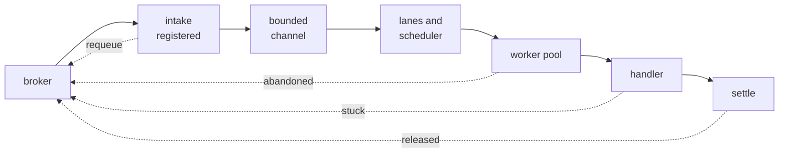
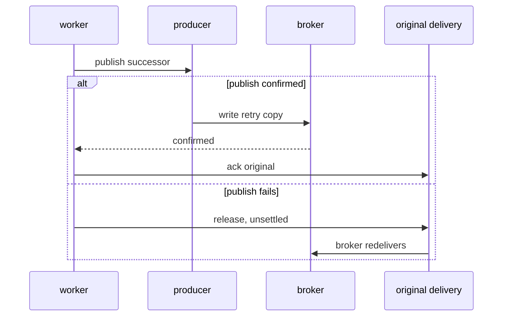

# Life of a delivery

*By trungbk.*

The order service publishes one message: type `orders.placed.v1`, key `o-42`, topic `orders.placed`. The broker hands a copy to the `order-projector` subscription, and from this moment the message belongs to F1. Everything that can go wrong happens here.

The process can be asked to shut down while o-42 is still in a queue. The connection to the broker can drop. The handler can hang and never return. The publish that carries the retry copy can fail after the original was already read. None of those endings lose the message. Once a message crosses from the driver into F1, F1 either settles it, telling the broker it is finished, or gives it back to the broker. It never drops one silently.

## The map

Follow the top row left to right and o-42 reaches an ending; the dashed edges are the same message handed back to the broker, which is what keeps the guarantee true when something fails.

<F1DeliveryPath />

A generation is one broker consumer plus three goroutines: the fetch side reads messages from the driver, the dispatch side schedules and dispatches them, and the error watcher reads the driver's error stream. A reconnect builds a new generation; the subscription above it and the runner stay the same, and so does F1's record of deliveries in flight.

Those three hand each other the channels they read. A goroutine that died without cancelling the generation would leave the others waiting on a close that never arrives, so each of them is started in a way that turns an error return and a panic alike into a cancellation of the whole generation. Every branch this page skips is traced in [consume flow](/development/consume-flow).

## Counted before it moves

I register o-42 before I move it. The fetch side takes the message off the driver's channel, records it in F1's record of deliveries in flight, and only then puts it on the dispatch channel. Registering first is what lets a shutdown count a message it cannot yet hand to a worker: if the drain starts while that channel is full, the message is already visible to the drain instead of hiding in a channel nobody is reading.

The dispatch channel holds as many messages as the subscription has workers, which is `Concurrency`, sixteen for `order-projector`. Once a delivery is in it, the fetch side's job for that message is done.

A full channel with a cancelled generation is where a message is easiest to lose, and it is not dropped: the fetch side nacks it with requeue, and the broker redelivers it later. On cancellation the fetch side also drains the driver's consumer within the drain timeout, forwards whatever the driver had already yielded, and closes the channel, so the dispatch side ends on a closed channel rather than on a message it never saw.

A delivery leaves F1's record of deliveries in flight only when its outcome is known or the bounded cleanup budget is spent. `Runner.Drain` waits for that record to reach zero, which is how a shutdown proves that nothing it accepted is still unaccounted for.

## Waiting for a worker

The dispatch channel is the first buffer; the lanes are the second. Every delivery goes into a lane chosen by its topic, its priority, and its retry tier: one main lane for fresh traffic, one lane per retry tier. o-42 goes into the main lane for `orders.placed` at its priority.

I use smooth weighted round robin for the pick: on every pick each non-empty lane gains its weight, the lane with the highest running total wins, and the winner gives the total weight in play back. Retry lanes carry a halved weight, clamped at the lowest weight a lane can hold, and a lane that has waited past its deadline can be promoted ahead of that order. The knobs are in [ordering and scheduling](/advanced-topics/ordering-and-scheduling).

A lane's capacity is its weighted share of the concurrency, raised to a small floor when the share would be narrower, then multiplied by a small prefetch factor. The floor matters when the share is narrow: without it a worker waits on the broker round trip behind its own acknowledgement.

The worker pool is one goroutine per unit of concurrency, and the dispatch loop asks the scheduler for its next pick only while the pool can take work. A loop that drained the scheduler into a queue in front of the workers would freeze the choice at read time, where it could no longer follow lanes filling and draining.

That is the backpressure chain: when every worker is busy the loop stops picking, lanes fill, a full lane stops taking deliveries for its destination, and the driver, whose prefetch is capped at the sum of the lane capacities, stops fetching a destination at its cap. Every buffer on the path is bounded, and the furthest-upstream one stops the broker.

By default every worker takes from one shared queue. In `OrderedByKey` mode each worker has its own queue, and a delivery goes to the queue its key hashes to, so two messages for o-42 always hash to the same worker and never run at once. Different keys still run in parallel.

The pool runs accepted work on a context whose cancellation has been removed from the generation's, so a delivery the pool already took is not cancelled when the generation ends for a reconnect. That is also how a delivery can reach a handler whose generation is already gone.

## Running the handler

Before any handler runs, the message has to pass a short inspection. The headers must decode into an envelope, a codec must exist for the declared content type, the attempt counter must not be runaway, the body must be inside the configured size limit, the event must not have expired, and a handler must match the event type. A message that fails any of those checks goes to the dead-letter path. One exception: an event type with no handler, under the ignore policy, is acked and reported as discarded, because a subscription that does not care about a type has nothing to dead-letter.

Middleware wraps the handler with the first middleware outermost, and panic recovery wraps the whole chain. Ack and nack happen in the dispatch side that called the chain, outside it, so a middleware that returns the wrong error cannot settle a message by accident.

The handler runs on its own goroutine with a context that expires after the handler timeout, thirty seconds by default. The dispatch side does not wait on it forever. At twice the timeout it logs a stuck-worker warning; twice again after that it gives up, marks the delivery abandoned, and stops waiting. If nothing settled the delivery in the meantime, the cleanup nacks it with requeue.

Giving up is not stopping. Go has no way to kill a goroutine from outside, so when F1 gives up it cancels the handler's context and returns to its own work, while the handler goroutine keeps running until the handler itself returns. A handler that ignores its context can outlive the delivery it was handling.

## Deciding what happens

The handler's result decides the original message's ending, and the decision is made in one place so that nothing wrapped around the handler can take it.

| What the handler returns | The original message |
| --- | --- |
| nil | acked |
| a dropped error, `f1.Drop` | acked and reported as discarded |
| a terminal error, `f1.Terminal`, or a panic | dead-lettered |
| any other error, with attempts left | retried through a successor |
| any other error on the last attempt | dead-lettered |

The full table, including decode failures, expiry and poison messages, is in [consume flow](/development/consume-flow#delivery-decisions).

Two of those rows reach the broker through a successor copy rather than through the original, and that handoff is where the ordering in the next section applies.

## Ack last

Retry and dead-letter both mean a new message. The original is not requeued and not modified in place: F1 copies the body and the key, adds one to the attempt counter, sets a due time, and publishes the copy to the retry destination for its tier. Only after that publish is confirmed does F1 ack the original. Dead-lettering has the same shape, with the dead-letter destination in place of the retry one.

I publish a copy for portability. A broker's own requeue cannot carry a delay or an updated attempt count, and on Kafka there is no per-message negative acknowledgement at all. A new message on a retry destination behaves the same on every broker F1 supports.

The ack is the last step in both branches, and when the successor cannot be published the original is never settled, so the broker still owns it.

The successor publish gets a few quick retries with a short pause between them. If it still fails, the original is not acked: F1 releases the consumer, leaving the message unsettled so the broker redelivers it, exactly as it would after a crash. That budget is small on purpose, because the whole chain of publish and settle has to fit inside the broker's consumer-liveness window, and every extra attempt spends part of it.

Acking last costs duplicates. If the process dies after the successor is confirmed and before the original is acked, the broker redelivers the original and the retry runs a second time. F1 is an at-least-once system, and handlers have to be idempotent.

## When the ack itself fails

The ack or nack call can fail too. The cleanup that runs at the end of every delivery retries the last settlement operation for a few more rounds with a short pause between them, and a failed ack falls back to a requeue nack within the same round.

Two separate facts decide when a delivery can leave F1's record of deliveries in flight: which call F1 decided to make, and whether the broker accepted it. A driver call that returned an error leaves the broker-side result unknown, so the entry stays until a later round settles it or the budget runs out. Drain waits for that record to reach zero, and the bounded budget is what keeps that wait finite.

During a drain every round is also bounded by the drain timeout, so a settlement that keeps failing ends with it rather than holding a shutdown open indefinitely.

## Two races the path guards against

### A generation that would never end

The dispatch side can return an error, and the interesting part is what happens to the fetch side next. Say the dispatch side fails while the fetch side is blocked handing a message to the dispatch channel. If that failure did not cancel the generation, nobody would read that channel again, the fetch side would wait for a reader that no longer exists, and the generation would never end.

An error or a panic from any source cancels the generation, so the fetch side's context ends, it stops, and the runner can rebuild the consumer or return. A delivery for a lane that does not exist is the other half of this guard: the scheduler refuses the lane, and the dispatch side routes the delivery to a fallback lane with a warning instead of ending the run over it.

### A handler whose generation is gone

The pool lets queued work outlive its generation, so a delivery can reach the handler path after the generation was cancelled for a reconnect. Follow the interleaving. The dispatch loop has already submitted the delivery to the pool when the reconnect cancels the generation. The pool's context does not carry that cancellation, so a worker picks the delivery up anyway and runs it.

That worker reads the generation's context, finds it finished, and checks whether the runner is draining. It is not, so F1 does not start the handler. The delivery comes back as abandoned, and the cleanup nacks it with requeue, which is the same ending it would have had if the fetch side had never accepted it.

During a drain the handler does run, because a drain exists to finish work the runner already accepted.

## Trade-offs

- Acking last can duplicate a retry when the process dies in the gap between a confirmed successor and the ack, so handlers have to be idempotent.
- A handler that ignores its context keeps running after F1 has stopped waiting, and nothing in the runtime can end it.
- Settlement retries are bounded, so a delivery can end with its broker-side outcome unknown rather than settled or requeued.
- A busy pool stops intake for every lane, so pressure in one lane slows the others.

## What I would change

<!-- TODO(trungbk): what you would change about this path, in your own words. -->

## Go further

- [Consume flow](/development/consume-flow) - the code map for every branch this page skips.
- [Ordering and scheduling](/advanced-topics/ordering-and-scheduling) - lanes, weights, and deadline promotion.
- [Failure handling](/advanced-topics/failure-handling) - the retry and dead-letter policy an application configures.
- [Lifecycle and shutdown](/advanced-topics/lifecycle-and-shutdown) - what a drain and a close promise the caller.
- [How F1 picks the next message](/deep-dives/scheduler) - what happens when a worker is free and several lanes have work.
