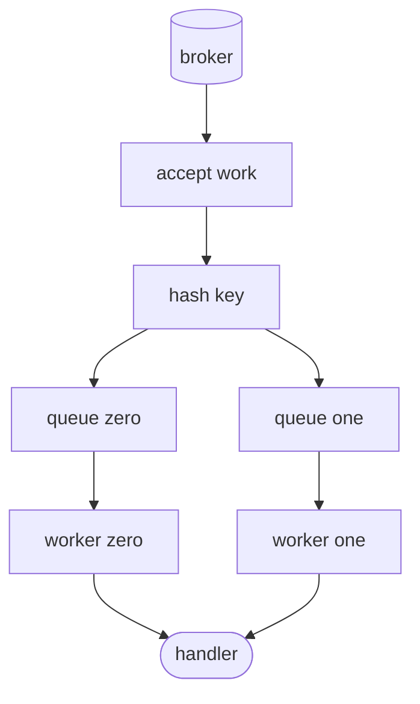

# Equal keys share a worker, not the whole subscription

*By trungbk.*

Two updates for order 42 arrive while the first update for that order is still in its handler. If a second worker picked up the next one, the two could write the order row in the wrong order. With `OrderedByKey` I send both to the same worker, so the second waits, while updates for other orders keep running on the other workers. The mode keeps equal keys apart in time; it does not make the whole subscription serial, and it does not keep a retry copy in order across the broker.

## Background

A subscription chooses ordered mode when one business entity must be handled serially. The key is the [message key](/learn/glossary#partition-key), commonly set with `WithKey`. F1 hashes that key to one worker queue. Every delivery with that key follows the same queue, while other queues can run at the same time.

The connected driver must advertise ordered-by-key capability. F1 rejects a subscription that requests the mode when the capability is unavailable; it does not silently fall back to unordered execution. The consumer also receives the ordered setting, so the driver's intake and F1's dispatch agree on ordering.

## Key-affine dispatch

The pool has one queue per worker in ordered mode, and the worker count is the subscription's `Concurrency`, fixed for the life of the runner. A key is hashed with a stable hash and reduced modulo the worker count, so the same key always lands on the same worker.

A message always has a key: without `WithKey`, F1 uses the subject, and without a subject, the event ID. F1 computes the worker once per message and uses that same worker when it counts the message as queued and when it frees the slot, so the count for each queue stays exact.

Each worker reads only its assigned queue and releases its slot after the handler path returns. Equal keys therefore serialize because they always wait in one queue. Different keys can run concurrently only when they hash to different queues. Different keys that collide on one queue still wait behind one another. The hash gives stable affinity, not a fairness guarantee between keys.

The pool's check for free capacity reflects this shape. In unordered mode, free capacity is a global count. In ordered mode, free capacity means at least one worker has no queued or running work. A busy worker can therefore hold more work for its key while an idle worker accepts another key.

Each worker's queue holds up to the subscription's prefetch, raised to at least `Concurrency`. The item a worker is running is not counted in its queue. With `Concurrency: 2` and `Prefetch: 4`, each of the two queues holds up to four waiting messages, and each worker runs one more, so at most ten messages are in the pool.

Configuration rejects an ordered subscription whose concurrency times prefetch exceeds a fixed total for all queues together.

## A six-message trace

This trace uses two workers and three keys. The key strings deliberately make `ordered-key-0` and `ordered-key-2` collide on queue 1, while `ordered-key-1` maps to queue 0. Start and finish order are separate event orders because the two workers overlap.

The rows below are in arrival order.

| Message | Key | Queue / worker | Start order | Finish order |
| --- | --- | --- | ---: | ---: |
| A1 | `ordered-key-0` | Q1 / W1 | 1 | 3 |
| B1 | `ordered-key-1` | Q0 / W0 | 2 | 1 |
| A2 | `ordered-key-0` | Q1 / W1 | 4 | 4 |
| C1 | `ordered-key-2` | Q1 / W1 | 5 | 5 |
| B2 | `ordered-key-1` | Q0 / W0 | 3 | 2 |
| C2 | `ordered-key-2` | Q1 / W1 | 6 | 6 |

This is one legal schedule, not a promise about cross-queue timing. W1 cannot start A2 until A1 finishes, and it cannot start C1 until A2 finishes even though C1 has a different key. That is head-of-line blocking from a hash collision. W0 runs B1 and B2 independently, so both can finish while W1 is still processing the colliding queue.

More concurrency adds more queues, which creates more opportunities for unrelated keys to run together. It does not split one hot key across workers. A slow handler for a hot key can therefore leave other workers idle while its queue continues to drain one item at a time.

## A retry releases the key

The ordered guarantee applies to deliveries in the current attempt. When a handler returns an ordinary error, meaning anything other than `f1.Terminal`, `f1.Drop`, or a panic, and attempts are left, F1 publishes a delayed copy with the same key, confirms that copy, and acknowledges the current delivery. The worker then becomes available. The delayed copy goes back through the broker and may arrive after a later same-key delivery has already run.

For example, A attempt 1 fails, its retry copy is stored for one second, and the source is acked. B with the same key can run immediately after that ack. When the broker returns A attempt 2, the pool routes it to the same queue, but the observed order can be A, B, A. During the delay the copy sits at the broker; the key's worker is not reserved until the copy returns.

A failure while publishing the retry copy is a different case from the handler's error. If the publish fails for a temporary reason, such as a lost connection, F1 closes the subscription's consumer and leaves the source unacked, so the broker delivers it again; the runner then opens a new consumer. If the copy can never be published, for example because the broker refuses it as too large, F1 sends the message to the dead-letter path instead, and reports it to the observer and `WithErrorHandler`. These outcomes are part of at-least-once delivery, not an extension of the ordered execution guarantee.

## Capability and limits

The built-in in-memory, RabbitMQ, and Kafka drivers advertise ordered-by-key capability. A driver that does not advertise it reports the feature as unavailable and rejects an ordered subscription before opening its runner. `WithStrictPortability` keeps ordered mode when the driver supports it. That option turns off broker features F1 can provide itself, such as a broker's own delayed delivery, so the application behaves the same on every broker; it never turns ordered mode into unordered mode.

Ordered mode protects equal-key handler concurrency. It does not provide global ordering, durable sequence numbers, or order across retry delays. It also does not prevent a key collision from making unequal work wait. Choose a stable key for the entity whose state must be serialized, and make the handler effect idempotent because redelivery remains possible.

## Limits and trade-offs

- A hot key can occupy one worker while other workers are idle.
- Unequal keys can collide and share the same head-of-line delay.
- A retry copy returns through the broker, so a later same-key message can run first.
- Same-key messages run in the order the scheduler hands them to workers, not the order they arrived. The scheduler picks between priority and retry lanes first, so a newer high-priority message can run before an older low-priority one with the same key.
- An unsupported driver rejects ordered subscriptions instead of degrading silently.
- Increasing concurrency cannot split one key; increasing partition count or changing key distribution is a separate transport decision.

## Go further

- [Ordering and scheduling](/advanced-topics/ordering-and-scheduling) - public ordering settings and capacity trade-offs.
- [Life of a delivery](/deep-dives/life-of-a-delivery) - how a delivery reaches the pool and returns to the broker.
- [Kafka lane balancer](/deep-dives/kafka-lane-balancer) - partition ownership and transport parallelism.
- [Driver contract](/development/driver-contract) - capability declarations and consumer behavior.
- [Source-reading guide](/development/source-reading-guide#code-behind-the-deep-dives) - where this lives in the code.
