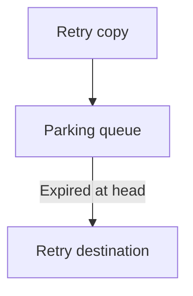

# One queue per retry step keeps short RabbitMQ retries from waiting behind long ones

*By trungbk.*

A retry due in 25 s can hold up one due in 1 s if both share a parking queue. Under RabbitMQ's head-of-queue expiration model, the short-delay copy behind the long-delay copy is not eligible for dead-lettering until the head can expire.

F1 gives each [retry step](/learn/glossary#retry-tier) its own [parking queue](/learn/glossary#parking-queue) to avoid that cross-step head-of-line blocking. Copies on the same step normally carry the same delay, so an earlier copy does not have a later expiration than the copies behind it.

Expiration makes a copy eligible to leave the parking queue; it does not promise when dead-letter routing completes or when a consumer runs the handler. The delay is a minimum wait, not an end-to-end completion bound.

The timeline compares copies A and B parked at the same moment with illustrative delays of 25 s and 1 s. It shows expiration eligibility, not measured delivery times.

<svg viewBox="0 0 640 232" role="img" aria-label="Illustrative expiration eligibility: in a shared queue B waits behind A until 25 s. With separate retry-step queues B is eligible at 1 s and A at 25 s. Actual dead-letter routing and consumption can finish later.">
<text class="f1-timeline__section" x="10" y="22">One queue shared by every step</text>
<text class="f1-timeline__row" x="10" y="51">A, due 25 s</text>
<rect class="f1-timeline__due" x="150" y="36" width="350" height="22" rx="4" />
<text class="f1-timeline__in" x="158" y="51">eligible at 25 s</text>
<text class="f1-timeline__row" x="10" y="79">B, due 1 s</text>
<rect class="f1-timeline__due" x="150" y="64" width="14" height="22" rx="4" />
<rect class="f1-timeline__late" x="164" y="64" width="336" height="22" rx="4" />
<text class="f1-timeline__in" x="172" y="79">behind A until 25 s, past its 1 s expiry</text>
<text class="f1-timeline__section" x="10" y="122">One queue per retry step</text>
<text class="f1-timeline__row" x="10" y="151">A, due 25 s</text>
<rect class="f1-timeline__due" x="150" y="136" width="350" height="22" rx="4" />
<text class="f1-timeline__in" x="158" y="151">separate queue, eligible at 25 s</text>
<text class="f1-timeline__row" x="10" y="179">B, due 1 s</text>
<rect class="f1-timeline__due" x="150" y="164" width="14" height="22" rx="4" />
<text class="f1-timeline__out" x="172" y="179">separate queue, eligible at 1 s</text>
<line class="f1-timeline__axis" x1="150" y1="200" x2="598" y2="200" />
<line class="f1-timeline__axis" x1="150" y1="197" x2="150" y2="203" />
<text class="f1-timeline__tick" x="150" y="220" text-anchor="middle">0 s</text>
<line class="f1-timeline__axis" x1="262" y1="197" x2="262" y2="203" />
<text class="f1-timeline__tick" x="262" y="220" text-anchor="middle">8 s</text>
<line class="f1-timeline__axis" x1="374" y1="197" x2="374" y2="203" />
<text class="f1-timeline__tick" x="374" y="220" text-anchor="middle">16 s</text>
<line class="f1-timeline__axis" x1="486" y1="197" x2="486" y2="203" />
<text class="f1-timeline__tick" x="486" y="220" text-anchor="middle">24 s</text>
<line class="f1-timeline__axis" x1="598" y1="197" x2="598" y2="203" />
<text class="f1-timeline__tick" x="598" y="220" text-anchor="middle">32 s</text>
</svg>

waiting until due waiting past due

## Background

A parking queue dead-letters expired copies to the retry destination, not the original topic queue. The extra queue lets the broker hold the copy without tying up a handler or keeping the original delivery unacked for the entire delay.

The [RabbitMQ driver reference](/drivers/rabbitmq#delayed-and-retried-messages-need-per-destination-parking-queues) owns provisioning policy, durability, expiration rounding, limits, and queue settings. The executable owners are [topology construction](https://fgit.zapps.vn/zatf2026-be-t3/event-driven-messaging-sdk/-/blob/main/drivers/rabbitmq/topology.go) and [publish routing](https://fgit.zapps.vn/zatf2026-be-t3/event-driven-messaging-sdk/-/blob/main/drivers/rabbitmq/producer.go).

## One retry, step by step

1. The handler returns a retryable error. F1 picks the retry step for this attempt and records the copy's due time: the moment it builds the copy plus that step's delay.
2. It publishes the copy to the step's retry destination, for example `f1.<env>.orders.<subscription>.high.retry.2`. The source delivery is acked only after the copy is confirmed.
3. The driver routes every message for that destination to `<destination>.park` and sets the step's delay as the message's expiration.
4. Once expired and at the queue head, the copy is eligible for dead-letter routing to the retry destination. Routing and later consumption are separate steps and can take longer.

The delay stays on each message rather than in the queue's name or TTL arguments. This lets a policy change reuse the queue instead of requiring new broker topology. The trade-off appears when the delay decreases: a new short-delay copy can sit behind an older long-delay copy in that step's queue. Rolling deployments can produce the same mixture.

## Dead-letter safety

Confirming the copy in the parking queue protects the first publish, not the later dead-letter transfer. F1 can already have acked the original when that transfer happens, so loss on the parking-to-destination route would lose the retry.

Quorum parking queues use at-least-once dead-lettering with reject-publish overflow because the dead-letter strategy depends on that overflow mode. A dead-letter route alone is not enough. Classic parking queues cannot provide that mode, leaving the transfer at-most-once even when the initial publish was confirmed. Queue type therefore changes the failure boundary, not just the storage choice; the driver reference holds the exact declaration settings.

## Limits and trade-offs

- Separating retry steps avoids cross-step head-of-line blocking at the cost of an extra queue per delayed destination.
- Reusing a queue across delay changes avoids topology churn but permits mixed-delay head-of-line blocking within that step.
- Expiration supplies no maximum for dead-letter transfer, consumer pickup, or handler completion.

## Go further

- [RabbitMQ driver](/drivers/rabbitmq#delayed-and-retried-messages-need-per-destination-parking-queues) - topology, durability, expiration rounding, and settings.
- [Failure handling](/advanced-topics/failure-handling) - retry delays and dead-letter policy.
- [Consume flow](/development/consume-flow) - where retry copies are created and acked.
- [Kafka retry delays](/deep-dives/kafka-retry-delays) - the same retry steps on a broker with no parking queue.
- [Source-reading guide](/development/source-reading-guide) - the maintainer route through the implementation.
