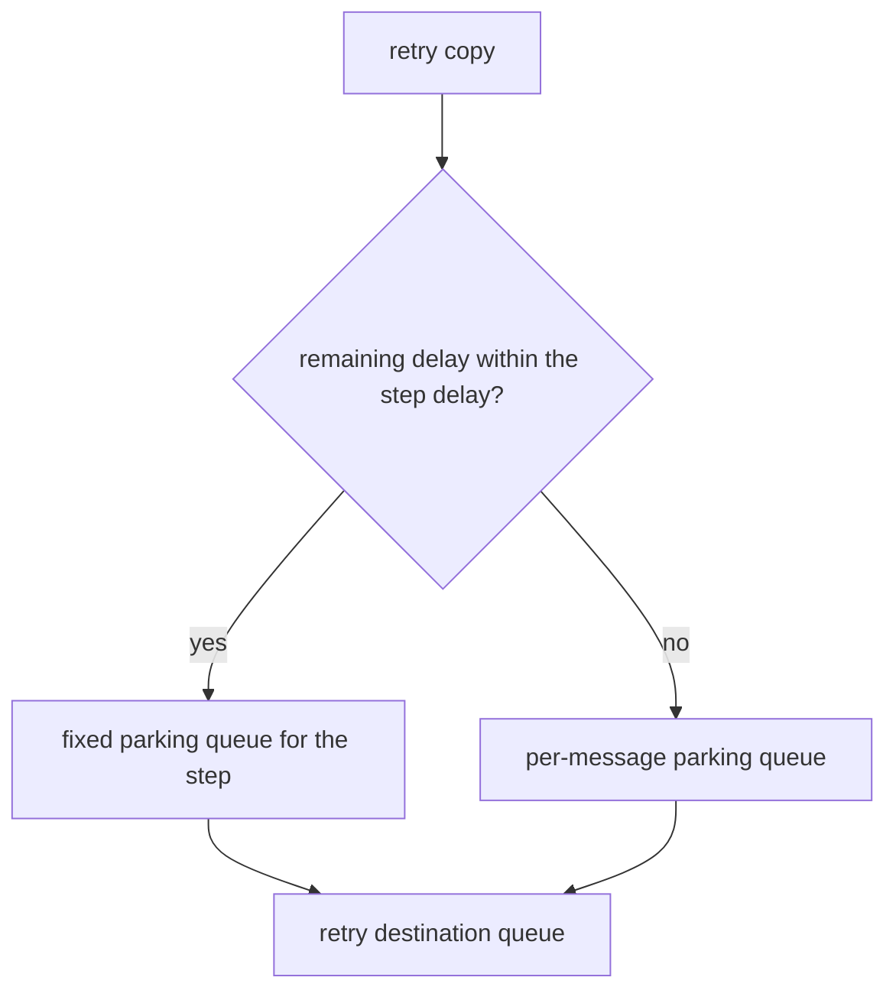

# One queue per retry step keeps short RabbitMQ retries from waiting behind long ones

*By trungbk.*

I park a retry due in 25 s and, a moment later, one due in 1 s. If both sat in one queue with a different expiry on each message, the 1 s retry would wait the full 25 s, because RabbitMQ only expires the message at the head of a queue.

RabbitMQ has no built-in delayed delivery, so F1 parks a retry copy in an ordinary queue until it is due, and I give each [retry step](/learn/glossary#retry-tier) its own [parking queue](/learn/glossary#parking-queue) whose queue-level TTL is that step's delay. With the default steps of 1 s, 5 s and 25 s, each subscription, topic, and priority gets three such queues, one per step, and each step also has a fallback queue that uses a per-message expiry.

Every copy in a step's queue waits the same time, so RabbitMQ expires them in the order they arrived. A copy is released once its delay has passed and never waits behind a copy due later. The delay sets the earliest release time, not an exact one.

The timeline shows two retry copies parked at the same moment: A on the 25 s step and B on the 1 s step.

<svg viewBox="0 0 640 232" role="img" aria-label="Two copies parked at 0 s. In one shared queue, B, due at 1 s, leaves with A at 25 s. With one queue per retry step, B leaves at 1 s and A at 25 s.">
<text class="f1-timeline__section" x="10" y="22">One shared per-message TTL queue</text>
<text class="f1-timeline__row" x="10" y="51">A, due 25 s</text>
<rect class="f1-timeline__due" x="150" y="36" width="350" height="22" rx="4" />
<text class="f1-timeline__in" x="158" y="51">waits, leaves at 25 s</text>
<text class="f1-timeline__row" x="10" y="79">B, due 1 s</text>
<rect class="f1-timeline__due" x="150" y="64" width="14" height="22" rx="4" />
<rect class="f1-timeline__late" x="164" y="64" width="336" height="22" rx="4" />
<text class="f1-timeline__in" x="172" y="79">stuck behind A, leaves at 25 s, 24 s late</text>
<text class="f1-timeline__section" x="10" y="122">One queue per retry step</text>
<text class="f1-timeline__row" x="10" y="151">A, due 25 s</text>
<rect class="f1-timeline__due" x="150" y="136" width="350" height="22" rx="4" />
<text class="f1-timeline__in" x="158" y="151">park.fixed-25000ms, leaves at 25 s, not held back</text>
<text class="f1-timeline__row" x="10" y="179">B, due 1 s</text>
<rect class="f1-timeline__due" x="150" y="164" width="14" height="22" rx="4" />
<text class="f1-timeline__out" x="172" y="179">park.fixed-1000ms, leaves at 1 s, not held back</text>
<line class="f1-timeline__axis" x1="150" y1="200" x2="598" y2="200" />
<line class="f1-timeline__axis" x1="150" y1="197" x2="150" y2="203" />
<text class="f1-timeline__tick" x="150" y="220" text-anchor="middle">0 s</text>
<line class="f1-timeline__axis" x1="262" y1="197" x2="262" y2="203" />
<text class="f1-timeline__tick" x="262" y="220" text-anchor="middle">8 s</text>
<line class="f1-timeline__axis" x1="374" y1="197" x2="374" y2="203" />
<text class="f1-timeline__tick" x="374" y="220" text-anchor="middle">16 s</text>
<line class="f1-timeline__axis" x1="486" y1="197" x2="486" y2="203" />
<text class="f1-timeline__tick" x="486" y="220" text-anchor="middle">24 s</text>
<line class="f1-timeline__axis" x1="598" y1="197" x2="598" y2="203" />
<text class="f1-timeline__tick" x="598" y="220" text-anchor="middle">32 s</text>
</svg>

waiting until due waiting past due

## Background

A parking queue has a queue-level TTL and a dead-letter route to its destination, here the retry step's own queue, not the original topic's queue. When the TTL expires, RabbitMQ dead-letters the copy to its default exchange, which delivers a message to the queue whose name equals the routing key; F1 sets that key to the retry step's queue name.

F1 declares every retry step as a fixed-delay destination: a destination where every message waits the same delay, the step's delay from the retry policy, counted from when it is published. The driver can therefore park all of the step's messages in one queue.

Every publish is mandatory and uses publisher confirms. An unroutable copy comes back as a return before the confirmation, so a missing parking queue is an explicit publish error rather than a silent drop.

## One retry, step by step

1. The handler returns a retryable error. F1 picks the retry step for this attempt, or for a `RetryAfter` the step whose delay is closest to the requested one, which can be shorter than asked. It sets the due time to the moment it builds the copy plus that step's delay.
2. It publishes the copy to the step's retry destination, for example `f1.<env>.orders.<subscription>.high.retry.2`, with that due time. The source delivery is acked only after the copy is confirmed.
3. The driver compares the remaining delay with the step's delay. Within it, the copy goes to `<destination>.park.fixed-<delay>ms` and carries no per-message expiration.
4. The queue's TTL expires, RabbitMQ dead-letters the copy to the retry destination, and the runner consumes it through the step's retry lane.

The copy is published a few milliseconds after its due time is set, so by then its remaining delay is slightly less than the step's delay, and it always fits the step's queue. F1's retry path never sends a copy to the per-message queue; that queue is only a safety net for a due time longer than the step's delay.

Each retry step declares two parking queues:

| Queue | Expiry behavior | Used for |
| --- | --- | --- |
| `<destination>.park.fixed-<delay>ms` | queue-level TTL equal to the step's delay | every retry copy on that step |
| `<destination>.park` | per-message TTL | a remaining delay longer than the step's delay |

The delay is written into the fixed queue's name in whole milliseconds, so changing a step's delay declares a new queue rather than conflicting with the old queue's TTL.

## Delays that are not retry steps

The driver also accepts a message that carries its own due time. F1's retries and publish API never produce one; the driver port offers it, and the driver conformance suite tests it. The driver parks such a message in one of eight queues with fixed TTLs from 500 ms to 64 s, rounding the remaining delay up so the message is never released early, and uses the per-message `<destination>.park` queue for anything over 64 s, where head-of-line delay can return.

Rounding up costs lateness: a 5 s delay waits in the 8 s queue. Two messages parked at different moments can also leave out of due-time order, because each one is rounded from its own remaining delay. A retry step pays neither cost, since its queue's TTL is exactly its delay.

## What the driver reports

`Client.Limits()` reports how late such delays can be, counting only the rounding to a fixed delay; publish time and the time until a runner picks the message up come on top: a delay below 500 ms can be late by up to 500 ms, a delay up to 64 s can be late by as much as the requested delay, and a delay above 64 s has no limit on lateness. These limits cover every delayed destination. A retry step's own fixed queue is late only by the time its publish took, well inside them.

## Dead-letter safety

Quorum parking queues are declared with four arguments that work together: `x-dead-letter-exchange` set to the default exchange, `x-dead-letter-routing-key` set to the destination, `x-dead-letter-strategy=at-least-once`, and `x-overflow=reject-publish`. RabbitMQ honours at-least-once dead-lettering only when the overflow mode is `reject-publish`; without it, or without the strategy, the broker quietly falls back to at-most-once and a parked retry can be lost with no error.

Classic queues cannot provide that at-least-once dead-lettering mode, so their delay path remains at-most-once. The queue type is therefore a delivery guarantee, not only a storage preference.

Topology policy decides who creates the parking queues. `TopologyDeclare` creates them, `TopologyVerify` requires matching queues, and `TopologyNone` leaves provisioning to the operator.

## Limits and trade-offs

- A retry step needs two parking queues: its fixed queue and the per-message fallback.
- Changing a step's delay declares a new fixed queue; the old one keeps draining into the destination.
- A delay that is not a retry step uses eight fixed-TTL queues plus the queue above 64 s, can be late, and can leave out of due-time order.
- On the per-message queue, a message can wait behind another message due later.
- Classic queues make the delay path at-most-once because their dead-lettering mode cannot be upgraded to at-least-once.

## Go further

- [Drivers and capabilities](/drivers-and-capabilities) - parking queues, topology policy, and provider limits.
- [Failure handling](/advanced-topics/failure-handling) - retry delays and dead-letter policy.
- [Life of a delivery](/deep-dives/life-of-a-delivery) - where retry copies are created and acked.
- [Source-reading guide](/development/source-reading-guide) - the maintainer route through the implementation.
