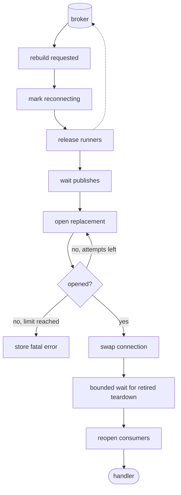
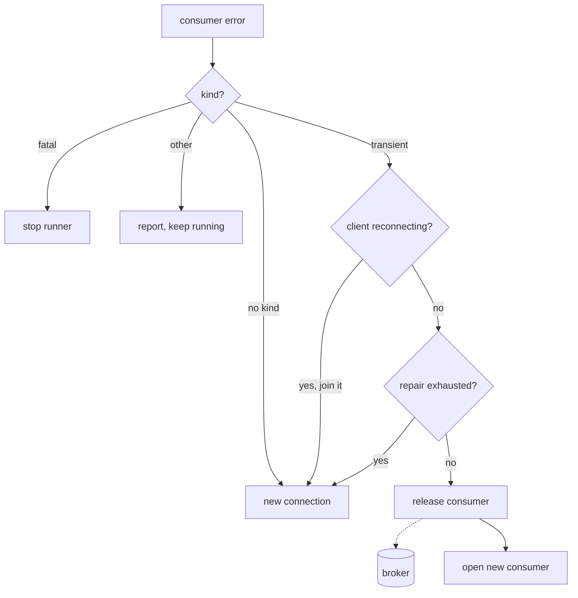

# Reconnecting without mixing up connections

*By trungbk.*

An F1 client keeps one connection to the broker, and every publish and every subscription's consumer runs on it. A publish is using connection 1 when that connection fails, while a subscription still holds a message it received on that same connection. F1 must replace the connection without letting old work, a publish or a consumer started on connection 1, carry on as if it were on connection 2.

## Background

F1 stores the live connection together with a
[connection number](/learn/glossary#connection-epoch) that changes on replacement.
Installing the connection and its number in one locked step prevents work from
seeing a new connection with an old number. The same swap updates the broker's
features and limits and retires the old shared producer.

A transient consumer error can request repair of that consumer; an
unclassified error requests connection replacement. A fatal consumer error
ends the runner. Other classified errors can be reported without recovery:
not every error says the transport is broken.

A publish is stricter: only a transient error counts as evidence of a bad connection, because one bad message should not tear down the connection for everyone. In a batch where some messages failed, at least one failed message must itself be transient; a transient label on the batch as a whole is only a hint to the caller that trying the batch again may work.

## The replacement path

I think of reconnect as a gate around two kinds of work: publishes already running must finish, while consumers must give their messages back to the broker.

The first request marks the client as reconnecting before it reaches the reconnect supervisor, the one goroutine that replaces connections. While that mark is set, new publishes and new consumers are refused before they start. A second request about the same connection does not start a second attempt. If the connection was already replaced while a request waited, the supervisor drops the request, because the change it asked for has already happened.

The supervisor first releases every runner's current consumer. Each running runner switches to reconnecting, stops its fetch and dispatch goroutines, and releases its consumer. Releasing closes the consumer, and the broker takes back every message it had not seen acked, including one whose handler or ack is still running, so that message can be delivered again.

A failed release must not strand the other runners halfway through recovery.
F1 logs it and keeps that consumer for another release attempt when retiring
the old connection. That connection closes only after its producer and retained
consumers finish successfully. This is recovering the transport, not retrying a
handler or dead-lettering a message.

After releasing the runners, F1 waits until no publish is running. It does not cancel a publish that already started. That order lets a running publish return its own result before the old producer is closed, and it keeps anyone from building a new producer on a connection that is about to be replaced.

## Connection numbers reject stale work

Work that uses the connection records the connection number it started with. A publish records number 1 when it is let in. The shared producer checks that number again when it is built or picked. If the swap has moved the client to number 2, the old publish is refused instead of using a producer from the old connection.

Opening a consumer follows the same rule. A runner opens a consumer and learns the connection number it opened on. Before the consumer is accepted, F1 compares that number with the current one under one lock. If the swap won the race, F1 releases the consumer it just opened and opens again on the new connection. The subscription and the runner stay the same; only the runner's current consumer changes.

Waiters do not wait for a particular reconnect attempt by name. They record a connection number and a wake-up channel together. The channel is closed when an attempt installs a new connection, when an attempt fails for good, or when the supervisor exits. After waking, the waiter reads the state again: a new number means it can reopen, a stored failure returns the reconnect error, and a closing client tells a runner to stop.

## A publish and consume race

This table shows one possible order of events. The publish error, the consumer error, and the supervisor can happen in another order; the connection-number checks give the same safety either way.

| Step | Publish path | Consume path | Client state |
| ---: | --- | --- | --- |
| 1 | `PublishBatch` is let in and records number 1. | A consumer on connection 1 holds one message that is not yet acked. | Connection 1, live |
| 2 | The producer call is still running when the connection drops. | The consumer's error stream reports a transient loss. | Connection 1, live |
| 3 | The producer returns an error and asks to reconnect connection 1. | The supervisor marks the runner reconnecting, stops it, and releases its consumer. | Connection 1, reconnecting |
| 4 | The publish returns its own error; F1 does not resend it. | The released message can be delivered again by the broker; the runner waits for the new connection. | Connection 1, attempt running |
| 5 | Reconnect waits until no publish is running. | A consumer open begun earlier can return on connection 1 now; the reconnect gate refuses it. If it returns after the swap, the connection-number check rejects it as stale. | Connection 1, attempt running |
| 6 | The replacement opens and its queues and topics are declared. | Waiters stay on the old wake-up channel until the swap. | Connection 1, attempt running |
| 7 | After the bounded retirement wait ends, new publishes record number 2 and build a new shared producer. | The waiter sees the new number and reopens when the client is live. | Connection 2 |
| 8 | The caller decides whether the failed publish should be sent again. | The broker may deliver the released message to the new consumer. | Connection 2, live |

Retirement uses a detached context and one sequential producer-close,
retained-consumer-release, connection-close attempt, stopping at the first error.
Reconnect bounds its wait for the whole attempt by `Lifecycle.CloseTimeout`; a
timeout lets recovery continue without abandoning ownership.

If `Close` starts during reconnect, it cancels and waits for the supervisor, then
finishes every retired teardown before current resources. Nil requires every
retired teardown to have succeeded. Running attempts are rejoined; failed
retirements get one new attempt per caller-issued `Close`, skipping successful
stages. Errors and timeouts retain unfinished ownership. There is no background
retry, timer, or backoff. Each retirement wait has its own
`Lifecycle.CloseTimeout` bound, subject to the caller context; total shutdown can
exceed one such bound.

The cleanup and replacement decisions are in
[`reconnect.go`](https://fgit.zapps.vn/zatf2026-be-t3/event-driven-messaging-sdk/-/blob/main/reconnect.go);
[`client.go`](https://fgit.zapps.vn/zatf2026-be-t3/event-driven-messaging-sdk/-/blob/main/client.go)
owns the shutdown wait.

## Who owns what

Publishers, runners, the supervisor, and `Close` all touch client state from
different goroutines. A mutex protects their shared view, but a lock alone does
not make reconnect correct when broker work runs outside it.

A runner reads connection 1 under the lock, releases it, and starts opening a consumer on the broker. While that open is in flight, the supervisor installs connection 2. When the open returns, the runner checks the number again under the lock, sees it is stale, and releases the new consumer instead of using it. What keeps the state consistent is deciding who may change each part, and checking the number whenever work comes back from the broker.

Only the supervisor replaces the connection. A publisher or runner requests
recovery with the connection number it observed rather than opening a
replacement itself. This makes simultaneous failure reports converge on one
attempt and lets requests for an already replaced connection be discarded.

Broker calls run outside the lock. Otherwise a stalled open or close would
prevent even checking whether new work is allowed. The cost is a second check
after the call: a producer or consumer built on a stale connection must be
discarded, not installed. Catching stale results is simpler than preventing
every possible overlap with the swap.

Waiters capture their connection number and wake-up channel under the same
lock. Closing that channel wakes all waiters; reading state again tells them
whether to reopen, fail, or stop. A wake-up is not itself permission to use the
connection. [Publish flow](/development/publish-flow) and
[Consume flow](/development/consume-flow) map the executable gates.

The runner takes another route to the same goal: one goroutine serializes its
lifecycle decisions and the rest report events
([one owner per runner](/deep-dives/runner-owner-loop)).

## Repair the consumer before the connection

Not every consumer error means the connection is bad. RabbitMQ can close the channel under one consumer while the connection and every other channel keep working. Replacing the whole connection for that would release every subscription's consumer and hold up every publish. So a runner first tries the smaller fix: it releases only its own consumer and opens a new one on the same connection. The connection number does not change, and no other runner notices.

Only an error the driver marks transient is repaired this way. An error with no kind goes straight to a connection replacement, because nothing says the connection is fine. If the client is already reconnecting, the runner waits for that instead of repairing on a connection about to go away. Errors such as a missing queue or a refused permission are reported and the consumer keeps running.

A consumer that keeps failing before finishing a message gives little evidence
that the smaller repair works. Repeated failed replacements therefore escalate
to a connection rebuild. Finishing a message without a retry or dead-letter
copy resets that repair streak; publishing a copy alone does not establish that
the consumer can finish ordinary work.

If releasing the old consumer fails, the runner also escalates rather than
opening more consumers on a suspect connection. These transport repairs are
separate from the attempt limit for handler failures.

## Limits and trade-offs

`broker.maxReconnectAttempts` bounds connection-open attempts when positive;
zero allows recovery to keep trying until cancellation or shutdown. Jittered
backoff avoids synchronized reconnects across clients. The retry schedule and
classification of open or topology failures belong to the
[reconnect source](https://fgit.zapps.vn/zatf2026-be-t3/event-driven-messaging-sdk/-/blob/main/reconnect.go),
not the handler retry policy.

F1 does not resend an application publish after a connection error. The broker may have accepted the message before the error showed up, so a resend could duplicate it. The caller decides whether to send again and should set an [idempotency key](/learn/glossary#idempotency-key) with `WithIdempotencyKey` and check it in the handler, or use another way to make a duplicate harmless.

A consumer that fails intermittently but finishes messages between failures
can keep using local repair instead of disrupting every subscription. That
trade-off relies on visible repair failures, not a claim that the transport
is permanently healthy.

A connection loss can return a message to the broker while its handler is
still running. The broker may deliver it again before the first effect ends.
It can also leave a failed publish uncertain. Applications still need
idempotent effects and a decision about whether an uncertain publish is safe
to repeat.

## Go further

- [Publish flow](/development/publish-flow) - how a publish is let in, waited for, and reported when uncertain.
- [Consume flow](/development/consume-flow) - a runner's consumers, message ownership, and repair.
- [Message](/basics/message#delivery-identity-and-redelivery) - what redelivery means for handler effects.
- [Lifecycle and shutdown](/advanced-topics/lifecycle-and-shutdown) - close and drain limits.
- [Source-reading guide](/development/source-reading-guide#code-behind-the-deep-dives) - where this lives in the code.
