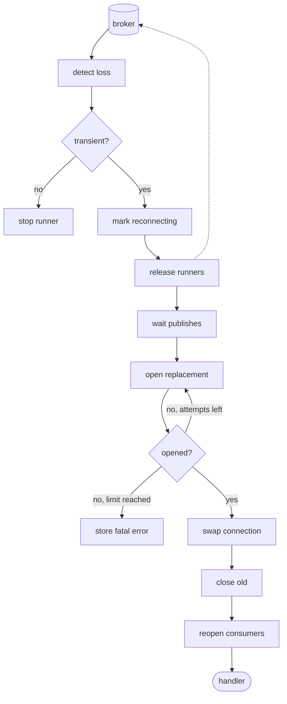

# Reconnecting without mixing up connections

*By trungbk.*

An F1 client keeps one connection to the broker, and every publish and every subscription's consumer runs on it. A publish is using connection 1 when that connection fails, while a subscription still holds a message it received on that same connection. F1 must replace the connection without letting old work, a publish or a consumer started on connection 1, carry on as if it were on connection 2.

## Background

F1 stores the live connection together with a [connection number](/learn/glossary#connection-epoch), a counter that only goes up, once per replacement, so work can tell whether the connection it started on is still the current one. The first connection is number 1. A replacement is installed with the next number, in the same locked step as its features and limits (what the new broker supports, such as message size), and the old producer is dropped; the next publish builds a new one. The connection and its number always change together: nobody can see a new connection with an old number.

Every driver error carries a kind: transient (worth trying again, such as a dropped connection), fatal (will not get better), or no kind at all. A reconnect request comes from a publish or a consumer that hit a transient error, or a consumer error with no kind. A consumer error marked fatal stops that runner instead of asking for a new connection.

A publish is stricter: only a transient error counts as evidence of a bad connection, because one bad message should not tear down the connection for everyone. In a batch where some messages failed, at least one failed message must itself be transient; a transient label on the batch as a whole is only a hint to the caller that trying the batch again may work.

## The replacement path

I think of reconnect as a gate around two kinds of work: publishes already running must finish, while consumers must give their messages back to the broker.

The first request marks the client as reconnecting before it reaches the reconnect supervisor, the one goroutine that replaces connections. While that mark is set, new publishes and new consumers are refused before they start. A second request about the same connection does not start a second attempt. If the connection was already replaced while a request waited, the supervisor drops the request, because the change it asked for has already happened.

The supervisor first releases every runner's current consumer. A runner is the loop that runs one subscription. Each running runner switches to reconnecting, stops its fetch and dispatch goroutines, and releases its consumer. Releasing closes the consumer, and the broker takes back every message it had not seen acked, including one whose handler or ack is still running, so that message can be delivered again.

A release that fails is logged and does not stop the other runners from being released; that consumer goes away when the old connection is closed, which returns its messages the same way. This is recovering the connection, not retrying a handler or dead-lettering a message.

After releasing the runners, F1 waits until no publish is running. It does not cancel a publish that already started. That order lets a running publish return its own result before the old producer is closed, and it keeps anyone from building a new producer on a connection that is about to be replaced.

## Connection numbers reject stale work

Work that uses the connection records the connection number it started with. A publish records number 1 when it is let in. The shared producer checks that number again when it is built or picked. If the swap has moved the client to number 2, the old publish is refused instead of using a producer from the old connection.

Opening a consumer follows the same rule. A runner opens a consumer and learns the connection number it opened on. Before the consumer is accepted, F1 compares that number with the current one under one lock. If the swap won the race, F1 releases the consumer it just opened and opens again on the new connection. The subscription and the runner stay the same; only the runner's current consumer changes.

Waiters do not wait for a particular reconnect attempt by name. They record a connection number and a wake-up channel together. The channel is closed when an attempt installs a new connection, when an attempt fails for good, or when the supervisor exits. After waking, the waiter reads the state again: a new number means it can reopen, a stored failure returns the reconnect error, and a closing client tells a runner to stop.

## A publish and consume race

This table shows one possible order of events. The publish error, the consumer error, and the supervisor can happen in another order; the connection-number checks give the same safety either way.

| Step | Publish path | Consume path | Client state |
| ---: | --- | --- | --- |
| 1 | `PublishBatch` is let in and records number 1. | A consumer on connection 1 holds one message that is not yet acked. | Connection 1, live |
| 2 | The producer call is still running when the connection drops. | The consumer's error stream reports a transient loss. | Connection 1, live |
| 3 | The producer returns an error and asks to reconnect connection 1. | The supervisor marks the runner reconnecting, stops it, and releases its consumer. | Connection 1, reconnecting |
| 4 | The publish returns its own error; F1 does not resend it. | The released message can be delivered again by the broker; the runner waits for the new connection. | Connection 1, attempt running |
| 5 | Reconnect waits until no publish is running. | A runner that started opening a consumer before step 1 can get it back now, on connection 1; the number check in the previous section refuses it. | Connection 1, attempt running |
| 6 | The replacement opens and its queues and topics are declared. | Waiters stay on the old wake-up channel until the swap. | Connection 1, attempt running |
| 7 | New publishes record number 2 and build a new shared producer. | The waiter sees the new number and reopens its consumer on connection 2. | Connection 2 |
| 8 | The caller decides whether the failed publish should be sent again. | The broker may deliver the released message to the new consumer. | Connection 2, live |

The old producer is closed after the swap, then the old connection. Close errors are logged and do not undo the replacement. The cleanup runs on a detached context, so canceling the reconnect does not stop it. Each close is bounded by `Lifecycle.CloseTimeout`, because the client reads as reconnecting until the cleanup returns. A close that times out is logged, and the reconnect finishes without waiting for it.

If `Close` starts while a reconnect is running, it cancels the reconnect and then waits up to `Lifecycle.CloseTimeout` for it to stop before it closes the current connection. The old connection's cleanup therefore finishes before `Close` returns, unless that wait times out.

## Who owns what

Publishers, runners, the supervisor, and `Close` all run on their own goroutines and all touch the client's state. One mutex guards the client's state, and nothing reads it without the lock. The lock alone does not make reconnect correct.

A runner reads connection 1 under the lock, releases it, and starts opening a consumer on the broker. While that open is in flight, the supervisor installs connection 2. When the open returns, the runner checks the number again under the lock, sees it is stale, and releases the new consumer instead of using it. What keeps the state consistent is deciding who may change each part, and checking the number whenever work comes back from the broker.

| State | Changed by | How a stale read is caught |
| --- | --- | --- |
| The current connection and its number, the broker's features and limits | Only the supervisor, in the swap. Creating the client sets the first connection. | The number changes in the same locked step, so work that recorded the old number is refused. |
| The stored reconnect failure | Only the supervisor: set when attempts run out, cleared by a swap. | Every new piece of work sees it and is refused. |
| The reconnecting mark | The first caller that asks for a reconnect sets it. The end of the attempt clears it. | A second request while it is set is dropped, so one loss starts one attempt. |
| The wake-up channel and the attempt's result | Whoever ends an attempt or makes a swap: it closes the channel and installs a new one in the same locked step. | A waiter records the channel together with the connection number and compares numbers after waking. |
| The shared producer | Any publisher builds one outside the lock; the first to install it under the lock wins. The swap and `Close` clear it. | The builder checks its recorded number again after building, and a losing or stale producer is closed, not used. |
| The count of running publishes | Each publish on start and finish. The last one to finish closes a "no publishes" channel. | The supervisor and `Close` wait on that channel instead of polling the count. |
| The "producer is closing" mark | `Close`, in the same locked step that sees zero publishes. | A retry or dead-letter copy that arrives later is refused. |
| Open or closing | Only `Close`. | Every new piece of work checks it. |
| The list of runners | `Subscribe` adds a runner. | The supervisor and `Close` copy the list under the lock, then work on the copy without it. |

Five rules follow from the table:

- **One goroutine replaces the connection.** A caller that sees a transient failure does not repair the connection. It sends a request with its connection number on a channel, and the supervisor is the only code that opens, swaps, and closes connections.
- **No broker calls under the lock.** Opening a connection, building a producer, and closing either one happen with the lock released, so a slow broker never blocks new work from being checked.
- **Check again after the call.** Because the lock was released, the state may have moved. The caller takes the lock again and compares the connection number it recorded before the call. If the number moved, the result is thrown away.
- **Catch stale work instead of preventing it.** The number does not stop old work from running. It makes old work fail its next check, which is simpler than proving that no order of events can reach the old connection.
- **Wake by closing a channel.** A closed channel wakes every waiter at once and cannot lose a wake-up. It is replaced in the same locked step, so a waiter that arrives later waits on the next one.

In Go terms, the bug is a check-then-act race: a decision made under the lock and acted on after it is released. The supervisor is the single-owner pattern, from the proverb "don't communicate by sharing memory; share memory by communicating". The connection number is a generation counter, called a fencing token in distributed systems.

When you add state to the client, place it in this table first: name who changes it, and if a caller reads it, releases the lock, and then acts, give that caller a connection number to check. The runner takes the other route to the same goal: one goroutine owns all of its state, and the rest send it events ([one owner per runner](/deep-dives/runner-owner-loop)).

## Limits and trade-offs

A positive `broker.maxReconnectAttempts` limits how many times F1 tries to open a connection, counting the first try. When the attempts run out, F1 stores a fatal reconnect error and the client has no connection. Zero means no limit on attempts, although context cancellation and shutdown still end the loop. Before each attempt F1 waits a random time between zero and a ceiling that starts at 500 milliseconds, doubles each attempt, and stops growing at 30 seconds. These values are about repairing the connection, not about handler retries.

F1 does not resend an application publish after a connection error. The broker may have accepted the message before the error showed up, so a resend could duplicate it. The caller decides whether to send again and should set an [idempotency key](/learn/glossary#idempotency-key) with `WithIdempotencyKey` and check it in the handler, or use another way to make a duplicate harmless.

Replacing a consumer has its own limit: if two replacement consumers in a row fail before handling a single message, F1 stops replacing consumers and asks for a whole new connection. It is separate from `RetryConfig.MaxAttempts`, which limits handler retries. A message handled successfully resets that limit. Reconnect repairs the connection; the normal retry path repairs a handler failure.

A connection loss can deliver a message again and can leave a failed publish uncertain. At any moment a message is either held by F1 for handling or back with the broker, never both on purpose, but that is not exactly-once: the broker can take a message back while its handler is still running, and deliver it again. The application still has to handle duplicates and decide whether an uncertain publish is safe to repeat.

## Go further

- [Publish flow](/development/publish-flow) - how a publish is let in, waited for, and reported when uncertain.
- [Consume flow](/development/consume-flow) - a runner's consumers, message ownership, and repair.
- [Life of a delivery](/deep-dives/life-of-a-delivery) - what redelivery means for a handler.
- [Lifecycle and shutdown](/advanced-topics/lifecycle-and-shutdown) - close and drain limits.
- [Source-reading guide](/development/source-reading-guide#code-behind-the-deep-dives) - where this lives in the code.
