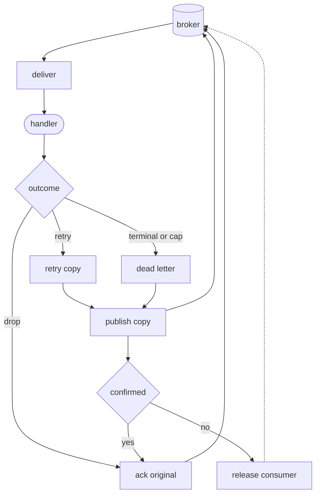

# A retry copy travels before the original is acked

*By trungbk.*

A handler returns an ordinary error while processing `orders.created` attempt 1. A broker requeue would bring the message straight back, with no delay and no record that this was attempt 1. So I do not requeue it: F1 builds a new message that carries the next attempt and a due time, waits for the broker to store that copy, and only then [acks](/learn/glossary#settlement) the message that called the handler.

## Background

A retry needs a new attempt number and a due time, not just another delivery of
the same broker message. A requeue alone cannot express that distinction.
[Failure handling](/advanced-topics/failure-handling) owns the public choices
between retry, terminal failure, and intentional drop, together with the
attempt-limit policy.

## Copy first, ack second

What matters is the order: publish the copy, then ack the source.

F1 carries the received body and message key into the copy without applying
`codec.maxBodyBytes`, the application-publish body limit, again. The broker has
already accepted those bytes once; rejecting them during recovery would create
a new loss path. The broker's own size limit still applies.

A confirmed copy is followed by an ack of the source. If the process stops
after confirmation but before the ack, the broker can redeliver the source
while the copy also exists. That is an intentional at-least-once duplicate, so
the handler still needs an idempotent effect. [Consume flow](/development/consume-flow)
places this boundary in the wider delivery lifecycle.

## One message through the retry steps

This illustrative policy allows four attempts with delays of 1 second,
5 seconds, and 25 seconds. The handler returns an ordinary retryable error
every time.

| Current attempt | Delay before the copy returns | Copy after confirmation | Original |
| ---: | --- | --- | --- |
| 1 | 1 s | Retry, attempt 2 | Ack |
| 2 | 5 s | Retry, attempt 3 | Ack |
| 3 | 25 s | Retry, attempt 4 | Ack |
| 4 | No retry remains | Dead letter, attempt 4 | Ack |

The current attempt chooses the retry step; the copy gets the next attempt
number. At attempt 3, the third delay therefore belongs to a copy labeled
attempt 4. Reaching the cap retains the last attempt in the dead-letter copy:
it does not invent another handler execution.

## When the copy cannot be stored

Publishing the copy uses the active context for
[finishing the message](/learn/glossary#settlement), including its short
republish attempts. On a healthy runner without an active runner window, that
is the delivery's live caller context. `Lifecycle.DrainTimeout` bounds the
drain window or a rescue window when that caller context has already ended;
it is not a blanket timeout for healthy retry and dead-letter publishes.

A temporarily unavailable destination is not a handler failure. If publishing
still fails, F1 reports the error, releases the consumer, and leaves the
original unacked for redelivery. Release is not a nack and does not create
another retry copy.

An intrinsically bad copy follows a different path. If the copy cannot be encoded, or the broker rejects it as too large, trying again cannot make that same copy acceptable. F1 moves into dead-letter handling instead of stopping the subscription.

If the dead-letter copy is intrinsically unpublishable too, F1 acks the original
and reports the deliberate drop after that ack succeeds. A poison message whose
dead-letter route is missing is contained the same way; this exception does not
apply to every missing route. The failed copy is visible to the observer, and
the drop reaches `WithErrorHandler` with the affected event and publish error,
or the client logger when no error handler is set.

The distinction is whether another delivery can change the outcome.
Temporary transport failure leaves the source available for another try;
an intrinsically unpublishable copy needs visible containment instead of an
endless redelivery loop. A corrupted attempt counter is also a poison case,
not an ordinary handler that has exhausted its attempts.

Destination derivation, poison detection, and the copy/drop decisions are in
[`worker.go`](https://fgit.zapps.vn/zatf2026-be-t3/event-driven-messaging-sdk/-/blob/main/worker.go).
Use [Failure handling](/advanced-topics/failure-handling) for public policy
and death reasons, and [Consume flow](/development/consume-flow) for the source
map rather than a second destination or reason inventory here.

## Limits and trade-offs

- The retry delay is the chosen step's delay, not a promise of exact delivery time. Broker and driver delay behavior still controls when the copy returns.
- A copy that temporarily fails to publish gives the original back to the broker; an original whose copy can never be published is deliberately acked after a visible drop.
- The dead-letter destination is derived from the consuming family, so a topic override is not silently confused with the event type.

## Go further

- [Failure handling](/advanced-topics/failure-handling) - public retry and dead-letter policy.
- [Consume flow](/development/consume-flow) - the whole path from delivery to ack and its executable owners.
- [RabbitMQ retry parking](/deep-dives/rabbitmq-delay-ladder) - how the RabbitMQ driver parks retry copies.
- [Source-reading guide](/development/source-reading-guide#code-behind-the-deep-dives) - where this lives in the code.
