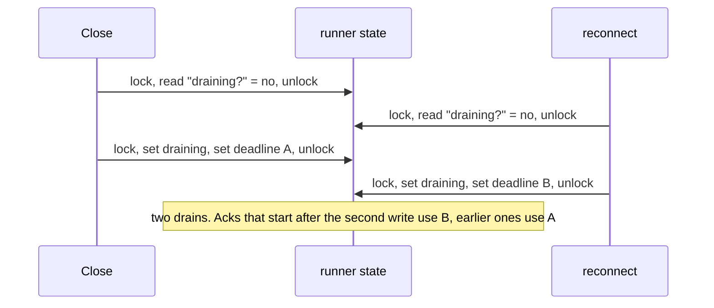
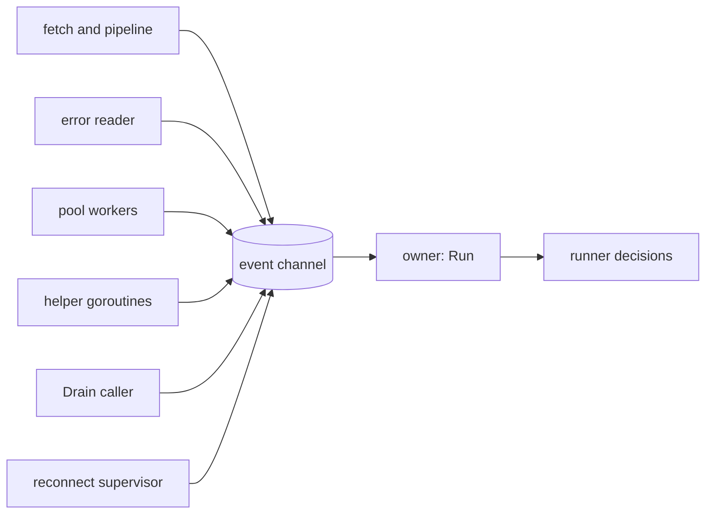

# One goroutine owns each runner

*By trungbk.*

`Close`, a reconnect, and the end of `Run` can all ask a runner to stop at the same moment, while pool workers are still acking messages. Which request starts the [drain](/learn/glossary#drain), and which deadline do those acks run on? I answer with Go's own rule, "Do not communicate by sharing memory; instead, share memory by communicating" ([Effective Go](https://go.dev/doc/effective_go#sharing)): the goroutine that called `Run` makes every decision about the runner, and every other goroutine reports to it with an event.

## Background: why a lock is not enough

A runner has fetch and dispatch goroutines, a consumer error reader, pool workers,
and callers such as `Drain` and the reconnect supervisor. They can discover a
failure or request a stop independently, but the deadline for finishing messages
must be one decision.

Suppose each goroutine writes shared fields under a mutex. The lock keeps each
read and write whole, but a decision takes a read and then a write, and another
goroutine can run in between:

Each step is safe on its own, and the result is still wrong. A larger critical
section could protect the whole decision, but it would still require every
caller to follow the same transition rules. A single owner puts that choice in
one place.

## The owner loop

The goroutine running `Run` reads an unbuffered event channel. The other
goroutines report facts through that mailbox rather than independently deciding
when to replace a consumer or start the drain.

An ended goroutine and a reported consumer error are different facts. A fetch or
pipeline failure does not by itself request connection recovery. On the
consumer error stream, a fatal error ends the runner; not-found, too-large, and
permission errors are reported without stopping the consumer. The error reader
keeps watching, so a later fatal error is not missed. Routine notifications do
not trigger recovery either.

A transient consumer error asks for repair on the same connection. An
unclassified error asks for connection replacement instead: there is no
classification supporting the smaller repair. Repeated replacement consumers
that fail before finishing a message also escalate to connection replacement.
The distinction is about the failed transport, not the handler's retry policy.

The executable decisions are in
[`worker.go`](https://fgit.zapps.vn/zatf2026-be-t3/event-driven-messaging-sdk/-/blob/main/worker.go);
[Consume flow](/development/consume-flow) maps the error reader and owner loop.

Handling an event records a fact and, at most, starts work: canceling the context the runner's goroutines run on, or a helper goroutine that reports back with another event. The owner never waits inside an event.

Because one goroutine reads the channel, events are handled one after another. The race above cannot happen: whichever stop request the owner reads first starts the drain, and the second one finds it already started.

One small piece of state stays outside the owner on purpose. A `Drain` caller moves the runner's lifecycle to draining and raises a "drain started" signal under the runner's lock before it sends its event, so a caller that asks for the state right away sees the drain. It does not start the drain: until the owner reads the event, an ack still runs on its own context. Starting it, the deadline, stopping the goroutines, and the result are the owner's.

## Three rules that keep it safe

**Report from a `defer`.** A goroutine sends its "finished" event from a deferred function and turns a panic into the event's error. The owner counts the goroutines still running, so one that died without reporting would leave it waiting forever; the `defer` makes that impossible.

**The owner never waits on the broker.** The only place it blocks is reading the event channel. Opening a consumer, waiting for a new connection, and releasing a consumer each run on a helper goroutine. This is not only about speed: the supervisor releases the runner's consumer before it replaces the connection, and an owner stuck inside a consumer open could never hear the event that ends that open.

**A sender never waits on a finished runner.** `Drain` and the supervisor send with a `select` on the runner's done channel, so a runner that has already ended lets them go instead of leaving them blocked.

## One drain, however many ask

`Close`, a reconnect, and the end of `Run` can all ask the runner to stop at the same moment. The drain can only run once: the first request the owner reads starts it, and every later request joins it: each `Drain` caller waits for the same runner to end and gets the same error, unless its own context ends first.

The owner installs the drain's deadline before canceling the runner's
goroutines. Otherwise a handler returning because of that cancellation could
start its ack before the drain's time limit existed. Installing the deadline
first lets those newly started calls use the same drain window. Calls already
in progress keep the context they started with.

## Compared with the client

The client solves the same problem differently, with one mutex, a [connection number](/learn/glossary#connection-epoch) that goes up each time the connection is replaced, and a supervisor that alone replaces the connection ([who owns what](/deep-dives/reconnect-and-generations#who-owns-what)). The two fit different shapes.

Client state is read by concurrent publishes, so a lock and connection-number
check fit that access pattern. The runner already has a natural owner in `Run`;
its mailbox serializes lifecycle decisions without giving every reporter a copy
of the transition rules.

Go does not prefer one tool everywhere. The Go wiki's [mutex or channel](https://go.dev/wiki/MutexOrChannel) guidance is to use whichever is simpler for the case: a mutex for state that many goroutines read often, a channel for handing over ownership or reporting events. The client and the runner follow that split.

## Limits and trade-offs

- Events are handled one at a time. Slow broker work belongs in helpers because doing it inside an event would delay every other decision.
- The channel is unbuffered, so a sender waits until the owner reads. Each handled ack reports through it; that is a serialization cost, not evidence of throughput. Measurements belong in [Benchmarks](/development/benchmarks).
- Messages themselves do not pass through the owner. They flow from the fetch goroutine through the [lanes](/learn/glossary#lane), F1's per-priority queues, to the pool directly; only facts about the runner's life go through the loop.
- Finishing a message normally uses its live caller context unless a runner window is active. `Lifecycle.DrainTimeout` bounds the drain or a rescue window when the caller's context has already ended; it is not a fresh timeout for every healthy ack.
- The owner removes races on the runner's own decisions, not on the broker's. Whether a message was acked is still decided by the broker call and its result.

## Go further

- [Reconnecting without mixing up connections](/deep-dives/reconnect-and-generations) - the client's lock-and-number approach.
- [Lifecycle and shutdown](/advanced-topics/lifecycle-and-shutdown) - what a drain promises to callers.
- [Consume flow](/development/consume-flow) - the maintainer trace of a runner from `Subscribe` to drain.
- [Source-reading guide](/development/source-reading-guide#code-behind-the-deep-dives) - where this lives in the code.
- [Effective Go: share by communicating](https://go.dev/doc/effective_go#sharing) - the Go rule this design follows.
- [Go wiki: mutex or channel](https://go.dev/wiki/MutexOrChannel) - when a lock is the simpler choice.
