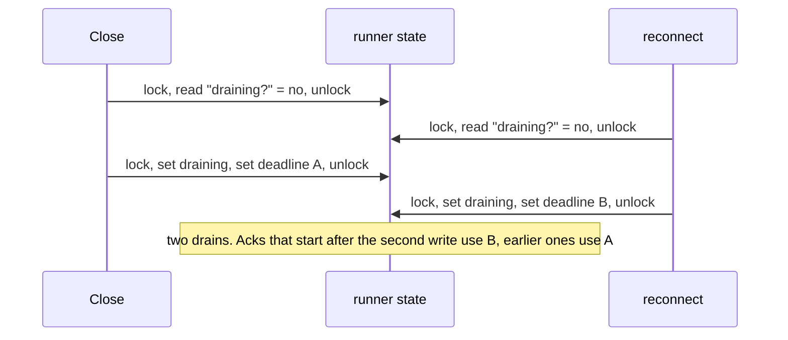
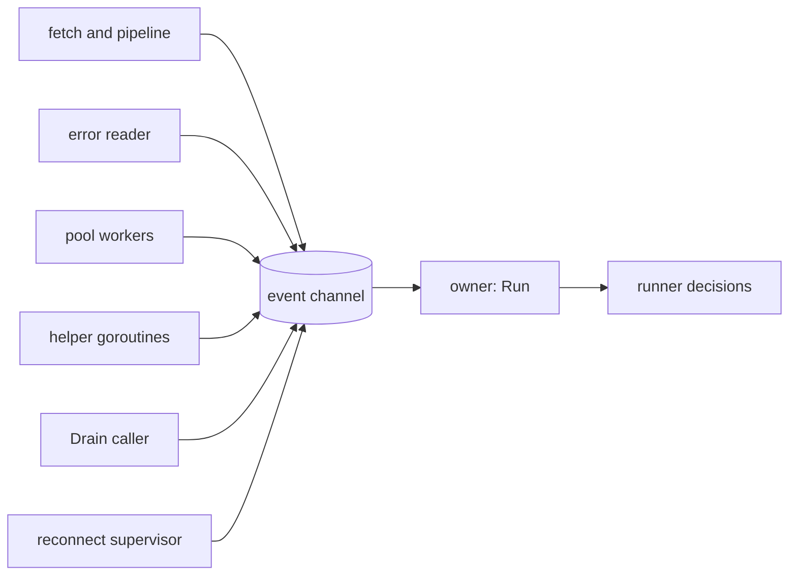

# One goroutine owns each runner

*By trungbk.*

`Close`, a reconnect, and the end of `Run` can all ask a runner to stop at the same moment, while pool workers are still acking messages. Which request starts the [drain](/learn/glossary#drain), and which deadline do those acks run on? I answer with Go's own rule, "Do not communicate by sharing memory; instead, share memory by communicating" ([Effective Go](https://go.dev/doc/effective_go#sharing)): the goroutine that called `Run` makes every decision about the runner, and every other goroutine reports to it with an event.

## Background: why a lock is not enough

A runner is many goroutines at once: one that fetches from the broker, a dispatch pipeline, one that reads the consumer's errors, the pool workers, and the handlers, plus callers from outside such as `Drain` and the reconnect supervisor. Each of them learns facts the runner must act on:

| Fact | Learned by |
| --- | --- |
| A drain has started, and the deadline for finishing messages | `Drain`, `Close`, a reconnect, the end of `Run` |
| The first error of the run | the fetch goroutine, the error reader, the pool workers |
| Why the consumer failed, and whether a new consumer could fix it | the error reader |
| Whether any message was handled successfully | the pool workers |
| Whether a reconnect released the consumer | the reconnect supervisor |

Suppose those facts were fields that each goroutine writes under a mutex. The lock keeps every single read and write whole, but a decision takes a read and then a write, and another goroutine can run in between:

Each step is safe on its own, and the result is still wrong. The usual repair is a rule such as "the first writer wins", and every later change has to be checked against every order in which the writers can arrive. With several facts and five kinds of writer, that check stops fitting in anyone's head.

## The owner loop

In `Run` I create one unbuffered event channel, and the goroutine running `Run` is the only one that reads it. I call that goroutine the owner. The other goroutines keep their shape, but instead of changing a shared fact they send an event, and the owner applies it.

| Event | Sent by | What the owner does |
| --- | --- | --- |
| a goroutine finished | the fetch goroutine, the dispatch pipeline, the error reader | counts it down and keeps the first error a goroutine ended with |
| a message was handled | a pool worker, after acking a handled message | marks the consumer healthy, which resets the count of failed repairs |
| a consumer error | the error reader | records the cause, and whether the driver called it transient, meaning a new consumer may fix it |
| an error | any of the runner's goroutines | keeps the first failure of the whole run; `Drain` returns it |
| a consumer opened, the connection was rebuilt, a consumer was released | helper goroutines | takes the result of a broker call the owner itself started |
| a reconnect released the consumer | the reconnect supervisor | records that the supervisor, not the owner, released the consumer because it is replacing the connection |
| drain requested, drain finished | `Runner.Drain`, the drain helper | starts the one drain, then takes its result |

A "finished" event carries the error that ended that one goroutine, and that error decides whether the current consumer has to be replaced. For example, when the consumer's delivery stream fails, the fetch goroutine ends and sends "finished" with that error; the owner then repairs the consumer or, for an error the driver does not call transient, ends the run and keeps the error as the one `Drain` returns. An "error" event is a failure of the run as a whole, and the first one is what `Drain` reports.

Repair works like this. When the error reader reports a transient error, the owner opens a new consumer on the same connection. If two replacement consumers in a row fail before handling a single message, it stops repairing and asks the reconnect supervisor to rebuild the connection. One handled message resets that count. An error the driver does not call transient ends the run.

Handling an event records a fact and, at most, starts work: canceling the context the runner's goroutines run on, or a helper goroutine that reports back with another event. The owner never waits inside an event.

Because one goroutine reads the channel, events are handled one after another. The race above cannot happen: whichever stop request the owner reads first starts the drain, and the second one finds it already started.

One small piece of state stays outside the owner on purpose. A `Drain` caller moves the runner's lifecycle to draining and raises a "drain started" signal under the runner's lock before it sends its event, so a caller that asks for the state right away sees the drain. It does not start the drain: until the owner reads the event, an ack still runs on its own context. Starting it, the deadline, stopping the goroutines, and the result are the owner's.

## Three rules that keep it safe

**Report from a `defer`.** A goroutine sends its "finished" event from a deferred function and turns a panic into the event's error. The owner counts the goroutines still running, so one that died without reporting would leave it waiting forever; the `defer` makes that impossible.

**The owner never waits on the broker.** The only place it blocks is reading the event channel. Opening a consumer, waiting for a new connection, and releasing a consumer each run on a helper goroutine. This is not only about speed: the supervisor releases the runner's consumer before it replaces the connection, and an owner stuck inside a consumer open could never hear the event that ends that open.

**A sender never waits on a finished runner.** `Drain` and the supervisor send with a `select` on the runner's done channel, so a runner that has already ended lets them go instead of leaving them blocked.

## One drain, however many ask

`Close`, a reconnect, and the end of `Run` can all ask the runner to stop at the same moment. The drain can only run once: the first request the owner reads starts it, and every later request joins it: each `Drain` caller waits for the same runner to end and gets the same error, unless its own context ends first.

I set the drain deadline in the same place. When the owner reads the first drain request, it computes the deadline for finishing messages and installs it before it stops the runner's goroutines. Each ack reads the current deadline when it starts. Stopping the goroutines cancels the context handlers run on, so a handler can return right away and its worker acks. Because the deadline is installed first, that ack runs on the drain's deadline instead of taking a fresh one of its own. One goroutine decides, at one moment, instead of whichever goroutine gets there first.

## Compared with the client

The client solves the same problem differently, with one mutex, a [connection number](/learn/glossary#connection-epoch) that goes up each time the connection is replaced, and a supervisor that alone replaces the connection ([who owns what](/deep-dives/reconnect-and-generations#who-owns-what)). The two fit different shapes.

Client state is read by every publish, right away, and a lock with a number check keeps that read cheap. Runner state changes on events in the runner's life, such as a goroutine ending, an error, or a drain, and the runner already has one natural owner sitting in `Run`, so a mailbox costs little and removes the question of order entirely.

Go does not prefer one tool everywhere. The Go wiki's [mutex or channel](https://go.dev/wiki/MutexOrChannel) guidance is to use whichever is simpler for the case: a mutex for state that many goroutines read often, a channel for handing over ownership or reporting events. The client and the runner follow that split.

## Limits and trade-offs

- Events are handled one at a time. The loop stays fast because handling an event only records a fact and hands slow work to helpers; an event that did real work there would delay every other one.
- The channel is unbuffered, so a sender waits until the owner reads. Every handled ack sends one event, which makes the owner a single point every ack passes through. It keeps up because receiving and setting a flag is cheap, but it is a cost a shared field would not have.
- Messages themselves do not pass through the owner. They flow from the fetch goroutine through the [lanes](/learn/glossary#lane), F1's per-priority queues, to the pool directly; only facts about the runner's life go through the loop.
- A handler's context ends at its timeout, or when `Run`'s context is canceled. If that happens before a drain starts, the worker's ack has no live context, so it takes a fresh deadline of `Lifecycle.DrainTimeout` (one minute by default) from that moment. From the drain on, every ack uses the deadline the owner set.
- The owner removes races on the runner's own decisions, not on the broker's. Whether a message was acked is still decided by the broker call and its result.

## Go further

- [Reconnecting without mixing up connections](/deep-dives/reconnect-and-generations) - the client's lock-and-number approach and its ownership table.
- [Lifecycle and shutdown](/advanced-topics/lifecycle-and-shutdown) - what a drain promises to callers.
- [Consume flow](/development/consume-flow) - the maintainer trace of a runner from `Subscribe` to drain.
- [Source-reading guide](/development/source-reading-guide#code-behind-the-deep-dives) - where this lives in the code.
- [Effective Go: share by communicating](https://go.dev/doc/effective_go#sharing) - the Go rule this design follows.
- [Go wiki: mutex or channel](https://go.dev/wiki/MutexOrChannel) - when a lock is the simpler choice.
