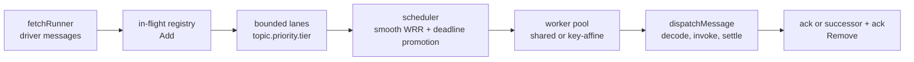

# Sixteen handlers, one fair queue: how the core schedules deliveries

*By trungbk, September 2026.*

A subscription runs sixteen handlers at once against three priorities and three retry tiers. A burst of low-priority retries arrives while high-priority traffic keeps flowing. Without a plan, the handlers either drain whatever arrived first, which starves nothing but honors nothing, or serve strict priority, which starves everything below the top lane. We schedule deliveries through bounded lanes, a smooth weighted round-robin picker with deadline promotion, and a worker pool, so each lane gets its configured share and no lane waits forever.

This page teaches the design and the why. The exact lane construction lives in [Consume flow](/development/consume-flow) and the capacity policy in [Ordering and scheduling](/advanced-topics/ordering-and-scheduling); both are linked where the story touches them.

## Background

A runner is one subscription's delivery loop. It fetches driver messages, decides which one a handler runs next, runs it, and settles the delivery. Fetching is transport: the driver hands over messages as fast as its prefetch allows; on a partition-bound driver that is one unsettled delivery per partition. Scheduling is the core's decision: which fetched delivery goes to a handler next, and how much of the handler capacity each kind of work may take.

F1 splits that decision into three parts. Lanes hold fetched deliveries by kind: one lane per topic, priority, and retry tier. The scheduler picks the next lane. The pool runs the handler. An in-flight registry tracks every accepted delivery until it settles, so shutdown can prove nothing was lost.

## How it works

The runner plans its lanes in [`runnerLanePlan`](https://fgit.zapps.vn/zatf2026-be-t3/event-driven-messaging-sdk/-/blob/main/worker.go). Each topic and priority gets a main lane, and each retry tier gets its own lane. The capacity of a lane is its weighted share of the subscription concurrency, with a floor of three and a multiplier from the fairness config:

```text
capacity = max(ceil(concurrency * weight / totalWeight), 3) * factor
```

The shipped defaults make this concrete. One topic, concurrency 16, weights 8, 4, and 1, three retry tiers (`MaxAttempts: 4`), a retry divisor of 2, a prefetch factor of 2, and budgets of 5 s, 30 s, and 120 s (`config.go`). The plan holds three main groups at 8, 4, and 1, plus three retry groups, one per priority, each holding its three tier lanes at `max(w / 2, 1)`: 4, 2, and 1. The total counts each group once: 8 + 4 + 1 + 4 + 2 + 1 = 20. `runnerLanePlan` computes each lane as `max(ceil(16 * laneWeight / 20), 3) * 2`: high main is `max(ceil(128 / 20), 3) * 2 = 14`, medium main is `max(ceil(64 / 20), 3) * 2 = 8`, and low main is `max(ceil(16 / 20), 3) * 2 = 6`. Each of the three high retry lanes is 8, each of the three medium retry lanes is 6, and each of the three low retry lanes is 6, so the sum is `14 + 8 + 6 + (3 * 8) + (3 * 6) + (3 * 6) = 88`; the core requests a consumer prefetch of `min(configured, 88)`. That is the request and not the depth a partition-bound driver reaches: that driver admits one delivery per partition, so on Kafka the ceiling is the number of partitions assigned to the consumer. With every group saturated the scheduler serves 20 picks per round: high main 8, medium main 4, low main 1, the high retry group 4, medium retry 2, low retry 1, with each retry group's picks rotating across its three tier lanes. The retry lanes double their budgets, to 10 s, 60 s, and 240 s. The construction is [`newRunnerScheduler`](https://fgit.zapps.vn/zatf2026-be-t3/event-driven-messaging-sdk/-/blob/main/worker.go); the capacity policy is documented in [Ordering and scheduling](/advanced-topics/ordering-and-scheduling).

Retry lanes get their own groups and a divided weight. Each retry tier of a topic and priority shares one group, and each lane in it carries `max(weight / divisor, 1)` with double the budget. With the default divisor of 2, the high retry lanes weigh 4 instead of 8. The group is what the scheduler charges: all retry tiers of one priority consume one weighted slot together, while keeping per-tier lanes so a due retry of tier 1 and a due retry of tier 3 do not collapse into one queue. Fresh traffic keeps its larger share, and the weights ensure even the lowest-weight group continues to receive service without relying on deadline promotion.

The scheduler in [`internal/sched`](https://fgit.zapps.vn/zatf2026-be-t3/event-driven-messaging-sdk/-/tree/main/internal/sched) picks across groups with smooth weighted round-robin. On each weighted pick, every non-empty group accrues its weight, and the group with the highest deficit wins; the winner then subtracts the total active weight from its deficit. This interleaves groups while preserving configured shares. When deadline promotion is on, it applies earliest-deadline-first over overdue lanes: a lane whose oldest item waited longer than its budget may be promoted first, with the greatest overrun winning. Grouped lanes share one weighted slot: the two retry lanes of one group alternate inside the group's turns rather than each taking a full share. The picker is [`scheduler.go`](https://fgit.zapps.vn/zatf2026-be-t3/event-driven-messaging-sdk/-/blob/main/internal/sched/scheduler.go), the bounded lane is [`lane.go`](https://fgit.zapps.vn/zatf2026-be-t3/event-driven-messaging-sdk/-/blob/main/internal/sched/lane.go).

The worker pool in [`pool.go`](https://fgit.zapps.vn/zatf2026-be-t3/event-driven-messaging-sdk/-/blob/main/internal/dispatch/pool.go) runs the picked delivery. Unordered mode uses one shared queue for every worker; ordered mode hashes each key to one worker queue so equal keys never run concurrently. The in-flight registry in [`registry.go`](https://fgit.zapps.vn/zatf2026-be-t3/event-driven-messaging-sdk/-/blob/main/internal/dispatch/registry.go) records each accepted delivery before dispatch and removes it when settlement finishes; `WaitZero` is the runner's proof that accepted work has left the set. The dispatch path [`dispatchMessage`](https://fgit.zapps.vn/zatf2026-be-t3/event-driven-messaging-sdk/-/blob/main/worker.go) decodes the envelope, matches the handler, invokes it, and settles: ack on success, a retry successor plus ack on failure, a dead-letter successor plus ack at the attempt cap or on terminal input.



Carry one delivery through. A high-priority delivery fails, so `dispatchMessage` publishes its retry successor to the tier-1 retry destination and acks the original. The redelivery lands in the high tier-1 lane, where it competes inside the high retry group: weight 4 against high main's 8, its group's turns rotating across the three high tier lanes. If it waits past 10 s, deadline promotion selects it first. The budget starts when `enqueuePendingDelivery` constructs the `sched.Item` with `EnqueuedAt: r.client.options.clock.Now()`, so it measures wait inside the SDK; backlog still in the broker is invisible. The pool runs whatever the scheduler hands it: in unordered mode on the next free worker, in ordered mode on the worker its key hashes to. Drain waits for `WaitZero`, so every delivery the runner accepted is settled before the consumer is released.

## Measured

The scheduler's shares are pinned by [`TestSchedulerShareMatchesWeights`](https://fgit.zapps.vn/zatf2026-be-t3/event-driven-messaging-sdk/-/blob/main/internal/sched/scheduler_test.go): with weights 8, 4, and 1 and all lanes saturated, 130 picks come out high=80, medium=40, low=10. That is exactly the 8:4:1 ratio, since 130 picks divide into ten rounds of 13.

Deadline promotion selects the low lane after its budget under sustained high load, pinned by [`TestDeadlinePromotionKeepsLowPriorityMovingUnderSustainedHighLoad`](https://fgit.zapps.vn/zatf2026-be-t3/event-driven-messaging-sdk/-/blob/main/internal/sched/scheduler_test.go): sixteen high items queued against one low item, the clock advanced 10 ms past the low lane's budget, and the next pick is the low item despite the 8:1 weight against it.

Grouped lanes share one weighted slot, pinned by [`TestGroupedLanesShareOneWeightedSlot`](https://fgit.zapps.vn/zatf2026-be-t3/event-driven-messaging-sdk/-/blob/main/internal/sched/scheduler_test.go): two lanes in one group alternate one, two, one, two, instead of each taking a full weighted share.

Reproduce all three with:

```sh
go test -count=1 -run 'TestSchedulerShareMatchesWeights|TestDeadlinePromotionKeepsLowPriorityMovingUnderSustainedHighLoad|TestGroupedLanesShareOneWeightedSlot' ./internal/sched/
```

The pick itself costs nanoseconds, measured by [`BenchmarkSchedulerNext`](https://fgit.zapps.vn/zatf2026-be-t3/event-driven-messaging-sdk/-/blob/main/internal/sched/scheduler_benchmark_test.go) over 60 slots of 2 lanes with 4 items each. On an Intel Core Ultra 5 235U, 14 CPUs, Go 1.26.6, on 2026-09-20:

| Case | ns/op | allocs/op |
| --- | --- | --- |
| deadline promotion disabled | 98.16 | 0 |
| deadline promotion enabled, nothing overdue | 1031 | 0 |
| deadline promotion enabled, all overdue | 817.7 | 0 |

Reproduce with:

```sh
go test -count=1 -run '^$' -bench 'BenchmarkSchedulerNext' -benchtime=10000x ./internal/sched/
```

Deadline promotion costs more than the smooth weighted pass because it scans every lane's oldest item for a budget overrun. Zero allocations in all three cases are the point: the hot pick allocates nothing.

## Limits and trade-offs

- Weights express relative opportunity, not a promise that one lane always wins. Strict priority would starve medium work during a sustained high-priority load.
- Deadline promotion can promote any lane past its budget, including a retry lane. The weight division keeps retry pressure below fresh traffic on average; it does not bar retries from ever jumping the queue.
- Lane capacity bounds memory, not latency. A full lane waits instead of growing, so a slow handler back-pressures fetching rather than buffering without limit.
- Ordered mode serializes equal keys on one worker. More concurrency does not help a single hot key, and per-key order ends at retry: the original is acked once its retry copy is stored, which releases the key.
- The scheduler is intended for one goroutine. The pipeline asks it for the next item only while the pool reports room, so its answer stays current instead of queuing behind earlier picks.

## Read the code

- [`runnerLanePlan` and `newRunnerScheduler`](https://fgit.zapps.vn/zatf2026-be-t3/event-driven-messaging-sdk/-/blob/main/worker.go) - lane planning, retry groups, divided weights, doubled budgets.
- [`internal/sched/scheduler.go`](https://fgit.zapps.vn/zatf2026-be-t3/event-driven-messaging-sdk/-/blob/main/internal/sched/scheduler.go), [`lane.go`](https://fgit.zapps.vn/zatf2026-be-t3/event-driven-messaging-sdk/-/blob/main/internal/sched/lane.go), [`doc.go`](https://fgit.zapps.vn/zatf2026-be-t3/event-driven-messaging-sdk/-/blob/main/internal/sched/doc.go) - smooth weighted round-robin, deadline promotion, grouped lanes.
- [`internal/dispatch/pool.go`](https://fgit.zapps.vn/zatf2026-be-t3/event-driven-messaging-sdk/-/blob/main/internal/dispatch/pool.go), [`registry.go`](https://fgit.zapps.vn/zatf2026-be-t3/event-driven-messaging-sdk/-/blob/main/internal/dispatch/registry.go) - worker pool and in-flight registry.
- [`dispatchMessage`](https://fgit.zapps.vn/zatf2026-be-t3/event-driven-messaging-sdk/-/blob/main/worker.go) - decode, invoke, settle.
- [Consume flow](/development/consume-flow) and [Ordering and scheduling](/advanced-topics/ordering-and-scheduling) - the reference for this path.
