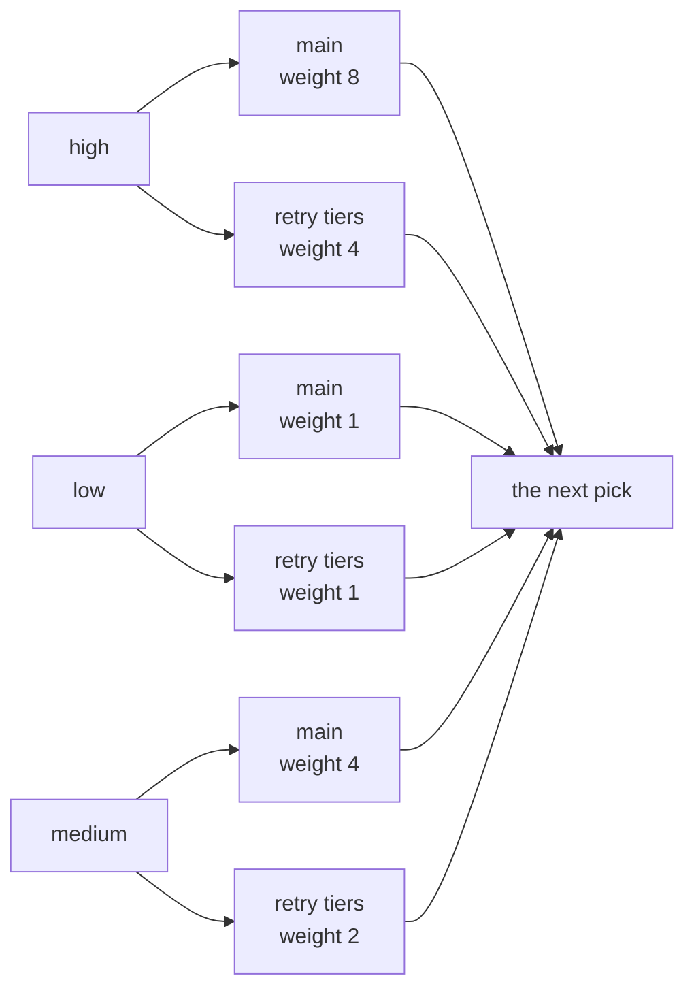

# How F1 picks the next message

*By trungbk.*

One worker slot frees up and a hundred messages are waiting: some high priority, some low, some on their second attempt. F1 serves exactly one of them, and it decides which one in the moment the worker is free. That decision is what this page is about.

Where the queues come from, and how a delivery reaches one, is [Life of a delivery](/deep-dives/life-of-a-delivery). Here I stay on the choice itself.

## Picking late

F1 asks for a pick only while a worker is free. While every worker is busy, deliveries keep arriving and keep landing in lanes, and nothing is chosen. The choice waits for the moment it can be used.

This is the reason fairness has any effect at all. If F1 picked at arrival and queued the result in front of the workers, every lane would hold at most one message at the moment of the choice, and the order would be fixed by arrival. Choosing late means the choice sees the lanes as they are now. A lane that drained while others filled is not owed anything, and a lane that filled while others drained competes with all of it.

The loop asks again after each worker finishes, so a lane that fills up between two picks still competes for the next free slot. A busy pool stops the picking entirely, which is one link in the backpressure chain that page follows.

## Lanes and contenders

A lane is one topic, one priority, and one tier. Every topic and priority has a main lane for fresh traffic and one lane per retry tier, so the default retry ladder of four attempts gives three retry tiers.

Lanes are grouped into contenders, and the contenders are what compete.

- Each main lane is its own contender.
- All retry tiers of one topic and priority are one contender. Inside it, the tiers take turns in rotation, so a message on its second attempt does not queue behind every message on its fourth.

Weights decide how much of the picking attention each contender gets. The defaults are high 8, medium 4 and low 1, from `FairnessConfig.Weights`. A retry contender gets its priority's weight divided by `RetryWeightDivisor`, which defaults to 2, and never below 1. The retry contender for a high-priority topic therefore competes with weight 4, and the low-priority retry contender competes with weight 1, exactly like a main low lane.

Six contenders for one topic, and the pick is one of them.

The order they sit in is not decoration. F1 lays its lanes out in a fixed order, and when two contenders tie on score, the one earlier in that order keeps the pick. The diagram above lists the contenders in that order, which is why low sits between high and medium.

## The pick

The rule is smooth weighted round robin. On every pick, each contender that has something waiting adds its weight to a running score. The highest score wins, and a tie goes to the contender listed first. The winner then gives back the total weight that took part in that pick.

With all three priorities backed up, the total in play is 13 on every pick. Five picks in:

| Pick | Winner | Scores after, high, medium, low |
| --- | --- | --- |
| 1 | high | -5, 4, 1 |
| 2 | medium | 3, -5, 2 |
| 3 | high | -2, -1, 3 |
| 4 | high | -7, 3, 4 |
| 5 | medium | 1, -6, 5 |

Thirteen picks close the round and the scores come back to zero. The order is high, medium, high, high, medium, high, low, high, medium, high, high, medium, high: eight highs, four mediums and one low, with the high lane's turns spread through the sequence instead of bunched at the front. A scheme that served a contender its weight in a row would put eight highs together, and medium would wait behind all of them. Here medium's turns are never more than four picks apart.

<F1SchedulerSim />

## Empty means reset

A contender with nothing waiting has its score set back to zero. That is not a small detail: the score is credit, and a lane that empties loses whatever it had built.

The alternative would let a lane bank credit while it is idle and spend it in a burst when it refills, which is the opposite of what the weights promise. A lane that is often briefly empty pays for the rule. It drains, resets, refills, and starts again from nothing, so it gets exactly its weight's share of the picks it was present for and never more. The bursty lane scenario in the figure above shows this: watch the lane that empties and comes back, and its bar restarts from the middle while a lane that stayed busy keeps its place.

## Deadline promotion

Weights decide shares. They do not decide how long any one message waits, and a share can be fair while every message in it is late. F1 has a second rule for the lane that is simply late.

Every lane has a budget: five seconds for high, thirty for medium and two minutes for low, and a retry lane gets twice its priority's budget. The budget clock starts when a message enters its lane, not when it was published. Before the weighted pick, F1 checks whether any lane's oldest message has waited longer than its budget. If one has, the lane that is furthest over its budget is served first, whatever the scores say. A promoted pick adds no weight and gives nothing back, so it leaves the scores alone.

Where the clock starts decides when promotion fires. A lane holds only a handful of messages: its capacity is its share of the workers, doubled, with a small floor. When a lane is full, further messages for it wait at the broker, and that wait is not on the budget clock. So a message's time in its lane is bounded by how long a full lane takes to drain, which is a few handler times for any lane whose share is above the floor, whatever its priority. A lane at the floor, which is usually low at a small concurrency, drains more slowly, because it holds more than its share.

That makes the handler the thing that makes a lane late, not the backlog. With fast handlers no lane comes near its budget, however deep the queue at the broker is. As handlers slow down, the lane with the shortest budget goes over first, and that is high: at five seconds, a handler that takes a second or two is enough. Once lanes are over their budgets, promotion serves whichever is furthest over first, and the weighted order only runs for the picks in between. The slow handlers scenario in the figure shows that point.

That is what promotion is: not priority, and not a promise. It is a cap on waiting inside F1, applied to whichever lane is furthest past its own. Wait at the broker is outside it; a lane that falls behind there shows as backlog, which is what the backlog alerts on [Alerts](/advanced-topics/alerts) watch.

`DisableDeadlinePromotion` turns the rule off, and its zero value leaves it on, which is the default. Promotions are reported to the observer as a deadline promotion event, rate limited per lane, with a count of the promotions that were collapsed into the same window. The event and its fields are on [Observer](/basics/observer).

## Trade-offs

- Strict priority starves medium and low forever under a sustained high load. Weights guarantee a share instead, and promotion caps the wait. That is the whole design, and it is why a priority value is a lane name rather than an execution order.
- Plain round robin ignores priority entirely, which is the other failure: a low-priority lane would take half the picks from a two-lane subscription.
- The empty-lane reset costs the lane that is often briefly empty. It gives up credit it had built, every time.
- Every weighted pick looks at every contender, so the work of one pick grows with the number of contenders: topics times priorities, doubled when retry lanes exist. That is a small number next to a handler call, and it is what the smoothness costs. What the default lanes do to a delivery's wait, with the command that produces it, is on [Benchmarks](/development/benchmarks#scheduler-fairness-by-priority).
- Promotion is a wait cap, not a latency guarantee. A lane can still be late, and it can be late for a long time, if another lane is further past its budget every time the check runs.
- The budget clock starts at the lane, so it cannot see a message waiting at the broker behind a full lane. That wait is backlog, and it is watched as backlog, not as a deadline.

## What I would change

<!-- TODO(trungbk): what you would change about this pick, in your own words. -->

## Go further

- [Ordering and scheduling](/advanced-topics/ordering-and-scheduling) - the settings an application uses to steer this, and what they do not promise.
- [Life of a delivery](/deep-dives/life-of-a-delivery) - where lanes come from and how a message reaches one.
- [Benchmarks](/development/benchmarks#scheduler-fairness-by-priority) - settle latency by priority on the in-memory driver, with the command to reproduce it.
- [Observer](/basics/observer) - the events a promotion, a retry and a settlement emit.
