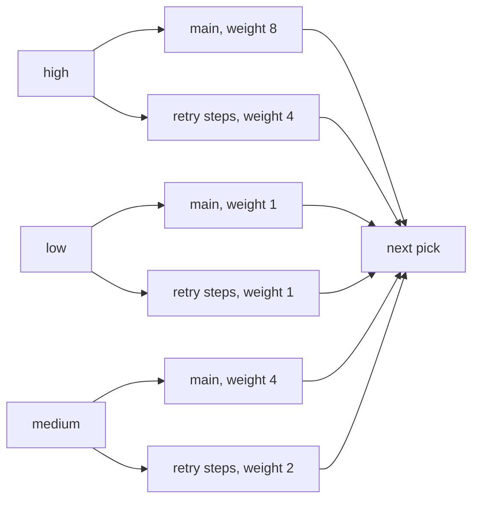

# How F1 picks the next message

*By trungbk.*

When a worker slot opens, F1 chooses one message from all [lanes](/learn/glossary#lane), the bounded queues inside F1, that currently have work. I use weights for normal picks, and let the lane whose oldest message is most overdue [jump the queue](/learn/glossary#deadline-promotion).

A scheduler pick is late by design. If F1 chose a lane when a message arrived, the choice would be fixed before the other lanes filled or drained. Choosing when a worker can accept work lets the current backlog shape the next decision.

## What competes

A lane combines one topic, one priority, and one [retry step](/learn/glossary#retry-tier). A main lane carries fresh traffic. Each retry step has its own lane. The scheduler picks between groups, not lanes: the main lane is a group of one, and all retry steps for one topic and priority form one retry group.

The default retry policy has three retry steps. The steps take turns inside their retry group: each time the group wins a pick, the next retry step after the last one picked that has a message waiting supplies it, skipping empty steps, so three retry steps share one group's picks instead of each getting a full share. With messages waiting in steps 1, 2 and 3, the group's wins go to step 1, step 2, step 3, step 1, and so on. A retry group's weight is its priority weight divided by `RetryWeightDivisor`, with a floor of one.

## Why lane capacity stays small

Capacity is not throughput. `Concurrency` decides how many handlers run at
once; a lane holds messages waiting for the next free worker. Weighted sizing
and a small minimum window keep work ready during broker round trips without
turning every lane into a large process-local backlog.

At low concurrency the minimum window dominates, so unequal weights can
produce equal capacities. Above that floor, weighted shares shape the lane
windows. The [prefetch contract](/advanced-topics/configuration#prefetch-resolution)
and its shared sizing implementation determine the actual limits; scheduling
weights are not reserved worker counts.

A larger buffer would not make handlers faster, and it costs in four places:

- **Load sharing.** A message the broker still holds can go to any instance. A message already fetched into one process waits for that process, even while another instance is idle.
- **Redelivery.** Fetched work that was not acked can return after a crash, reconnect, or revoke, so a deeper buffer increases the work exposed to redelivery.
- **Drain time.** A drain dispatches everything already in the lanes, so a deeper buffer needs more of `DrainTimeout`.
- **Hidden backlog.** Messages age inside the process while the broker's queue depth looks healthy.

On Kafka, one record per partition is outstanding at a time, so a larger lane mostly stays empty; the partition count is the parallelism lever.

Lane capacity is deliberately a destination ceiling, not a statically divided
share of a smaller total budget. Keeping full destination windows avoids
unnecessary per-destination throughput limits while the aggregate admission
ceiling bounds SDK-unsettled work. The [prefetch contract](/advanced-topics/configuration#prefetch-resolution)
owns automatic sizing and explicit totals.

Transport buffering is a separate trade-off: RabbitMQ broker credit and Kafka
fetch buffers may retain work that has not been SDK-admitted. Raising
`broker.rabbitmq.brokerPrefetch` cannot bypass either SDK admission ceiling.
Read the [RabbitMQ options](/drivers/rabbitmq#rabbitmq-options) and
[Kafka delayed records](/drivers/kafka#kafka-delayed-records) for transport
constraints; the admission owners are the consumers in
[`drivers/rabbitmq`](https://fgit.zapps.vn/zatf2026-be-t3/event-driven-messaging-sdk/-/tree/main/drivers/rabbitmq)
and [`drivers/kafka`](https://fgit.zapps.vn/zatf2026-be-t3/event-driven-messaging-sdk/-/tree/main/drivers/kafka).

The [fallback lane](/learn/glossary#lane) takes a delivery whose destination F1 cannot map to a lane; it is the main lane of the subscription's first topic and priority. F1 then holds the one delivery that did not fit, outside any lane, and stops reading new deliveries for the whole subscription until a worker frees a slot in that lane. It never holds more than one.

The delivery is kept, not requeued, but one full lane slows intake for the whole subscription.

Choose `Concurrency` from safe handler parallelism, not a desired buffer size.
Raise `PrefetchFactor` only when measurements show workers waiting on broker
round trips; a deeper buffer also increases drain work and redelivery exposure.

## The weighted pick

Smooth weighted round robin gives each non-empty group its weight as running score. The highest score wins, and that winner gives back the total active weight, the sum of the weights of the groups that have work right now. An empty group resets its score instead of banking credit for a later burst.

The following trace uses three saturated main lanes with weights 8, 4, and 1.
The scores are the values after each pick. Equal scores keep the earlier group
in the scheduler's stable group order; the columns here are in weight order.
The thirteen picks return the scores to zero and give eight picks to high,
four to medium, and one to low.

<F1SchedulerStepper scenario="weighted" />

The steps are recorded from the Go scheduler by a test, so the figure changes only when the scheduler does.

The same trace as a table

| Pick | Winner | Scores after pick, high, medium, low |
| ---: | --- | --- |
| 1 | high | -5, 4, 1 |
| 2 | medium | 3, -5, 2 |
| 3 | high | -2, -1, 3 |
| 4 | high | -7, 3, 4 |
| 5 | medium | 1, -6, 5 |
| 6 | high | -4, -2, 6 |
| 7 | low | 4, 2, -6 |
| 8 | high | -1, 6, -5 |
| 9 | medium | 7, -3, -4 |
| 10 | high | 2, 1, -3 |
| 11 | high | -3, 5, -2 |
| 12 | medium | 5, -4, -1 |
| 13 | high | 0, 0, 0 |

This is a share guarantee for weighted picks while a group stays non-empty, not a latency guarantee; picks made by jumping the queue come on top of it. A group that empties loses its accumulated score, so it starts clean when work returns.

## Jumping the queue when overdue

Weights control opportunity. They do not stop one message from becoming overdue, so F1 checks the oldest item in each lane before a weighted pick.

The wait clock starts when F1 takes a message for its lane. A delivery held back because its lane is full is already waiting, so that time counts. Once the oldest message has waited its lane's [wait limit](/learn/glossary#lane-budget), the lane may jump the queue. F1 picks the lane furthest past its limit, measured in time, not the earliest deadline. A jump does not charge the winning group's score; only groups that are empty reset to zero, as in any pick.

| Moment | Lane state | Next decision |
| --- | --- | --- |
| Message taken | F1 records when it took the message for the lane. | The message waits for a normal pick. |
| Before the limit | The lane's wait is below its limit. | Weighted selection continues. |
| At the limit | The wait equals the limit. | The lane may jump the queue. |
| Next pick | The lane is at or past its limit. | The lane furthest past its limit wins, and the winner's score is not charged. |

<F1SchedulerStepper scenario="promotion" />

Watch the jump leave the non-empty groups' scores unchanged even as the low lane wins.

Jumping the queue is an escape hatch for overdue lanes, not a cap on waiting. Another lane can be further past its limit on every check. Capacity limits how many messages wait in a lane, not how long: a full lane waits at the broker, where the wait clock does not run.

`DisableDeadlinePromotion` turns this rule off. Its zero value leaves it on.
Observer reports are rate-limited per lane; suppressed jumps are counted in a
later report. See [Observer](/basics/observer) for the event contract.

## Trade-offs

- Strict priority can starve lower priorities, while weights preserve a share for each non-empty group.
- Retry weight reduction keeps fresh traffic ahead on average, but an overdue retry can still jump the queue.
- Ordered delivery can serialize one hot key even when other worker slots are free; more concurrency does not split that key.
- The picker scans every lane group on each weighted choice, so work grows with the number of topics, priorities, and retry groups. The [benchmarks](/development/benchmarks) page records the finding without making benchmark numbers part of this contract.
- Jumping the queue eases starvation without promising a latency SLA. Broker backlog and handler duration stay outside its clock.

## Go further

- [Ordering and scheduling](/advanced-topics/ordering-and-scheduling) - the public fairness settings and their limits.
- [Consume flow](/development/consume-flow) - how a fetched message reaches a lane and a handler.
- [Benchmarks](/development/benchmarks) - measured scheduler and delivery behavior.
- [Observer](/basics/observer) - queue-jump, retry, and ack events.
- [Source-reading guide](/development/source-reading-guide) - the maintainer route through the implementation.
