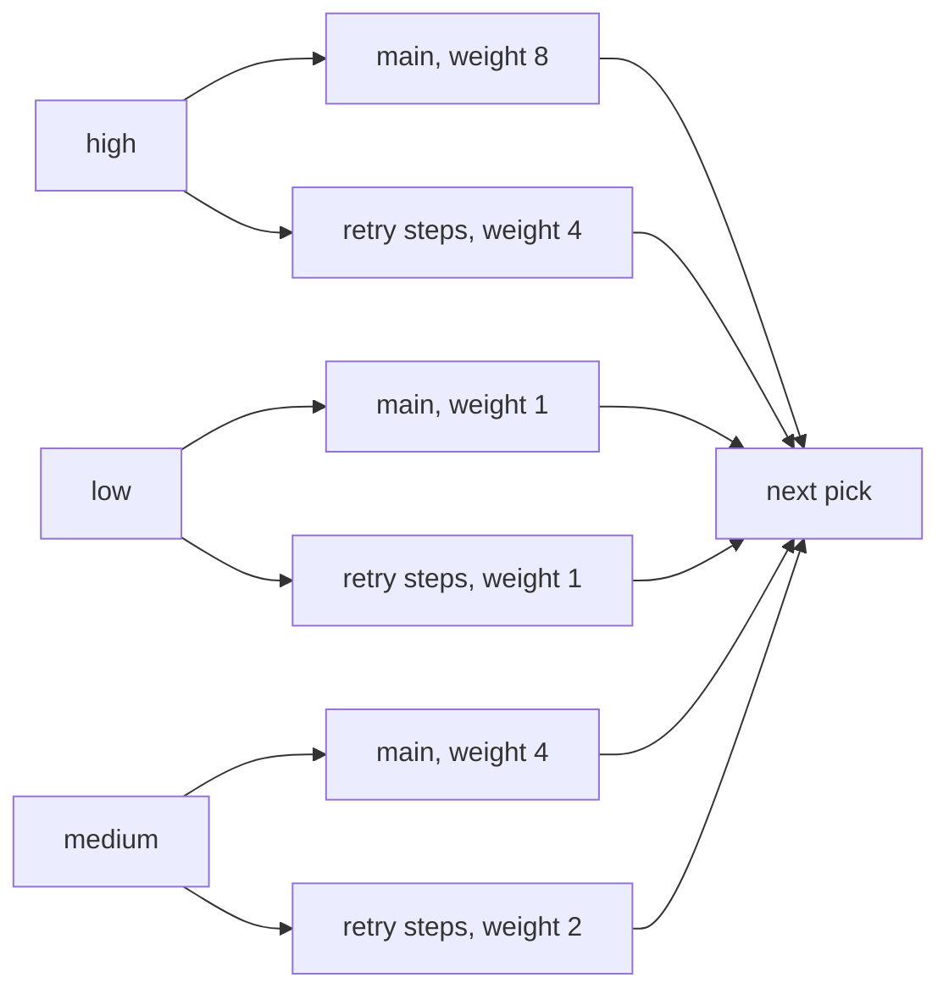

# How F1 picks the next message

*By trungbk.*

When a worker slot opens, F1 chooses one message from all [lanes](/learn/glossary#lane), the bounded queues inside F1, that currently have work. I use weights for normal picks, and let the lane whose oldest message is most overdue [jump the queue](/learn/glossary#deadline-promotion).

A scheduler pick is late by design. If F1 chose a lane when a message arrived, the choice would be fixed before the other lanes filled or drained. Choosing when a worker can accept work lets the current backlog shape the next decision.

## What competes

A lane combines one topic, one priority, and one [retry step](/learn/glossary#retry-tier). A main lane carries fresh traffic. Each retry step has its own lane. The scheduler picks between groups, not lanes: the main lane is a group of one, and all retry steps for one topic and priority form one retry group.

The default retry policy has three retry steps. The steps take turns inside their retry group: each time the group wins a pick, the next retry step after the last one picked that has a message waiting supplies it, skipping empty steps, so three retry steps share one group's picks instead of each getting a full share. With messages waiting in steps 1, 2 and 3, the group's wins go to step 1, step 2, step 3, step 1, and so on. A retry group's weight is its priority weight divided by `RetryWeightDivisor`, with a floor of one.

For one topic, the production group order is high main, high retry, low main, low retry, medium main, and medium retry. That is simply alphabetical order of the lane names (high, low, medium), not a ranking. It matters only for ties: equal scores keep the earlier group, so low main wins a tie against medium main.

## The default lane sizes

The default subscription has concurrency 16, priority weights 8, 4, and 1, a retry divisor of 2, a prefetch factor of 2, and four total attempts. The retry policy therefore adds three lanes to each retry group.

| Lane group | Lanes in the group | Weight | Wait limit | Capacity per lane |
| --- | --- | ---: | ---: | ---: |
| High main | one fresh lane | 8 | 5 s | 14 |
| High retry | three retry lanes | 4 | 10 s | 8 |
| Low main | one fresh lane | 1 | 2 min | 6 |
| Low retry | three retry lanes | 1 | 4 min | 6 |
| Medium main | one fresh lane | 4 | 30 s | 8 |
| Medium retry | three retry lanes | 2 | 1 min | 6 |

Each lane's capacity is `max(ceil(Concurrency x group weight / total group weight), 3) x PrefetchFactor`. For high main at the defaults: 16 x 8 / 20 = 6.4, rounded up to 7, above the floor of 3, times 2 = 14. The six group weights total 20, so the capacities above are the bounded depth for one topic at concurrency 16.

## Why lane capacity stays small

Capacity is not throughput. `Concurrency` decides how many handlers run at once; a lane only holds the messages waiting for the next free worker. The formula therefore sizes each lane to its weighted share of the workers, doubled by the prefetch factor so the next batch is already in hand while the current one runs.

The weights shape capacity only once the shares are larger than the floor. With 4 workers and three fresh lanes weighted 8, 4, and 1, the shares are 3, 2, and 1 workers, the floor of 3 wins everywhere, and every lane holds 6. At the default concurrency of 16 the same weights give 14, 8, and 6. More workers mean bigger lanes, in proportion to the weights.

The floor of 3 exists for fast handlers at low concurrency. With a lane capacity of only 2, the broker sends the next message only after an ack frees a slot, so a handler that finishes before that round trip does sits idle waiting for the next message. A third slot keeps one message ready during the round trip.

A larger buffer would not make handlers faster, and it costs in four places:

- **Load sharing.** A message the broker still holds can go to any instance. A message already fetched into one process waits for that process, even while another instance is idle.
- **Redelivery.** Every fetched message that is not yet acked is redelivered after a crash, reconnect, or revoke, so a deeper buffer means more duplicate work.
- **Drain time.** A drain dispatches everything already in the lanes, so a deeper buffer needs more of `DrainTimeout`.
- **Hidden backlog.** Messages age inside the process while the broker's queue depth looks healthy.

On Kafka, one record per partition is outstanding at a time, so a larger lane mostly stays empty; the partition count is the parallelism lever.

The same capacity also bounds the driver. Each destination, the broker queue or topic behind one lane, may have only that lane's capacity outstanding, and the subscription's effective prefetch is capped at the sum of all its lanes. For one topic at the defaults that is 14 + 6 + 8 for the main lanes plus three lanes each of 8, 6, and 6 for retries, 88 in all. When a lane is full, its destination has spent its credit and new messages stay at the broker. Nothing is nacked or redelivered. The two drivers stop the flow in different places:

- **RabbitMQ: the broker holds back.** Each destination's channel is opened with a prefetch (`basic.qos`) equal to its lane capacity. Once that many deliveries are unacknowledged, RabbitMQ stops pushing to the consumer, and each ack or nack lets it send one more. F1 does nothing active.
- **Kafka: the driver holds back.** Kafka is pull-based and has no unacknowledged limit, so the driver counts records not yet acked per destination. When the count reaches the lane capacity, it pauses fetching that topic, and it resumes when an ack or nack brings the count below the capacity. Records fetched before the pause stay in the client's buffer and are delivered after it, not fetched again. A record counts toward the lane capacity only once the driver hands it to F1, so buffered records are not counted; the buffer has its own per-partition bound, and the driver pauses a partition whose buffer reaches it. Separately, only one record per partition is outstanding at a time, which usually binds first when a topic has few partitions.

| | RabbitMQ | Kafka |
| --- | --- | --- |
| Who stops the flow | The broker, through the channel prefetch | The driver, by pausing the topic's fetches |
| The limit | Unacknowledged deliveries per destination | Records not yet acked per destination, and one per partition |
| Flow resumes on | Each ack or nack | An ack or nack that brings the count below the capacity |
| A lane can still fill | With `brokerPrefetch`, or on the fallback lane | On the fallback lane |

A lane can still fill in the two cases in the last row: `broker.rabbitmq.brokerPrefetch` lets RabbitMQ send more than the lane holds, and the fallback lane takes deliveries from any destination it cannot map.

The [fallback lane](/learn/glossary#lane) takes a delivery whose destination F1 cannot map to a lane; it is the main lane of the subscription's first topic and priority. F1 then holds the one delivery that did not fit, outside any lane, and stops reading new deliveries for the whole subscription until a worker frees a slot in that lane. It never holds more than one.

The delivery is kept, not requeued, but one full lane slows intake for the whole subscription.

To buffer more, raise `Concurrency` first. Raise `PrefetchFactor` only when the broker round trip is long compared with the handler time, and expect more redelivery and a longer drain in the same proportion.

## The weighted pick

Smooth weighted round robin gives each non-empty group its weight as running score. The highest score wins, and that winner gives back the total active weight, the sum of the weights of the groups that have work right now. An empty group resets its score instead of banking credit for a later burst.

The following trace uses three saturated main lanes with weights 8, 4, and 1. The scores are the values after each pick. The columns are in weight order; the alphabetical group order only breaks ties. The thirteen picks return the scores to zero and give eight picks to high, four to medium, and one to low.

<F1SchedulerStepper scenario="weighted" />

The steps are recorded from the Go scheduler by a test, so the figure changes only when the scheduler does.

The same trace as a table

| Pick | Winner | Scores after pick, high, medium, low |
| ---: | --- | --- |
| 1 | high | -5, 4, 1 |
| 2 | medium | 3, -5, 2 |
| 3 | high | -2, -1, 3 |
| 4 | high | -7, 3, 4 |
| 5 | medium | 1, -6, 5 |
| 6 | high | -4, -2, 6 |
| 7 | low | 4, 2, -6 |
| 8 | high | -1, 6, -5 |
| 9 | medium | 7, -3, -4 |
| 10 | high | 2, 1, -3 |
| 11 | high | -3, 5, -2 |
| 12 | medium | 5, -4, -1 |
| 13 | high | 0, 0, 0 |

This is a share guarantee for weighted picks while a group stays non-empty, not a latency guarantee; picks made by jumping the queue come on top of it. A group that empties loses its accumulated score, so it starts clean when work returns.

## Jumping the queue when overdue

Weights control opportunity. They do not stop one message from becoming overdue, so F1 checks the oldest item in each lane before a weighted pick.

The wait clock starts when F1 takes a message for its lane. A delivery held back because its lane is full is already waiting, so that time counts. Once the oldest message has waited its lane's [wait limit](/learn/glossary#lane-budget), the lane may jump the queue. F1 picks the lane furthest past its limit, measured in time, not the earliest deadline. A jump does not charge the winning group's score; only groups that are empty reset to zero, as in any pick.

| Moment | Lane state | Next decision |
| --- | --- | --- |
| Message taken | F1 records when it took the message for the lane. | The message waits for a normal pick. |
| Before the limit | The lane's wait is below its limit. | Weighted selection continues. |
| At the limit | The wait equals the limit. | The lane may jump the queue. |
| Next pick | The lane is at or past its limit. | The lane furthest past its limit wins, and the winner's score is not charged. |

<F1SchedulerStepper scenario="promotion" />

Watch the jump leave the non-empty groups' scores unchanged even as the low lane wins.

Jumping the queue is an escape hatch for overdue lanes, not a cap on waiting. Another lane can be further past its limit on every check. Capacity limits how many messages wait in a lane, not how long: a full lane waits at the broker, where the wait clock does not run.

`DisableDeadlinePromotion` turns this rule off. Its zero value leaves it on. Each jump is reported to the observer, at most once per lane in a 15-second window. Jumps inside a window that already reported are counted, and the count rides on the lane's next reported jump. The event fields are in [Observer](/basics/observer).

## Trade-offs

- Strict priority can starve lower priorities, while weights preserve a share for each non-empty group.
- Retry weight reduction keeps fresh traffic ahead on average, but an overdue retry can still jump the queue.
- Ordered delivery can serialize one hot key even when other worker slots are free; more concurrency does not split that key.
- The picker scans every lane group on each weighted choice, so work grows with the number of topics, priorities, and retry groups. The [benchmarks](/development/benchmarks) page records the finding without making benchmark numbers part of this contract.
- Jumping the queue eases starvation without promising a latency SLA. Broker backlog and handler duration stay outside its clock.

## Go further

- [Ordering and scheduling](/advanced-topics/ordering-and-scheduling) - the public fairness settings and their limits.
- [Life of a delivery](/deep-dives/life-of-a-delivery) - how a fetched message reaches a lane and a handler.
- [Benchmarks](/development/benchmarks) - measured scheduler and delivery behavior.
- [Observer](/basics/observer) - queue-jump, retry, and ack events.
- [Source-reading guide](/development/source-reading-guide) - the maintainer route through the implementation.
