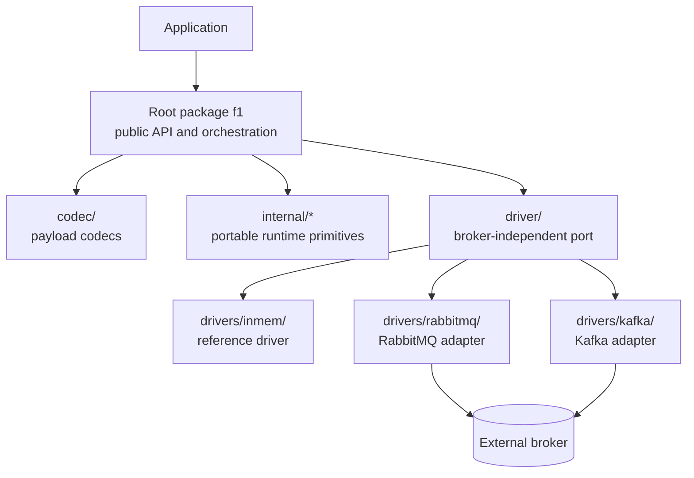
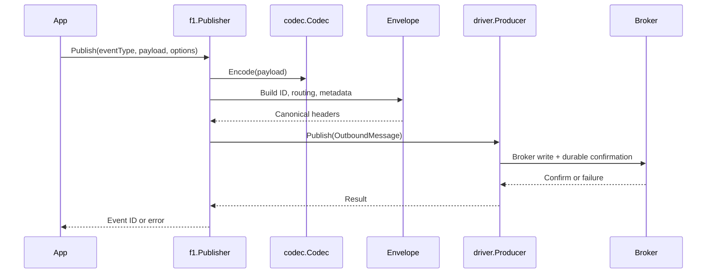
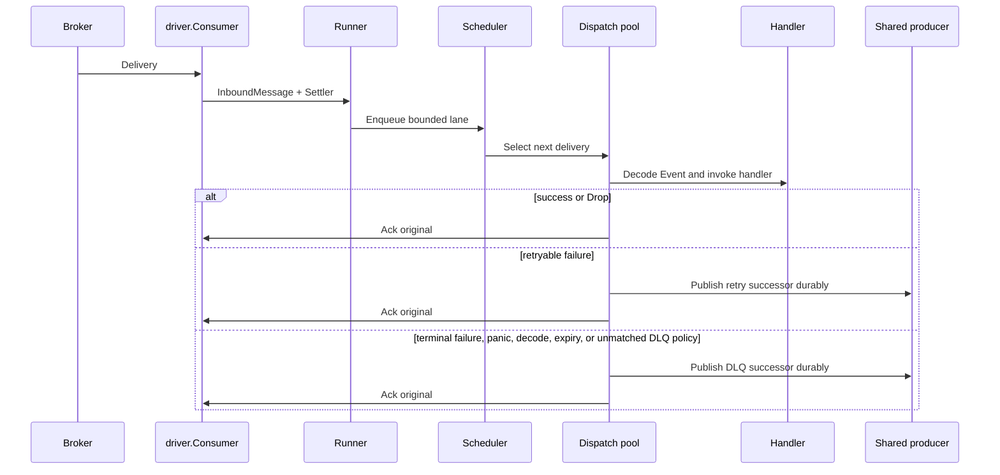
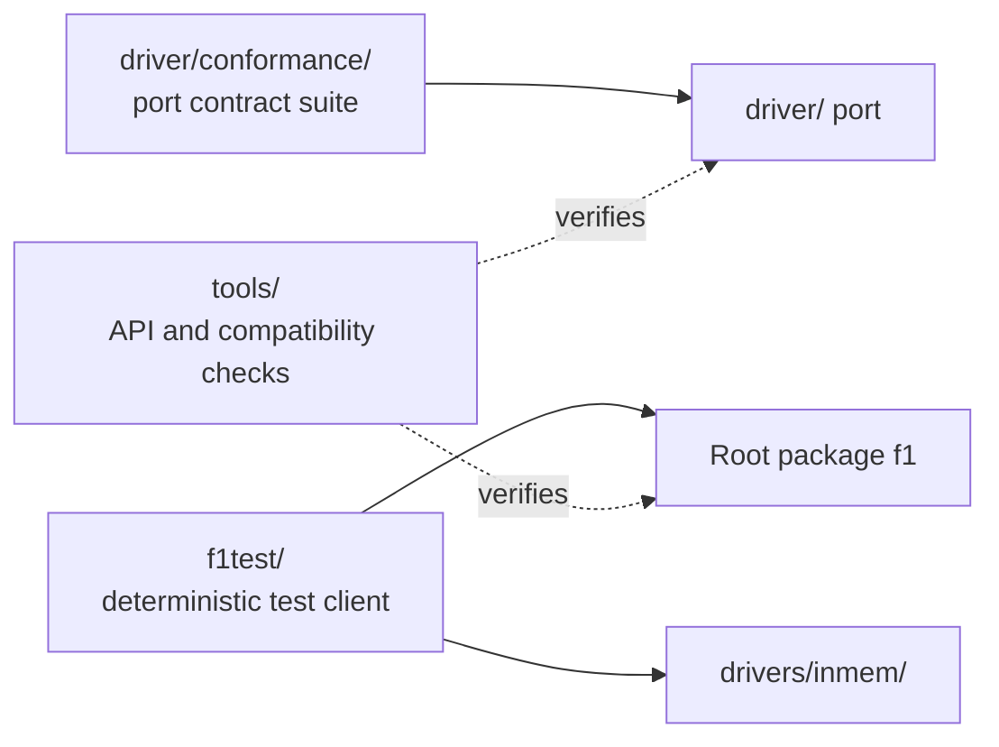

# Architecture

This is the canonical maintainer map of the F1 repository. It explains where
responsibilities live and which boundaries are deliberate. The source and tests
remain authoritative for current behavior; use the links below to inspect the
implementation when a detail matters.

Read this page when you need to locate a change, understand a dependency rule,
or decide whether a behavior belongs in the core SDK or in a driver.

## System shape

## Runtime paths at a glance

The public path is the same regardless of the connected driver: the root
package builds the message or handler-facing event, and the driver translates
the port operation into broker work.

### Publish path

See [Publish flow](/development/publish-flow) for the complete path,
including topology, producer admission, and close interaction.

### Consume path

See [Consume flow](/development/consume-flow) and
[Lifecycle and shutdown](/advanced-topics/lifecycle-and-shutdown) for
dispatch, settlement, reconnect, and drain behavior.

The verification packages sit beside the runtime and point at what they exercise:

The root package owns the SDK contract exposed to an application. It selects
portable behavior from the driver port, while concrete drivers translate that
behavior into broker operations. The root package does not import concrete
drivers or broker clients.

The in-memory driver is both a deterministic reference implementation and the
foundation of `f1test`. RabbitMQ and Kafka provide connected broker adapters;
their broker clients stay inside their respective packages.

Observability follows the same boundary. The core emits lifecycle events through
`f1.Observer` and the optional `TraceInjector`, but never imports OpenTelemetry.
`f1otel` is the built-in adapter in its own package, outside the core.

## Package ownership

The following map records the real responsibility boundaries. It is intentionally
not a complete file inventory; package documentation and source declarations
own the details.

| Package | Responsibility | Start here |
| --- | --- | --- |
| `.` (`package f1`) | Public API, configuration, client lifecycle, publishing, subscriptions, runners, event/envelope types, routing, errors, and capability limits | [`client.go`](https://fgit.zapps.vn/zatf2026-be-t3/event-driven-messaging-sdk/-/blob/main/client.go), [`publisher.go`](https://fgit.zapps.vn/zatf2026-be-t3/event-driven-messaging-sdk/-/blob/main/publisher.go), [`subscription.go`](https://fgit.zapps.vn/zatf2026-be-t3/event-driven-messaging-sdk/-/blob/main/subscription.go), [`worker.go`](https://fgit.zapps.vn/zatf2026-be-t3/event-driven-messaging-sdk/-/blob/main/worker.go) |
| `codec/` | Broker-independent payload codec interface and JSON implementation | [`codec/codec.go`](https://fgit.zapps.vn/zatf2026-be-t3/event-driven-messaging-sdk/-/blob/main/codec/codec.go) |
| `driver/` | Broker port: connection, producer, consumer, settlement, administration, topology, capabilities, messages, and driver errors | [`driver/driver.go`](https://fgit.zapps.vn/zatf2026-be-t3/event-driven-messaging-sdk/-/blob/main/driver/driver.go), [`driver/capability.go`](https://fgit.zapps.vn/zatf2026-be-t3/event-driven-messaging-sdk/-/blob/main/driver/capability.go), [`driver/topology.go`](https://fgit.zapps.vn/zatf2026-be-t3/event-driven-messaging-sdk/-/blob/main/driver/topology.go) |
| `driver/conformance/` | Broker-independent contract suite that exercises a candidate driver through the port | [`driver/conformance/run.go`](https://fgit.zapps.vn/zatf2026-be-t3/event-driven-messaging-sdk/-/blob/main/driver/conformance/run.go), [`driver/conformance/manifest.go`](https://fgit.zapps.vn/zatf2026-be-t3/event-driven-messaging-sdk/-/blob/main/driver/conformance/manifest.go) |
| `internal/clock/` | Real and manually advanced clocks used to keep timing behavior testable | [`internal/clock/clock.go`](https://fgit.zapps.vn/zatf2026-be-t3/event-driven-messaging-sdk/-/blob/main/internal/clock/clock.go) |
| `internal/retry/` | Backoff tiers, delay resolution, and retry sanity checks | [`internal/retry/ladder.go`](https://fgit.zapps.vn/zatf2026-be-t3/event-driven-messaging-sdk/-/blob/main/internal/retry/ladder.go) |
| `internal/sched/` | Bounded weighted lanes, deadline promotion, and scheduling fairness | [`internal/sched/scheduler.go`](https://fgit.zapps.vn/zatf2026-be-t3/event-driven-messaging-sdk/-/blob/main/internal/sched/scheduler.go) |
| `internal/dispatch/` | Worker pool, ordered-key routing, and in-flight delivery accounting | [`internal/dispatch/pool.go`](https://fgit.zapps.vn/zatf2026-be-t3/event-driven-messaging-sdk/-/blob/main/internal/dispatch/pool.go), [`internal/dispatch/registry.go`](https://fgit.zapps.vn/zatf2026-be-t3/event-driven-messaging-sdk/-/blob/main/internal/dispatch/registry.go) |
| `internal/lifecycle/` | Runner lifecycle state machine and transition validation | [`internal/lifecycle/state.go`](https://fgit.zapps.vn/zatf2026-be-t3/event-driven-messaging-sdk/-/blob/main/internal/lifecycle/state.go) |
| `drivers/inmem/` | Deterministic in-memory broker, including topology, delivery, settlement, and fault behavior for tests | [`drivers/inmem/inmem.go`](https://fgit.zapps.vn/zatf2026-be-t3/event-driven-messaging-sdk/-/blob/main/drivers/inmem/inmem.go) |
| `drivers/rabbitmq/` | RabbitMQ transport, topology, management, settlement, reconnect, and broker-specific tests | [`drivers/rabbitmq/rabbitmq.go`](https://fgit.zapps.vn/zatf2026-be-t3/event-driven-messaging-sdk/-/blob/main/drivers/rabbitmq/rabbitmq.go) |
| `drivers/kafka/` | Kafka transport, classic consumer groups, topology, offsets, rebalancing, and broker-specific tests | [`drivers/kafka/kafka.go`](https://fgit.zapps.vn/zatf2026-be-t3/event-driven-messaging-sdk/-/blob/main/drivers/kafka/kafka.go) |
| `f1test/` | Black-box handler-test client backed by the in-memory driver and a fake clock | [`f1test/f1test.go`](https://fgit.zapps.vn/zatf2026-be-t3/event-driven-messaging-sdk/-/blob/main/f1test/f1test.go) |
| `tools/` | API-surface and API-diff checks for public packages | [`tools/apisurface/main.go`](https://fgit.zapps.vn/zatf2026-be-t3/event-driven-messaging-sdk/-/blob/main/tools/apisurface/main.go), [`tools/apidiff/normalize.go`](https://fgit.zapps.vn/zatf2026-be-t3/event-driven-messaging-sdk/-/blob/main/tools/apidiff/normalize.go) |

## Ownership of the runtime

The runtime objects have distinct owners:

| Object | Owns |
| --- | --- |
| `Client` | one live connection, shared producer, runners, lifecycle admission |
| `Publisher` | application publish calls; delegates state to `Client` |
| `Subscription` | handler-facing policy and callbacks |
| `Runner` | one subscription's consumer, fetcher, scheduler, workers, and drain |
| `driver.Conn` | live broker resources |
| `driver.Producer` | durable publish acknowledgement |
| `driver.Consumer` | broker delivery and transport lifecycle |
| `driver.Settler` | broker-specific ack/nack operation for one delivery |

The public root package coordinates the runtime, but each concern has one
primary owner:

- **Client and lifecycle:** `client.go` owns the connected driver, shared
  producer, runner registry, reconnect supervision, publish admission, and
  client close phases. `reconnect.go` owns connection replacement and runner
  re-entry. The shutdown semantics are explained in
  [Lifecycle and shutdown](/advanced-topics/lifecycle-and-shutdown).
- **Publishing:** `publisher.go` builds outbound messages from application
  events, codec output, envelope headers, and logical routing options.
  `client.go` owns producer admission and delegates durable publication to
  `driver.Producer`. See [Message](/basics/message) for the public
  envelope model and [Pub/sub](/basics/pubsub) for application-level use.
- **Consuming:** `subscription.go` resolves and validates subscription policy;
  `worker.go` owns runner generations, fetching, dispatch, handler decisions,
  successor publication, and settlement. The driver owns transport delivery
  and the per-message settler.
- **Scheduling and ordering:** `internal/sched` selects work from bounded
  lanes; `internal/dispatch` owns worker execution, ordered-key routing, and
  in-flight accounting. User-visible behavior is described in
  [Ordering and scheduling](/advanced-topics/ordering-and-scheduling).
- **Settlement and failure routing:** `worker.go` classifies handler errors and
  `internal/retry` resolves tiers and delays;
  `worker.go` publishes retry or dead-letter successors and settles the source
  delivery. The [Failure handling](/advanced-topics/failure-handling)
  guide describes the application-facing policy.
- **Topology:** the core resolves logical F1 topics, retry lanes, dead-letter
  lanes, and subscription destinations into `driver.TopologySpec`. The driver
  translates that specification into broker objects through `driver.Admin`.
  See [Topology and capabilities](/advanced-topics/topology-and-capabilities).

The canonical implementation walkthroughs are [Publish flow](/development/publish-flow)
and [Consume flow](/development/consume-flow). The provider guide remains a
useful companion page for adapter-specific notes and broker operations.

## Dependency and import boundaries

These boundaries keep the SDK broker-agnostic and are enforced by the
`depguard` configuration in [`.golangci.yml`](https://fgit.zapps.vn/zatf2026-be-t3/event-driven-messaging-sdk/-/blob/main/.golangci.yml) through
[`make verify-agnostic`](https://fgit.zapps.vn/zatf2026-be-t3/event-driven-messaging-sdk/-/blob/main/Makefile):

- The root package and `internal/**` may depend on the port and portable
  standard-library code, but must not import `drivers/**` or a broker client.
- `driver/**` outside `driver/conformance/**` is a standard-library-only port.
- A concrete driver may import the standard library, the shared `driver` port,
  and its own broker client. It must not import another concrete driver.
- `driver/conformance/**` tests the port and must not import a concrete driver.
- `f1test/` may use the SDK, `drivers/inmem`, the shared clock, and test
  support; it is not a second broker abstraction.
- Examples may select a driver, but application code must reach the broker
  through F1 rather than using a broker client directly.

If a change appears to require crossing one of these boundaries, first decide
whether the behavior belongs in the portable port, the core, or the concrete
driver. Do not bypass the boundary to make one provider convenient.

## Non-negotiable invariants

These are design constraints, not a description of every implementation detail.
The linked source and tests are the executable authority.

### Drivers do not leak broker clients into core

The core depends on `driver` interfaces and portable message/configuration
types. Broker syntax, client objects, acknowledgements, offsets, and management
APIs remain inside `drivers/*`. This keeps the application-facing API generic
and lets the same runtime use in-memory, RabbitMQ, or Kafka transports.

The import boundary is checked by `make verify-agnostic`; the port itself is
defined in [`driver/driver.go`](https://fgit.zapps.vn/zatf2026-be-t3/event-driven-messaging-sdk/-/blob/main/driver/driver.go).

### Successors are published before the source is acknowledged

Retry and dead-letter handling use successor messages. The worker must complete
the successor publication handoff before acknowledging the original delivery.
This prevents the source from being lost when the replacement was not durably
accepted, while still allowing duplicates if acknowledgement or connection
state is uncertain.

The implementation path is in [`worker.go`](https://fgit.zapps.vn/zatf2026-be-t3/event-driven-messaging-sdk/-/blob/main/worker.go), especially the
successor publication and settlement helpers. The ordering is protected by
[`worker_settlement_test.go`](https://fgit.zapps.vn/zatf2026-be-t3/event-driven-messaging-sdk/-/blob/main/worker_settlement_test.go) and the retry
bridge tests in [`worker_retry_bridge_test.go`](https://fgit.zapps.vn/zatf2026-be-t3/event-driven-messaging-sdk/-/blob/main/worker_retry_bridge_test.go).

### Delivery is at least once

A message may be delivered again after a connection failure, an uncertain
settlement, a release, or a process restart. F1 preserves message identity and
does not deduplicate application effects. Handlers must make externally visible
effects idempotent, normally using the event idempotency key exposed by the
public event model.

The user-facing trade-off is documented in
[Failure handling](/advanced-topics/failure-handling); the settlement
state and redelivery behavior are covered by the root settlement and driver
tests.

### Handlers must be idempotent

The SDK can provide stable identity and safe retry routing, but it does not own
the application's effect store or deduplication policy. A handler that charges a
card, updates a database, or emits an external side effect must tolerate the
same event being observed more than once.

This is the application boundary of at-least-once delivery, not an optional
optimization.

### Capabilities may be reduced at runtime

`driver.Driver` exposes static capabilities, while `driver.Conn` reports the
capabilities available on the live connection. The core can further select a
portable effective profile, including the strict profile, so native features
must be treated as optimizations rather than new semantics.

The core must preserve required behavior when a native capability is absent and
must expose physical limitations instead of silently claiming support. See
[`driver/capability.go`](https://fgit.zapps.vn/zatf2026-be-t3/event-driven-messaging-sdk/-/blob/main/driver/capability.go),
[`limits.go`](https://fgit.zapps.vn/zatf2026-be-t3/event-driven-messaging-sdk/-/blob/main/limits.go), and
[Topology and capabilities](/advanced-topics/topology-and-capabilities).

### F1 owns logical routing; drivers own physical destinations

The core decides the logical topic, subscription, retry tier, dead-letter
family, and the resulting `driver.TopologySpec`. A driver receives physical
destination names and translates them into exchanges, queues, partitions,
consumer groups, offsets, or equivalent broker objects.

Drivers must not reconstruct F1 routing names or infer application policy from
broker-specific defaults. Topology ownership is split deliberately between
the core's logical model and the driver's physical model; the port types are
defined in [`driver/topology.go`](https://fgit.zapps.vn/zatf2026-be-t3/event-driven-messaging-sdk/-/blob/main/driver/topology.go).

## How to use this map

For a user-facing behavior, start with the relevant Guides or Concepts page
in the sidebar, then follow its source links. For a runtime
change, read this page first, trace the owning package, and read the nearest
behavioral tests before modifying a boundary.

The maintainer route is:

1. [Architecture](/development/architecture) for object ownership and flow.
2. [Publish flow](/development/publish-flow) or [Consume flow](/development/consume-flow)
   for the message path.
3. [Driver contract](/development/driver-contract) for port behavior and extension rules.
4. [Driver conformance](/development/driver-conformance) for shared contract tests,
   profiles, and provider fixtures.
5. [Drivers and capabilities](/drivers-and-capabilities) for provider
   differences and the current adapter notes.
6. [Source-reading guide](/development/source-reading-guide) for a staged source and test tour.

The development documentation is the canonical maintainer route. The root
`ARCHITECTURE.md` remains a stable entrypoint that points here.
