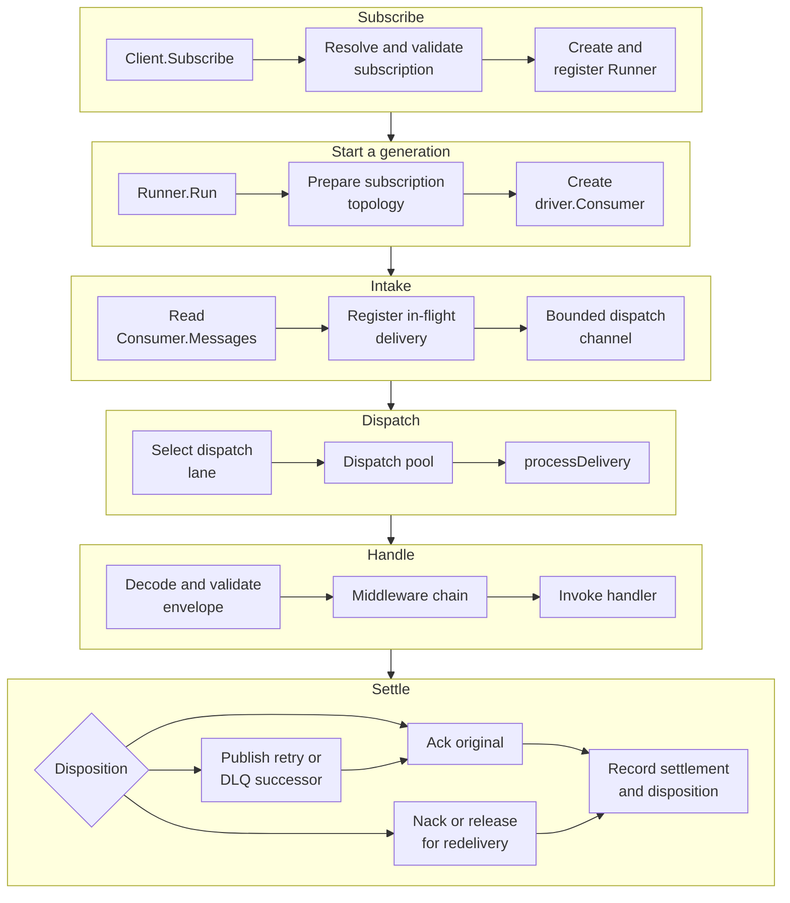
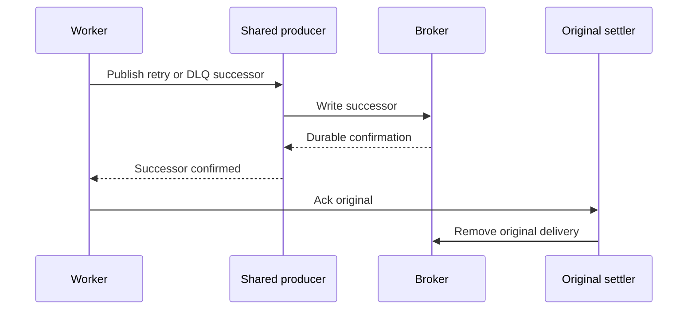
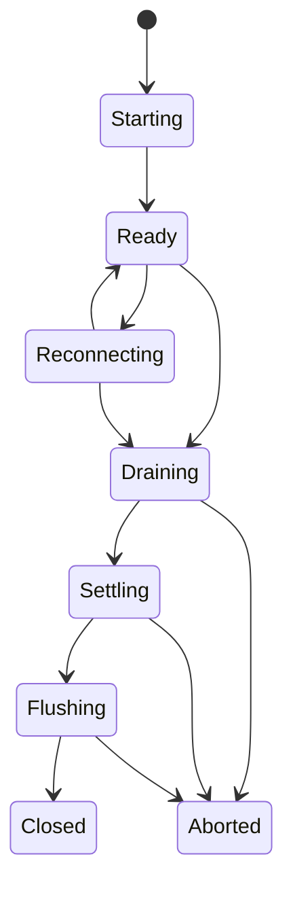

# Consume flow

This page is the canonical maintainer trace for one subscription's delivery
lifecycle. It follows the path from `Client.Subscribe` through runner startup,
broker intake, scheduling, middleware and handler execution, disposition,
settlement, drain, and reconnect.

The source and tests own exact behavior. This page records responsibility,
ordering constraints, and the boundaries between the root runtime, portable
primitives, and the driver port.

## End-to-end path

Each row is one stage, read left to right; the stages run top to bottom. The last node of a stage
feeds the first node of the next.

The main owners are:

- [`Client.Subscribe`](https://fgit.zapps.vn/zatf2026-be-t3/event-driven-messaging-sdk/-/blob/main/subscription.go) for configuration resolution,
  validation, middleware wrapping, and runner registration;
- [`Runner.Run`](https://fgit.zapps.vn/zatf2026-be-t3/event-driven-messaging-sdk/-/blob/main/worker.go) for generation lifecycle, consumer startup,
  fetch, dispatch, and reconnect decisions;
- [`openRunnerConsumer`](https://fgit.zapps.vn/zatf2026-be-t3/event-driven-messaging-sdk/-/blob/main/worker.go) for destinations, topology, and
  `driver.Consumer` construction;
- [`runDispatchPipeline`](https://fgit.zapps.vn/zatf2026-be-t3/event-driven-messaging-sdk/-/blob/main/worker.go) for scheduler and pool coordination;
- [`processDelivery`](https://fgit.zapps.vn/zatf2026-be-t3/event-driven-messaging-sdk/-/blob/main/worker.go) and [`dispatchMessage`](https://fgit.zapps.vn/zatf2026-be-t3/event-driven-messaging-sdk/-/blob/main/worker.go)
  for handler outcomes and settlement;
- [`internal/dispatch`](https://fgit.zapps.vn/zatf2026-be-t3/event-driven-messaging-sdk/-/blob/main/internal/dispatch/registry.go) for accepted-work
  and settlement accounting;
- [`internal/lifecycle`](https://fgit.zapps.vn/zatf2026-be-t3/event-driven-messaging-sdk/-/blob/main/internal/lifecycle/state.go) for runner state
  transitions and shutdown phases.

## Subscription creation is not runner startup

`Client.Subscribe` does not open a consumer or begin delivery. It:

1. checks that the client is connected and not closing;
2. resolves defaults, loaded configuration, environment overrides, and
   explicit subscription fields;
3. validates topics, concurrency, prefetch, priorities, retry policy, mode,
   and handler timeout;
4. rejects ordered mode when the connected effective capability does not
   provide ordered-by-key behavior;
5. wraps handlers with the client middleware chain; and
6. creates and registers a `Runner`.

The runner is ready to start, but no subscription topology or driver consumer
exists yet. The precedence and validation path is in
[`subscription.go`](https://fgit.zapps.vn/zatf2026-be-t3/event-driven-messaging-sdk/-/blob/main/subscription.go).

`Runner.Run` performs the runtime work. It can only start once, initializes the
generation contexts, lifecycle machine, in-flight registry, accounting view,
and notification groups, then enters its generation loop. A generation owns
one consumer, fetcher, dispatch pipeline, and consumer-error watcher.

This separation lets an application construct subscriptions before deciding
which goroutine owns their run loop, and lets reconnect rebuild a generation
without creating a second public subscription.

## Topology and consumer creation

`openRunnerConsumer` reads the current connection and effective capability
profile, then derives the physical destinations for:

- each configured logical topic;
- each selected priority;
- the main destination; and
- every configured retry tier, plus the dead-letter destinations.

The core owns the logical destination family. The driver receives the resulting
physical names through the port. Fanout capability determines whether a
subscription consumes a subscription-specific destination or shares the
publish entry point.

When topology policy is not `TopologyNone`, the runner passes a
`driver.TopologySpec` to `driver.Admin.EnsureTopology`. The spec includes the
main, retry, dead-letter, and capability-dependent broker backstop objects.
Missing or drifted topology fails consumer startup according to the selected
policy.

The runner then creates one `driver.Consumer` with:

- the subscription name as the consumer group or queue-set identity;
- all main and retry destinations owned by the subscription;
- the total prefetch budget;
- a calculated per-destination prefetch allocation;
- exclusive/ordered mode when ordered-by-key is requested;
- the effective capability profile; and
- the current core-selected starting position for a new group (`StartEarliest`).

The executable owner is [`openRunnerConsumer`](https://fgit.zapps.vn/zatf2026-be-t3/event-driven-messaging-sdk/-/blob/main/worker.go). The shared
consumer and topology contracts are [`driver.Consumer`](https://fgit.zapps.vn/zatf2026-be-t3/event-driven-messaging-sdk/-/blob/main/driver/driver.go),
[`driver.Admin`](https://fgit.zapps.vn/zatf2026-be-t3/event-driven-messaging-sdk/-/blob/main/driver/driver.go), and
[`driver/topology.go`](https://fgit.zapps.vn/zatf2026-be-t3/event-driven-messaging-sdk/-/blob/main/driver/topology.go). User-visible capability
behavior is explained in [Topology and capabilities](/advanced-topics/topology-and-capabilities).

## Fetching deliveries

After a consumer is ready, `Runner.Run` starts three coordinated activities:

- `fetchRunner` reads `Consumer.Messages`;
- `runDispatchPipeline` moves accepted deliveries through lanes and workers;
- `consumeRunnerErrors` observes asynchronous driver errors.

The driver owns transport delivery. Each `driver.InboundMessage` carries the
physical destination, key, headers, body, broker reference, delivery count,
and a per-delivery `driver.Settler`. The port definition is in
[`driver/message.go`](https://fgit.zapps.vn/zatf2026-be-t3/event-driven-messaging-sdk/-/blob/main/driver/message.go).

`fetchRunner` registers a delivery before placing it on the bounded dispatch
channel. Registration is important: once the driver has handed the message to
the runtime, shutdown must account for it even if dispatch is temporarily
full.

The fetch-to-dispatch channel is sized from subscription concurrency. If
fetching is cancelled, the runner calls `Consumer.Drain`, forwards deliveries
already yielded by the consumer, and requeues a delivery that cannot be
accepted locally. It does not silently discard a message that crossed the
driver boundary.

The consumer contract requires that `Messages` closes only after `Stop`, while
transient failures are reported through `Errors`. The core therefore treats a
closed message channel, a transient error, and a fatal error as different
generation outcomes.

## Dispatch lanes and scheduler

The runtime separates transport admission, lane selection, and handler
execution. `newRunnerScheduler` creates a lane for each topic, priority, and
retry tier. Retry tiers share a retry group so retry pressure can be weighted
below fresh traffic without losing per-tier visibility.

The scheduler uses:

- bounded lane capacity derived from subscription concurrency, fairness weights,
  prefetch, and the prefetch factor;
- deficit weighted round-robin selection across groups; and
- optional age-based promotion when a lane exceeds its configured budget.

Retry lanes normally receive a reduced weight and a larger aging budget. This
keeps a retry storm from consuming all handler capacity while still preventing
an eligible lane from starving indefinitely.

The scheduler implementation is in
[`internal/sched/scheduler.go`](https://fgit.zapps.vn/zatf2026-be-t3/event-driven-messaging-sdk/-/blob/main/internal/sched/scheduler.go) and the
runner's lane construction is in [`newRunnerScheduler`](https://fgit.zapps.vn/zatf2026-be-t3/event-driven-messaging-sdk/-/blob/main/worker.go).

When a lane is full, `runDispatchPipeline` keeps one pending delivery and waits
for worker capacity. It does not grow an unbounded in-memory queue. This is the
second backpressure boundary after driver prefetch.

## Dispatch pool, ordering, and concurrency

`internal/dispatch.Pool` executes the selected work:

- unordered mode uses a shared worker queue;
- ordered-by-key mode hashes each message key to one worker queue;
- equal keys therefore cannot execute concurrently within the pool; and
- different keys may execute concurrently when they map to different workers.

`Subscription.Concurrency` controls the worker count and the dispatch budget.
`Subscription.Prefetch` controls the amount of transport work admitted across
the destination set. The core passes a per-destination allocation to the
driver, while the scheduler and pool enforce their own bounded queues.

Ordered mode is a portability contract, not a broker hint. `Subscribe` checks
the effective capability before accepting it, and `ConsumerConfig.Exclusive`
is set for the ordered consumer path. The pool still performs key-affine
dispatch so the handler-side ordering invariant is visible in the core.

The pool implementation is in
[`internal/dispatch/pool.go`](https://fgit.zapps.vn/zatf2026-be-t3/event-driven-messaging-sdk/-/blob/main/internal/dispatch/pool.go). Behavioral
coverage includes [`f1test/ordered_test.go`](https://fgit.zapps.vn/zatf2026-be-t3/event-driven-messaging-sdk/-/blob/main/f1test/ordered_test.go),
[`worker_ordering_test.go`](https://fgit.zapps.vn/zatf2026-be-t3/event-driven-messaging-sdk/-/blob/main/worker_ordering_test.go), and the scheduler
tests in [`internal/sched/scheduler_test.go`](https://fgit.zapps.vn/zatf2026-be-t3/event-driven-messaging-sdk/-/blob/main/internal/sched/scheduler_test.go).

## Middleware and handler execution

Subscription creation wraps each registered handler with the client middleware
chain. [`buildHandlerChain`](https://fgit.zapps.vn/zatf2026-be-t3/event-driven-messaging-sdk/-/blob/main/handler.go) applies user middleware in
submission order and places panic recovery around the resulting chain.
Classification and settlement intentionally stay outside middleware in
`dispatchMessage`, so middleware cannot accidentally acknowledge or requeue a
delivery.

For each accepted delivery, `dispatchMessage`:

1. decodes the inbound headers into an `Envelope`;
2. selects the codec from the envelope content type;
3. normalizes the attempt and applies retry-counter sanity checks;
4. rejects oversized or expired messages before handler invocation;
5. matches the envelope type to a handler;
6. creates the read-only `Event` view over the copied body and headers; and
7. invokes the wrapped handler with its configured timeout.

`invokeHandler` recovers panics, observes cancellation and shutdown, and
recognizes a non-cooperative handler as stuck after its bounded thresholds. A
stuck handler is not allowed to hold the runner indefinitely; the surrounding
`processDelivery` cleanup decides how the unsettled delivery is returned.

The handler and middleware contracts are in [`handler.go`](https://fgit.zapps.vn/zatf2026-be-t3/event-driven-messaging-sdk/-/blob/main/handler.go).
The user-facing message and middleware model is documented in
[Message](/basics/message) and [Middleware](/basics/middleware).

## Delivery decisions

The result of handler processing determines the intended disposition of the
original delivery:

| Condition | Core action | Original delivery |
| --- | --- | --- |
| Handler succeeds | Record handled disposition | Ack |
| Handler explicitly drops | Notify `OnDiscarded` | Ack without successor |
| No handler, unmatched policy `Ignore` | Notify discarded | Ack without successor |
| No handler, unmatched policy `DeadLetter` | Build DLQ successor | Ack after successor publication |
| Retryable error with attempts remaining | Build retry successor with next attempt and due time | Ack after successor publication |
| Retryable error at maximum attempts | Build DLQ successor | Ack after successor publication |
| Terminal error or panic | Build DLQ successor | Ack after successor publication |
| Decode, invalid codec, poison, or expired message | Build DLQ successor when possible | Ack after successor publication |
| Successor publication cannot be confirmed | Stop settling the original | Release for broker redelivery |
| Handler or settlement remains incomplete during shutdown | Preserve broker ownership where possible | Requeue, release, unknown, or abandoned outcome |

The decision tree is implemented by
[`dispatchMessage`](https://fgit.zapps.vn/zatf2026-be-t3/event-driven-messaging-sdk/-/blob/main/worker.go), with error categories in
[`errors.go`](https://fgit.zapps.vn/zatf2026-be-t3/event-driven-messaging-sdk/-/blob/main/errors.go) and retry mechanics in
[`internal/retry`](https://fgit.zapps.vn/zatf2026-be-t3/event-driven-messaging-sdk/-/blob/main/internal/retry/classify.go).

### Retry, delay, and successor destinations

`retryAndSettle` carries the already-received body forward, increments the
attempt, resolves the retry tier and delay, encodes the updated envelope, and
publishes to the retry destination. The destination topology supplies the
configured delay; the outbound message also carries `DelayUntil` for drivers
that implement deferred delivery through the port.

Dead-letter copies preserve the original body and add death metadata. Decode
failures that cannot produce an envelope use the stable `unknown` dead-letter
family. The destination family is resolved from the configured subscription
topology before falling back to the event type, because an explicit publish
topic or fanout path can make the event type an unreliable physical-family
guide.

Successor publication has a bounded retry budget. If it still cannot be
confirmed, the core releases the consumer rather than acknowledging the source
delivery. This deliberately chooses broker redelivery over losing a message or
pretending that the successor exists.

User-facing retry and dead-letter policy is documented in
[Failure handling](/advanced-topics/failure-handling).

## Settle-last ordering

Retry and dead-letter routing are successor handoffs, not in-place mutations of
the source delivery:

The source is acknowledged only after the successor publish returns success.
If the successor publish or source settlement is uncertain, the original stays
eligible for redelivery. A crash after successor confirmation and before the
ack can duplicate the successor; at-least-once delivery means handlers must
remain idempotent.

The implementation is in [`retryAndSettle`](https://fgit.zapps.vn/zatf2026-be-t3/event-driven-messaging-sdk/-/blob/main/worker.go),
[`deadLetterAndSettle`](https://fgit.zapps.vn/zatf2026-be-t3/event-driven-messaging-sdk/-/blob/main/worker.go), and
[`publishSuccessor`](https://fgit.zapps.vn/zatf2026-be-t3/event-driven-messaging-sdk/-/blob/main/worker.go). The settlement port is
[`driver.Settler`](https://fgit.zapps.vn/zatf2026-be-t3/event-driven-messaging-sdk/-/blob/main/driver/message.go), whose `Ack` and `Nack` operations
must not be applied more than once by a driver.

## In-flight accounting and settlement cleanup

The runtime tracks two related but different facts for each accepted delivery:

1. **Intended message disposition:** handled, requeued, retried, or
   dead-lettered.
2. **Settlement outcome:** settled, requeued, unknown, or abandoned.

`internal/dispatch.Registry` registers a delivery before dispatch and removes
it only after the settlement result is known or the bounded cleanup budget is
exhausted. `WaitZero` is the runner's proof that accepted work has left the
in-flight set.

`processDelivery` owns the final cleanup defer. It:

- recovers a panic that escaped the middleware wrapper and attempts a DLQ path;
- requeues an abandoned delivery when no settlement was attempted;
- retries the last ack or nack operation for a bounded number of rounds;
- falls back from a failed ack to a requeue nack during cleanup; and
- records the final accounting outcome in the registry.

This distinction matters when a driver call returns an error: the intended
disposition may be known while the broker-side settlement remains unknown.
The registry and accounting types are in
[`internal/dispatch/registry.go`](https://fgit.zapps.vn/zatf2026-be-t3/event-driven-messaging-sdk/-/blob/main/internal/dispatch/registry.go) and
[`internal/lifecycle/accounting.go`](https://fgit.zapps.vn/zatf2026-be-t3/event-driven-messaging-sdk/-/blob/main/internal/lifecycle/accounting.go).
Settlement behavior is covered by [`settlement_state_test.go`](https://fgit.zapps.vn/zatf2026-be-t3/event-driven-messaging-sdk/-/blob/main/settlement_state_test.go),
[`worker_settlement_test.go`](https://fgit.zapps.vn/zatf2026-be-t3/event-driven-messaging-sdk/-/blob/main/worker_settlement_test.go), and the driver
settlement suites.

## Drain and shutdown

`Runner.Drain` transitions a ready or reconnecting runner to draining, marks
the runner as no longer accepting normal intake, cancels the generation, and
waits for `Runner.Run` to finish. The cancellation path first calls
`Consumer.Drain`, then forwards messages already yielded by the driver while
the dispatch pipeline settles accepted work.

Handler cancellation is staged. The configured lifecycle budget leaves the
handler grace period available before the shutdown context is cancelled more
forcefully. Non-cooperative handlers and terminal callbacks are not waited on
indefinitely; the runner keeps settlement and shutdown bounded.

The lifecycle machine uses these phases:

For a normal runner drain, `WaitSettled` waits for the in-flight registry to
reach zero and the consumer is then stopped. If `Stop` refuses because the
driver still owns outstanding deliveries, the runner uses `Release` so those
deliveries can be redelivered. `Release` is not a retry disposition; it returns
broker-owned work without claiming that the message was handled.

`Client.Close` drains all registered runners before waiting for active publishes
and closing shared producer/connection resources. The lifecycle implementation
is in [`internal/lifecycle/drain.go`](https://fgit.zapps.vn/zatf2026-be-t3/event-driven-messaging-sdk/-/blob/main/internal/lifecycle/drain.go), with
runner integration in [`Runner.Drain`](https://fgit.zapps.vn/zatf2026-be-t3/event-driven-messaging-sdk/-/blob/main/worker.go),
[`drainAfterRun`](https://fgit.zapps.vn/zatf2026-be-t3/event-driven-messaging-sdk/-/blob/main/reconnect.go), and [`Client.Close`](https://fgit.zapps.vn/zatf2026-be-t3/event-driven-messaging-sdk/-/blob/main/client.go).
User-visible shutdown behavior is documented in
[Lifecycle and shutdown](/advanced-topics/lifecycle-and-shutdown).

## Reconnect behavior

`Consumer.Errors` is observed separately from message intake:

- notification errors are reported without ending the generation;
- transient or unclassified errors record a reconnect cause and cancel the
  generation;
- fatal errors mark the runner failed, and any error that ends a started
  runner is recorded in client health, except after the caller's cancel, a
  drain, or the start of client shutdown; the record stays until a runner
  with the same subscription name reaches ready again;
- a canceled generation drains or releases its consumer according to the
  outstanding-delivery state.

The runner may first repair a consumer generation. If the connection itself
must be rebuilt, it transitions to reconnecting and asks the client supervisor
to coordinate the handoff. [`Runner.abandonForReconnect`](https://fgit.zapps.vn/zatf2026-be-t3/event-driven-messaging-sdk/-/blob/main/reconnect.go)
cancels the generation and calls `Consumer.Release`, deliberately leaving
unsettled deliveries for broker redelivery rather than classifying them as
application retries.

The client reconnect path then waits for publish quiescence, opens a replacement
connection, derives its effective capabilities, re-establishes topology, swaps
the live connection, and lets the runner create a fresh consumer generation.
The complete connection path is in [`reconnect.go`](https://fgit.zapps.vn/zatf2026-be-t3/event-driven-messaging-sdk/-/blob/main/reconnect.go).
A runner that starts, or opens a new generation, while a reconnect is in
progress waits for it and opens on the replacement connection. A consumer
that was opened on the old connection as the reconnect began is released
before its generation starts.

After a successful repair, lifecycle state returns to ready. If reconnect
attempts are exhausted or a fatal consumer condition remains, the runner records
the failure and stops rather than silently losing the subscription.

## Trace checklist for changes

When changing consume behavior, follow this order:

1. Subscription resolution and middleware wrapping in
   [`subscription.go`](https://fgit.zapps.vn/zatf2026-be-t3/event-driven-messaging-sdk/-/blob/main/subscription.go).
2. Runner generation, topology, fetching, and lifecycle transitions in
   [`worker.go`](https://fgit.zapps.vn/zatf2026-be-t3/event-driven-messaging-sdk/-/blob/main/worker.go).
3. Ordered dispatch and in-flight registry behavior in
   [`internal/dispatch/pool.go`](https://fgit.zapps.vn/zatf2026-be-t3/event-driven-messaging-sdk/-/blob/main/internal/dispatch/pool.go) and
   [`internal/dispatch/registry.go`](https://fgit.zapps.vn/zatf2026-be-t3/event-driven-messaging-sdk/-/blob/main/internal/dispatch/registry.go).
4. Fairness, retry-lane weighting, and aging in
   [`internal/sched/scheduler.go`](https://fgit.zapps.vn/zatf2026-be-t3/event-driven-messaging-sdk/-/blob/main/internal/sched/scheduler.go).
5. Retry classification and destination construction in
   [`internal/retry/classify.go`](https://fgit.zapps.vn/zatf2026-be-t3/event-driven-messaging-sdk/-/blob/main/internal/retry/classify.go) and
   [`worker.go`](https://fgit.zapps.vn/zatf2026-be-t3/event-driven-messaging-sdk/-/blob/main/worker.go).
6. Driver delivery and settlement semantics in
   [`driver/driver.go`](https://fgit.zapps.vn/zatf2026-be-t3/event-driven-messaging-sdk/-/blob/main/driver/driver.go) and
   [`driver/message.go`](https://fgit.zapps.vn/zatf2026-be-t3/event-driven-messaging-sdk/-/blob/main/driver/message.go).
7. Reconnect and shutdown handoff in [`reconnect.go`](https://fgit.zapps.vn/zatf2026-be-t3/event-driven-messaging-sdk/-/blob/main/reconnect.go).
8. Root, `f1test`, conformance, and provider tests before changing a port or
   lifecycle contract.

The former root-level consume, scheduling, and settlement documents are now
consolidated here. They can be removed after inbound links are migrated; this
development page is the canonical maintainer route.
