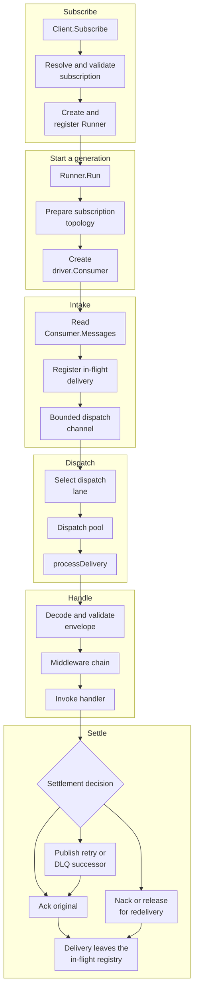
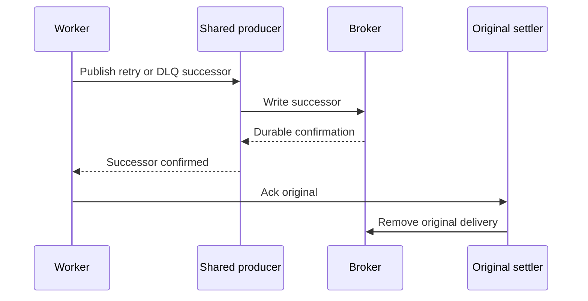
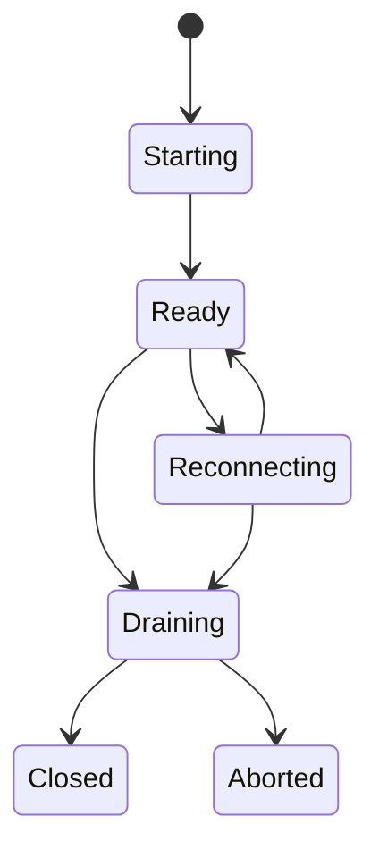

# Consume flow

F1 carries each subscription's deliveries from runner startup through handling,
acks, drain, and reconnect. This maintainer trace follows the path from `Client.Subscribe` through runner startup,
broker intake, scheduling, middleware and handler execution, delivery decisions,
settlement, drain, and reconnect.

The source and tests own exact behavior. This page records responsibility,
ordering constraints, and the boundaries between the root runtime, portable
primitives, and the driver port.

## End-to-end path

Each row is one stage, read left to right; the stages run top to bottom. The last node of a stage
feeds the first node of the next.

The main owners are:

- [`Client.Subscribe`](https://fgit.zapps.vn/zatf2026-be-t3/event-driven-messaging-sdk/-/blob/main/subscription.go) for configuration resolution,
  validation, middleware wrapping, and runner registration;
- [`Runner.Run`](https://fgit.zapps.vn/zatf2026-be-t3/event-driven-messaging-sdk/-/blob/main/worker.go) for generation lifecycle, consumer startup,
  fetch, dispatch, and reconnect decisions;
- [`openRunnerConsumerWith`](https://fgit.zapps.vn/zatf2026-be-t3/event-driven-messaging-sdk/-/blob/main/worker.go) for destinations, topology, and
  `driver.Consumer` construction;
- [`runDispatchPipeline`](https://fgit.zapps.vn/zatf2026-be-t3/event-driven-messaging-sdk/-/blob/main/worker.go) for scheduler and pool coordination;
- [`processDelivery`](https://fgit.zapps.vn/zatf2026-be-t3/event-driven-messaging-sdk/-/blob/main/worker.go) and [`dispatchMessage`](https://fgit.zapps.vn/zatf2026-be-t3/event-driven-messaging-sdk/-/blob/main/worker.go)
  for handler outcomes and settlement;
- [`internal/dispatch`](https://fgit.zapps.vn/zatf2026-be-t3/event-driven-messaging-sdk/-/blob/main/internal/dispatch/pool.go) for the dispatch pool,
  ordered-key routing, and the in-flight registry;
- [`internal/lifecycle`](https://fgit.zapps.vn/zatf2026-be-t3/event-driven-messaging-sdk/-/blob/main/internal/lifecycle/state.go) for runner state
  transitions and shutdown phases.

## Subscription creation is not runner startup

`Client.Subscribe` does not open a consumer or begin delivery. It:

1. checks that the client is connected and not closing;
2. resolves defaults, loaded configuration, environment overrides, and
   explicit subscription fields;
3. validates topics, concurrency, prefetch, priorities, retry policy, mode,
   and handler timeout;
4. rejects ordered mode when the connected effective capability does not
   provide ordered-by-key behavior;
5. wraps handlers with the client middleware chain; and
6. creates and registers a `Runner`.

The runner is ready to start, but no subscription topology or driver consumer
exists yet. The precedence and validation path is in
[`subscription.go`](https://fgit.zapps.vn/zatf2026-be-t3/event-driven-messaging-sdk/-/blob/main/subscription.go).

`Runner.Run` performs the runtime work. It can only start once. It initializes
the generation contexts, its lifecycle machine, the in-flight registry, and the
notification groups, then runs one owner loop on the calling goroutine. Every
other goroutine in the runner reports to that loop as an event, and the loop's
only blocking read is its event channel, so the runner is never parked where it
cannot be told to stop: opening a consumer, waiting for a connection rebuild,
and releasing a consumer each run on a sibling goroutine and hand their result
back as an event.

A generation owns one consumer, fetcher, dispatch pipeline, and consumer-error
watcher, plus the connection epoch its consumer was opened on. The epoch is the
client's connection incarnation: the client installs a connection and its number
as one value, so a number that has moved means the connection the runner opened
on was replaced under it.

The runner's reconnect work reads that one value instead of keeping its own copy
of the connection: an open returns the epoch it read together with the consumer,
admission of a new consumer compares that epoch under the client lock, and a
generation that finds the epoch moved releases its consumer and opens again on
the replacement.

This separation lets an application construct subscriptions before deciding
which goroutine owns their run loop, and lets reconnect rebuild a generation
without creating a second public subscription.

## Topology and consumer creation

`openRunnerConsumerWith` reads the current connection, its epoch, the effective
capability profile, and the source in one critical section, then derives the
physical destinations for:

- each configured logical topic;
- each selected priority;
- the main destination; and
- every configured retry tier, plus the dead-letter destinations.

The core owns the logical destination family. The driver receives the resulting
physical names through the port. Fanout capability determines whether a
subscription consumes a subscription-specific destination or shares the
publish entry point.

Every policy goes through the admin, `TopologyNone` included: the runner passes
a `driver.TopologySpec` carrying the selected policy to
`driver.Admin.EnsureTopology`, and the spec includes the main, retry,
dead-letter, and capability-dependent broker backstop objects. What each
policy asks of the driver is in
[Driver contract](/development/driver-contract#driver-admin-and-topology).

The runner then creates one `driver.Consumer` with:

- the subscription name as the consumer group or queue-set identity;
- all main and retry destinations owned by the subscription;
- the resolved positive SDK admission total ([prefetch resolution](/advanced-topics/configuration#prefetch-resolution));
- the full per-destination lane capacities, not a split of that total;
- exclusive/ordered mode when ordered-by-key is requested;
- the effective capability profile; and
- the current core-selected starting position for a new group (`StartEarliest`).

The executable owner is [`openRunnerConsumerWith`](https://fgit.zapps.vn/zatf2026-be-t3/event-driven-messaging-sdk/-/blob/main/worker.go). It returns the
epoch it read along with the consumer, so the caller admits what it built
against the incarnation it was built on. The shared
consumer and topology contracts are [`driver.Consumer`](https://fgit.zapps.vn/zatf2026-be-t3/event-driven-messaging-sdk/-/blob/main/driver/driver.go),
[`driver.Admin`](https://fgit.zapps.vn/zatf2026-be-t3/event-driven-messaging-sdk/-/blob/main/driver/driver.go), and
[`driver/topology.go`](https://fgit.zapps.vn/zatf2026-be-t3/event-driven-messaging-sdk/-/blob/main/driver/topology.go). User-visible capability
behavior is explained in [Topology and capabilities](/advanced-topics/topology-and-capabilities).

## Fetching deliveries

After a consumer is ready, `Runner.Run` starts three coordinated activities:

- `fetchRunner` reads `Consumer.Messages`;
- `runDispatchPipeline` moves accepted deliveries through lanes and workers;
- `consumeRunnerErrors` observes asynchronous driver errors.

All three belong to one generation and are cancelled with it. The fetcher reads
the consumer that generation admitted, so a repair cancels the fetch of the
consumer it is replacing and never the fetch of a newer generation.

If dispatch exits while fetch is blocked on a full channel, fetch cannot make
progress without its reader. Canceling the generation's sources together
breaks that wait, so repair or drain can proceed.

The driver owns transport delivery. Each `driver.InboundMessage` carries the
physical destination, key, headers, body, broker reference, delivery count,
and a per-delivery `driver.Settler`. The port definition is in
[`driver/message.go`](https://fgit.zapps.vn/zatf2026-be-t3/event-driven-messaging-sdk/-/blob/main/driver/message.go).

`fetchRunner` registers a delivery before placing it on the bounded dispatch
channel. Registration is important: once the driver has handed the message to
the runtime, shutdown must account for it even if dispatch is temporarily
full.

The fetch-to-dispatch channel is sized from subscription concurrency. If
fetching is cancelled, the runner calls `Consumer.Drain`, forwards deliveries
already yielded by the consumer, and requeues a delivery that cannot be
accepted locally. It does not silently discard a message that crossed the
driver boundary.

The consumer contract requires that `Messages` stays open until `Stop` or
`Release` completes, while
transient failures are reported through `Errors`. The core therefore treats a
closed message channel, a transient error, and a fatal error as different
generation outcomes.

## Observer call sites

When a client has an observer, the consume path emits events at these
boundaries:

- `Client.New` records `ObserverDriverSelected` after the driver opens.
- `fetchRunner` records `ObserverDeliveryReceived` when a delivery is admitted
  to dispatch.
- `processDelivery` pairs `ObserverProcess` around the handler invocation and
  carries the returned context to the handler.
- Settlement pairs `ObserverSettle` around acknowledgement or negative
  acknowledgement.
- Retry and dead-letter decisions record their point events. A retry point is
  emitted after the successor is confirmed; a dead-letter publication point is
  emitted after its successor is confirmed.
- The backlog poll loop records `ObserverBacklogSampled` per sampled
  destination, and deadline promotion records `ObserverDeadlinePromoted`.
- Drain and reconnect paths emit their paired or point lifecycle events.

Observer methods run synchronously on these paths, without a client or runner
lock held. The adapter must therefore be concurrent-safe and non-blocking.

`worker.go:invokeHandlerMessage` calls `observer_call.go:Client.observeStart` for `process`, passes its returned context to the handler, and finishes through `worker.go:finishProcessResult` or guard abandonment. `worker.go:startSettleObservation` starts Ack or Nack observation, and `worker.go:startSuccessorPublish` starts retry and DLQ sends. Both complete through `worker.go:finishObservationFromError`. `worker.go:retryAndSettle` and `worker.go:deadLetter` call `observer_call.go:Client.injectTrace` before sending.

## Dispatch lanes and scheduler

The runtime separates transport admission, lane selection, and handler
execution. `newRunnerScheduler` creates a lane for each topic, priority, and
retry tier. Retry tiers share a retry group so retry pressure can be weighted
below fresh traffic without losing per-tier visibility.

- bounded lane capacity owned by `runnerLanePlan` in
  [`worker.go`](https://fgit.zapps.vn/zatf2026-be-t3/event-driven-messaging-sdk/-/blob/main/worker.go); automatic and explicit totals share those destination windows;
- smooth weighted round-robin selection across groups; every weighted pick scans all slots to accrue weights and choose the highest deficit; and
- optional deadline promotion when a lane exceeds its configured budget.

Deadline promotion chooses the lane furthest past its budget, not the lane with
the earliest absolute deadline. `runDispatchPipeline` timestamps a delivery
when it leaves the fetch channel; `enqueuePendingDelivery` preserves that
timestamp while waiting for lane space. Broker backlog and time still in the
fetch channel are outside this clock.

Retry lanes normally receive a reduced weight and a larger budget. Weights
share normal picks among non-empty groups; overdue picks are additional
opportunities, not a maximum-wait guarantee.

The scheduler implementation is in
[`internal/sched/scheduler.go`](https://fgit.zapps.vn/zatf2026-be-t3/event-driven-messaging-sdk/-/blob/main/internal/sched/scheduler.go) and the
runner's lane construction is in [`newRunnerScheduler`](https://fgit.zapps.vn/zatf2026-be-t3/event-driven-messaging-sdk/-/blob/main/worker.go).

For the design and trade-offs behind these lanes, see [how F1 schedules deliveries](/deep-dives/scheduler).

When a lane is full, `runDispatchPipeline` keeps one pending delivery and waits
for worker capacity. It does not grow an unbounded in-memory queue. This is the
second backpressure boundary after driver prefetch.

## Dispatch pool, ordering, and concurrency

`internal/dispatch.Pool` executes the selected work:

- unordered mode uses a shared worker queue;
- ordered-by-key mode hashes each message key to one worker queue;
- equal-key work items serialize within the pool, subject to the handler
  abandonment boundary below; and
- different keys may execute concurrently when they map to different workers.

`Subscription.Concurrency` controls the worker count and the dispatch budget.
For total SDK admission and destination ceilings, use the
[prefetch contract](/advanced-topics/configuration#prefetch-resolution) and
[`ConsumerConfig`](https://fgit.zapps.vn/zatf2026-be-t3/event-driven-messaging-sdk/-/blob/main/driver/driver.go).
These ceilings are distinct from transport buffering and may be reduced by a
driver's physical limits; [Kafka partition limits](/drivers/kafka#kafka-parallelism-and-partitions)
explain the operational consequence.

Ordered mode is a portability contract, not a broker hint. `Subscribe` checks
the effective capability before accepting it, and `ConsumerConfig.Exclusive`
is set for the ordered consumer path. The pool still performs key-affine
dispatch so the handler-side ordering invariant is visible in the core.

The pool implementation is in
[`internal/dispatch/pool.go`](https://fgit.zapps.vn/zatf2026-be-t3/event-driven-messaging-sdk/-/blob/main/internal/dispatch/pool.go). Behavioral
coverage includes [`f1test/ordered_test.go`](https://fgit.zapps.vn/zatf2026-be-t3/event-driven-messaging-sdk/-/blob/main/f1test/ordered_test.go),
[`worker_ordering_test.go`](https://fgit.zapps.vn/zatf2026-be-t3/event-driven-messaging-sdk/-/blob/main/worker_ordering_test.go), and the scheduler
tests in [`internal/sched/scheduler_test.go`](https://fgit.zapps.vn/zatf2026-be-t3/event-driven-messaging-sdk/-/blob/main/internal/sched/scheduler_test.go).

## Middleware and handler execution

Subscription creation wraps each registered handler with the client middleware
chain. [`buildHandlerChain`](https://fgit.zapps.vn/zatf2026-be-t3/event-driven-messaging-sdk/-/blob/main/handler.go) applies user middleware in
submission order and places panic recovery around the resulting chain.
Classification and settlement intentionally stay outside middleware in
`dispatchMessage`, so middleware cannot accidentally acknowledge or requeue a
delivery.

For each accepted delivery, `dispatchMessage`:

1. decodes the inbound headers into an `Envelope`;
2. selects the codec from the envelope content type;
3. normalizes the attempt and applies retry-counter sanity checks;
4. rejects oversized or expired messages before handler invocation;
5. matches the envelope type to a handler;
6. creates the read-only `Event` view over the copied body and headers; and
7. invokes the wrapped handler with its configured timeout.

`invokeHandler` recovers panics, observes cancellation and shutdown, and
recognizes a non-cooperative handler as stuck after its bounded thresholds. A
stuck handler is not allowed to hold the runner indefinitely; the surrounding
`processDelivery` cleanup decides how the unsettled delivery is returned.

### Running the handler

The handler runs on its own goroutine. Its timeout cancels its context, but
cancellation does not itself choose a delivery outcome: a handler that returns
nil after cancellation can still be acknowledged.

If the handler ignores cancellation, `invokeHandlerMessage` eventually stops
waiting and marks the delivery abandoned. Deferred `processDelivery` cleanup
attempts a requeue without incrementing the attempt. Go cannot stop the
application goroutine, so the worker can accept another delivery while that
goroutine still runs. This can exceed configured handler concurrency and
overlap equal-key effects even in ordered mode.

Cancellation must reach downstream work. Neither a worker slot nor an
idempotency key can undo an effect still executing after its delivery was
abandoned.

The handler and middleware contracts are in [`handler.go`](https://fgit.zapps.vn/zatf2026-be-t3/event-driven-messaging-sdk/-/blob/main/handler.go).
The user-facing message and middleware model is documented in
[Message](/basics/message) and [Middleware](/basics/middleware).

## Delivery decisions

The result of handler processing determines how the original delivery is
settled:

| Condition | Core action | Original delivery |
| --- | --- | --- |
| Handler succeeds | Mark the generation handled | Ack |
| Handler explicitly drops | Notify `OnDiscarded` | Ack without successor |
| No handler, unmatched policy `Ignore` | Notify discarded | Ack without successor |
| No handler, unmatched policy `DeadLetter` | Build DLQ successor | Ack after successor publication |
| Retryable error with attempts remaining | Build retry successor with next attempt and due time | Ack after successor publication |
| Retryable error at maximum attempts | Build DLQ successor | Ack after successor publication |
| Terminal error or panic | Build DLQ successor | Ack after successor publication |
| Decode, invalid codec, poison, or expired message | Build DLQ successor when possible | Ack after successor publication |
| Successor publication cannot be confirmed | Stop settling the original | Release for broker redelivery |
| Handler or settlement remains incomplete during shutdown | Preserve broker ownership where possible | Requeue, release, unknown, or abandoned outcome |

The interactive figure illustrates the outcome branches, not scheduler timing
or broker behavior:

<F1DeliveryPath />

The decision tree is implemented by
[`dispatchMessage`](https://fgit.zapps.vn/zatf2026-be-t3/event-driven-messaging-sdk/-/blob/main/worker.go), with error categories in
[`errors.go`](https://fgit.zapps.vn/zatf2026-be-t3/event-driven-messaging-sdk/-/blob/main/errors.go), classification in
[`worker.go`](https://fgit.zapps.vn/zatf2026-be-t3/event-driven-messaging-sdk/-/blob/main/worker.go), and retry mechanics in
[`internal/retry`](https://fgit.zapps.vn/zatf2026-be-t3/event-driven-messaging-sdk/-/blob/main/internal/retry/ladder.go).

### Retry, delay, and successor destinations

`retryAndSettle` carries the already-received body forward, increments the
attempt, resolves the retry tier and delay, encodes the updated envelope, and
publishes to the retry destination. The destination topology supplies the
configured delay. Its timing boundary depends on the driver; see
[RabbitMQ retry parking](/deep-dives/rabbitmq-delay-ladder) and
[Kafka retry delays](/deep-dives/kafka-retry-delays).

Dead-letter copies preserve the original body and add death metadata. Decode
failures that cannot produce an envelope use the stable `unknown` dead-letter
family. The destination family is resolved from the configured subscription
topology before falling back to the event type, because an explicit publish
topic or fanout path can make the event type an unreliable physical-family
guide.

Successor publication has a bounded retry budget. If it still cannot be
confirmed, the core releases the consumer rather than acknowledging the source
delivery. This deliberately chooses broker redelivery over losing a message or
pretending that the successor exists.

User-facing retry and dead-letter policy is documented in
[Failure handling](/advanced-topics/failure-handling).

## Settle-last ordering

Retry and dead-letter routing are successor handoffs, not in-place mutations of
the source delivery:

F1 confirms the successor before acknowledging the source. If the process
stops between confirmation and the source ack, the source can be redelivered
while the confirmed copy also exists. This deliberately prefers duplicates to
loss; handler effects must be idempotent.

The implementation is in [`retryAndSettle`](https://fgit.zapps.vn/zatf2026-be-t3/event-driven-messaging-sdk/-/blob/main/worker.go),
[`deadLetterAndSettle`](https://fgit.zapps.vn/zatf2026-be-t3/event-driven-messaging-sdk/-/blob/main/worker.go), and
[`publishSuccessor`](https://fgit.zapps.vn/zatf2026-be-t3/event-driven-messaging-sdk/-/blob/main/worker.go). The settlement port is
[`driver.Settler`](https://fgit.zapps.vn/zatf2026-be-t3/event-driven-messaging-sdk/-/blob/main/driver/message.go), whose `Ack` and `Nack` operations
must not be applied more than once by a driver.

## In-flight registry and settlement cleanup

The runtime tracks one fact for each accepted delivery: whether it is still in
flight. The in-flight registry (root `registry.go`, backed by
`internal/dispatch.Registry`) registers a delivery before dispatch and
removes it once its settlement path finished, or when bounded cleanup ends
without a confirmed settlement. `WaitZero` is the runner's proof that accepted work has left
the in-flight set.

Registration precedes the dispatch-channel send. If shutdown starts while the
channel is full, the delivery is already visible to cleanup rather than hidden
between owners. A zero registry means tracking has ended; it does not prove
that every broker settlement succeeded.

`processDelivery` owns the final cleanup defer. It:

- recovers a panic that escaped the middleware wrapper and attempts a DLQ path;
- requeues an abandoned delivery when no settlement was attempted;
- retries the last ack or nack operation for a bounded number of rounds;
- falls back from a failed ack to a requeue nack within a round, and tries the
  ack again in the next round; and
- removes the delivery from the in-flight registry once its settlement path
  finished.

When a driver call returns an error the broker-side settlement is unknown, so
the entry stays in the registry while bounded cleanup retries it. Cleanup can
end without a confirmed settlement. The registry is in
[`internal/dispatch/registry.go`](https://fgit.zapps.vn/zatf2026-be-t3/event-driven-messaging-sdk/-/blob/main/internal/dispatch/registry.go).
Settlement behavior is covered by [`settlement_state_test.go`](https://fgit.zapps.vn/zatf2026-be-t3/event-driven-messaging-sdk/-/blob/main/settlement_state_test.go),
[`worker_settlement_test.go`](https://fgit.zapps.vn/zatf2026-be-t3/event-driven-messaging-sdk/-/blob/main/worker_settlement_test.go), and the driver
settlement suites.

### Work selected after its consumer is gone

A reconnect can cancel intake while the pool still holds accepted work.
`dispatchMessage` checks cancellation and drain state before invoking a
handler. During a reconnect it abandons not-yet-started work for deferred
requeue; during drain it keeps processing accepted work. Using cancellation
alone as the decision would discard work a graceful drain owes.

## Drain and shutdown

`Runner.Drain` transitions a ready or reconnecting runner to draining, marks
the runner as no longer accepting normal intake, cancels the generation, and
waits for `Runner.Run` to finish. The cancellation path first calls
`Consumer.Drain`, then forwards messages already yielded by the driver while
the dispatch pipeline settles accepted work.

Handler cancellation is staged. The configured lifecycle budget leaves the
handler grace period available before the shutdown context is cancelled more
forcefully. Non-cooperative handlers and terminal callbacks are not waited on
indefinitely; the runner keeps settlement and shutdown bounded.

The lifecycle machine uses these phases:

For a normal runner drain, `drainAfterRun` waits for the in-flight registry to
reach zero under `Lifecycle.DrainTimeout`, then stops the consumer under
`Lifecycle.CloseTimeout`. A wait that fails still attempts `Stop` on a context
detached from the canceled run context. If `Stop` returns any error, including
a refusal because the driver still owns outstanding deliveries, the runner calls
`Release` so the consumer does not stay registered; after a timeout or
cancellation, `Release` uses a fresh context bounded by `Lifecycle.CloseTimeout`.

A failed wait or a `Stop`/`Release` error ends the runner `Aborted`; success ends
`Closed`; a runner that is already `Failed` stays `Failed` and returns nil.
`Release` is not a retry disposition: it returns broker-owned work without
claiming that the message was handled.

A `Release` that failed leaves the consumer registered on the driver, and a
driver refuses to close the connection that still carries one. The client keeps
that consumer with the connection it was opened on, so the release it owes is
attempted again before the connection is closed: by a later `Client.Close` for
the live connection, and by the swap that retires the connection on the way out
of a reconnect. Each attempt is bounded by `Lifecycle.CloseTimeout`, and a
release that succeeds drops the consumer from the client.

`Client.Close` drains all registered runners, waits for publish quiescence,
waits up to `Lifecycle.CloseTimeout` for a reconnect in progress to stop, and
only then closes the shared producer/connection resources. The lifecycle
package holds the state machine only, with runner integration in
[`Runner.Drain`](https://fgit.zapps.vn/zatf2026-be-t3/event-driven-messaging-sdk/-/blob/main/worker.go),
[`drainAfterRun`](https://fgit.zapps.vn/zatf2026-be-t3/event-driven-messaging-sdk/-/blob/main/reconnect.go), and [`Client.Close`](https://fgit.zapps.vn/zatf2026-be-t3/event-driven-messaging-sdk/-/blob/main/client.go).
User-visible shutdown behavior is documented in
[Lifecycle and shutdown](/advanced-topics/lifecycle-and-shutdown).

## Reconnect behavior

`Consumer.Errors` is observed separately from message intake:

- notification errors are reported without ending the generation;
- transient or unclassified errors record a reconnect cause and cancel the
  generation;
- not-found, too-large and permission errors are reported without ending the
  generation, and the reader keeps watching for a later fatal error;
- fatal errors mark the runner failed, and any error that ends a started
  runner is recorded in client health, except after the caller's cancel, a
  drain, or the start of client shutdown; the record stays until a runner
  with the same subscription name reaches ready again;
- a canceled generation drains or releases its consumer according to the
  outstanding-delivery state.

The runner may first repair a consumer generation. If the connection itself
must be rebuilt, it asks the client for one and waits on its own goroutine. The
ask and the wait are one call, `awaitRebuild`: it sends the request when the
caller's epoch is still current and no attempt is in flight, and otherwise only
waits, which is what a runner that arrived during a rebuild does.

A wait parks only where something will release it. An attempt in flight releases
the wake captured with the epoch, and a request this call sends is served by the
attempt it starts or dropped by the swap that answered it; with neither, nothing
would ever release the park, so the state is read instead. That is the caller
that arrived after the change it would have waited for had already happened.

[`Runner.abandonForReconnect`](https://fgit.zapps.vn/zatf2026-be-t3/event-driven-messaging-sdk/-/blob/main/reconnect.go)
is how the attempt takes a runner that is still on the old connection: it
cancels the generation and calls `Consumer.Release` under
`Lifecycle.CloseTimeout`, deliberately leaving
unsettled deliveries for broker redelivery rather than classifying them as
application retries, and reports the abandon to the owner loop as an event. The
open that the abandon cancelled is not a failure of the runner's: it waits for
the attempt, then opens again on what the attempt leaves behind.

The client reconnect path then waits for publish quiescence, opens a replacement
connection, derives its effective capabilities, re-establishes topology, swaps
the live connection under the next epoch, and retires the producer and the
connection the swap replaced. Every runner waiting on the previous epoch is
released by that one swap. The complete connection path is in
[`reconnect.go`](https://fgit.zapps.vn/zatf2026-be-t3/event-driven-messaging-sdk/-/blob/main/reconnect.go).

A runner that starts, or opens a new generation, while an attempt is in flight
waits for it inside `openRunnerConsumerWith` and opens on the replacement
connection. A consumer that was opened on the old connection as the attempt
began fails the admission that compares the epoch it was opened on, and the
runner releases it and opens again.

After a successful repair, the runner's lifecycle state returns to ready. If the
attempts are exhausted, or the connection was given up, the runner records the
failure and stops rather than silently losing the subscription.

## Trace checklist for changes

When changing consume behavior, follow this order:

1. Subscription resolution and middleware wrapping in
   [`subscription.go`](https://fgit.zapps.vn/zatf2026-be-t3/event-driven-messaging-sdk/-/blob/main/subscription.go).
2. Runner generation, topology, fetching, and lifecycle transitions in
   [`worker.go`](https://fgit.zapps.vn/zatf2026-be-t3/event-driven-messaging-sdk/-/blob/main/worker.go).
3. Ordered dispatch and in-flight registry behavior in
   [`internal/dispatch/pool.go`](https://fgit.zapps.vn/zatf2026-be-t3/event-driven-messaging-sdk/-/blob/main/internal/dispatch/pool.go) and
   [`internal/dispatch/registry.go`](https://fgit.zapps.vn/zatf2026-be-t3/event-driven-messaging-sdk/-/blob/main/internal/dispatch/registry.go).
4. Fairness, retry-lane weighting, and deadline promotion in
   [`internal/sched/scheduler.go`](https://fgit.zapps.vn/zatf2026-be-t3/event-driven-messaging-sdk/-/blob/main/internal/sched/scheduler.go).
5. Retry classification and destination construction in
   [`worker.go`](https://fgit.zapps.vn/zatf2026-be-t3/event-driven-messaging-sdk/-/blob/main/worker.go) and
   [`internal/retry/ladder.go`](https://fgit.zapps.vn/zatf2026-be-t3/event-driven-messaging-sdk/-/blob/main/internal/retry/ladder.go).
6. Driver delivery and settlement semantics in
   [`driver/driver.go`](https://fgit.zapps.vn/zatf2026-be-t3/event-driven-messaging-sdk/-/blob/main/driver/driver.go) and
   [`driver/message.go`](https://fgit.zapps.vn/zatf2026-be-t3/event-driven-messaging-sdk/-/blob/main/driver/message.go).
7. Reconnect and shutdown handoff in [`reconnect.go`](https://fgit.zapps.vn/zatf2026-be-t3/event-driven-messaging-sdk/-/blob/main/reconnect.go).
8. Root, `f1test`, conformance, and provider tests before changing a port or
   lifecycle contract.

## Go further

- [Publish flow](/development/publish-flow) - the outbound message path;
- [Failure handling](/advanced-topics/failure-handling) - retry and dead-letter policy;
- [Retries and dead letters](/deep-dives/retries-and-dead-letters) - copy-before-ack reasoning and failed publication.
