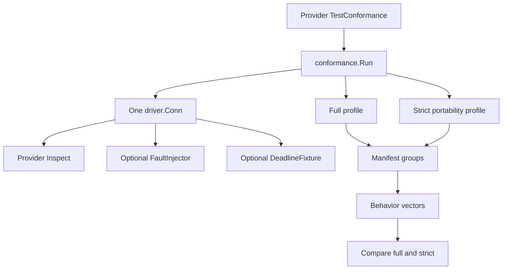

# Driver conformance

The shared conformance suite is the executable compatibility check for the
[`driver` port](https://fgit.zapps.vn/zatf2026-be-t3/event-driven-messaging-sdk/-/blob/main/driver/driver.go). It runs the same broker-independent
behavior checks against each adapter through `driver.Driver`, `driver.Conn`,
and the other port interfaces. A driver-specific test supplies only the
adapter's connection setup, broker-state inspector, and optional fault or
deadline fixtures.

The suite protects the contract described in [Driver contract](/development/driver-contract)
without making the core depend on a broker client. The exact group manifest,
check names, and declared counts remain authoritative in
[`driver/conformance/manifest.go`](https://fgit.zapps.vn/zatf2026-be-t3/event-driven-messaging-sdk/-/blob/main/driver/conformance/manifest.go) and
the group implementations under
[`driver/conformance/`](https://fgit.zapps.vn/zatf2026-be-t3/event-driven-messaging-sdk/-/tree/main/driver/conformance).

## What conformance proves

For a candidate driver, conformance proves that the port's observable rules
hold through a live connection or deterministic adapter fixture. It checks
publication, delivery, settlement, topology, lifecycle, capability
negotiation, error classification, and the broker-facing state transitions
needed by those behaviors.

It does not certify broker performance, operational sizing, provider-specific
extensions, or every failure mode of a real cluster. Those belong in the
provider's own tests and operational checks. Conformance is deliberately
narrower: it asks whether a driver can implement the shared SDK contract
without leaking broker-specific behavior into core code.

The suite also does not replace the root-package tests. The root package owns
F1 event routing, codecs, retry and dead-letter policy, dispatch, and handler
semantics. Conformance exercises the driver-level redelivery and settlement
primitives that those core policies depend on.

## Harness shape



[`conformance.Run`](https://fgit.zapps.vn/zatf2026-be-t3/event-driven-messaging-sdk/-/blob/main/driver/conformance/run.go) validates the manifest,
opens one connection, builds the provider fixtures, and runs the profile
subtests. Each profile uses isolated destinations derived from the run ID and
profile name. The tracked connection records resources and touched
destinations so failures can be cleaned up before the next group.

The runner performs a broker-state self-check before the behavior groups: it
publishes two messages, receives them, settles them, and asks the inspector to
confirm the expected ready and unsettled deltas. This catches an inspector
that reports plausible values but does not describe the same state transitions
as the driver.

## Core contract tests and provider tests

The shared package under [`driver/conformance/`](https://fgit.zapps.vn/zatf2026-be-t3/event-driven-messaging-sdk/-/tree/main/driver/conformance)
must remain broker-independent. It imports the port and standard-library test
support, not RabbitMQ, Kafka, or in-memory implementation packages. Its tests
state the contract once so every adapter receives the same checks.

The provider package owns the parts the shared suite cannot express through
the port alone:

- `drivers/inmem/conformance_test.go` adapts the in-memory connection, exposes
  broker state, injects deterministic faults, and supplies the fake-clock
  deadline fixture.
- `drivers/rabbitmq/conformance_test.go` adapts RabbitMQ queue and parked
  message inspection and uses the RabbitMQ fault injector from
  [`drivers/rabbitmq/fault_injector_test.go`](https://fgit.zapps.vn/zatf2026-be-t3/event-driven-messaging-sdk/-/blob/main/drivers/rabbitmq/fault_injector_test.go).
- `drivers/kafka/conformance_test.go` adapts Kafka offsets, consumer-group
  state, deferred records, and the Kafka fault injector. Its `TestConformance`
  is gated by `F1_KAFKA_CONFORMANCE` because the live suite is intentionally
  explicit and long-running.

Provider-specific tests remain necessary for broker APIs, reconnect details,
partition or queue behavior, management-client limitations, and any adapter
feature that is not part of the port. They must not weaken or duplicate the
shared contract to accommodate a provider.

## Full and strict profiles

`conformance.Run` runs two profiles on the same connection:

- **Full** uses the capabilities reported by the live `driver.Conn`.
- **Strict** applies [`Capabilities.Strict`](https://fgit.zapps.vn/zatf2026-be-t3/event-driven-messaging-sdk/-/blob/main/driver/capability.go),
  withdrawing native optimizations while preserving physical limits and
  semantic declarations such as ordered-by-key behavior and the broker's
  scaling model.

The strict profile is a portability probe. A driver must keep the same
observable behavior when a capability is forced off and the core selects a
portable implementation. The suite scopes destinations per profile so the
profiles do not consume or settle one another's messages.

The capability group separately checks that the live declaration is honest:
the connection cannot widen the driver's static ceiling, declared limits
match accepted boundaries, unsupported operations return the standard
classified error, and capability observations do not become behavior-vector
events. The field-level source is
[`driver/conformance/capability.go`](https://fgit.zapps.vn/zatf2026-be-t3/event-driven-messaging-sdk/-/blob/main/driver/conformance/capability.go);
the capability definitions and strict transformation are in
[`driver/capability.go`](https://fgit.zapps.vn/zatf2026-be-t3/event-driven-messaging-sdk/-/blob/main/driver/capability.go).

A native capability is an optimization, not permission to change F1
semantics. If the driver cannot provide a capability, the core must take its
portable path or report a classified unsupported result where the port allows
that outcome.

## Topology inspection

The shared suite does not assume that a queue depth, topic offset, parked
message, or in-memory list has the same representation. A provider registers
an `InspectorFactory` that returns an `Inspect` function for the connection
owned by the run. The inspector reports the common view:

- `Ready`: messages available for delivery;
- `Unsettled`: deliveries handed to a consumer but not settled; and
- `Auxiliary`: driver-held messages that exist but are not currently ready,
  such as deferred or parked records.

The inspector must honor context cancellation and return
`driver.ErrDestinationMissing` when the named destination does not exist. It
must account for the provider's deferred and consumer-held state consistently
enough for the suite to observe publish, receive, settle, drain, lag, and
topology transitions.

The topology group then checks the port's administrative behavior through
[`driver.Admin`](https://fgit.zapps.vn/zatf2026-be-t3/event-driven-messaging-sdk/-/blob/main/driver/driver.go): creation, idempotency, existing and
orphaned objects within scope, drift or verification, `TopologyNone`,
description, purge, prune, and context cancellation. The group source is
[`driver/conformance/topology.go`](https://fgit.zapps.vn/zatf2026-be-t3/event-driven-messaging-sdk/-/blob/main/driver/conformance/topology.go),
while topology types and policy semantics live in
[`driver/topology.go`](https://fgit.zapps.vn/zatf2026-be-t3/event-driven-messaging-sdk/-/blob/main/driver/topology.go).

Inspection is test support, not a new production port. Do not add a broker
depth or offset API to `driver.Conn` merely to make a conformance inspector
convenient.

## Fault injection

Fault injection makes transient and fatal paths deterministic without
pretending that all brokers fail in the same way. A provider can register a
`FaultInjector` for the connection. The shared fixture contract currently
covers these port-level conditions:

- a transient publish failure;
- a connection drop that redelivers unsettled work without closing consumer
  channels;
- a single transport-lane closure while another lane remains usable;
- a delivery failure that returns an unsettled message for redelivery;
- a fatal publish failure; and
- a close failure after admission has closed, where a retry of `Close` remains
  valid.

The failure group checks classification, recovery, absence of phantom
messages, redelivery, delivery-count behavior, stale settlement, open
`Messages` and `Errors` channels, and deterministic repeated fault sequences.
See [`driver/conformance/failure.go`](https://fgit.zapps.vn/zatf2026-be-t3/event-driven-messaging-sdk/-/blob/main/driver/conformance/failure.go) and
the provider injectors linked in the provider test section.

The optional `DeadlineFixture` is separate from fault injection. It gives the
shared suite a provider-specific way to create an acknowledgement deadline
and advance time deterministically. It is used by the deferred-delivery
checks where a real broker clock would make the assertion slow or unstable.

## Behavior covered by the shared groups

The manifest is the authority for the exact check count. The following map is
the useful reading guide, not a second test manifest:

| Behavior | What the group protects | Source |
| --- | --- | --- |
| Publish | Durable visibility, empty and canceled calls, body/header/key preservation, partial and total failure, limits, concurrency, and flush/close behavior | [`publish.go`](https://fgit.zapps.vn/zatf2026-be-t3/event-driven-messaging-sdk/-/blob/main/driver/conformance/publish.go) |
| Consume | Identity, delivery count, multi-destination intake, prefetch shares, pause/resume, start position, channel liveness, and cancellation | [`consume.go`](https://fgit.zapps.vn/zatf2026-be-t3/event-driven-messaging-sdk/-/blob/main/driver/conformance/consume.go) |
| Settlement | Ack, requeue and discard nack, no double settlement, out-of-order accounting, concurrent settlement, and cancellation | [`settle.go`](https://fgit.zapps.vn/zatf2026-be-t3/event-driven-messaging-sdk/-/blob/main/driver/conformance/settle.go) |
| Retry and redelivery | Transient recovery, delivery faults, redelivery count, stale settlement, and classified fatal errors at the driver boundary | [`failure.go`](https://fgit.zapps.vn/zatf2026-be-t3/event-driven-messaging-sdk/-/blob/main/driver/conformance/failure.go) |
| Ordering | Equal-key receipt order, independent-key progress, requeued-key precedence, nil keys, and usable exclusive ordering | [`ordering.go`](https://fgit.zapps.vn/zatf2026-be-t3/event-driven-messaging-sdk/-/blob/main/driver/conformance/ordering.go) |
| Deferred delivery | Due-time behavior, destination delay, auxiliary depth, and delivery-deadline interaction | [`deferred.go`](https://fgit.zapps.vn/zatf2026-be-t3/event-driven-messaging-sdk/-/blob/main/driver/conformance/deferred.go) |
| Draining | Stop-fetch semantics, settleability after drain, open channels, refusal and timeout, idempotence, stop closure, and release redelivery | [`drain.go`](https://fgit.zapps.vn/zatf2026-be-t3/event-driven-messaging-sdk/-/blob/main/driver/conformance/drain.go) |
| Rebalance | Work redistribution, per-consumer budgets, in-flight transfer, key ordering across ownership changes, and stable repeated departure | [`rebalance.go`](https://fgit.zapps.vn/zatf2026-be-t3/event-driven-messaging-sdk/-/blob/main/driver/conformance/rebalance.go) |
| Lag | Per-destination coverage, backlog growth and fall, broker-depth agreement, and classified unsupported behavior | [`lag.go`](https://fgit.zapps.vn/zatf2026-be-t3/event-driven-messaging-sdk/-/blob/main/driver/conformance/lag.go) |
| Topology | Admin policies, scope, drift, description, purge, prune, and cancellation | [`topology.go`](https://fgit.zapps.vn/zatf2026-be-t3/event-driven-messaging-sdk/-/blob/main/driver/conformance/topology.go) |
| Capabilities | Declaration honesty, native and portable paths, limits, scaling, fanout, priority, and capability-report isolation | [`capability.go`](https://fgit.zapps.vn/zatf2026-be-t3/event-driven-messaging-sdk/-/blob/main/driver/conformance/capability.go) |

The suite tests driver-level retry and redelivery primitives. It does not
reproduce the root worker's retry ladder or dead-letter successor publication;
those semantics belong to [failure handling](/advanced-topics/failure-handling)
and [consume flow](/development/consume-flow).

## Behavior vectors and reports

Each check records only stable, observable events in a
[`BehaviorVector`](https://fgit.zapps.vn/zatf2026-be-t3/event-driven-messaging-sdk/-/blob/main/driver/conformance/types.go). An event has an ID,
outcome, optional attempt count, and final destination. The vector is ordered
by observation, which makes differences attributable to a specific event
rather than to broker-specific logs or timing.

After both profiles finish, [`BehaviorVector.Diff`](https://fgit.zapps.vn/zatf2026-be-t3/event-driven-messaging-sdk/-/blob/main/driver/conformance/types.go)
compares length and event values position by position. A full-versus-strict
difference fails the run. This catches a portable path that passes in
isolation but changes the result when native capabilities are unavailable.

The report also records profile group status, declared and observed group
counts, explicit fixture-gated skips, capability observations, and pending
groups. `Run` logs a JSON report; the in-memory test additionally exercises the
Markdown report writer. Use [`Report`](https://fgit.zapps.vn/zatf2026-be-t3/event-driven-messaging-sdk/-/blob/main/driver/conformance/types.go) and
the report writers in [`run.go`](https://fgit.zapps.vn/zatf2026-be-t3/event-driven-messaging-sdk/-/blob/main/driver/conformance/run.go) when a
machine-readable or archived result is needed.

## Pending and unsupported checks

There are three different states, and a driver implementation must not blur
them:

1. A behavior is implemented and passes. It contributes to the vector and the
   group count.
2. A fixture-gated check cannot run. The group must record it through
   `group.Skip` with a reason. The result is visible as a skipped check or a
   `passed-with-skips` group, not as an unreported pass.
3. A conformance group is not implemented yet. Its name must appear in both
   the manifest and `pendingGroups`, with no registered runner. Manifest
   validation rejects a group that is both pending and implemented, missing
   from the manifest, or absent from both sets.

An unavailable optional interface such as `driver.Maintenance` is an explicit
fixture condition for the checks that require it. An unsupported capability is
different: when the effective declaration says the capability is absent, the
driver must return the port's expected classified unsupported result or the
core must use the portable path. It must not skip a check merely because the
driver does not implement an optional optimization.

The authoritative pending list and group counts are in
[`manifest.go`](https://fgit.zapps.vn/zatf2026-be-t3/event-driven-messaging-sdk/-/blob/main/driver/conformance/manifest.go). Do not copy the list or
counts into another document.

## Adding a driver

When a new adapter is ready to implement the port, use this sequence:

1. Implement the interfaces and behavioral rules in [Driver contract](/development/driver-contract).
   Keep broker clients and physical destination logic inside the new
   `drivers/<name>/` package.
2. Add a provider conformance test modeled on
   [`drivers/inmem/conformance_test.go`](https://fgit.zapps.vn/zatf2026-be-t3/event-driven-messaging-sdk/-/blob/main/drivers/inmem/conformance_test.go)
   or the connected adapters. Call `conformance.Run` with the driver,
   connection config, and an `InspectorFactory`.
3. Implement an inspector that reads the broker's ready, unsettled, and
   auxiliary state for the one connection passed by the harness. Validate its
   own publish/receive/settle deltas before relying on it in a behavior group.
4. Register a fault injector when the provider can deterministically exercise
   the shared failure contract. Register a deadline fixture only when the
   provider needs adapter-specific clock or acknowledgement-deadline control.
5. Make provider cleanup safe for failed groups. The harness tracks resources
   and uses `driver.Maintenance` when available, but the adapter must still
   release consumers, close producers, and tolerate the cleanup context rules.
6. Run both profiles. If a behavior is truly not available, make the
   capability declaration or explicit fixture skip explain that fact; do not
   hide a failed contract behind a provider-only test.
7. Add provider-specific tests for behavior not represented by the port, then
   run the shared package's own harness tests and the adapter suite.

The shared conformance package must not import the new driver. The provider
test is the registration point; the shared group runner remains the single
definition of the contract.

## Running conformance

Run the shared harness tests without a broker first:

```sh
go test ./driver/conformance
```

Run the in-memory adapter's two conformance tests directly. The regular Go
test pattern matches both `TestConformance` and its minimal-capability variant:

```sh
go test -race -count=1 -run '^TestConformance' ./drivers/inmem/...
```

For RabbitMQ, the Make target starts the pinned local fixture, requires the
broker to be reachable, and runs the whole RabbitMQ driver suite. To target
only the shared conformance test after the fixture is available, use:

```sh
make broker-up
make broker-smoke
F1_REQUIRE_RABBITMQ=1 go test -race -count=1 -run '^TestConformance$' ./drivers/rabbitmq/...
```

The broader adapter command is [`make test-rabbitmq`](https://fgit.zapps.vn/zatf2026-be-t3/event-driven-messaging-sdk/-/blob/main/Makefile). Stop
the fixture with `make broker-down` when the broker is no longer needed.

For Kafka, use the dedicated Make target. It starts Kafka, sets the explicit
conformance gate, requires a reachable broker, and gives the live suite its
long timeout:

```sh
make test-kafka-conformance
```

The target and its environment contract are defined in
[`Makefile`](https://fgit.zapps.vn/zatf2026-be-t3/event-driven-messaging-sdk/-/blob/main/Makefile). Running `make test-kafka` exercises the regular
Kafka driver suite, but does not opt into the gated conformance run. The
Kafka test itself also documents why the gate exists in
[`drivers/kafka/conformance_test.go`](https://fgit.zapps.vn/zatf2026-be-t3/event-driven-messaging-sdk/-/blob/main/drivers/kafka/conformance_test.go).

When changing a port contract or adapter lifecycle, run the shared harness,
the in-memory conformance, and the affected broker-backed suite. The repository
CI definition shows the required Kafka conformance job in
[`.gitlab-ci.yml`](https://fgit.zapps.vn/zatf2026-be-t3/event-driven-messaging-sdk/-/blob/main/.gitlab-ci.yml).

## Maintainer reading order

Read [Architecture](/development/architecture) for package ownership and import
boundaries, then [Driver contract](/development/driver-contract) for the port rules. Use
this page to trace how those rules are tested. After that, read the specific
group source and the provider's inspector or fault injector before changing a
driver.

The conformance suite is a contract guard, not a second architecture. If the
shared test needs a broker-specific concept, first check whether the concept
belongs in the port. If it does not, keep it in provider tests or in the
provider fixture rather than widening the core abstraction.
