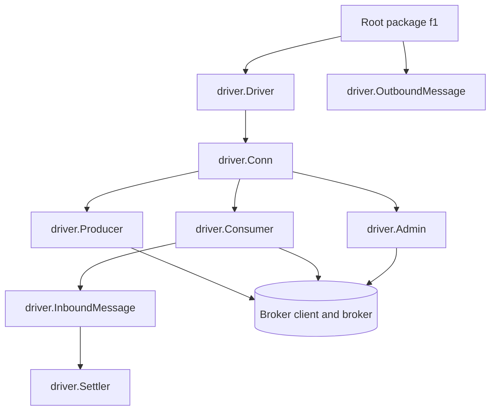

# Driver contract

This is the authoritative guide for implementing a driver for F1. The
interfaces and comments in [`driver/driver.go`](https://fgit.zapps.vn/zatf2026-be-t3/event-driven-messaging-sdk/-/blob/main/driver/driver.go),
[`driver/message.go`](https://fgit.zapps.vn/zatf2026-be-t3/event-driven-messaging-sdk/-/blob/main/driver/message.go),
[`driver/capability.go`](https://fgit.zapps.vn/zatf2026-be-t3/event-driven-messaging-sdk/-/blob/main/driver/capability.go),
[`driver/topology.go`](https://fgit.zapps.vn/zatf2026-be-t3/event-driven-messaging-sdk/-/blob/main/driver/topology.go), and
[`driver/errors.go`](https://fgit.zapps.vn/zatf2026-be-t3/event-driven-messaging-sdk/-/blob/main/driver/errors.go) are the executable contract. This
page explains the boundaries and the behavioral rules behind them.

The driver port is broker-independent. The core owns F1 semantics and logical
routing; a driver owns broker clients, physical destinations, confirmations,
offsets, exchanges, queues, partitions, consumer groups, and broker-specific
resource management.

## Port shape

The resource interfaces are concurrent-use contracts. A driver may use
provider-specific synchronization internally, but it must not require the core
to serialize calls that the port declares safe for concurrent use.

## `driver.Driver`

`Driver` is the stateless adapter entry point. Its implementation should be a
safe registry value; connection-specific state belongs in the `Conn` returned
by `Open`.

The contract is:

- `Name` returns the stable driver registry key used in configuration and
  diagnostics;
- `Capabilities` reports the driver's pessimistic native ceiling without
  reading a live connection;
- `Open` does not return until the connection is usable or the context expires;
- transient connection failures during `Open` are handled within the driver's
  configured connection budget;
- concurrent calls to the driver are safe.

If a capability depends on broker version, authentication, cluster topology,
or negotiated protocol features, `Capabilities` must report the pessimistic
value and `Conn.Capabilities` may refine it downward for the live connection.
It must never refine a capability upward beyond the driver's declared ceiling.

The public interface and shared connection configuration are in
[`driver/driver.go`](https://fgit.zapps.vn/zatf2026-be-t3/event-driven-messaging-sdk/-/blob/main/driver/driver.go).

## `driver.Conn`

`Conn` represents one usable live broker connection and owns factories for all
resources created from it.

### Connection responsibilities

- `Capabilities` reports the live capability view and may reduce the static
  driver declaration, never increase it.
- `BrokerInfo` provides diagnostic metadata; it is not a routing or behavior
  contract.
- `Producer` creates a producer using the core-selected configuration.
- `Consumer` creates a consumer over the physical destination set supplied by
  the core.
- `Admin` returns the required topology surface.
- `Ping` performs a lightweight readiness check.
- `Close` releases connection resources only after all producers and consumers
  created from the connection have been closed.

The core may create producer and consumer resources concurrently. A driver must
protect connection state accordingly.

`Conn.Close` must not silently tear down resources that the core still owns. A
driver should return [`ErrResourcesOutstanding`](https://fgit.zapps.vn/zatf2026-be-t3/event-driven-messaging-sdk/-/blob/main/driver/errors.go) when
the caller violates the close order. The client close sequence is documented in
[Lifecycle and shutdown](/advanced-topics/lifecycle-and-shutdown).

## Message types and settlement

There is no type named `driver.Message` in the current port. The message
contract is split deliberately:

- [`driver.OutboundMessage`](https://fgit.zapps.vn/zatf2026-be-t3/event-driven-messaging-sdk/-/blob/main/driver/message.go) is the portable value the
  core gives to a producer;
- [`driver.InboundMessage`](https://fgit.zapps.vn/zatf2026-be-t3/event-driven-messaging-sdk/-/blob/main/driver/message.go) is the delivery a consumer
  gives to the core;
- [`driver.Header`](https://fgit.zapps.vn/zatf2026-be-t3/event-driven-messaging-sdk/-/blob/main/driver/message.go) carries opaque key/value metadata;
- [`driver.BrokerRef`](https://fgit.zapps.vn/zatf2026-be-t3/event-driven-messaging-sdk/-/blob/main/driver/message.go) carries broker identity without
  exposing its fields to core routing; and
- [`driver.Settler`](https://fgit.zapps.vn/zatf2026-be-t3/event-driven-messaging-sdk/-/blob/main/driver/message.go) finishes one inbound delivery.

### `OutboundMessage`

The core has already selected the physical `Destination`. Drivers must use it
as provided and must not parse it, rebuild F1 names, or infer whether it is a
publish entry point from the name. The `EntryPoint` flag is also core-owned and
must be honored as supplied.

Drivers transport the body, headers, key, optional priority hint, and optional
`DelayUntil`. A broker that cannot implement a native hint must rely on the
effective capability profile and the portable path selected by the core; it
must not change the observable F1 result silently.

A driver may defer on its own terms rather than honour `DelayUntil`. A message
sent to a destination that declares a delay may be delivered at that message's
publish instant plus the declared delay, whatever due time the message carries,
and never earlier; within one partition of a destination, the messages it
deferred are then delivered in the order they were published. That is a property
of the driver rather than a capability, because it describes the semantics the
driver owes instead of an optimisation it performs, so it is declared to the
conformance suite rather than reported by `Capabilities`.

### `InboundMessage`

An inbound message must include the physical destination, body, headers, broker
reference, and a valid `Settler`. `DeliveryCount` is the previous broker
redelivery count or `-1` when the broker cannot provide it. The core does not
interpret provider-specific fields inside `BrokerRef`.

The delivery body and headers must remain usable until the core has completed
the handler and settlement path. If a driver reuses buffers, it must copy them
before the next delivery can mutate the storage.

### `Settler`

`Settler` provides per-delivery `Ack` and `Nack`. A driver must not allow the
same delivery to be settled twice; subsequent calls should expose
[`ErrAlreadySettled`](https://fgit.zapps.vn/zatf2026-be-t3/event-driven-messaging-sdk/-/blob/main/driver/errors.go) or the equivalent documented
portable error.

- `Ack` marks the original delivery successfully handled.
- `Nack` asks the broker to redeliver or apply broker failure policy according
  to `NackOptions`.
- `NackOptions.Requeue` requests redelivery.
- `NackOptions.CountAsFailure` requests a broker failure count when the broker
  supports that distinction; it is best effort because some brokers count all
  rejects.

The core uses these operations only after it has classified the message. A
driver must not convert an ack into a requeue or a requeue nack into a durable
commit merely because its broker API uses a different verb.

## `driver.Producer`

`Producer` is the durable publication boundary.

### Publish durability

`Producer.Publish` must not return `nil` until every message in the call has a
durable broker acknowledgment under the requested configuration. The exact
confirmation mechanism is provider-specific, but a local buffer write or an
unconfirmed client enqueue is not sufficient.

The core always requests `ProducerConfig.RequireDurableAck = true` in the v1
publish path. A driver must honor that flag rather than downgrade it based on a
provider default.

`Publish` accepts multiple messages and must be safe for concurrent use. It may
return a [`PublishError`](https://fgit.zapps.vn/zatf2026-be-t3/event-driven-messaging-sdk/-/blob/main/driver/errors.go) when only some indexes failed.
The `Failed` map uses input indexes and contains the individual causes for
messages that were not acknowledged. The core maps that result into per-message
batch outcomes; it does not treat a batch as atomic.

If the transport result is ambiguous, the driver must return a classified
error rather than claiming success. The caller may observe a duplicate if the
broker accepted a message before the connection failure became visible.

### Close

`Close` releases producer resources. It must not discard accepted but
unacknowledged work silently, and it must coordinate with concurrent `Publish`
calls according to the provider's resource guarantees. There is no separate
teardown call before it: the core closes the producer once application
publishes reach quiescence. A canceled `Close` must still leave the producer
and the connection in a state the caller can reason about, unless the provider
has made the resource unusable.

Concrete producer implementations are the source of provider mechanics:

- [`drivers/inmem/producer.go`](https://fgit.zapps.vn/zatf2026-be-t3/event-driven-messaging-sdk/-/blob/main/drivers/inmem/producer.go)
- [`drivers/rabbitmq/producer.go`](https://fgit.zapps.vn/zatf2026-be-t3/event-driven-messaging-sdk/-/blob/main/drivers/rabbitmq/producer.go)
- [`drivers/kafka/producer.go`](https://fgit.zapps.vn/zatf2026-be-t3/event-driven-messaging-sdk/-/blob/main/drivers/kafka/producer.go)

## `driver.Consumer`

`Consumer` owns transport intake for a set of physical destinations. It must be
safe for concurrent use and must keep message delivery, asynchronous errors,
drain, stop, and release distinguishable.

### Message and error channels

`Messages` yields `InboundMessage` values. The channel closes only after
`Stop` or `Release` completes. A transient broker or connection error must not
close `Messages` on its own; report it on `Errors` so the core can decide
whether to repair the generation or reconnect the connection.

`Errors` carries connection loss, rebalance notifications, and transport
failures that do not belong to one message. Fatal errors must be distinguishable
from routine notifications and transient errors through `driver.Classify`.

Do not send an error on `Errors` and then close `Messages` before the core has a
chance to observe the error and release or drain outstanding deliveries.

### Pause and resume

`Pause` stops delivery without leaving the consumer group. `Resume` restarts
delivery. An empty destination list applies the operation to all destinations
owned by the consumer.

Pause must respect the per-destination prefetch budget passed in
`ConsumerConfig`; it must not allow an outage or paused lane to accumulate an
unbounded local buffer.

### Drain

`Drain` stops fetching new messages while keeping already-delivered messages
settleable. When `Drain` returns, `Messages` must yield no new deliveries, but
the driver must continue to accept settlement calls for deliveries already
handed to the core.

Drain is not Stop and is not Release. It is the first phase of an orderly
handoff: stop intake, preserve ownership of accepted work, and let the core
settle or explicitly return it.

### Stop

`Stop` is final consumer shutdown after outstanding deliveries have been
settled. It must flush committed positions or equivalent broker progress before
returning. If the context expires first, return
[`ErrDrainTimeout`](https://fgit.zapps.vn/zatf2026-be-t3/event-driven-messaging-sdk/-/blob/main/driver/errors.go), preserving the distinction from a
caller's ordinary resource or protocol failure.

Calling `Stop` while the driver still owns unsettled deliveries is a contract
violation. A driver should return [`ErrResourcesOutstanding`](https://fgit.zapps.vn/zatf2026-be-t3/event-driven-messaging-sdk/-/blob/main/driver/errors.go)
instead of silently committing past those deliveries.

### Release

`Release` abandons every outstanding delivery without settling it and closes
the consumer. The broker must be allowed to redeliver what this consumer held
but did not settle.

Release makes no durability promise about committed positions. It is the
explicit handoff operation for connection loss, reconnect, and shutdown paths
where the core cannot prove settlement. It must be idempotent and safe after a
previous release or stop. A broker that cannot return unsettled work must
return [`ErrUnsupported`](https://fgit.zapps.vn/zatf2026-be-t3/event-driven-messaging-sdk/-/blob/main/driver/errors.go).

### Lag

`Lag` reports per-destination backlog when the broker can determine it. A driver
without a reliable lag query returns `ErrUnsupported`; it must not invent a
zero backlog.

The complete consumer interface is in
[`driver/driver.go`](https://fgit.zapps.vn/zatf2026-be-t3/event-driven-messaging-sdk/-/blob/main/driver/driver.go). The core's use of these operations
is traced in [Consume flow](/development/consume-flow).

## `driver.Admin` and topology

`Admin` is the required topology administration surface. The core owns the
logical F1 topology and passes a declarative [`TopologySpec`](https://fgit.zapps.vn/zatf2026-be-t3/event-driven-messaging-sdk/-/blob/main/driver/topology.go).
The driver owns how that spec maps to broker objects.

### Policies

`TopologyPolicy` has three meanings:

| Policy | Driver responsibility |
| --- | --- |
| `TopologyDeclare` | Create missing topology, preserve existing topology, and return a diff. The operation is idempotent and must not delete. |
| `TopologyVerify` | Create nothing; verify requested objects and configured arguments, reporting drift or failing when verification is not possible. |
| `TopologyNone` | Make no topology round trip and assume the supplied physical destinations already exist. |

The core may pass `Policy` on each spec. A driver must apply the requested
policy rather than use an environment-specific default.

### Spec and diff rules

`TopologySpec` can contain exchanges, destinations, bindings, an orphan-scan
scope, and the effective capability profile. Destination names are already
resolved by the core. Drivers must not reconstruct logical topic, retry, or
dead-letter names.

`EnsureTopology` must be idempotent, must not delete, and must report created
and existing objects in its `TopologyDiff`. When `Scope` is provided, it must
report in-scope orphaned core-owned destinations. If scanning is unavailable,
populate `OrphanScanError` rather than claiming the scan was clean.

Under `TopologyVerify`, a driver must verify arguments represented by the spec.
If its primary broker API cannot expose those arguments, it must use an
appropriate provider-side inspection channel or fail verification; it must not
return a clean diff it did not actually verify.

`DescribeTopology` reads current state for requested names and distinguishes a
missing destination from an existing empty destination.

The topology structures and their ownership rules are defined in
[`driver/topology.go`](https://fgit.zapps.vn/zatf2026-be-t3/event-driven-messaging-sdk/-/blob/main/driver/topology.go). Optional destructive
operations are exposed separately through `driver.Maintenance`; they are not
part of the required `Admin` contract.

## Configuration passed to a driver

`driver.Config` contains the portable connection inputs: endpoints, client and
instance identity, reconnect/drain timing, TLS, SASL, and opaque
`DriverOptions`. Credentials must not be logged. Driver-specific options may be
interpreted only by that driver.

`ProducerConfig` carries:

- `RequireDurableAck`, which is true for core-originated v1 publishing; and
- `Effective`, the capability profile selected by the core.

`ConsumerConfig` carries:

- group identity and physical destinations;
- the delay each destination declares, keyed by its physical name, for a driver
  that defers on the consumer side. The core fills it from the same topology it
  passes to `EnsureTopology`, and a destination absent from the map has no
  delay, which is how a driver is told a destination defers nothing;
- total prefetch and the core-calculated `PerDestination` allocation;
- exclusive mode;
- start position for a new group only; and
- the same effective capability profile.

Drivers must honor the effective configuration they receive. They may retain
internal connection facts, but must not replace core-selected behavior with a
different capability view.

## Capability reporting

[`Capabilities`](https://fgit.zapps.vn/zatf2026-be-t3/event-driven-messaging-sdk/-/blob/main/driver/capability.go) describes native mechanisms and
physical constraints. It does not redefine F1 semantics. The core must produce
the same observable result when a portable capability is forced off; a driver
must therefore report an optimization only when it can actually provide it.

The fields cover per-message settlement, equal-key ordering, fanout, native
priority, delay, delivery count, broker DLQ, consumer scaling, physical message
and header limits, and lag queries.

Capability reporting has three stages:

1. `Driver.Capabilities` declares the static pessimistic ceiling.
2. `Conn.Capabilities` reports what the connected broker can actually provide;
   it may reduce the ceiling but never increase it.
3. The core selects `Effective` and passes that profile to producers,
   consumers, and topology administration.

### Strict portability

`Capabilities.Strict` withdraws native optional mechanisms so the core exercises
portable fallbacks. It preserves facts that are not optional optimizations:

- fanout shape;
- equal-key ordering semantics;
- consumer scaling constraints; and
- physical message/header limits.

The strict profile clears native per-message ack, native priority, native delay,
native delivery count, native broker DLQ, and lag-query declarations. A driver
must branch on `TopologySpec.Effective`, `ProducerConfig.Effective`, and
`ConsumerConfig.Effective`, not on its own raw connection capability cache.

The strict behavior is tested in
[`driver/capability_test.go`](https://fgit.zapps.vn/zatf2026-be-t3/event-driven-messaging-sdk/-/blob/main/driver/capability_test.go) and compared
against the full profile by the conformance suite.

## Errors and classification

Errors crossing the port must preserve enough information for the core to make
portable decisions.

### Sentinel errors

Use the shared sentinels for portable conditions, including:

- `ErrUnsupported` for an unavailable optional operation;
- `ErrAlreadySettled` for a repeated per-delivery settlement;
- `ErrDrainTimeout` when consumer finalization exceeds its context;
- `ErrResourcesOutstanding` when close order is unsafe; and
- `ErrDestinationMissing` when a physical destination is absent.

Drivers may wrap these errors so `errors.Is` remains useful.

### Classified errors

Implement [`ClassifiedError`](https://fgit.zapps.vn/zatf2026-be-t3/event-driven-messaging-sdk/-/blob/main/driver/errors.go), or return the standard
[`driver.Error`](https://fgit.zapps.vn/zatf2026-be-t3/event-driven-messaging-sdk/-/blob/main/driver/errors.go), for errors where the core needs a
portable class:

- `KindTransient` - retryable network, timeout, or leader-election failure;
- `KindFatal` - authentication, protocol, or unrecoverable resource failure;
- `KindNotFound` - missing destination;
- `KindTooLarge` - physical message or header limit;
- `KindPermission` - authorization failure; and
- `KindNotification` - routine lifecycle notification, not a failure.

`driver.Classify` treats an unclassified error as transient and reports that it
was unclassified. This conservative fallback keeps a transport failure from
being mistaken for success, but drivers should classify known errors at the
boundary and preserve the broker cause through `Unwrap`.

`PublishError` aggregates per-message causes. Its `Kind` is the most severe
classification among the failed indexes, and `Retryable` is true only when all
failed messages are transient.

The rules are exercised by [`driver/errors_test.go`](https://fgit.zapps.vn/zatf2026-be-t3/event-driven-messaging-sdk/-/blob/main/driver/errors_test.go)
and the provider error tests.

## Context cancellation

Every operation that can block accepts a context. A driver must:

- stop waiting when the context is done;
- return a context-aware or port-classified error rather than reporting a
  successful operation that did not complete;
- leave resources in a state the caller can reason about after cancellation;
- keep a canceled `Close` from corrupting the producer/connection state when
  the provider allows the resource to remain usable; and
- preserve the distinction between caller cancellation, drain timeout, and a
  broker failure.

`Open` must not return an unusable connection after its context expires.
`Consumer.Stop`, `Drain`, and `Release` must honor their contexts while
preserving their different ownership promises. The conformance drain and
publication groups exercise cancellation and post-cancellation usability.

## Acknowledge, nack, release, and successor publication

These operations are related but must never be conflated:

| Operation | Scope | Meaning | Durability/ownership promise |
| --- | --- | --- | --- |
| `Settler.Ack` | One delivery | The core has completed the intended handling path. | Removes the original only after the driver accepts the ack. |
| `Settler.Nack` | One delivery | Ask the broker to requeue or apply its failure policy. | Uses `NackOptions`; requeue is not a successful handler disposition. |
| `Consumer.Release` | All outstanding deliveries on one consumer | Abandon without settling so the broker can redeliver. | No committed-position durability promise; must preserve redelivery. |
| `Producer.Publish` to a retry/DLQ destination | New successor message | Create a durable replacement copy. | It is not settlement of the source; the core settles the source only after successor success. |

The settle-last rule belongs to the core, but drivers must provide the
semantics that make it possible: a successful producer result must mean durable
acceptance, `Ack` must settle only the named delivery, `Nack` must honor the
requested requeue policy, and `Release` must not commit past unsettled work.
The complete core ordering is documented in
[Consume flow](/development/consume-flow).

## Core independence and implementation boundary

The root package and `internal/**` must not import concrete driver packages or
broker clients. The `driver/` port outside conformance is standard-library-only.
Each concrete driver may import the port, its own broker client, and permitted
shared support, but not another concrete driver. The conformance package tests
the port and never imports a concrete adapter.

These rules are enforced by the `depguard` configuration in
[`.golangci.yml`](https://fgit.zapps.vn/zatf2026-be-t3/event-driven-messaging-sdk/-/blob/main/.golangci.yml) and [`make verify-agnostic`](https://fgit.zapps.vn/zatf2026-be-t3/event-driven-messaging-sdk/-/blob/main/Makefile).
Do not add a broker convenience path to the core to work around an incomplete
driver; add or correct the port contract when the behavior is genuinely
portable.

## Before declaring a driver complete

Use this checklist as a handoff to the conformance page:

1. `Driver` is stateless, concurrent-safe, and reports a pessimistic static
   capability ceiling.
2. `Open` honors context and returns only a usable `Conn`.
3. Live capabilities never exceed the static declaration.
4. Producer publication and close honor durable acknowledgment and
   cancellation rules.
5. Consumer messages/errors channels, drain, stop, release, pause/resume, and
   lag follow the port distinctions.
6. Every inbound delivery has a valid, exactly-once `Settler` boundary.
7. Topology declare/verify/none policies are implemented without deleting or
   silently skipping requested objects.
8. Driver errors preserve sentinel identity, classification, and broker causes.
9. All core-selected effective capability profiles are honored.
10. The driver passes the shared contract suite and provider-specific tests.

Continue with [Driver conformance](/development/driver-conformance) for the shared
harness, profiles, behavior vectors, provider fixtures, and run commands.
