# Publish flow

This page is the maintainer trace for publishing. It follows an application
call from `Publisher.Publish` or `Publisher.PublishBatch` through validation,
encoding, envelope construction, producer admission, and the
`driver.Producer` boundary.

The source owns the exact behavior. This page records the ownership and the
decisions that matter when changing the path.

## End-to-end path

```mermaid
flowchart LR
    CALL[Publisher.Publish] --> BATCH[Publisher.PublishBatch]
    BATCH --> ADMIT[Client admission]
    ADMIT --> BUILD[buildOutbound per message]
    BUILD --> VALIDATE[Validate event and options]
    VALIDATE --> CODEC[Configured codec.Encode]
    CODEC --> ENVELOPE[Build Envelope]
    ENVELOPE --> HEADERS[Envelope.EncodeHeaders]
    HEADERS --> ROUTE[Resolve topic and entry point]
    ROUTE --> PRODUCER[Shared driver.Producer]
    PRODUCER --> DURABLE[Durable broker result]
    DURABLE --> RESULT[BatchResult or event ID]
```



The main executable path is split across:

- [`Publisher.Publish`](https://fgit.zapps.vn/zatf2026-be-t3/event-driven-messaging-sdk/-/blob/main/publisher.go) and
  [`Publisher.PublishBatch`](https://fgit.zapps.vn/zatf2026-be-t3/event-driven-messaging-sdk/-/blob/main/publisher.go) for the public entry points;
- [`buildOutbound`](https://fgit.zapps.vn/zatf2026-be-t3/event-driven-messaging-sdk/-/blob/main/publisher.go) for one message's portable outbound
  representation;
- [`Client.New`](https://fgit.zapps.vn/zatf2026-be-t3/event-driven-messaging-sdk/-/blob/main/client.go) and
  [`ensurePublisherTopology`](https://fgit.zapps.vn/zatf2026-be-t3/event-driven-messaging-sdk/-/blob/main/client.go) for startup topology;
- [`publishMessages`](https://fgit.zapps.vn/zatf2026-be-t3/event-driven-messaging-sdk/-/blob/main/client.go) for core-generated successor messages;
- [`driver.Producer`](https://fgit.zapps.vn/zatf2026-be-t3/event-driven-messaging-sdk/-/blob/main/driver/driver.go) for the broker-independent
  publication contract.

## Observer call sites

When a client has an observer, the publish path emits events at these
boundaries:

- `PublishBatch` pairs `ObserverPublish` around one admitted call, from
  admission through the producer result.
- `buildOutbound` pairs `ObserverMessageBuilt` around each outbound message
  build.
- Core-generated retry and dead-letter successors use `ObserverPublish` with
  their route, then record the corresponding retry or dead-letter point after
  the successor result is known.

Observer methods run synchronously on these paths, without a client or runner
lock held. A slow or panicking adapter must not be allowed to turn
instrumentation into a publish failure.

`publisher.go:Publisher.PublishBatch` calls `observer_call.go:Client.observeStart` for the publish stage, and `observer_call.go:observerFinishGuard.finishWith` invokes `Observer.Finish` after the producer result. `publisher.go:buildOutbound` starts the message-built stage, calls `observer_call.go:Client.injectTrace` with the returned context, and finishes after `Envelope.EncodeHeaders`; successor sends use `worker.go:startSuccessorPublish` and inject in `worker.go:retryAndSettle` or `worker.go:deadLetter`.

## Public entry points

`Publisher.Publish` does not have a separate transport path. It creates a
single-item `Message`, delegates to `PublishBatch`, and returns the first
successful event ID or error.

`Publisher.PublishBatch` is synchronous and makes no atomicity claim. It
returns a `BatchResult` in input order. An empty batch is a no-op. The method
first checks that the publisher and client are connected, then admits the
whole call before building outbound messages.

That early admission is deliberate: caller-supplied codec work can take time,
and `Client.Close` must be able to wait for an already-admitted publish rather
than close the producer underneath it. The entry-point implementation is in
[`publisher.go`](https://fgit.zapps.vn/zatf2026-be-t3/event-driven-messaging-sdk/-/blob/main/publisher.go); the admission and quiescence tests are
in [`client_producer_admission_test.go`](https://fgit.zapps.vn/zatf2026-be-t3/event-driven-messaging-sdk/-/blob/main/client_producer_admission_test.go)
and [`client_publish_quiescence_test.go`](https://fgit.zapps.vn/zatf2026-be-t3/event-driven-messaging-sdk/-/blob/main/client_publish_quiescence_test.go).

## Build one outbound message

`buildOutbound` converts one public `Message` into a `driver.OutboundMessage`
and an event ID. Its decisions are intentionally broker-independent.

### Validation and options

The function checks the caller context, requires a non-empty event type, rejects
nil publish options, applies each option, and validates the resulting priority.
Option behavior is defined beside the option constructors in
[`publisher.go`](https://fgit.zapps.vn/zatf2026-be-t3/event-driven-messaging-sdk/-/blob/main/publisher.go). `WithMaxAttempts` validates its own
per-event attempt cap while the subscription policy remains the consumer-side
ceiling.

The option values contribute to the envelope and routing inputs:

| Input | Owner or rule |
| --- | --- |
| Event type | Required; remains the envelope type. |
| `WithTopic` | Replaces the value used to derive the logical topic. |
| `WithKey` | Explicit partition/routing key. |
| `WithSubject` | Envelope subject and fallback partition key. |
| `WithPriority` | Selects the logical delivery lane and broker priority hint. |
| `WithIdempotencyKey` | Application deduplication key; defaults to the event ID. |
| `WithCorrelationID` / `WithCausedBy` | Correlation and causation context. |
| `WithHeader` | User extension header, subject to envelope validation and limits. |
| `WithExpiry` / `WithMaxAttempts` | Envelope delivery constraints. |

The option table is a navigation aid, not a second API reference. The
constructors and validation code remain authoritative.

### Event ID and payload

The event ID is generated after options are applied, using the configured clock
and cryptographic randomness. The configured codec then encodes the payload.
Encoding failure stops the batch before the driver is called.

Codec selection is configured on the client. The default is the public JSON
codec; additional codecs are registered through client options and selected by
the client configuration. The codec boundary is defined in
[`codec/codec.go`](https://fgit.zapps.vn/zatf2026-be-t3/event-driven-messaging-sdk/-/blob/main/codec/codec.go), with the JSON implementation in
[`codec/json.go`](https://fgit.zapps.vn/zatf2026-be-t3/event-driven-messaging-sdk/-/blob/main/codec/json.go).

The publish-side body limit is checked after encoding. It is an application
publish guardrail, so an oversized body fails before producer publication. The
SDK's retry and dead-letter successor paths intentionally forward an already
accepted body through their own publish helper instead of applying this
caller-only guard again.

### Logical topic and allowlist

The logical topic is derived from `WithTopic`, when present, or from the event
type. [`topicFor`](https://fgit.zapps.vn/zatf2026-be-t3/event-driven-messaging-sdk/-/blob/main/publisher.go) removes a trailing numeric `.v<N>`
segment, so versioned event types can share a canonical physical entry point
while retaining their original type in the envelope.

`WithPublishTopics` is both an allowlist and a topology declaration input. The
option canonicalizes its values with the same topic derivation, rejects empty
or duplicate logical topics, and stores the resulting list on the client.
`validatePublishTopic` rejects a publish whose derived topic is not in that
list.

This means the allowlist decision occurs before a producer is called, and a
versioned input is checked against its canonical topic. The behavior is pinned
by [`publisher_topology_test.go`](https://fgit.zapps.vn/zatf2026-be-t3/event-driven-messaging-sdk/-/blob/main/publisher_topology_test.go).

### Envelope and headers

`buildOutbound` creates the public [`Envelope`](https://fgit.zapps.vn/zatf2026-be-t3/event-driven-messaging-sdk/-/blob/main/envelope.go) with the
CloudEvents fields and F1 fields required on the wire, including:

- specification version, event ID, source, original event type, timestamp,
  and codec content type;
- idempotency key, priority, attempt, producer identity, partition key,
  expiry, and maximum attempts;
- subject, correlation, causation, trace context, and user extensions.

Root events use their own ID as the default correlation identity. `WithCausedBy`
can inherit correlation and trace context while recording the cause.

[`Envelope.EncodeHeaders`](https://fgit.zapps.vn/zatf2026-be-t3/event-driven-messaging-sdk/-/blob/main/envelope.go) validates priorities and reserved
extension names, serializes the canonical header map, and applies the effective
header limit. Optional headers may be shed under pressure; mandatory protocol
headers are preserved, and an envelope that still cannot fit returns an error.
The resulting map is sorted before conversion to `[]driver.Header`, making the
driver input deterministic.

## Resolve the driver message

The final `driver.OutboundMessage` contains the encoded body, sorted headers,
partition/routing key, priority hint, and a physical destination derived by
the core:

```text
f1.<environment>.<canonical-topic>.<priority>
```

The exact naming helper is [`publishEntryPoint`](https://fgit.zapps.vn/zatf2026-be-t3/event-driven-messaging-sdk/-/blob/main/publisher.go). The core
also sets `EntryPoint` from the effective fanout capability. A driver receives
this physical destination and the portable message fields; it does not rebuild
F1 topic names or infer application routing policy.

The logical-to-physical split is part of the repository architecture. See
[`architecture.md`](/development/architecture) and the port types in
[`driver/topology.go`](https://fgit.zapps.vn/zatf2026-be-t3/event-driven-messaging-sdk/-/blob/main/driver/topology.go).

## Publisher topology initialization

Publisher entry points are prepared during `Client.New`, not on the first
publish. Initialization follows this sequence:

1. `Client.New` opens the injected driver and reads live capabilities.
2. The core derives an effective capability set, applying strict portability
   when requested.
3. If `WithPublishTopics` was supplied and topology policy is not `None`, the
   core builds a publisher topology spec for every configured topic and
   priority.
4. `driver.Admin.EnsureTopology` declares or verifies that spec.
5. A topology error aborts client construction.

`WithTopology` overrides the configured policy. Without an explicit option,
`AutoCreate` selects `TopologyDeclare`, `VerifyOnStart` selects
`TopologyVerify`, and neither setting selects `TopologyNone`. `TopologyNone`
performs no topology round trip and assumes the physical entry points already
exist.

The startup owner is [`Client.New`](https://fgit.zapps.vn/zatf2026-be-t3/event-driven-messaging-sdk/-/blob/main/client.go), with topology construction
in [`publisherTopologySpec`](https://fgit.zapps.vn/zatf2026-be-t3/event-driven-messaging-sdk/-/blob/main/publisher.go). The shared topology port is
[`driver.Admin`](https://fgit.zapps.vn/zatf2026-be-t3/event-driven-messaging-sdk/-/blob/main/driver/driver.go) and the policy types are in
[`driver/topology.go`](https://fgit.zapps.vn/zatf2026-be-t3/event-driven-messaging-sdk/-/blob/main/driver/topology.go).

## Producer admission and close barriers

The client owns one shared producer handle per live connection. The first
publish creates it lazily through `driver.Conn.Producer`; concurrent first
publishes race safely, install one producer, and close any losing producer.
Subsequent publishes reuse the installed handle.

Before a producer call, the core checks:

- the client and connection are live;
- shutdown has not rejected a new application publish;
- reconnect has not failed or entered its in-progress state;
- the connection captured before encoding is still the current connection.

The connection recheck prevents a publish from using a producer built against
a connection that reconnect has already replaced.

`beginPublish`/`endPublish` maintain the active-publish count. `Client.Close`
uses that count as a barrier: it closes the application publish entry gate,
drains runners, waits until active publishes reach zero, then closes the
producer and connection. The entry gate is what refuses a new application
publish; the successor handoff keeps using the same producer, and the same
count, until the producer itself is closed. The close path is owned by
[`Client.Close`](https://fgit.zapps.vn/zatf2026-be-t3/event-driven-messaging-sdk/-/blob/main/client.go), with focused coverage in
[`client_publish_quiescence_test.go`](https://fgit.zapps.vn/zatf2026-be-t3/event-driven-messaging-sdk/-/blob/main/client_publish_quiescence_test.go)
and [`publish_test.go`](https://fgit.zapps.vn/zatf2026-be-t3/event-driven-messaging-sdk/-/blob/main/publish_test.go).

Core-generated retry and dead-letter successors go through
[`publishMessages`](https://fgit.zapps.vn/zatf2026-be-t3/event-driven-messaging-sdk/-/blob/main/client.go), which builds the shared producer with the same
`workPublish` admission and the same constructor an application publish uses.
What differs is the entry gate: `Publisher.Publish` first requires a `Ready`
client, so a publish entered after `Close` began is refused, while the
successor handoff has no such gate and is admitted while the client drains as
long as the producer still stands. That is what lets a delivery already being
drained finish its handoff instead of being lost to shutdown. Both paths
discard a producer built across a connection swap rather than installing it.

## The `driver.Producer` boundary

The port contract is intentionally small:

- `Producer.Publish` accepts one or more portable outbound messages and must
  not return `nil` until every message in the call has a durable broker
  acknowledgement;
- a partial outcome is returned as `*driver.PublishError`, whose `Failed` map
  identifies per-message failures by input index;
- `Close` releases producer resources and is the only teardown call the core
  makes on the producer, once application publishes reach quiescence;
- implementations must be safe for concurrent use.

The contract is defined in [`driver/driver.go`](https://fgit.zapps.vn/zatf2026-be-t3/event-driven-messaging-sdk/-/blob/main/driver/driver.go), and
error classification plus partial results are defined in
[`driver/errors.go`](https://fgit.zapps.vn/zatf2026-be-t3/event-driven-messaging-sdk/-/blob/main/driver/errors.go).

Concrete producers translate the same boundary into provider operations:

- [`drivers/inmem/producer.go`](https://fgit.zapps.vn/zatf2026-be-t3/event-driven-messaging-sdk/-/blob/main/drivers/inmem/producer.go) provides the
  deterministic reference behavior;
- [`drivers/rabbitmq/producer.go`](https://fgit.zapps.vn/zatf2026-be-t3/event-driven-messaging-sdk/-/blob/main/drivers/rabbitmq/producer.go) owns
  AMQP publication, confirms, and returned-message handling;
- [`drivers/kafka/producer.go`](https://fgit.zapps.vn/zatf2026-be-t3/event-driven-messaging-sdk/-/blob/main/drivers/kafka/producer.go) owns Kafka
  record construction and synchronous broker results.

The core must not depend on those provider details. Driver behavior is checked
through the shared publication contract in
[`driver/conformance/publish.go`](https://fgit.zapps.vn/zatf2026-be-t3/event-driven-messaging-sdk/-/blob/main/driver/conformance/publish.go), while
provider-specific tests remain beside each producer.

## Durable result and batch mapping

When `driver.Producer.Publish` returns `nil`, `PublishBatch` assigns the
generated ID to every result and returns successfully. The ID is the caller's
stable reference even though the transport destination is broker-specific.

When the producer returns `*driver.PublishError`, the core maps the failed
indexes into `BatchResult`:

- successful messages retain their generated IDs;
- failed messages have an empty ID and their individual error;
- the batch method returns the `BatchResult` with a nil method-level error.

When the producer returns any other transport-wide error, every result receives
that error and the method returns the same error. This distinguishes a known
partial outcome from a failure where the call's overall publication result is
not usable.

`Publisher.Publish` converts the single-item batch result back into the simple
`(id, error)` API. It does not retry a failed application publish itself.
Transient classification requests client reconnection, but replaying an
application call is the caller's responsibility because the broker may already
have accepted a message before the transport error became visible.

The mapping is exercised by [`publish_test.go`](https://fgit.zapps.vn/zatf2026-be-t3/event-driven-messaging-sdk/-/blob/main/publish_test.go), the
driver error tests in [`driver/errors_test.go`](https://fgit.zapps.vn/zatf2026-be-t3/event-driven-messaging-sdk/-/blob/main/driver/errors_test.go),
and the shared conformance publication checks.

## Reconnection interaction

Producer creation and publication classify transient driver errors and request
the client reconnect supervisor. A publish that arrives while reconnect is in
progress is rejected with the reconnecting state rather than sent through an
old connection.

The reconnect path in [`reconnect.go`](https://fgit.zapps.vn/zatf2026-be-t3/event-driven-messaging-sdk/-/blob/main/reconnect.go):

1. abandons active runners according to the consumer handoff rules;
2. waits for the current publish generation to become idle;
3. opens a replacement connection and derives its live/effective capabilities;
4. re-establishes configured publisher topology;
5. swaps the connection, limits, and producer state;
6. retires the old producer and connection.

The producer handle is cleared after a successful swap, so the next admitted
publish creates a producer for the new connection. A publish that built against
the old connection is checked again before use and fails rather than crossing
the connection boundary.

Reconnection therefore protects resource ownership and future publishes; it
does not turn an uncertain application publish into an automatic replay. The
caller must choose whether and how to retry based on the returned error and its
idempotency policy.

## Trace checklist for changes

When changing publishing behavior, trace the complete ownership chain:

1. Public entry point and option validation in [`publisher.go`](https://fgit.zapps.vn/zatf2026-be-t3/event-driven-messaging-sdk/-/blob/main/publisher.go).
2. Payload and envelope behavior in [`codec/codec.go`](https://fgit.zapps.vn/zatf2026-be-t3/event-driven-messaging-sdk/-/blob/main/codec/codec.go) and
   [`envelope.go`](https://fgit.zapps.vn/zatf2026-be-t3/event-driven-messaging-sdk/-/blob/main/envelope.go).
3. Client admission, shared producer, topology, and close behavior in
   [`client.go`](https://fgit.zapps.vn/zatf2026-be-t3/event-driven-messaging-sdk/-/blob/main/client.go).
4. Connection replacement in [`reconnect.go`](https://fgit.zapps.vn/zatf2026-be-t3/event-driven-messaging-sdk/-/blob/main/reconnect.go).
5. Portable producer contract in [`driver/driver.go`](https://fgit.zapps.vn/zatf2026-be-t3/event-driven-messaging-sdk/-/blob/main/driver/driver.go)
   and [`driver/errors.go`](https://fgit.zapps.vn/zatf2026-be-t3/event-driven-messaging-sdk/-/blob/main/driver/errors.go).
6. Reference and provider implementations under
   [`drivers/inmem/producer.go`](https://fgit.zapps.vn/zatf2026-be-t3/event-driven-messaging-sdk/-/blob/main/drivers/inmem/producer.go) and the
   provider producer links above.
7. Root, driver, conformance, and provider tests before changing a contract.

Keep the core generic: a broker-specific requirement belongs in the driver or
in a capability/port decision, not in the application-facing publish path.
