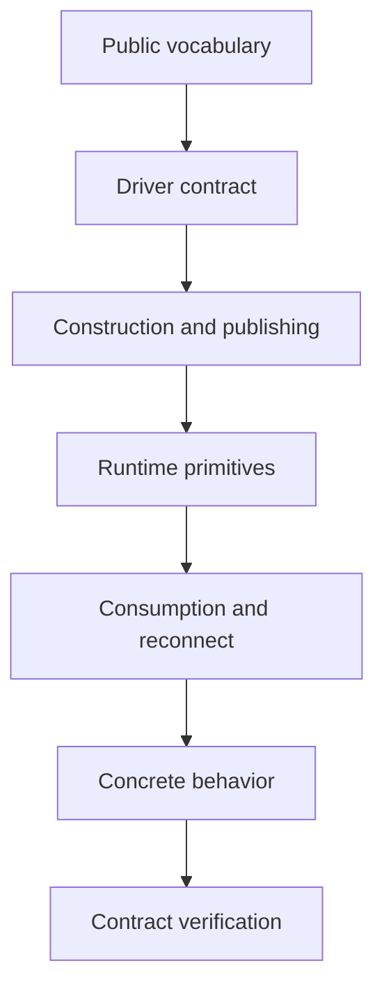

# Source-reading guide

This is the canonical reading order for maintainers and AI collaborators who
need to understand the F1 repository before changing it. It starts with public
vocabulary and ports, then follows construction, runtime primitives, concrete
drivers, and verification. Do not begin in `worker.go`: the worker coordinates
contracts that are defined elsewhere.

The links below are navigation, not a second source of implementation detail.
When a claim matters, open the linked source, its nearest tests, and the
relevant development guide.

## How to use the route

Read one pass at a time. After each pass, be able to answer the question in
the pass goal before moving deeper.



Start with [Architecture](architecture.md) when you need package ownership or
import boundaries, [Publish flow](publish-flow.md) for the outbound path, and
[Consume flow](consume-flow.md) for delivery, dispatch, settlement, drain, and
reconnect. Use [Testing strategy](testing.md) to choose which tests should
accompany a change.

## Pass 1: public vocabulary

Read the public nouns and guarantees before reading orchestration:

1. [`doc.go`](../../doc.go) - package purpose and public boundary.
2. [`event.go`](../../event.go) - event identity, payload, and handler-facing
   values.
3. [`envelope.go`](../../envelope.go) - wire metadata, headers, identity, and
   encoding limits.
4. [`errors.go`](../../errors.go) - public error wrappers and caller-visible
   classification.
5. [`priority.go`](../../priority.go) - priority values and their public
   ordering meaning.

Then read the public package comments and the nearest focused tests. The goal
is to understand what a service author can observe: event identity, headers,
payload encoding, errors, priority, and at-least-once consequences.

Do not infer broker behavior from these files. Broker-independent transport
rules begin in the driver port.

## Pass 2: driver contract

Read the port before any adapter or worker implementation:

1. [`driver/driver.go`](../../driver/driver.go) - `Driver`, `Conn`, `Admin`,
   `Producer`, `Consumer`, and their lifecycle contracts.
2. [`driver/message.go`](../../driver/message.go) - inbound and outbound
   messages, headers, broker references, and settlement.
3. [`driver/capability.go`](../../driver/capability.go) - native capability
   declarations, physical limits, and strict portability.
4. [`driver/topology.go`](../../driver/topology.go) - topology specifications,
   policies, scopes, diffs, and state inspection.
5. [`driver/errors.go`](../../driver/errors.go) - sentinel errors, error kinds,
   classified errors, and partial publish errors.

The goal is to know which behavior belongs in every adapter and which behavior
must remain in core. Continue with [Driver contract](driver-contract.md) for
the behavioral rules and [Driver conformance](driver-conformance.md) for how
they are checked.

The core must not import a broker client to make a driver easier to implement.
If a behavior cannot be expressed through the port, decide whether it is
provider-specific or whether the port is missing a genuinely portable
contract before changing an import boundary.

## Pass 3: construction and publishing

Trace how an application becomes a connected client and a durable outbound
message:

1. [`config.go`](../../config.go) - user configuration and resolved defaults.
2. [`broker_config.go`](../../broker_config.go) - broker connection and driver
   configuration.
3. [`options.go`](../../options.go) - functional options and runtime option
   resolution.
4. [`client.go`](../../client.go) - driver opening, topology initialization,
   shared producer admission, reconnect ownership, and client close.
5. [`publisher.go`](../../publisher.go) - publish validation, codec selection,
   envelope construction, topic routing, and durable publication.
6. [`envelope.go`](../../envelope.go) again at `EncodeHeaders` - the wire
   boundary between core metadata and driver headers.

The goal is to understand which work happens before driver publication and
which work is the driver's durability responsibility. Follow
[Publish flow](publish-flow.md) for the complete path and close barriers.

## Pass 4: runtime primitives

Read the small, portable mechanisms before the worker that composes them:

1. [`internal/clock/`](../../internal/clock/) - real and manually advanced
   clocks used by retries, delays, deadlines, and tests.
2. [`internal/retry/`](../../internal/retry/) - classification, retry
   outcomes, tiers, and delay resolution.
3. [`internal/sched/`](../../internal/sched/) - bounded weighted lanes,
   priority, aging, and fairness.
4. [`internal/dispatch/`](../../internal/dispatch/) - worker pool,
   ordered-key routing, and in-flight registry behavior.
5. [`internal/lifecycle/`](../../internal/lifecycle/) - runner state,
   drain transitions, and disposition accounting.

The goal is to recognize an algorithmic invariant when it appears in a higher
level flow. Read the package-local tests with each primitive; they are faster
than reconstructing the invariant from the worker.

## Pass 5: consumption and reconnect

Only after the contracts and primitives are clear, read the orchestration:

1. [`subscription.go`](../../subscription.go) - subscription resolution,
   handler registration, topology inputs, and runner construction.
2. [`worker.go`](../../worker.go) - runner generations, fetch, dispatch,
   handler invocation, retry/dead-letter routing, settlement, and drain.
3. [`reconnect.go`](../../reconnect.go) - connection replacement and runner
   re-entry after transient driver failure.

Use the function map in [Consume flow](consume-flow.md) while reading
`worker.go`. Start at `Runner.Run`, then jump to the fetch, dispatch,
processing, handler, and settlement functions instead of reading the file
linearly.

The goal is to preserve the ownership boundaries: the driver owns delivery and
settlement, the core owns logical routing and handler policy, and the internal
packages own scheduling, dispatch, accounting, and lifecycle state.

## Pass 6: concrete behavior

Read adapters in this order:

1. [`drivers/inmem/`](../../drivers/inmem/) - the deterministic reference
   adapter and the easiest place to see topology, delivery, settlement,
   deferred work, and fault behavior.
2. [`f1test/`](../../f1test/) - the handler-facing deterministic test client
   built on the in-memory adapter and fake clock.
3. [`drivers/rabbitmq/`](../../drivers/rabbitmq/) - AMQP translation,
   management inspection, queue/exchange behavior, reconnect, and settlement.
4. [`drivers/kafka/`](../../drivers/kafka/) - classic consumer groups,
   partition-bound scaling, offsets, deferral, lag, and rebalance ownership.

Read the adapter source beside its tests. The in-memory implementation shows
the port contract with fewer external moving parts; RabbitMQ and Kafka then
show which details must remain inside a provider. Do not transfer a broker
client assumption back into the core because it is convenient in one adapter.

For provider differences and current capability limits, use
[Topology and capabilities](../advanced-topics/topology-and-capabilities.md)
and the provider notes in
[`drivers-and-capabilities.md`](../drivers-and-capabilities.md).

## Pass 7: contract verification

Finish by reading the checks that protect the repository boundaries:

1. [`driver/conformance/`](../../driver/conformance/) - the broker-independent
   driver contract suite, profiles, behavior vectors, and provider fixtures.
2. [`tools/apisurface/`](../../tools/apisurface/) - exported-symbol checks
   against committed public API fixtures.
3. [`tools/apidiff/`](../../tools/apidiff/) - compatibility comparison and
   normalization for API baselines.
4. [`Makefile`](../../Makefile) - build, unit, lint, API-surface, API-diff,
   import-boundary, self-contained, and broker-backed verification targets.
5. [`.gitlab-ci.yml`](../../.gitlab-ci.yml) - the CI composition that makes
   the local gates meaningful.

The goal is to know what evidence a change must provide. A driver change needs
the shared conformance suite and affected provider tests. A public API change
needs API-surface and API-diff review. A package-boundary change needs the
import-boundary gate. A documentation citation or path change needs the
self-contained check.

## Trace a publish

Use this recipe for an application-originated event:

```text
Publisher.Publish
  -> Publisher.PublishBatch
  -> buildOutbound
  -> codec encode and topic validation
  -> Envelope.EncodeHeaders
  -> publishMessages
  -> driver.Producer.Publish
```

Start at [`Publisher.Publish`](../../publisher.go), which delegates to
`PublishBatch`. Then follow `buildOutbound` in the same file for codec
selection, event identity, envelope fields, routing, allowlists, and headers.
Follow `publishMessages` in [`client.go`](../../client.go) for producer
admission, reconnection, and the close barrier. The final durable publication
contract is the `driver.Producer` implementation in the selected adapter.

The short form is:

```text
Publisher.Publish -> buildOutbound -> Envelope.EncodeHeaders
  -> publishMessages -> driver.Producer.Publish
```

Use [Publish flow](publish-flow.md) when the question concerns batch partial
failure, successor publication, or reconnect behavior.

## Trace a consume

Use this recipe for a broker delivery:

```text
Runner.Run
  -> openRunnerConsumer
  -> fetchRunner
  -> runDispatchPipeline
  -> processDelivery
  -> dispatchMessage
  -> invokeHandler
  -> retryAndSettle / deadLetterAndSettle / ackDelivery
```

`Runner.Run` owns the generation and lifecycle. `fetchRunner` receives from the
driver consumer and admits deliveries. `runDispatchPipeline` selects lanes and
submits work to the dispatch pool. `processDelivery` owns per-delivery cleanup;
`dispatchMessage` decodes and classifies the event; `invokeHandler` runs the
handler under its lifecycle context. The final branch publishes a retry or
dead-letter successor before settling the original, or acknowledges/discards
it directly.

The named owners are in [`worker.go`](../../worker.go):

- `Runner.Run` near the public runner API;
- `fetchRunner` and `fetchRunnerAfterCancel` in intake and cancellation;
- `runDispatchPipeline` in dispatch and scheduling;
- `processDelivery`, `dispatchMessage`, and `invokeHandler` in handler
  processing; and
- `retryAndSettle`, `deadLetterAndSettle`, and `ackDelivery` in settlement.

Use [Consume flow](consume-flow.md) for the full lifecycle, including ordered
keys, priorities, delays, concurrency, drain, shutdown, and reconnect.

## Read the nearest tests

After tracing a flow, read the tests that guard its boundary rather than every
test in the repository. Good first stops are:

- [`publish_test.go`](../../publish_test.go),
  [`publish_close_barrier_test.go`](../../publish_close_barrier_test.go), and
  [`worker_retry_bridge_test.go`](../../worker_retry_bridge_test.go) for
  publication and successor ordering;
- [`dispatch_test.go`](../../dispatch_test.go),
  [`worker_ordering_test.go`](../../worker_ordering_test.go), and
  [`settlement_state_test.go`](../../settlement_state_test.go) for dispatch,
  ordering, and settlement;
- [`client_close_sequencing_test.go`](../../client_close_sequencing_test.go),
  [`client_drain_budget_test.go`](../../client_drain_budget_test.go), and
  [`worker_settlement_test.go`](../../worker_settlement_test.go) for shutdown;
- [`reconnection_test.go`](../../reconnection_test.go) and
  [`lane_repair_test.go`](../../lane_repair_test.go) for recovery; and
- [`f1test/f1test_test.go`](../../f1test/f1test_test.go),
  [`f1test/fanout_test.go`](../../f1test/fanout_test.go), and
  [`f1test/ordered_test.go`](../../f1test/ordered_test.go) for handler-facing
  behavior.

When a test fails, use the lowest owning layer to diagnose it: a primitive
invariant in `internal`, a public orchestration rule in the root package, a
port rule in conformance, or a broker translation in the provider suite.

## Keep the route current

This development page is the canonical maintainer route and should be updated
when package ownership or the source-reading order changes. Keep source links
close to the decision they explain, and let source, tests, fixtures, API
manifests, and the Makefile remain authoritative for mutable details.
