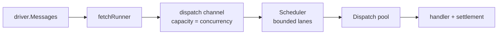
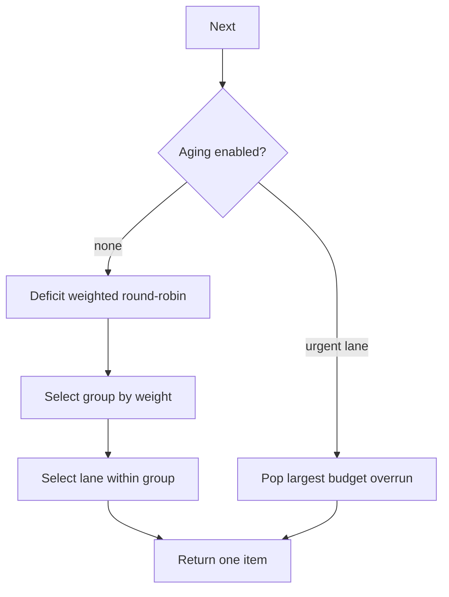
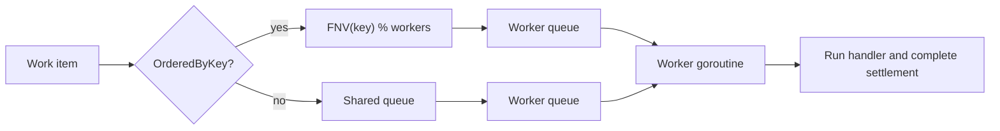

# Dispatch and scheduling

The runtime separates admission, lane selection, and handler execution.

## Scheduler

Implementation: [`internal/sched`](../internal/sched)

Each configured topic, priority, and retry tier becomes a lane. A lane has:

- an ID
- a bounded capacity
- a weight
- an optional aging budget
- an optional retry group

The scheduler uses deficit weighted round-robin. Retry lanes normally receive reduced weight so a
retry storm cannot consume all handler capacity. Aging promotes a lane whose oldest item exceeded
its budget.

## Dispatch pool

Implementation: [`internal/dispatch/pool.go`](../internal/dispatch/pool.go)

Ordered mode hashes the message key to one worker. Therefore equal keys cannot overlap. Different
keys may execute concurrently when they map to different workers.

## Backpressure

Backpressure exists at multiple points:

1. driver prefetch limits broker deliveries
2. fetch-to-dispatch channel is bounded
3. scheduler lanes are bounded
4. dispatch pool queues are bounded
5. handler concurrency is capped

When the scheduler cannot accept a delivery, `runDispatchPipeline` waits for a free worker rather
than growing memory without limit.

## Relevant tests

- [`internal/sched/scheduler_test.go`](../internal/sched/scheduler_test.go) — lane selection and aging.
- [`internal/dispatch/pool_test.go`](../internal/dispatch/pool_test.go) — pool behavior.
- [`f1test/ordered_test.go`](../f1test/ordered_test.go) — equal-key serialization and different-key concurrency.
- [`retry_storm_test.go`](../retry_storm_test.go) — retry pressure and fairness behavior.
