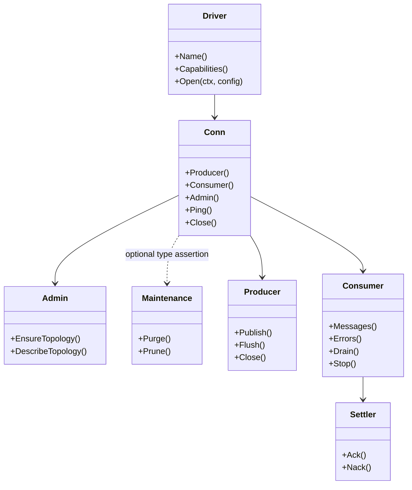
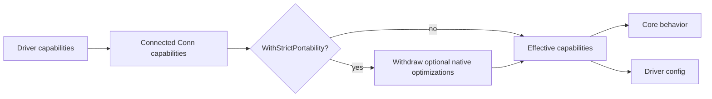

# Drivers and capabilities

## Port model

The interfaces live under [`driver/`](../driver). `Conn.Admin()` returns the required
[`driver.Admin`](../driver/driver.go) topology surface. When that value also implements
[`driver.Maintenance`](../driver/driver.go), callers can type-assert it before using the optional
destructive operations; `EnsureTopology` and `DescribeTopology` remain available through `Admin`.

## Capability selection

Capabilities describe optimization or physical limits, not a license to change F1 semantics. The
core can emulate missing features or reject a requested feature, and `Client.Limits()` reports the
result.

## In-memory driver

The in-memory driver is the deterministic reference adapter. It provides:

- isolated or shared broker state
- fake-clock delayed delivery
- consumer groups and per-key affinity
- delivery counters and redelivery
- topology administration
- injectable publish, ack, nack, and connection failures

Start at [`drivers/inmem/inmem.go`](../drivers/inmem/inmem.go), then read `producer.go`,
`consumer.go`, and `admin.go`.

## RabbitMQ driver

The RabbitMQ adapter translates the port into AMQP operations:

- `rabbitmq.go` — connection, TLS/SASL, capability reporting
- `producer.go` — publishing, confirms, returns, delayed messages
- `consumer.go` — delivery lanes, pause/resume, drain, lag
- `settlement.go` — ack/nack serialization
- `topology.go` — exchanges, queues, bindings, backstop routes
- `management.go` — HTTP management API for inspection and pruning

It may use broker-specific mechanisms internally. Those mechanisms must not leak through the root
handler API.

## Topology

The core generates physical names for:

- publish entry points
- main destinations
- retry tiers
- SDK DLQs
- broker backstop DLQs

The driver receives a `driver.TopologySpec` and applies `Declare`, `Verify`, or `None`. The driver
owns broker syntax; the core owns the logical topology contract.

## Conformance

[`driver/conformance`](../driver/conformance) runs the same behavior checks against each driver in:

- full capability mode
- strict portability mode

The two modes must produce equivalent observable behavior. This protects the port from adapters that
silently change semantics when a native optimization is unavailable.
