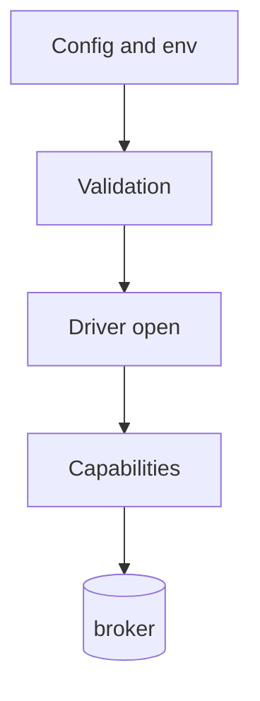

# Drivers and capabilities

Every F1 driver shares the same configuration, environment overrides,
security rules, and validation, and reports [the list of features the connected broker supports](/learn/glossary#capability-report). Each driver page lists its own
options and behavior. For every configuration key in one place, see the
[Configuration reference](/advanced-topics/configuration).

The figure shows configuration flowing through validation, driver opening, the feature list, and the broker.



## Pick a driver

- [In-memory driver](/drivers/inmem) - deterministic tests and local validation without a broker.
- [RabbitMQ driver](/drivers/rabbitmq) - AMQP delivery, queue topology, and management operations.
- [Kafka driver](/drivers/kafka) - partitioned logs, consumer groups, and offset ownership.

## Driver configuration

A driver accepts only the broker-specific keys listed on its driver page. The
configuration validator checks this list during configuration validation, both
for a file loaded with `LoadConfig` and for a `Config` built in Go and passed to
`f1.New`. A key under another driver's prefix or a key with no driver prefix is
refused. RabbitMQ options are listed in [RabbitMQ options](/drivers/rabbitmq#rabbitmq-options),
Kafka options in [Kafka options](/drivers/kafka#kafka-options), and the in-memory
driver takes no driver keys. `broker.kafka.compression` is a Kafka option and is
refused on a RabbitMQ deployment.

Options live under the driver's name, and every value in the configuration file
is a string, whatever type the driver parses it as:

```yaml
f1:
  broker:
    driver: kafka
    endpoints:
      - localhost:19092
    kafka:
      compression: lz4
      batchLinger: 5ms
```

In the option tables on the driver pages, the **Accepted values** column says what
the driver takes, not what the broker supports. A value the driver cannot
translate fails `Open`, and an `Open` failure is fatal, so a process never
starts on a value that would silently do nothing. Some keys are also constrained
earlier by configuration and subscription validation; those checks are listed in
[Validation before the driver](#validation-before-the-driver).

In the option tables on the driver pages, the **Read at** column says when an
option takes effect. *Open* means it is resolved once when the driver opens.
*Per consumer* means it is resolved again for each consumer the driver creates.
*Topology* means it is read when the driver declares or verifies destinations
rather than at connection time.

### Environment overrides

F1 applies these environment variables after loading the configuration file, so
an environment value wins over the corresponding file value:

| Variable | Field set | Details |
| --- | --- | --- |
| `F1_ENV` | `f1.env` | Replaces the environment name. |
| `F1_SERVICE` | `f1.service` | Replaces the service name. |
| `F1_INSTANCE_ID` | `f1.instanceId` | Replaces the instance identity. |
| `F1_BROKER_DRIVER` | `f1.broker.driver` | Replaces the selected broker driver. |
| `F1_BROKER_ENDPOINTS` | `f1.broker.endpoints` | Comma-separated endpoints. F1 trims surrounding blanks and drops empty items. |

Each subscription also reads its own variables when `Subscribe` resolves it.
The name is `F1_SUBSCRIPTIONS_`, then the subscription name, then the setting,
each upper-cased with a camelCase boundary or punctuation turned into `_`:

```sh
F1_SUBSCRIPTIONS_ORDERS_CONCURRENCY=8
F1_SUBSCRIPTIONS_ORDERS_HANDLER_TIMEOUT=45s
F1_SUBSCRIPTIONS_ORDERS_RETRY_MAX_ATTEMPTS=5
```

The settings covered are `topics`, `mode`, `concurrency`, `prefetch`,
`priorities`, `handlerTimeout`, `unmatchedPolicy`, the `retry` fields
(`maxAttempts`, `initialInterval`, `maxInterval`, `multiplier`, `tiers`), and
the `fairness` fields (`prefetchFactor`, `retryWeightDivisor`,
`disableDeadlinePromotion`, `weights.high`, `weights.medium`, `weights.low`,
`budgets.high`, `budgets.medium`, `budgets.low`). A variable under a
subscription's prefix that matches none of them fails `Subscribe`, so a
misspelled key is an error rather than a silent no-op.

For a subscription named `ORDERS`, the fairness overrides are:

| Setting | Environment variable |
| --- | --- |
| High, medium, low weights | `F1_SUBSCRIPTIONS_ORDERS_FAIRNESS_WEIGHTS_HIGH`, `F1_SUBSCRIPTIONS_ORDERS_FAIRNESS_WEIGHTS_MEDIUM`, `F1_SUBSCRIPTIONS_ORDERS_FAIRNESS_WEIGHTS_LOW` |
| High, medium, low wait limits (budgets) | `F1_SUBSCRIPTIONS_ORDERS_FAIRNESS_BUDGETS_HIGH`, `F1_SUBSCRIPTIONS_ORDERS_FAIRNESS_BUDGETS_MEDIUM`, `F1_SUBSCRIPTIONS_ORDERS_FAIRNESS_BUDGETS_LOW` |

Keep credentials and other driver-specific settings in the configuration file
or the application's configuration layer.

### Security

For a normal deployment, enable TLS and provide a CA file so the client
verifies the broker certificate. Add a client certificate and key when the
broker requires mutual TLS. The shared `broker.tls` and `broker.sasl` settings
are documented in [Kafka TLS](/drivers/kafka#kafka-tls), [Kafka SASL](/drivers/kafka#kafka-sasl),
[RabbitMQ TLS](/drivers/rabbitmq#rabbitmq-tls), and
[RabbitMQ SASL](/drivers/rabbitmq#rabbitmq-sasl). Each driver accepts its own
SASL mechanisms.

### Secure connection examples

Kafka accepts `plain`, `scram-sha-256`, and `scram-sha-512`; RabbitMQ accepts
`plain`, `amqplain`, and `external`.

In `prod`, F1 refuses SASL unless `broker.tls.enabled` is true.

::: code-group

```yaml [Kafka]
f1:
  broker:
    driver: kafka
    tls:
      enabled: true
      caFile: /etc/service/ca.pem
      serverName: kafka.example.internal
    sasl:
      mechanism: scram-sha-256
      username: orders-service
      password: "<set from your secret store>"
```

```yaml [RabbitMQ]
f1:
  broker:
    driver: rabbitmq
    tls:
      enabled: true
      caFile: /etc/service/ca.pem
      serverName: rabbitmq.example.internal
    sasl:
      mechanism: plain
      username: orders-service
      password: "<set from your secret store>"
```

:::

The configuration file is read as written, with no variable expansion. Load secrets in Go and set `cfg.Broker.SASL.Username` and `cfg.Broker.SASL.Password` before `f1.New`.

## Validation before the driver

Three driver keys are also constrained before any driver parses them: when the
configuration loads, and for a subscription, also when it is created. Each
refusal names the key.

- `broker.rabbitmq.queueType` must be exactly `quorum` when `env: prod` and the
  selected driver is `rabbitmq`. The comparison is on the raw string, so a
  spelling that would fold and trim into `quorum`, such as `QUORUM` or
  ` quorum `, is refused there, and leaving the key out is refused as well.
- `broker.kafka.sessionTimeout` bounds `lifecycle.rebalanceDrainTimeout`: the
  drain timeout must be at most 0.6 times the session timeout. The check reads
  this key on the `kafka` driver only and uses the 45s default when the key is
  absent.
- `broker.rabbitmq.consumerTimeout` must be at least three times every
  subscription's `handlerTimeout`. The check reads this key on the `rabbitmq`
  driver only and uses the 90s default when the key is absent. The default
  `handlerTimeout` is 30s, which that default exactly meets, so a handler
  timeout above 30s with this key unset fails startup.

For the two duration keys, a value that does not parse as a duration is refused
by these checks too, before the driver would refuse it at `Open`. The accepted
key list and its error are implemented in
[`broker_config.go`](https://fgit.zapps.vn/zatf2026-be-t3/event-driven-messaging-sdk/-/blob/main/broker_config.go).

## Provider boundary

The core works out routing from [the topic names in your code](/learn/glossary#logical-topic) and passes
[broker queue and topic names](/learn/glossary#physical-destination), feature choices, and topology specifications through the `driver` port.
Each adapter owns broker syntax, client objects, broker queue and topic names,
confirmations, offsets, management APIs, and provider-specific failure
handling. The import boundary is enforced by
`make verify-agnostic` and `.golangci.yml`.

## Enqueue time and backlog

The [observability guide](/advanced-topics/observability#use-enqueue-timestamps-correctly)
defines how these sources affect broker wait and oldest-age metrics:

| Driver | Enqueue time source(s) | Backlog count | Head time | Oldest-age metric |
| --- | --- | --- | --- | --- |
| In-memory | The in-memory broker clock assigns the enqueue time during dispatch; source is `broker` | Number of queued messages | Earliest non-zero queued timestamp | Reported when the head timestamp is known |
| RabbitMQ | Trusted `timestamp_in_ms` with overwrite mode is `broker`; CloudEvents time or AMQP timestamp is `producer`; otherwise `unknown` | Same value as `Lag` | Management API head for classic queues; unknown for quorum queues | Not reported: a management head is marked `producer`, and quorum has no head |
| Kafka | `CreateTime` is `producer`; `LogAppendTime` is `broker`; absent or unknown timestamp is `unknown` | Offset lag from group commits to log ends | Earliest pending record across partitions, with its timestamp source | Reported only for a `broker` head; set `message.timestamp.type=LogAppendTime` for broker time |

## Capability report

Inspect [`Client.Limits()`](https://fgit.zapps.vn/zatf2026-be-t3/event-driven-messaging-sdk/-/blob/main/limits.go)
after connecting when service behavior depends on a broker feature. Each
entry is a `FeatureStatus`
with a mode and, where declared, a detail string. The mode `native` means
[the broker does it](/learn/glossary#native), `emulated` means
[F1 does it](/learn/glossary#emulated), and `unavailable` means neither does. A service that depends on a
feature can refuse to start without it:

```go
limits := client.Limits()
for _, feature := range limits.Features {
	if feature.Feature == "lag_metrics" && feature.Mode == f1.FeatureUnavailable {
		return fmt.Errorf("driver %s reports no backlog; backlog alerts would stay silent", limits.Driver)
	}
}
```

The report lists these rows, in this order:

| Feature | Mode | Detail |
| --- | --- | --- |
| `per_message_ack` | `native` or `emulated` | `driver.Capabilities.PerMessageAck` selects the mode. Native: the broker acks each message on its own, so a slow message does not hold its lane's in-flight slots. Emulated: the core finishes each message itself in its own order, so a slow message holds its lane's in-flight slots. |
| `ordered_by_key` | `native` or `unavailable` | `driver.Capabilities.OrderedByKey` selects the mode. Native means ordering is guaranteed for equal keys. Unavailable means a subscription requesting ordered mode is rejected. |
| `priority_fairness` | `emulated` | The core's scheduler uses weighted lanes instead, so fairness is per lane and not per broker. Broker priority, when declared through `driver.Capabilities.NativePriority`, does not replace this core scheduling contract. |
| `native_delay` | `native` or `emulated` | `driver.Capabilities.NativeDelay` selects the mode. The connected `driver.DelayAccuracy` is rendered as the lateness bound; its zero value is reported as `delay accuracy not declared by this driver`. A driver can report `emulated` while still declaring accuracy for its own delay path. |
| `delivery_count` | `native` or `emulated` | `driver.Capabilities.NativeDeliveryCount` selects the mode. Native: the broker supplies a redelivery count to observer events, but handler code reads the core's one-based attempt count instead. Emulated: the core counts handler attempts in the envelope; retry copies increment that count, broker redeliveries do not, and a new publish resets it to one. |
| `dlq_backstop` | `native` or `unavailable` | `driver.Capabilities.NativeDLQ` selects the mode. Native: the broker has [its own dead-letter queue](/learn/glossary#backstop) for a message it gives up on; the core also publishes its own dead-letter copies, but this row reports only the broker's routing. Unavailable: the broker has no dead-letter queue of its own, and the core's dead-letter path still publishes a copy and acks the original after the copy is confirmed. |
| `lag_metrics` | `native` or `unavailable` | `driver.Capabilities.LagQueryable` selects the mode. Native means the broker exposes a backlog query; unavailable means it does not. No additional detail is emitted for this status. |
| `consumer_scaling` | `native` | `driver.Capabilities.ConsumerScaling` is rendered through `driver.Scaling.String`: `partition-bound` means [parallelism is limited by partition count](/learn/glossary#partition-bound-scaling), while `free` means [it is not limited by partitions](/learn/glossary#free-scaling). |

The scheduler row is always `emulated` and the scaling row is always `native`
because these are fixed properties of F1's feature list. Other modes can
vary with the connected driver's live capabilities and broker configuration.
Static declarations can be narrowed by a connected driver, so read the
connected report instead of maintaining a hard-coded provider matrix.

## Choosing the right guide

- Use [Driver contract](/development/driver-contract) to implement or review
  a port interface.
- Use [Driver conformance](/development/driver-conformance) to validate
  portability across adapters and capability profiles.
- Use this page for shared configuration and the feature list, and the
  driver pages for provider-specific options and behavior.
- Use [Topology and capabilities](/advanced-topics/topology-and-capabilities)
  for service-facing feature and topology decisions.

## Go further

- [Driver contract](/development/driver-contract) - implement the broker-neutral port.
- [Topology and capabilities](/advanced-topics/topology-and-capabilities) - choose portable service behavior.
- [RabbitMQ retry parking](/deep-dives/rabbitmq-delay-ladder) - one parking queue per retry step, and how other delays are parked.
