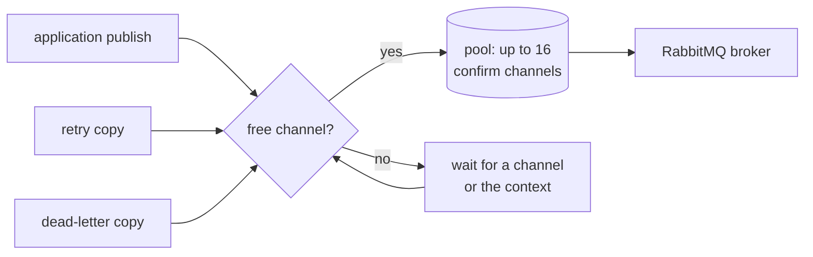

# RabbitMQ driver

F1's RabbitMQ driver sends and receives messages over AMQP and reads the broker's queues and bindings through the RabbitMQ management HTTP API.

For shared configuration and security, see [Drivers and capabilities](/drivers-and-capabilities).

## How the driver works

The RabbitMQ adapter translates the port into AMQP and management operations.
The provider-specific ownership is split across these files in
[`drivers/rabbitmq`](https://fgit.zapps.vn/zatf2026-be-t3/event-driven-messaging-sdk/-/tree/main/drivers/rabbitmq):

- `rabbitmq.go` for connection, TLS/SASL,
  and the feature list;
- `producer.go` for publishing, confirms,
  returns, and delayed messages;
- `consumer.go` for delivery lanes,
  pause/resume, drain, and lag;
- `settlement.go` for ack/nack
  serialization;
- `topology.go` for exchanges, queues,
  bindings, and the broker's own dead-letter routes; and
- `management.go` for inspection and
  pruning.

Use the RabbitMQ suite for queue, exchange, management, confirmation,
reconnect, TLS, and broker-specific flow control. Use conformance when
the behavior is part of the shared port.

### Publishing runs on a pool of confirm channels

A client has one producer, and every publish goes through it: application
publishes, retry copies, and dead-letter copies. The producer holds up to 16
AMQP channels in confirm mode, so up to 16 publishes can wait for broker
confirmations at the same time. A 17th publish waits for a free channel, or
until its context ends.

With a single channel, each publish waited for the confirmations of the one
before it, and throughput stayed near 300 messages per second no matter how
many publishers ran. The pool lets those publishes overlap.

What to expect from the pool:

- **One channel per call.** A `Publish` keeps its channel until the call
  returns, because RabbitMQ only promises message order within one channel.
  A batch keeps its order.
- **Windows of 64.** Inside a call, the producer sends up to 64 messages before
  it reads their confirmations, so a large batch costs about one confirm round
  trip per 64 messages instead of one per message.
- **Channels open when needed.** The first channel opens with the producer, so a
  connection that cannot give a confirm channel fails at startup. The others
  open as concurrent publishes need them.
- **A broken channel is replaced.** When a channel fails in the middle of a
  publish, the producer closes it and never reuses it, so its late confirmations
  cannot be read against another publish. The next publish opens a fresh one.
- **Close waits for publishes.** `Close` stops new publishes, waits for the
  ones in flight to hand their channels back (bounded by its context), then
  closes every channel.

The size is a constant in
[`producer.go`](https://fgit.zapps.vn/zatf2026-be-t3/event-driven-messaging-sdk/-/blob/main/drivers/rabbitmq/producer.go),
not a configuration key. It matches a default subscription's handler
concurrency, which bounds how many retry and dead-letter copies one subscription
publishes at once.

### The management HTTP API is a deployment requirement

The adapter inspects broker-side state through the RabbitMQ management HTTP
API, not through AMQP. A passive declaration confirms a queue's name and
nothing else, so a driver that must compare the arguments a queue was declared
with against what the broker holds has no AMQP channel for that comparison.
The same applies to bindings, which AMQP cannot enumerate. The requirement
therefore reaches the subscription path:

| Topology policy | Management API needed to start a subscription |
| --- | --- |
| `TopologyDeclare` | Yes. The subscription's bindings are read before the consumer opens. |
| `TopologyVerify` | Yes. The broker's queue arguments and the bindings are both read. |
| `TopologyNone` | No. The adapter makes no management call, so the topology must already exist. |

The endpoint defaults to the AMQP host with the AMQP port plus 10000, and uses
the AMQP credentials unless `broker.sasl` overrides them. Set
`broker.rabbitmq.managementPort` when the management plugin listens elsewhere.
The endpoint's host is always the AMQP host, and only its port can be
overridden. A managed offering that serves the management API on a separate
hostname cannot be configured today: there is no host option, so a port setting
does not reach it and a deployment of that shape needs the API exposed on the
AMQP host or a proxy in front of it.

An unreachable API fails subscription start with an error naming the endpoint,
rather than skipping the check; a broker with the management plugin disabled,
firewalled, or on a non-default port is the most likely cause.

The local fixture (`make broker-up`) runs a `-management` image with the API on
15672. Managed RabbitMQ offerings differ in whether that API is exposed and on
which credentials, so check it before deploying.

### Delayed and retried messages need per-destination [parking queues](/learn/glossary#parking-queue)

RabbitMQ has no built-in delayed delivery, so the adapter builds it from
queue-level TTLs and a dead-letter route back to the destination.

A delay of at most 64s on the generic path is parked in the smallest fixed
delay that is at least the delay. Fixed-delay destinations are the exception:
each [retry step](/learn/glossary#retry-tier) uses one queue whose TTL is that step's delay. See [Parking retries on RabbitMQ](/deep-dives/rabbitmq-delay-ladder) for the queue sequence.

| Fixed delay | 500ms | 1s | 2s | 4s | 8s | 16s | 32s | 64s |
| --- | --- | --- | --- | --- | --- | --- | --- | --- |

That queue is named `<destination>.park.<delay>`, for example `orders.park.2s`,
and it is declared with `x-message-ttl` set to its delay. The message carries no
expiration of its own: RabbitMQ expires a per-message TTL only when the message
reaches the head of its queue, so a message parked behind a later one waits for
it and the delay can overrun by the distance between the two due times. The
queue TTL makes every message expire in FIFO order, so a fixed-delay queue cannot
create that case at all.

Rounding the delay up keeps a message from being released before its due time.
The cost is lateness below one step, so a 5s delay is released at about 8s. A
fixed-delay retry step is late only by the time its publish took.

For the queue sequence and its trade-offs, see [Parking retries on RabbitMQ](/deep-dives/rabbitmq-delay-ladder).

That cost is reported rather than left to folklore. `Client.Limits()`
renders the delay feature for this driver as `late by at most the requested delay, or
500ms, whichever is larger, for a delay of at most 1m4s; no bound above that`.
The report derives the floor and ceiling from the fixed-delay table. Changing a fixed delay therefore changes the
reported limit too.

A delay above 64s parks in `<destination>.park`, the queue that carries a
per-message expiration. The longest delay it accepts is about 24.8 days. Because
RabbitMQ expires only the message at the head of a queue, a due time beyond the
largest fixed delay can be released late by a message parked ahead of it. F1's
retry path never reaches this queue, because each retry step has its own fixed
queue; only code that calls the driver directly with a delay does.

The names are reserved: a destination may not end in `.park`, `.park.` plus a
fixed-delay tag, or `.park.fixed-<ms>ms`. All three shapes belong to parking queues,
so application destinations must avoid them.

The fixed-delay queues and the queue for longer delays are declared from the
destination's delay, and which policy makes them exist is the same split as any
other destination:

| Topology policy | Parking queues |
| --- | --- |
| `TopologyDeclare` | Declared by the adapter at subscription start. |
| `TopologyVerify` | Must exist and match their declared arguments, checked at subscription start. |
| `TopologyNone` | Provisioned by the operator. The adapter declares and checks nothing. |

The queues are durable, and their declare arguments follow the deployment's
queue type (`broker.rabbitmq.queueType`, `quorum` by default):

| Argument | Value |
| --- | --- |
| `x-queue-type` | `quorum`, or `classic` when the deployment selects it |
| `x-dead-letter-exchange` | `""`, the default exchange |
| `x-dead-letter-routing-key` | the destination name |
| `x-dead-letter-strategy` | `at-least-once`, on quorum only |
| `x-overflow` | `reject-publish`, on quorum only |
| `x-message-ttl` | the fixed delay, in milliseconds, on the fixed-delay queues only |

On quorum the two strategy arguments are added because all three dead-letter
arguments are required together for RabbitMQ's at-least-once dead-letter
guarantee; the parking queues are the delay mechanism itself, not a failure
path, so a message lost there is a dropped retry with no error. A classic
deployment omits them, and its delay path is at-most-once.

Upgrading from a release without the fixed delays needs no drain. The existing
`<destination>.park` queue keeps dead-lettering to its destination and the
messages parked in it leave on their own schedule, and the fixed-delay queues are
declared by the topology pass. A fixed-delay destination declares its fixed
queue plus `<destination>.park`; fixed-delay queues left by an earlier version report
as orphans and drain on their own TTLs. An application that empties a destination
(`Purge`) empties every parking queue of it, and one that deletes a destination
(`Prune`) is refused while any of them still holds a message.

Under `TopologyNone` a missing parking queue is discovered by the publish that
needed it. The broker returns the message (`312 NO_ROUTE`) rather than closing
the channel, and the publish failure names the missing queue, the policy that
obliges you to create it, and its declare arguments. The producer recovers on
its own: creating the queue while the service runs is enough, with no restart.

This obligation is RabbitMQ's alone, and it is worth knowing that the same topology policy does not
mean the same thing on both drivers. [Kafka carries the delay in a record header on the
destination's own topic](/drivers/kafka#kafka-delayed-records) and the consuming side holds the record
until its due time, so a delayed or retried message needs no topology beyond the destination topic.
RabbitMQ's version needs the parking queue, so `TopologyNone` obliges an operator to provision the
destinations and their parking queues here, and only the topics there.

Consumer delivery timeouts are a destination-queue setting rather than a
parking-queue one, and they follow the same policy split. Setting
`broker.rabbitmq.consumerTimeout` reaches the broker as the queue argument
`x-consumer-timeout`, on quorum destination queues only: the broker refuses the
argument on a classic queue, so a classic deployment never declares it, and when
the key is absent nothing is declared and the broker's own default stays in
force. The argument is fixed when the queue is created, which is what decides
the upgrade path for a deployment whose destination queues already exist.

A default deployment runs `TopologyVerify`. Against an existing queue, startup
compares `x-consumer-timeout` with the requested value. It logs a warning under
`f1 topology argument drift` with `argument=x-consumer-timeout` instead of
failing, and the queue keeps the broker default.

Under `topology.autoCreate` (`TopologyDeclare`), there is no drift check. The
existing queue is found and left as it was. The adapter never actively
redeclares the argument because the broker refuses that operation with
`406 PRECONDITION_FAILED`. Delete and recreate an existing queue to gain the
setting; the drift warning is the signal to do so.

## RabbitMQ options

| Key | What it does | Accepted values | Default | Read at |
| --- | --- | --- | --- | --- |
| `broker.rabbitmq.vhost` | Vhost the management API inspects when it reads queue arguments and bindings. It does not change the AMQP connection: the endpoint URI still selects the vhost that messages are published to. | Any string, used as the vhost name. Empty falls back to the endpoint URI. | The endpoint URI's vhost as the AMQP client parses it: `/` when the URI has no path, and `orders` for `amqp://host/orders`. | Open |
| `broker.rabbitmq.queueType` | Queue type every destination and its parking queue is declared with. `classic` also clears the delivery-count and dead-letter capabilities, both of which are quorum arguments. Quorum queues are always durable, so a destination declared non-durable is declared durable and the driver logs one warning for it. | `quorum` or `classic`, case-insensitive, with surrounding whitespace ignored. Any other value fails `Open`, and `env: prod` requires the exact string `quorum`. | `quorum` | Open |
| `broker.rabbitmq.consumerTimeout` | `x-consumer-timeout` declared on quorum destination queues. The broker cancels a consumer that has held one delivery this long. | Go duration of at least `1ms`, and at least three times every subscription's `handlerTimeout`. Shorter, zero, negative, or unparsable fails `Open`. | None: nothing is declared and the broker's own default stays in force. | Open |
| `broker.rabbitmq.brokerPrefetch` | Broker credit per destination. It raises how many deliveries RabbitMQ can hold ahead of the core without changing the core's in-flight limit. Extra deliveries wait in the driver's messages channel, and a delivery that meets its full lane stops intake for every lane of the subscription until that lane has room ([why](/deep-dives/scheduler#why-lane-capacity-stays-small)). | Integer from 1 to 65535, at least every destination's core window. A non-integer, zero, negative value, or smaller value fails `Open` or consumer creation. | Unset: each destination uses its core window. | Open |
| `broker.rabbitmq.managementPort` | Port the RabbitMQ management HTTP API listens on. | Integer from 1 to 65535. Any other value fails `Open`. | The AMQP port plus 10000, so 15672 for the usual 5672. | Open |
| `broker.rabbitmq.trustBrokerTimestamp` | Trusts RabbitMQ's `timestamp_in_ms` header as the broker enqueue time. Enable this only when `message_interceptors.incoming.set_header_timestamp.overwrite = true`; without that setting the header is publisher-controlled. | Boolean, using Go's accepted boolean spellings after surrounding whitespace is trimmed. Any other value fails `Open`. | `false` | Open |

`broker.rabbitmq.vhost` deserves extra care because the management client and
the AMQP connection must read the same vhost from the endpoint. Both parse it
once through the AMQP client: `amqp://host/orders` is the vhost `orders`, and a
URI with no path is the default vhost `/`. The readings agree for the
percent-encoded `amqp://host/%2Forders` vhost `/orders`. Set this key only when
the management API must inspect a vhost other than the one the endpoint names.

Extra broker credit carries a RabbitMQ-specific risk. On a quorum queue, closing
a consumer that holds deliveries increments the broker delivery count for each
of them, so a crash loop can dead-letter messages that no handler ever saw.
Classic queues have no broker delivery count, so they do not carry that risk.
With the option set, the deliveries held in the driver's channel are bounded by
the option value per destination, so a subscription with several destinations
can hold that value times the destination count. The other costs of the option
are in [Ordering and
scheduling](/advanced-topics/ordering-and-scheduling#configure-execution-capacity).

## RabbitMQ TLS

| YAML key | What it does |
| --- | --- |
| `broker.tls.enabled` | Set to `true` to enable TLS for RabbitMQ connections. When enabled, every endpoint must use the `amqps://` scheme. |
| `broker.tls.caFile` | Path to a PEM file containing trusted CA certificates. When set, the driver uses those certificates to verify the broker. |
| `broker.tls.certFile` | Path to the client certificate PEM file for mutual TLS. Set it together with `broker.tls.keyFile`; providing only one of the pair fails when RabbitMQ opens. |
| `broker.tls.keyFile` | Path to the private key for `broker.tls.certFile`. |
| `broker.tls.serverName` | TLS server name used to verify the broker certificate. Set it when the endpoint is an IP address or the certificate is issued for an alias. Leave it empty to derive the name from the endpoint. |
| `broker.tls.insecureSkipVerify` | Set to `true` only for a test endpoint. It disables server certificate verification and is refused for other endpoints and in `prod`. |

## RabbitMQ SASL

| YAML key | What it does |
| --- | --- |
| `broker.sasl.mechanism` | Selects `plain`, `amqplain`, or `external`, case-insensitively. Leave it empty to use no explicit SASL mechanism. |
| `broker.sasl.username` | Username passed to the `plain` or `amqplain` mechanism. Credentials are never logged. |
| `broker.sasl.password` | Password passed to the `plain` or `amqplain` mechanism. Credentials are never logged. |

An unsupported RabbitMQ mechanism makes `Open` return
`rabbitmq: unsupported SASL mechanism %q; supported mechanisms: PLAIN, AMQPLAIN, EXTERNAL, or empty`,
with the unsupported value substituted for `%q`. In `prod`, selecting SASL
also requires `broker.tls.enabled: true`.

## Go further

- [Drivers and capabilities](/drivers-and-capabilities) - shared configuration, security, and the feature list.
- [Parking retries on RabbitMQ](/deep-dives/rabbitmq-delay-ladder) - understand queued delay and its trade-offs.
- [Driver contract](/development/driver-contract) - implement the broker-neutral port.
- [Driver conformance](/development/driver-conformance) - validate portability across adapters and capability profiles.
