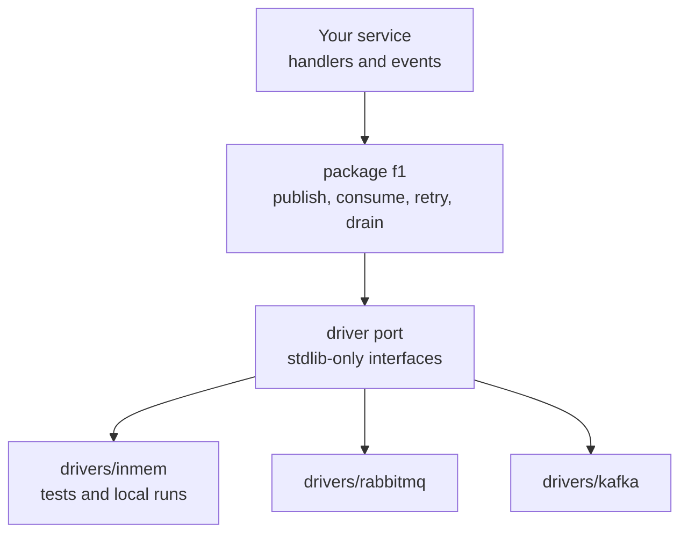

## At a glance

The driver is chosen once, when the client is built. Everything after that line is broker-free:
publish an event, handle it, and let F1 ack, retry, or dead-letter it.

```go
client, err := f1.New(ctx, cfg, f1.WithDriver(rabbitmq.Driver{}))
if err != nil {
	return err
}
defer client.Close(context.Background())

// Publish returns after the broker durably accepts the event. The topic must
// already be routable: topology provisioned, or the consumer below already running.
if _, err := client.Publisher().Publish(ctx, "orders.placed.v1",
	OrderPlaced{OrderID: "o-42"},
	f1.WithKey("o-42"),
); err != nil {
	return err
}

// A subscription maps event types to handlers; Run owns the delivery loop.
runner, err := client.Subscribe(ctx, f1.Subscription{
	Name:   "order-projector",
	Topics: []string{"orders.placed"},
	Handlers: map[string]f1.Handler{
		"orders.placed.v1": f1.HandlerFunc(func(ctx context.Context, e *f1.Event) error {
			var placed OrderPlaced
			if err := e.Decode(&placed); err != nil {
				return f1.Terminal(err) // retrying cannot fix a bad payload
			}
			return project(ctx, e.IdempotencyKey(), placed) // nil acks, an error retries
		}),
	},
})
if err != nil {
	return err
}
return runner.Run(ctx)
```

## Choose your path

<div class="f1-paths">
  <a class="f1-path" href="/learn/getting-started">
    <span class="f1-path__eyebrow">Build a service</span>
    <strong class="f1-path__title">Publish and consume events</strong>
    <span class="f1-path__body">Install the module, connect a driver, then follow Basics for the message and subscription model and Advanced for failures, ordering and shutdown.</span>
    <span class="f1-path__cta">Getting started -&gt;</span>
  </a>
  <a class="f1-path" href="/development/architecture">
    <span class="f1-path__eyebrow">Understand the runtime</span>
    <strong class="f1-path__title">Follow a message end to end</strong>
    <span class="f1-path__body">How a message travels from Publish to its final ack, and which package owns each step of the way.</span>
    <span class="f1-path__cta">Architecture map -&gt;</span>
  </a>
  <a class="f1-path" href="/development/driver-contract">
    <span class="f1-path__eyebrow">Write or review a driver</span>
    <strong class="f1-path__title">Implement the port</strong>
    <span class="f1-path__body">The interfaces every broker adapter implements, and the conformance suite that proves an adapter keeps F1's semantics.</span>
    <span class="f1-path__cta">Driver contract -&gt;</span>
  </a>
</div>

## How it fits together

Services talk to the `f1` package. The core talks to a standard-library-only driver port, and each
adapter translates that port into one broker. The core never imports a broker client;
`make verify-agnostic` enforces it. The [architecture map](/development/architecture) has the full
package picture.



## Go further

- [Getting started](/learn/getting-started) - connect a driver and run a service.
- [Message](/basics/message) - understand events, envelopes, and delivery identity.
- [Driver contract](/development/driver-contract) - implement or review a broker adapter.
