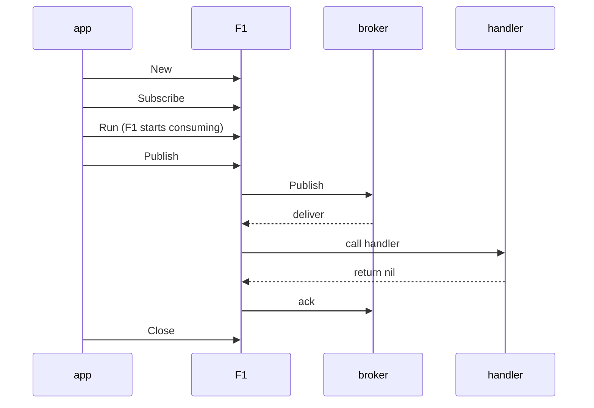

# Getting started

F1 is a Go SDK for publishing and consuming events without writing broker code.

An HTTP handler never reads a request off a socket; `net/http` does that for it. F1 does the same job
for message brokers. The RabbitMQ and Kafka client libraries hand you raw deliveries and leave the
hard parts to you: when to ack, how to retry after a delay, where a message that keeps failing goes,
and how to shut down without dropping what is in flight. F1 solves those once, the same way on every
supported broker.

A service author writes handlers and event structs. F1 handles envelope construction, delivery
guarantees, acknowledgement, retry delays, dead-letter routing, poison-message, priorities,
zero-loss shutdown, and observability.

New to a term? See the [glossary](/learn/glossary).

F1 ships three drivers: in-memory for tests and local runs, RabbitMQ, and Kafka. You choose one in
configuration, and your handlers never talk to a broker client, so switching brokers does not change
them. When a broker lacks a feature, such as delayed retries on RabbitMQ, F1 provides it;
`Client.Limits()` lists what the connected broker supports.

The minimal program follows one lifecycle: create the client, declare the subscription, start the runner, publish, handle, acknowledge, and close.



## Install

The module lives on the project's private Go module host. Set `GOPRIVATE` before the first
download so the Go tool does not query the public proxy or checksum database, which cannot see that
host:

```sh
go env -w GOPRIVATE=fgit.zapps.vn
go get fgit.zapps.vn/zatf2026-be-t3/event-driven-messaging-sdk
```

Use the Go version declared in [`go.mod`](https://fgit.zapps.vn/zatf2026-be-t3/event-driven-messaging-sdk/-/blob/main/go.mod),
and keep endpoints, credentials, and driver settings in the application's configuration rather than
in handler code. [Quickstart](/learn/quickstart) runs a complete program with no broker at all.

## The one-minute background

An event has two names. Its **event type** is the contract being handled, such as
`orders.placed.v1`. Its **topic** is the name your code uses for the stream carrying related events: F1 derives
`orders.placed` from `orders.placed.v1` by removing the trailing version segment. The publisher
encodes the payload and attaches an [**envelope**](/learn/glossary#envelope) carrying the event type, ID, subject, routing
metadata, and delivery metadata. A subscription reads topics and routes each event to the handler
registered for its type.

Delivery is [at least once](/learn/glossary#at-least-once-delivery). A handler can see the same event again after a redelivery, so the side
effect it performs must be idempotent. `Event.IdempotencyKey()` returns the stable [idempotency key](/learn/glossary#idempotency-key)
when the publisher set one, and the event ID otherwise; an attempt number is not a deduplication
key, because attempts change on redelivery. Version the event type when the payload contract
changes, and keep the old handler until its events are retired.

## Connect the client

F1 needs a resolved [`f1.Config`](https://fgit.zapps.vn/zatf2026-be-t3/event-driven-messaging-sdk/-/blob/main/config.go),
normally loaded with `f1.LoadConfig`, and the concrete
[`driver.Driver`](https://fgit.zapps.vn/zatf2026-be-t3/event-driven-messaging-sdk/-/blob/main/driver/driver.go)
your composition layer selected:

```go
// selectedDriver is built by the application's composition layer.
func connect(ctx context.Context, configPath string, selectedDriver driver.Driver) (*f1.Client, error) {
	cfg, err := f1.LoadConfig(configPath)
	if err != nil {
		return nil, fmt.Errorf("load F1 config: %w", err)
	}
	return f1.New(ctx, cfg, f1.WithDriver(selectedDriver))
}
```

`f1.New` opens the driver before it returns, so a startup failure surfaces at the connection
boundary. Keep `broker.driver` aligned with `selectedDriver.Name()`: F1 logs a driver-identity
mismatch so a configuration split is visible. Add `f1.WithPublishTopics(...)` when F1 should set up
the publisher's topology at startup; production topology is normally provisioned separately. Every
driver setting is in [Drivers and capabilities](/drivers-and-capabilities).

## Publish an event

Define a payload type for the event contract, then publish it:

```go
type OrderPlaced struct {
	OrderID string `json:"orderId"`
}

func publishOrder(ctx context.Context, client *f1.Client, orderID string) error {
	_, err := client.Publisher().Publish(
		ctx,
		"orders.placed.v1",
		OrderPlaced{OrderID: orderID},
		f1.WithKey(orderID),
		f1.WithIdempotencyKey("order-placed:"+orderID),
	)
	if err != nil {
		return fmt.Errorf("publish order %s: %w", orderID, err)
	}
	return nil
}
```

`Publish` returns only after the selected driver reports durable broker acknowledgement, and it
returns the generated event ID, which is useful in logs and traces. `WithKey` carries the business
routing key and is also the key the driver uses when nothing else is supplied, so a stable value
such as an order ID beats a random one. Use `f1.WithTopic` only to override the derived topic.

## Subscribe and handle events

A subscription names its [consumer group](/learn/glossary#consumer-group), declares the topics it reads, and maps event types
to handlers:

```go
func subscribeOrders(ctx context.Context, client *f1.Client) (*f1.Runner, error) {
	return client.Subscribe(ctx, f1.Subscription{
		Name:   "order-projector",
		Topics: []string{"orders.placed"},
		Handlers: map[string]f1.Handler{
			"orders.placed.v1": f1.HandlerFunc(func(ctx context.Context, event *f1.Event) error {
				var placed OrderPlaced
				if err := event.Decode(&placed); err != nil {
					return f1.Terminal(fmt.Errorf("decode %s: %w", event.Type(), err))
				}
				// Replace this with the application's idempotent side effect.
				return applyOrder(ctx, event.IdempotencyKey(), placed)
			}),
		},
	})
}
```

The handler's result decides the [ack or nack](/learn/glossary#settlement):

- return `nil` after the side effect succeeds, and F1 acks the event as handled;
- return an ordinary error for a transient failure, and F1 applies the configured retry policy; and
- wrap an unrecoverable error with `f1.Terminal` when retrying cannot help.

The `applyOrder` call stands for the application's side effect, which should record or update state
under the idempotency key so a redelivery cannot apply the same operation twice. With no handler
registered for an event type, the subscription's `UnmatchedPolicy` decides whether F1 ignores or
dead-letters the event.

## Run and shut down

`Subscribe` validates the subscription and returns a runner but does not start fetching. `Run` owns
the delivery loop and blocks until its context is cancelled or the runner stops with an error:

```go
func runOrders(ctx context.Context, client *f1.Client, runner *f1.Runner) error {
	runDone := make(chan error, 1)
	// Run keeps the values ctx carries, but not its cancellation: the shutdown
	// trigger must not cut in-flight handlers off.
	go func() { runDone <- runner.Run(context.WithoutCancel(ctx)) }()

	<-ctx.Done()

	shutdownCtx, cancel := context.WithTimeout(context.Background(), 20*time.Second)
	defer cancel()
	if err := client.Close(shutdownCtx); err != nil {
		return fmt.Errorf("close F1 client: %w", err)
	}

	// Close drains the runner, so Run returns even though its context was never cancelled.
	if runErr := <-runDone; runErr != nil && !errors.Is(runErr, context.Canceled) {
		return fmt.Errorf("order subscription stopped: %w", runErr)
	}
	return nil
}
```

Here `ctx` is only the shutdown trigger. A real service watches termination signals and calls
`client.Close` with a fresh timeout context, or `runner.Drain` for one subscription, rather than
cancelling `Run`'s context: cancelling `Run` skips the grace period and gives up on the handler in
flight. Give shutdown its own deadline so a stalled handler cannot keep the process alive, and note
that the process creating the client owns its runners and must drain them. [Lifecycle and
shutdown](/advanced-topics/lifecycle-and-shutdown) shows the signal-driven pattern.

## Observe it

One `f1.WithObserver` option is all the instrumentation a service needs. The `f1otel` adapter turns
F1's lifecycle events into standard OpenTelemetry metrics and spans:

```go
observer, err := f1otel.New(f1otel.WithMeterProvider(meterProvider))
if err != nil {
	return err
}
client, err := f1.New(ctx, cfg, f1.WithDriver(selectedDriver), f1.WithObserver(observer))
```

For the adapter setup, the metric names, and the broker timestamp settings, see
[Observability](/advanced-topics/observability); [Observer](/basics/observer) explains the model.

## What F1 guarantees

Each guarantee below is tested, and the repository gates exercise them.

<!--@include: ../../README.md#guarantees-->

## What F1 does not do

These are out of scope for v1. Plan for them in the application or the platform rather than
expecting the SDK to cover them.

<!--@include: ../../README.md#non-goals-->

## Go further

- [Message](/basics/message) and [Publisher and subscriber](/basics/pubsub) - the event, envelope,
  and subscription model.
- [Failure handling](/advanced-topics/failure-handling) - retry, terminal, drop, and dead-letter.
- [Observability](/advanced-topics/observability) and [Alerts](/advanced-topics/alerts) - metrics,
  spans, and the runbook built on them.
- [Drivers and capabilities](/drivers-and-capabilities) - configuration for each adapter, and the
  rest of Basics and Advanced in the sidebar.
