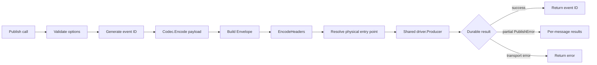
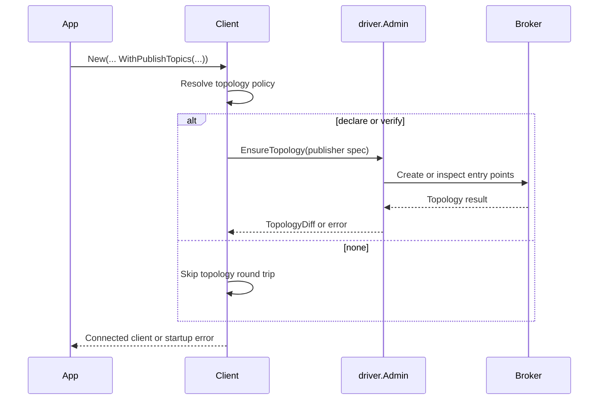

# Publish flow

Entry points:

- [`Publisher.Publish`](../publisher.go)
- [`Publisher.PublishBatch`](../publisher.go)
- [`buildOutbound`](../publisher.go)
- [`Client.ensurePublisherTopology`](../client.go)

## What `buildOutbound` decides

| Decision | Source |
| --- | --- |
| event ID | `newEventID` |
| payload bytes | configured `codec.Codec` |
| logical topic | explicit `WithTopic`, otherwise `topicFor(eventType)` |
| partition key | explicit key, subject, then event ID |
| idempotency key | explicit key, otherwise event ID |
| correlation/causation | explicit values or `WithCausedBy` inheritance |
| broker entry point | `publishEntryPoint` and priority |
| physical headers | `Envelope.EncodeHeaders` |

The event type version suffix is used for handler compatibility while the physical topic is based
on the unversioned logical topic. The implementation of that rule is `topicFor`.

## Topology timing

`TopologyNone` assumes topology already exists. `TopologyDeclare` is useful for development;
production configuration rejects auto-creation in `validateConfig`.

## Batch semantics

`PublishBatch` is synchronous but not atomic. A `driver.PublishError` identifies failed indexes; the
successful messages keep their IDs and failed messages receive individual errors. A non-partial
transport error is returned as the method error.

## Close interaction

`Client.Close` marks the client as closing before waiting for active publishes. New application
publishes are rejected, while core-generated retry/DLQ publishes may use the internal
`allowClosing` path during runner drain.
