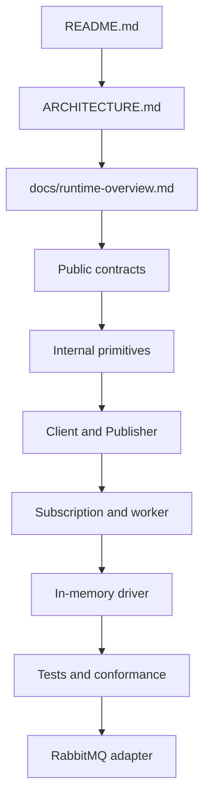

# Reading guide

Read in this order. Do not begin with tests or the 1,365-line worker file.



## Pass 1: vocabulary and contracts

Read:

1. [`README.md`](../README.md)
2. [`ARCHITECTURE.md`](../ARCHITECTURE.md)
3. [`doc.go`](../doc.go)
4. `priority.go`, `deathreason.go`, `errors.go`
5. `codec/`
6. `driver/`
7. `envelope.go` and `event.go`

Goal: understand event identity, headers, errors, settlement, capabilities, and the driver boundary.

## Pass 2: construction and publishing

Read:

1. `config.go` and `broker_config.go`
2. `options.go`
3. `client.go` and `limits.go`
4. `subscription_env.go`
5. `publisher.go`
6. `examples/config.yaml`
7. `examples/publisher/main.go`

Goal: understand how a client connects, resolves options, builds an envelope, names a destination,
and waits for durable publish acknowledgement.

## Pass 3: runtime internals

Read:

1. `internal/clock/`
2. `internal/retry/`
3. `internal/sched/`
4. `internal/dispatch/`
5. `internal/lifecycle/`
6. `internal/obs/`
7. `handler.go`
8. `subscription.go`
9. `worker.go`, using [the function map](consume-flow.md#file-level-worker-map)

Goal: understand timing, retry decisions, scheduling, worker ownership, and shutdown.

## Pass 4: concrete broker behavior

Read:

1. `drivers/inmem/`
2. `f1test/`
3. `driver/conformance/`
4. `drivers/rabbitmq/`

The in-memory adapter is easier to reason about. RabbitMQ should be read as a translation of the
same port contract into AMQP and management API operations.

## Tests to read early

- `publish_test.go` — durable publishing and close races.
- `dispatch_test.go` — worker pipeline and settlement edge cases.
- `settlement_state_test.go` — ack/nack recovery.
- `worker_retry_bridge_test.go` — retry and DLQ boundaries.
- `f1test/fanout_test.go` — one event per subscription.
- `f1test/ordered_test.go` — key ordering and concurrency.

## Tests to read later

- `config_test.go` — YAML/default/environment edge cases.
- `envelope_test.go` — wire compatibility and header-size behavior.
- `internal/*/*_test.go` — isolated algorithm contracts.
- `drivers/rabbitmq/*_test.go` — broker-specific behavior; some require Docker.
- `tools/apisurface` and `tools/apidiff` — repository safeguards, not message runtime.

## How to follow one message

For publishing, trace:

```text
Publisher.Publish
  -> PublishBatch
  -> buildOutbound
  -> Envelope.EncodeHeaders
  -> publishMessages
  -> driver.Producer.Publish
```

For consuming, trace:

```text
Runner.Run
  -> openRunnerConsumer
  -> fetchRunner
  -> runDispatchPipeline
  -> processDelivery
  -> dispatchMessage
  -> invokeHandler
  -> retryAndSettle / deadLetterAndSettle / ackDelivery
```
