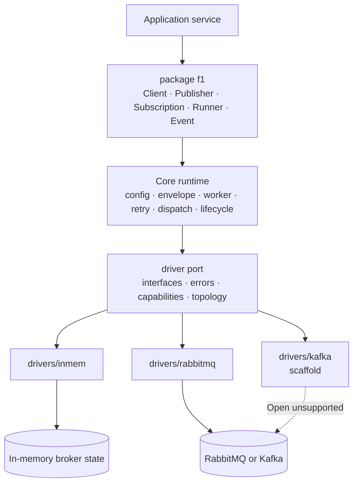
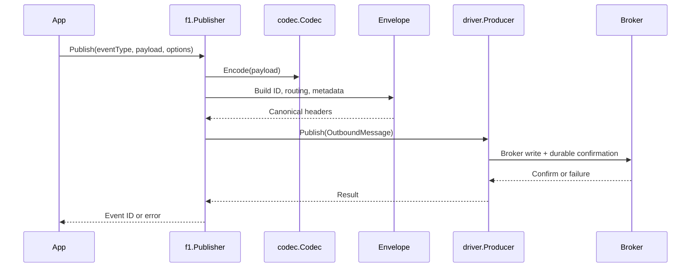
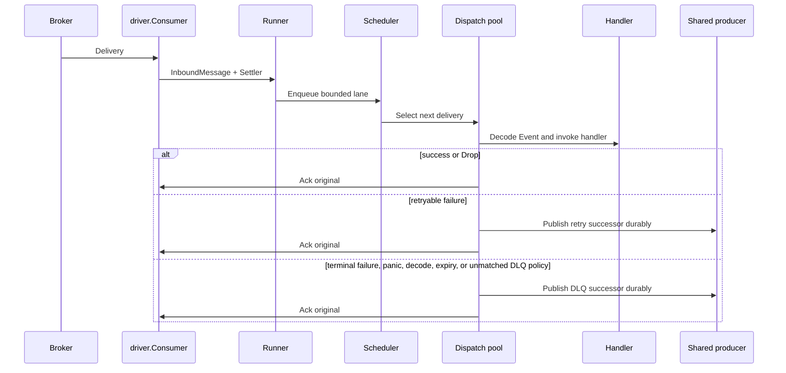

# Runtime overview

F1 separates application-facing behavior from broker mechanics.

## Object ownership

| Object | Owns |
| --- | --- |
| `Client` | one live connection, shared producer, runners, lifecycle admission |
| `Publisher` | application publish calls; delegates state to `Client` |
| `Subscription` | handler-facing policy and callbacks |
| `Runner` | one subscription’s consumer, fetcher, scheduler, workers, and drain |
| `driver.Conn` | live broker resources |
| `driver.Producer` | durable publish acknowledgement |
| `driver.Consumer` | broker delivery and transport lifecycle |
| `driver.Settler` | broker-specific ack/nack operation for one delivery |

## Publish path

Details: [publish flow](publish-flow.md).

## Consume path

Details: [consume flow](consume-flow.md), [settlement and shutdown](settlement-and-shutdown.md).

## Non-negotiable boundaries

- Core code does not import broker clients or concrete drivers.
- `driver` imports only the standard library.
- A driver receives physical destinations; it does not construct F1 names.
- A successor retry/DLQ copy is confirmed before the original is acknowledged.
- At-least-once delivery means duplicate handler effects are possible.
- The application owns idempotency using `Event.IdempotencyKey()`.

The import rules are enforced by [`make verify-agnostic`](../Makefile) and `.golangci.yml`.
